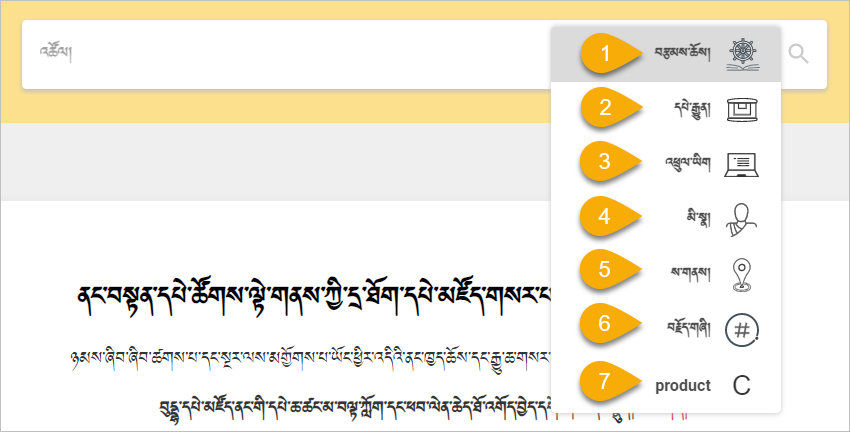

# BDRC དྲ་ཚིགས་ཀྱི་བཀོལ་སྤྱོད་ལམ་སྟོན།

## དང་པོ། དྲ་ཚིགས་ཀྱི་ངོ་སྤྲོད་མདོར་བསྡུས།

དྲ་ཚིགས་[buda.zju.edu.cn](buda.zju.edu.cn) ནི་ BDRC འམ་ནང་བསྟན་དཔེ་ཚོགས་ལྟེ་གནས་ཀྱིས་བཟོས་ཤིང་། ད་བར་ངེད་ཚོགས་པས་འབད་པ་གློད་མེད་ཀྱིས་འཚོལ་བསྡུ་བྱས་པའི་ནང་བསྟན་གྱི་གསུང་དཔེ་ཇི་སྙེད་ཡོད་པ་རྣམས་ཐུན་མོང་གིས་ལོངས་སུ་སྤྱོད་ཕྱིར། དྲ་ཐོག་དཔེ་མཛོད་ནང་གསོག་འཇོག་བྱས་ཏེ་གློག་ཀླད་བཀོལ་མཁན་ཚོར་ཆེད་དམིགས་ཀྱིས་དྲ་ཚིགས་འདི་བཟོ་བསྐྲུན་བྱས་པ་ཞིག་ཡིན། ཁ་པར་དང་ipad, 平板 བཀོལ་མཁན་རིགས་ལའང་རིན་འབབ་སྤྲོད་མི་དགོས་པའི་ **ལག་བཅངས་དཔེ་མཛོད་** ཅེས་པའི་མཉེན་ཆས་ཤིག་ཀྱང་ཆེད་དུ་བཟོ་བསྐྲུན་བྱས་ཡོད།

## གཉིས་པ། བཀོལ་སྤྱོད་ལམ་སྟོན་སྒྲིག་སྟངས་ངོ་སྤྲོད།

དྲ་ཚིགས་འདི་ལ་འཚོལ་ཞིབ་དང་དཔེ་ཀློག་ལ་ཉེ་བར་འཁོ་བའི་ཁྱད་ཆོས་ཞིབ་ཚགས་ཤིང་སྣེ་འཛོམས་ཤིག་ཡོད། དེ་དག་རེ་རེའི་བཀོལ་སྤྱོད་ལམ་སྟོན་རྣམས་ལ་གཟིགས། སྡེ་ཚན་ཀྱི་ཆ་ནས་
1. དྲ་ཚིགས་འཚོལ་བཤེར་སྒྲིག་འགོད་ཀྱི་རིམ་པ།
2. བཙལ་འབྲས་ཞིབ་བཤེར་གྱི་རིམ་པ།
3. བཙལ་འབྲས་ཚགས་སྒྲིག་གི་རིམ་པ།

བཅས་སྡེ་ཚན་དེ་དག་གི་གོ་རིམ་ལྟར་ངོ་སྤྲོད་བྱས་ཡོད།

### 1. སྡེ་ཚན། དྲ་ཚིགས་འཚོལ་ཞིབ་ཀྱི་རིམ་པ།

དྲ་ལམ་ནས་ཐད་ཀར་buda.zju.edu.cn བྲིས་ཏེ་དྲ་ཚིགས་ཚོལ། དྲ་ཚིགས་ཀྱི་སྐད་ཡིག་འདེམ། བཙལ་བྱའི་ནང་དོན་གྱི་རིགས་གང་དགོས་བཅས་བདམས་ཏེ་བཙལ་བྱ་བྲིས་ཏེ་ཚོལ། འདིའི་བཙལ་བྱའི་རིགས་ནི་
- **བརྩམས་ཆོས་** དང་།
- **དཔེ་རྒྱུན།** 
- **འཕྲུལ་ཡིག** 
- **མི་སྣ།** 
- **ས་གནས།** བཅས་ཀྱི་གང་རུང་ཞིག་འདེམ།

🔊 གསལ་བཤད། འདིའི་འཕྲུལ་ཡིག་ནི་ཡིག་རྐྱང་ཙམ་ལས་འཕྲུལ་དེབ་མིན། ཡོངས་ལ་ཡིག་རྐྱང་ཡོད་པའི་ངེས་པ་མེད།

དྲ་ཚིགས་འཚོལ་ཞིབ་དང་སྐད་ཡིག་བརྗེ་ཚུལ་གྱི་ལམ་སྟོན་འགུལ་རིས་ལ་གཟིགས།

### 2. སྡེ་ཚན། བཙལ་འབྲས་ཞིབ་བཤེར་གྱི་རིམ་པ།

བཙལ་བྱ་དེའི་བཙལ་འབྲས་རྣམས་བརྩམས་ཆོས་དང་དཔེ་རྒྱུན་སོགས་ཀྱི་སྡེ་ཚན་རེ་རེའི་ནང་ཐོན་པའི་བསྡོམས་གྲངས་བཅས་གསལ་ཡོང་། རང་ཉིད་ཀྱི་དགོས་མཁོ་ལྟར་སྡེ་ཚན་རེ་རེའི་སྒང་ལ་རྟགས་བཀོད་དེ་དེའི་བཙལ་འབྲས་ལ་རིམ་བས་མིག་བཤེར་བྱོས། སྐབས་འདིའི་བཙལ་འབྲས་ཁྲོད་བཙལ་བྱ་དེ་དང་འབྲེལ་བའི་དཔེ་ཆ་ཡོད་དོ་ཅོག་བཙལ་ཡོང་བས། རྩོམ་པ་བོ་དེ་ཁོ་ནའི་དཔེ་ཆ་དགོས་ཚེ་གཤམ་གྱི་རྩོམ་པ་བོའི་སྡེ་ཚན་དེ་ལ་གཟིགས།

### 3. སྡེ་ཚན། བཙལ་འབྲས་ཚགས་སྒྲིག་གི་རིམ་པ།

བཙལ་འབྲས་ཁྲོད་རང་ཉིད་ལ་མཁོ་བའི་དཔེ་ཆ་དེ་ཐད་ཀར་འཆར་མེད་ཚེ་འདིར་ **ཚགས་སྒྲིག** ཟེར་བ་དེར་བསྣུན་ཏེ་ནང་གསེས་རྣམས་རིམ་པར་སྒྲིག
- **རྒྱུགས་ཆེ་བ** བསྒྲིགས་ན་དེ་དང་འབྲེལ་བའི་བཙལ་བྱ་རྒྱུགས་ཆེ་བའི་རིགས་གཙོར་སྟོན་བྱེད།
- **འདྲ་ཤེས་ཆེ་བ** བསྒྲིགས་ན་བཙལ་བྱ་དེ་དང་མཚུངས་ཤོས་རྣམས་གཙོར་སྟོན་བྱེད།
- **མཚན་བྱང་** བསྒྲིགས་ན་བཙལ་བྱ་དེ་མཚན་བྱང་གང་ཡིན་པ་རྣམས་གཙོར་སྟོན་བྱེད།
- **དཔར་ལོ་** བསྒྲིགས་ན་བཙལ་བྱའི་དཔེ་ཆ་དེ་དཔར་ལོའི་གོ་རིམ་ལྟར་གཙོར་སྟོན་བྱེད།
    - ལོ་ཚིགས་དེ་ཡང་རྙིང་ཤོས་ནས་གསར་ཤོས་ཀྱི་གོ་རིམ་ལྟར་བསྒྲིག་ཡོང་བ་ཡིན།

## BDRC དྲ་ཚིགས་ཀྱི་བཀོལ་སྤྱོད་ལམ་སྟོན་ཁག

1. BDR01 དྲ་ཚིགས་སྤྱིའི་བཀོལ་སྤྱོད་ལམ་སྟོན།
2. BDR02 ཚགས་སྒྲིག་གི་བཀོལ་སྤྱོད་ལམ་སྟོན།
3. BDR03 ནང་གསེས་འདེམ་སྒྲིག་གི་བཀོལ་སྤྱོད་ལམ་སྟོན།

<iframe src="https://shimowendang.com/forms/UdCXeOAfR3U6Gqj9/fill?channel=1" style="height:1050px;width:800px;"></iframe>

## [教程目录 བཀོལ་སྤྱོད་ལམ་སྟོན་གྱི་དཀར་ཆག།](../../menu/menu)