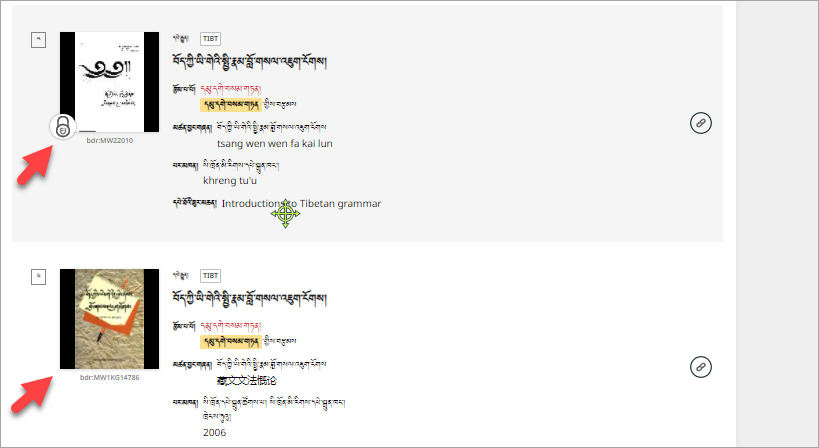

# དྲ་ཚིགས་ནས་དཔེ་ཆ་ཕབ་ལེན།
## དང་བོ། BDRC དྲ་ཚིགས་ཀྱི་བཀོལ་སྤྱོད་ལམ་སྟོན་ཁག

དྲ་ཚིགས་འདི་ལ་འཚོལ་ཞིབ་དང་དཔེ་ཀློག་ལ་ཉེ་བར་འཁོ་བའི་ཁྱད་ཆོས་ཞིབ་ཚགས་ཤིང་སྣེ་འཛོམས་ཤིག་ཡོད་པས། ཁྱེད་ཀྱིས་ཐུན་མིན་གྱི་ཁྱད་ཆོས་དེ་དག་ལེགས་པར་ཤེས་འདོད་ཚེ་གཤམ་བཀོད་ཀྱི་བཀོལ་སྤྱོད་ལམ་སྟོན་ཁག་གཅིག་ཀྱང་མ་ཆད་པར་གཟིགས་དགོས།

1. BDR01 དྲ་ཚིགས་ནས་དཔེ་ཆ་འཚོལ་བཤེར་དང་ཕབ་ལེན།
2. BDR02 དྲ་ཚིགས་ནང་ཞིབ་ཕྲའི་འཚོལ་བཤེར།
3. BDR03 དྲ་ཚིགས་ནས་བཙལ་འབྲས་ཆེད་འདེམ།
4. BDR04 
5. BDR05 དྲ་ཚིགས་ནས་དཔེ་ཀློག་བྱ་ཚུལ།

## གཉིས་པ། སྐབས་སུ་བབ་པའི་བཀོལ་སྤྱོད་ལམ་སྟོན།

བཀོལ་སྤྱོད་ལམ་སྟོན་གོང་མ་སྟེ་**ནང་གསེས་འདེམ་སྒྲིག** ནང་ནང་གསེས་འདེམ་སྒྲིག་བྱེད་ཚུལ་ཞིབ་ཕྲ་སྔོན་དུ་སོང་ཟིན་པ་ལྟར། ད་ནི་རང་ཉིད་ལ་ངེས་པར་མཁོ་བ་དཔེ་ཆ་དེ་ལ་བསྐྱར་ཞིབ་བྱེད་ཚུལ་གྱི་རིམ་པ་གསུམ་སྟེ།

- དཔེ་ཆ་དེར་བལྟ་ཀློག་གི་ཆོག་མཆན་ཡོད་མེད་བལྟ་བ།
- དཔེ་ཆ་དེའི་ལོ་རྒྱུས་སམ་གནས་ཚུལ་རྒྱུས་ལོན་བྱེད་པ།
- དཔེ་ཆ་དེ་ཐད་ཀར་ཕབ་ལེན་བྱེད་ཚུལ།  བཅས་ངོ་སྤྲད་པར་བྱའོ།།

## 1. སྡེ་ཚན། ཆོག་མཆན་ཡོད་མེད་བལྟ་བ།

བདག་དབང་ཡོད་པའི་དཔེ་ཆའི་གཡོན་ཟུར་འོག་མ་ན་སྒོ་ཟྭ་ཡི་རྟགས་ཤིག་ཡོད། དེའི་རིགས་ཀྱི་མགོ་གཞུག་གཉིས་ཀྱི་ཤོག་ངོས་༤༠ ཙམ་ལས་ཆ་ཚང་བལྟ་ཀློག་བྱེད་མི་ཐུབ། སྒོ་ཟྭ་མེད་པའི་རིགས་འདེམ་དགོས།

བལྟ་ཀློག་གི་ཆོག་མཆན་ཡོད་མེད་བལྟ་ཚུལ་གྱི་འགུལ་རིས་ལ་གཟིགས།

### 2.1 སྡེ་ཚན། དཔེ་ཆ་དེའི་ཞིབ་ཕྲའི་གནས་ཚུལ།

དཔེ་ཆ་དེའི་རྩོམ་པ་བོ་དང་མཚན་བྱང་། སྐད་ཡིག་དང་བརྗོད་གཞི་གང་ཡིན། དེ་འབྲེལ་གྱི་དཔེ་རྒྱུན་བཅས་ཀྱི་གནས་ཚུལ་རྣམས་ལ་གཟིགས་ཐུབ།

### 2.2 དཔེ་ཆ་དེའི་ཞིབ་ཕྲའི་གནས་ཚུལ།

འདི་ནས་དཔེ་ཆའི་མཚན་བྱང་དང་མཛད་བྱང་། པར་མཁན་དང་པར་གནས། པར་ཁང་། དཀར་ཆག ཤོག་གྲངས། སྐད་ཡིག་གང་ཡིན། ལྷག་པར་དཔེ་ཆག་བཅས་ཞིབ་ཕྲའི་གནས་ཚུལ་ལ་གཟིགས་ཚུལ།

### 2.3 དཔེ་ཆ་དེའི་ཞིབ་ཕྲའི་གནས་ཚུལ།

དཔེ་ཆ་དེ་ཐད་ཀར་ཕབ་ལེན་བྱ་ཚུལ་བཅས་སོ།།

<iframe src="https://shimowendang.com/forms/UdCXeOAfR3U6Gqj9/fill?channel=1" style="height:1050px;width:800px;"></iframe>

## [教程目录 བཀོལ་སྤྱོད་ལམ་སྟོན་གྱི་དཀར་ཆག།](../../menu/menu)