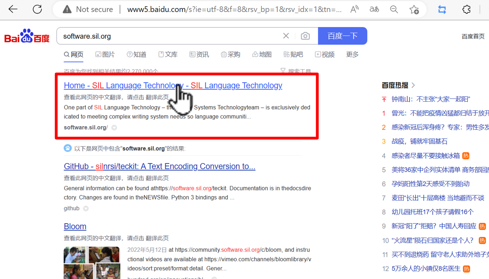
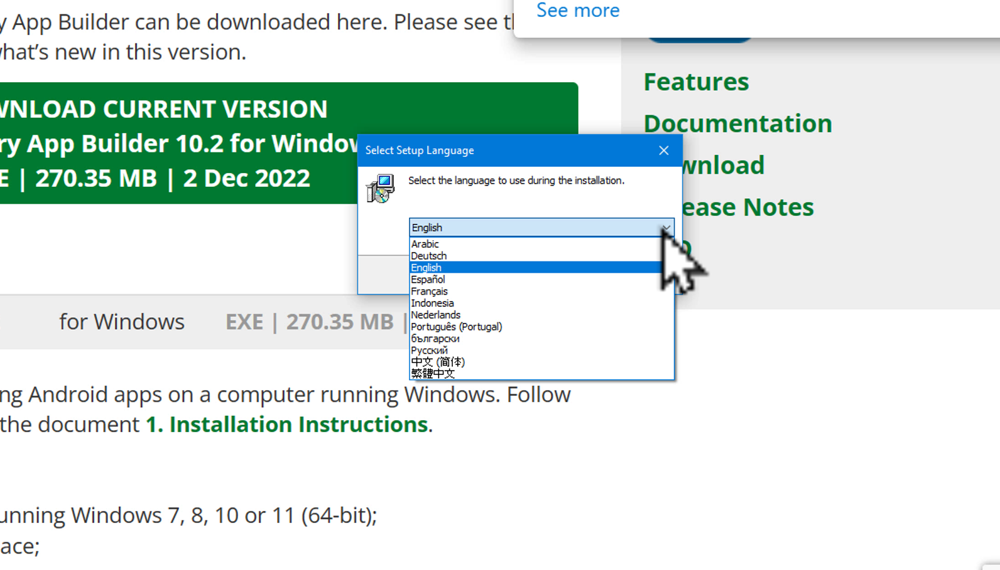

# DABཚིག་མཛོད་སྒྲིག་ཚུལ།1/3

འདིར་Dictionary App Builder (DAB)ཚིག་མཛོད་མཉེན་ཆས་སྒྲིག་སྟེགས་བཀོལ་སྟེ་དེའི་ནང་ཚིག་མཛོད་སྒྲིག་ཚུལ། དེ་བཞིན་Wesayམཉེན་ཆས་ནང་རྒྱུ་ཆ་རྩོམ་སྒྲིག་བྱ་ཚུལ་བཅས་ངོ་སྤྲོད་བྱས་ཡོད། ཞིབ་ཕྲ་གཤམ་ལ་གཟིགས།

## DABཚིག་མཛོད་སྒྲིག་ཚུལ་སྤྱིའི་སློབ་ཚན་ཁག

འདི་ལ་རྩ་བའི་སློབ་ཚན་གསུམ་ཡོད་དེ།
1. DABདང་Wesayམཉེན་ཆས་གཉིས་ཕབ་ལེན།
2. [Wesayནང་ཚིག་མཛོད་རྩོམ་སྒྲིག་བྱ་ཚུལ།]()
3. [DABནང་ཚིག་མཛོད་སྒྲིག་འཇོག་བྱ་ཚུལ།]()

## 1. DABདང་Wesayམཉེན་ཆས་གཉིས་ཕབ་ལེན།

སློབ་ཚན་དང་པོའི་ནང་ཡོད་པའི་དོན་ཁག་ནི་

- 👉 DABདང་Wesayགཉིས་འཚོལ་ཞིབ་བྱ་ཚུལ།
- 👉 DABཚིག་མཛོད་སྒྲིག་སྟེགས་ཕབ་ལེན་བྱ་ཚུལ།
- 👉 Wesayམཉེན་ཆས་ཕབ་ལེན་བྱ་ཚུལ།

## ཚོད་ལྟའི་དྲི་བ།

ཚོད་ལྟའི་དྲི་བ་རྣམས་ལ་ལན་རེ་ངེས་པར་དུ་འདེམ་རོགས། དེ་དག་ཐོག་མ་ནས་ཤེས་དགོས་པའི་ངེས་པ་མེད་པས་གང་རུང་ཞིག་འདེམ་ཆོག

1. DABདང་Wesayགཉིས་ཀྱི་ཕབ་ལེན་བྱེད་གནས་གཅིག་ཡིན་ནམ། མི་ཤེས།༽ མིན།༽ ཡིན།༽ (正确回答)
2. DABསྐད་ཡིག་བསལ་འདེམ་ཁྲོད་བོད་ཡིག་ཡོད་དམ། མི་ཤེས།༽ ཡོད།༽ མེད།༽ (正确回答)
3. Wesayམཉེན་ཆས་ཕབ་ལེན་སྐབས་སྐད་ཡིག་བསལ་འདེམ་ཡོད་དམ། མི་ཤེས།༽ ཡོད།༽ མེད།༽ (正确回答)

## 1. DABདང་Wesayགཉིས་འཚོལ་ཞིབ་བྱ་ཚུལ།

ཐོག་མར་[དྲ་ཐག་འདིར་](https://software.sil.org/)སྣུན། ཡང་ན་software.sil.orgའདི་ལྟར་བྲིས་ཏེ་ཚོལ། 

👇 དེ་ཅི་ལྟར་བྱ་ཚུལ་ལ་གཟིགས།

- སློབ་ཚན་གྱི་བརྙན། [དྲ་ཐག་འདིར་སྣུན།](https://drive.google.com/file/d/14bMaV8lLexNjdbhALaLAPi9XEpTgLmNP/view?usp=share_link)

1. དྲི་བ། DABདང་Wesayགཉིས་ཀྱི་ཕབ་ལེན་བྱེད་གནས་གཅིག་ཡིན་ནམ། 
ཡིན།༽ (正确回答) མིན།༽ མི་ཤེས།༽

## 2. DABཚིག་མཛོད་སྒྲིག་སྟེགས་ཕབ་ལེན་བྱ་ཚུལ།

👇 དེ་ཅི་ལྟར་བྱ་ཚུལ་ལ་གཟིགས།

- སློབ་ཚན་གྱི་བརྙན། [དྲ་ཐག་འདིར་སྣུན།](https://drive.google.com/file/d/1wEHNvRXdqpWhK8Jgz9Uju1NxoClBGVhx/view?usp=share_link)

2. དྲི་བ། DABསྐད་ཡིག་བསལ་འདེམ་ཁྲོད་བོད་ཡིག་ཡོད་དམ། 
ཡོད།༽ མེད།༽ (正确回答) མི་ཤེས།༽

## 3. Wesayམཉེན་ཆས་ཕབ་ལེན་བྱ་ཚུལ།

ཐོག་མར་[དྲ་ཐག་འདིར་](https://software.sil.org/)སྣུན། ཡང་ན་software.sil.orgའདི་ལྟར་བྲིས་ཏེ་ཚོལ།

👇 དེ་ཅི་ལྟར་བྱ་ཚུལ་ལ་གཟིགས།

 

- སློབ་ཚན་གྱི་བརྙན། [དྲ་ཐག་འདིར་སྣུན།](https://drive.google.com/file/d/1bbxDG5BBKkH90b9gsdjiFbNIF5nYSPgu/view?usp=share_link)

3. དྲི་བ། Wesayམཉེན་ཆས་ཕབ་ལེན་སྐབས་སྐད་ཡིག་བསལ་འདེམ་ཡོད་དམ། 
མི་ཤེས།༽ ཡོད།༽ མེད།༽ (正确回答)

## སློབ་ཚན་འདིའི་རྗེས་མ་ཁག

མདུན་ལ་ཡོད་པའི་དྲ་ཐག་དེ་བརྒྱུད་ནས་སློབ་ཚན་རྗེས་མ་གཉིས་ལ་གཟིགས།
