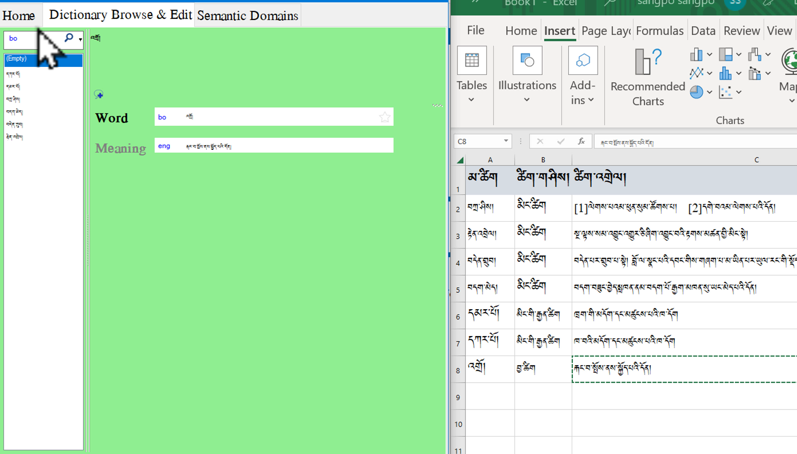
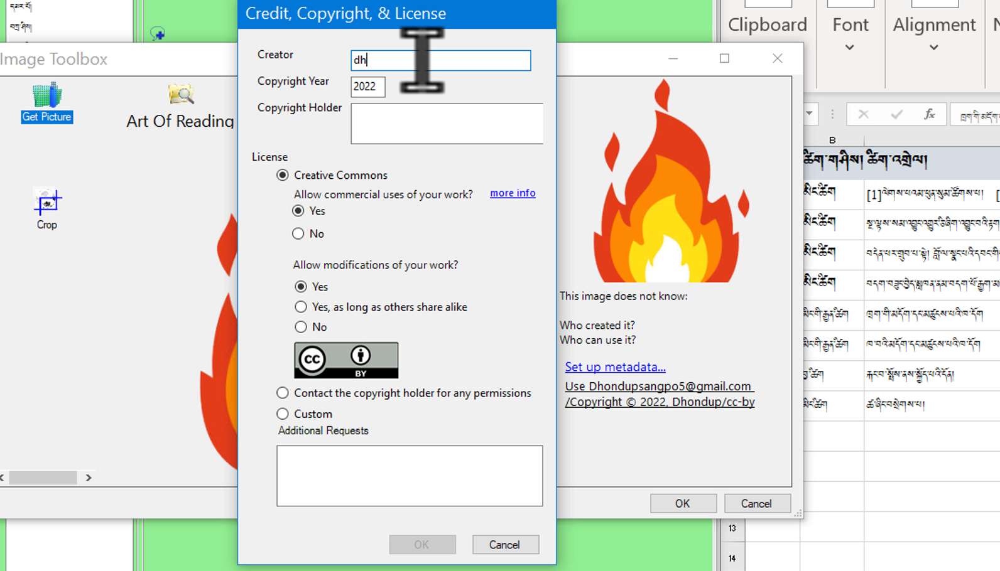
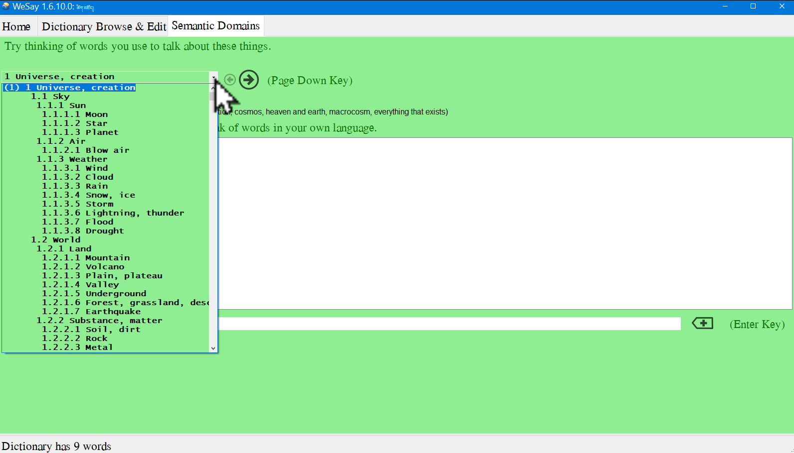

# DABཚིག་མཛོད་སྒྲིག་ཚུལ།3/4

འདིར་Wesayམཉེན་ཆས་ནང་མ་ཚིག་དང་ཚིག་འགྲེལ་སོགས་དངོས་སུ་སྒྲིག་ཚུལ་རྣམས་ངོ་སྤྲོད་བྱས་ཡོད། 
ཞིབ་ཕྲ་གཤམ་ལ་གཟིགས།

## DABཚིག་མཛོད་སྒྲིག་ཚུལ་སྤྱིའི་སློབ་ཚན་ཁག

ཚིག་མཛོད་མཉེན་ཆས་སྒྲིག་ཚུལ་ཆ་ཚང་ཤེས་པ་ལ་གཤམ་བཀོད་ཀྱི་སློབ་ཚན་རྣམས་ལ་ངེས་ཆ་དང་བྱང་ཆ་གཉིས་ཀ་ལྡན་དགོས། འདི་ལ་རྩ་བའི་སློབ་ཚན་བཞི་ཡོད་དེ།

1. [DABདང་Wesayམཉེན་ཆས་གཉིས་ཕབ་ལེན།](https://github.com/buda-base/budax/blob/master/howtoguides/DAB01/index.md)
2. [རྒྱུ་ཆ་གྲ་སྒྲིག་དང་Wesayཡི་སྒྲིག་འགོད།](https://github.com/buda-base/budax/blob/master/howtoguides/DAB02/index.md)
3. Wesayནང་ཚོག་མཛོད་སྒྲིག་ཚུལ།
4. [DABནང་ཚིག་མཛོད་སྒྲིག་འཇོག་བྱ་ཚུལ།](https://github.com/buda-base/budax/blob/master/howtoguides/DAB04/index.md)

## 3. Wesayནང་ཚོག་མཛོད་སྒྲིག་ཚུལ།

སློབ་ཚན་འདིའི་ནང་ཡོད་པའི་དོན་ཁག་ནི་

- 👉 Wesayནང་མ་ཚིག་དང་ཚིག་འགྲེལ་འཇོག་ཚུལ།
- 👉 Wesayནང་དཔེར་བརྗོད་དང་འདྲ་པར་འཇོག་ཚུལ།
- 👉 Wesayནང་གི་རིགས་མཐུན་ཐ་སྙད་རྣམས་བསྒྱུར་ཚུལ།

## ཚོད་ལྟའི་དྲི་བ།

ཚོད་ལྟའི་དྲི་བ་རྣམས་ལ་ལན་རེ་ངེས་པར་དུ་འདེམ་རོགས། དེ་དག་ཐོག་མ་ནས་ཤེས་དགོས་པའི་ངེས་པ་མེད་པས་གང་རུང་ཞིག་འདེམ་ཆོག

1. མ་ཚིག་འཇོག་སྟངས་ལ་ཐབས་ལམ་ག་ཚོད་ཡོད་དམ། གསུམ།༽ གཅིག༽ གཉིས།༽ (正确回答)
2. འདྲ་པར་འཇོག་སའི་ཚན་པ་གང་ཡིན་ནམ། New Word༽ Recieve༽ Show Uncommon Fields༽ (正确回答)
3. མཉེན་ཆས་བཟོ་གྲུབ་རྗེས་ཀྱི་རྣམ་པ་ཚན་པ་གང་གི་ནང་བལྟ་ཐུབ་བམ། Semantic Domains༽ Browse༽ Export to XHTML༽ (正确回答)

## 3.1 Wesayནང་མ་ཚིག་དང་ཚིག་འགྲེལ་འཇོག་ཚུལ།

👇 དེ་ཅི་ལྟར་བྱ་ཚུལ་ལ་གཟིགས།

- སློབ་ཚན་གྱི་བརྙན། [དྲ་ཐག་འདིར་སྣུན།](https://drive.google.com/file/d/1Q2JhZgQDicIo6uUfq7ASUJQOX5Ypnfbj/view?usp=share_link)

1. དྲི་བ། མ་ཚིག་འཇོག་སྟངས་ལ་ཐབས་ལམ་ག་ཚོད་ཡོད་དམ། 
གཉིས།༽ (正确回答) གསུམ།༽ གཅིག༽

## 3.2 Wesayནང་དཔེར་བརྗོད་དང་འདྲ་པར་འཇོག་ཚུལ།

👇 དེ་ཅི་ལྟར་བྱ་ཚུལ་ལ་གཟིགས།

- སློབ་ཚན་གྱི་བརྙན། [དྲ་ཐག་འདིར་སྣུན།](https://drive.google.com/file/d/1i3P32_xhJ0S9Rr5oFQopa_jiTdCitFUq/view?usp=share_link)

2. དྲི་བ། འདྲ་པར་འཇོག་སའི་ཚན་པ་གང་ཡིན་ནམ། 
New Word༽ Show Uncommon Fields༽ (正确回答) Recieve༽

## 3.3 Wesayནང་གི་རིགས་མཐུན་ཐ་སྙད་རྣམས་བསྒྱུར་ཚུལ།

👇 དེ་ཅི་ལྟར་བྱ་ཚུལ་ལ་གཟིགས།

 

- སློབ་ཚན་གྱི་བརྙན། [དྲ་ཐག་འདིར་སྣུན།](https://drive.google.com/file/d/1ioOdjqREfnZWLniqNksFoH-MdPzLNvaG/view?usp=share_link)

3. དྲི་བ། མཉེན་ཆས་བཟོ་གྲུབ་རྗེས་ཀྱི་རྣམ་པ་ཚན་པ་གང་གི་ནང་བལྟ་ཐུབ་བམ། 
Semantic Domains༽ Browse༽ Export to XHTML༽ (正确回答)

## སློབ་ཚན་འདིའི་རྗེས་མ་ཁག

མདུན་ལ་ཡོད་པའི་དྲ་ཐག་དེ་བརྒྱུད་ནས་སློབ་ཚན་རྗེས་མ་རྣམས་ལ་གཟིགས།
