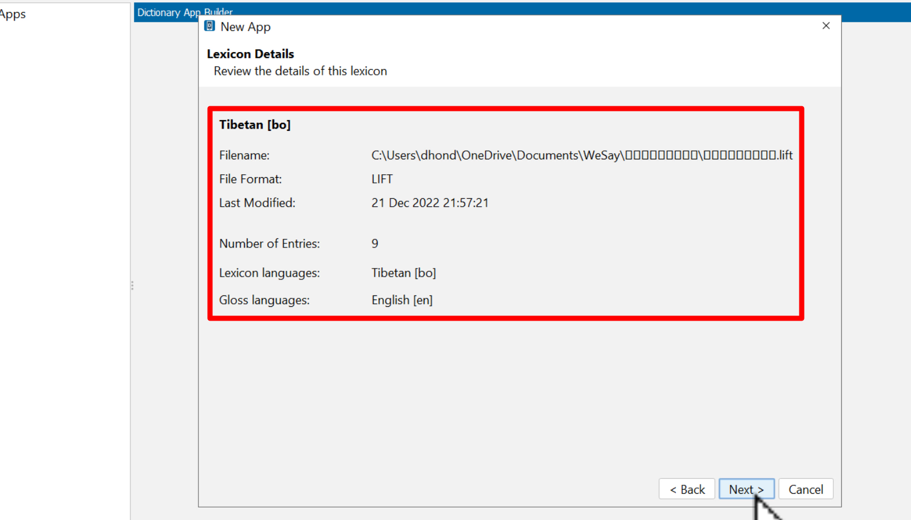
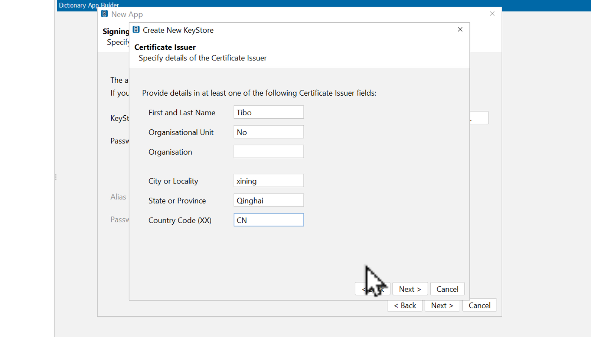
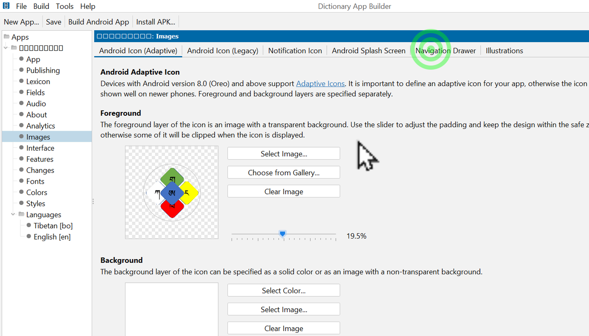
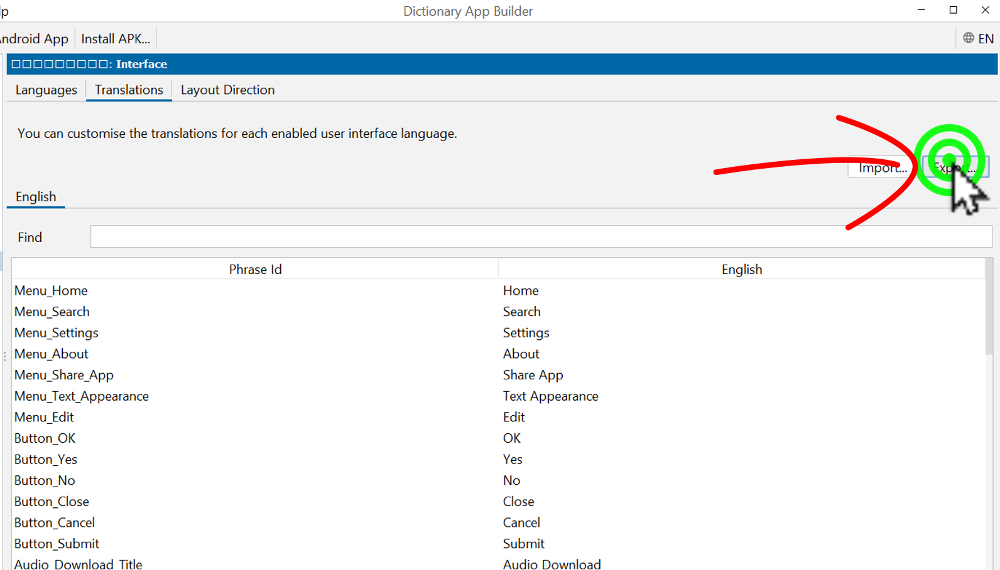

# DABཚིག་མཛོད་སྒྲིག་ཚུལ།4/4

འདིར་WEsayནང་རྩོམ་སྒྲིག་བྱས་ཟིན་པའི་ཚིག་མཛོད་དེ་Dictionary App Builder (DAB) ནང་ཚིག་མཛོད་དངོས་སུ་སྒྲིག་ཚུལ་གྱི་རིམ་པ་རྣམས་ངོ་སྤྲོད་བྱས་ཡོད། ཞིབ་ཕྲ་གཤམ་ལ་གཟིགས།

## DABཚིག་མཛོད་སྒྲིག་ཚུལ་སྤྱིའི་སློབ་ཚན་ཁག

ཚིག་མཛོད་མཉེན་ཆས་སྒྲིག་ཚུལ་ཆ་ཚང་ཤེས་པ་ལ་གཤམ་བཀོད་ཀྱི་སློབ་ཚན་རྣམས་ལ་ངེས་ཆ་དང་བྱང་ཆ་གཉིས་ཀ་ལྡན་དགོས། འདི་ལ་རྩ་བའི་སློབ་ཚན་བཞི་ཡོད་དེ།

1. [DABདང་Wesayམཉེན་ཆས་གཉིས་ཕབ་ལེན།](https://github.com/buda-base/budax/blob/master/howtoguides/DAB01/index.md)
2. [རྒྱུ་ཆ་གྲ་སྒྲིག་དང་Wesayཡི་སྒྲིག་འགོད།](https://github.com/buda-base/budax/blob/master/howtoguides/DAB02/index.md)
3. [Wesayནང་ཚོག་མཛོད་སྒྲིག་ཚུལ།](https://github.com/buda-base/budax/blob/master/howtoguides/DAB03/index.md)
4. DABནང་ཚིག་མཛོད་སྒྲིག་འཇོག་བྱ་ཚུལ།

## 4. DABནང་ཚིག་མཛོད་སྒྲིག་འཇོག་བྱ་ཚུལ།

སློབ་ཚན་འདིའི་ནང་ཡོད་པའི་དོན་ཁག་ནི་

- 👉 DABནང་ཚིག་མཛོད་ཡིག་ཆ་ནང་འདྲེན་བྱ་ཚུལ།
- 👉 Keystore གསར་བཟོ་བྱ་ཚུལ།
- 👉 ཚིག་མཛོད་ཀྱི་འདྲ་པར་དང་སྒྲིག་འགོད་གཞན་སྒྲིག་ཚུལ།
- 👉 DABཡི་སྐད་ཡིག་ལོ་ཙཱ་དང་ནང་འདྲེན་བྱ་ཚུལ།

## ཚོད་ལྟའི་དྲི་བ།

ཚོད་ལྟའི་དྲི་བ་རྣམས་ལ་ལན་རེ་ངེས་པར་དུ་འདེམ་རོགས། དེ་དག་ཐོག་མ་ནས་ཤེས་དགོས་པའི་ངེས་པ་མེད་པས་གང་རུང་ཞིག་འདེམ་ཆོག

1. DABནང་ལེན་རྒྱུའི་ཚིག་མཛོད་ཡིག་ཆའི་རྣམ་པ་(格式གང་ཡིན། .TXT༽ XHTML༽ .LIFT༽ (正确回答)
2. མཉེན་ཆས་གསར་པ་རེ་རེ་བཟོ་དུས་Keystore རེ་རེ་བཟོ་དགོས་སམ། མི་ཤེས།༽ དགོས།༽ མི་དགོས།༽ (正确回答)
3. མཉེན་ཆས་ཀྱི་སྐད་ཡིག་ལོ་ཙཱ་བྱེད་སྐབས་ཐ་སྙད་རེའི་མདུན་ལ་གང་འཇོག་དགོས། Tibetan:༽ Tib:༽ bo:༽ (正确回答)

## 4.1 DABནང་ཚིག་མཛོད་ཡིག་ཆ་ནང་འདྲེན་བྱ་ཚུལ།

👇 དེ་ཅི་ལྟར་བྱ་ཚུལ་ལ་གཟིགས།

- སློབ་ཚན་གྱི་བརྙན། [དྲ་ཐག་འདིར་སྣུན།](https://drive.google.com/file/d/1tkYJCG_PNx6YQEfJgx2qQ60ZIxVbIj2w/view?usp=share_link)

1. དྲི་བ། DABནང་ལེན་རྒྱུའི་ཚིག་མཛོད་ཡིག་ཆའི་རྣམ་པ་(格式གང་ཡིན། 
.LIFT༽ (正确回答) XHTML༽ .TXT༽

## 4.2 Keystore གསར་བཟོ་བྱ་ཚུལ།

👇 དེ་ཅི་ལྟར་བྱ་ཚུལ་ལ་གཟིགས།

- སློབ་ཚན་གྱི་བརྙན། [དྲ་ཐག་འདིར་སྣུན།](https://drive.google.com/file/d/1aw0g3VK6vXXaSV5UhqxVDtP5TTLhIFyH/view?usp=share_link)

2. དྲི་བ། མཉེན་ཆས་གསར་པ་རེ་རེ་བཟོ་དུས་Keystore རེ་རེ་བཟོ་དགོས་སམ། 
དགོས།༽ མི་དགོས།༽ (正确回答) མི་ཤེས།༽

## 4.3 ཚིག་མཛོད་ཀྱི་འདྲ་པར་དང་སྒྲིག་འགོད་གཞན་སྒྲིག་ཚུལ།

👇 དེ་ཅི་ལྟར་བྱ་ཚུལ་ལ་གཟིགས།

 

- སློབ་ཚན་གྱི་བརྙན། [དྲ་ཐག་འདིར་སྣུན།](https://drive.google.com/file/d/1vxP0mN14-B32bGcUB52Fqv30VXVF8gPm/view?usp=share_link)

## 4.4 DABཡི་སྐད་ཡིག་ལོ་ཙཱ་དང་ནང་འདྲེན་བྱ་ཚུལ།

👇 དེ་ཅི་ལྟར་བྱ་ཚུལ་ལ་གཟིགས།

 

- སློབ་ཚན་གྱི་བརྙན། [དྲ་ཐག་འདིར་སྣུན།](https://drive.google.com/file/d/1zJgtszqoZNOTmtHJEw2xI3S8NJdxK9yt/view?usp=share_link)

3. དྲི་བ། མཉེན་ཆས་ཀྱི་སྐད་ཡིག་ལོ་ཙཱ་བྱེད་སྐབས་ཐ་སྙད་རེའི་མདུན་ལ་གང་འཇོག་དགོས། 
Tibetan:༽ Tib:༽ bo:༽ (正确回答)

## སློབ་ཚན་འདིའི་སྔ་མ་ཁག

མདུན་ལ་ཡོད་པའི་དྲ་ཐག་དེ་བརྒྱུད་ནས་སློབ་ཚན་སྔ་མ་རྣམས་ལ་གཟིགས།
