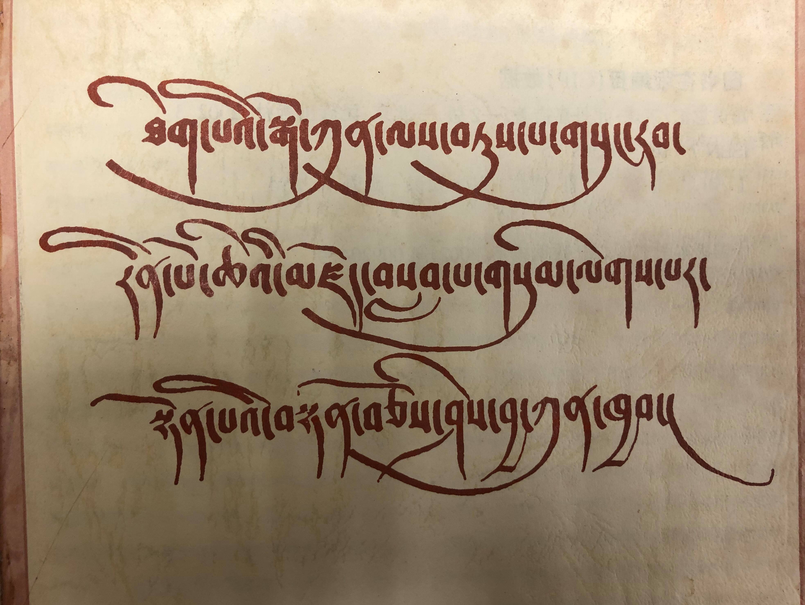

# ལྔ་བ། དན་གྲངས་གོང་མ་འགེང་ཚུལ། Biblio Info Sheet 

**ཐོག་མར།** དྲ་ཐག་འདིར་ [དཔེ་སྐྲུན་གནས་ཚུལ་](https://github.com/buda-base/digitization-guidelines/files/4654363/Biblipgraphic.Info.Sheet.xlsx) བསྣུན་ནས་ཕབ་ལེན་བྱོས། ཕབ་ལེན་བྱས་རྗེས་གློག་ཀླད་ནང་ཉར་ཚགས་བྱས་ཏེ་དགོས་སྐབས་ངོ་བཤུ་བྱ་ཆོག་པ་ཡིན།

## དང་བོ། བཤེར་འབེབས་པ་དང་འབྲེལ་བའི་དན་གྲངས་གོང་མ་འགེང་ཚུལ།

བརྩམས་ཆོས་རེ་རེ་བཤེར་འབེབས་བྱེད་སྐབས་དེའི་དན་གྲངས་གོང་མའི་རེའུ་མིག་རེ་ངེས་པར་འགེང་དགོས། རེའུ་མིག་དེ་འགེང་སྐབས་ཤེས་དགོས་པ་དང་ཆད་མི་རུང་བའི་གནད་འགག་འགའ་རེ་ཡོད། 

| དན་གྲངས་གོང་མའི་དཀར་ཆག | དཔེ་མཚོན་ཁག |
| ---------------- | -------------------|
| དཔེ་ཆ་དེ་མཁོ་སྒྲུབ་བྱེད་མཁན་མིའི་གྲངས། 收购书籍人员数量# # of Persons Involved in Acquisition | *མི་གཉིས།*
| ཕོ་མོ། 性别 Gender (F/M) | *ཕོ་གཉིས།*
| ལོ་ ༡༨ ལོན་ཡོད་མེད། 是否未成年 Younger than 18 (Y/N) | *ལོ་ ༡༨ ལ་སོན་འདུག*
| རབ་འབྱུང་ཡིན་མིན། 僧侣状况 Ordained (Y/N) | *རབ་བྱུང་བ་གཅིག*
| དཔེ་ཆ་ཇི་ལྟར་རྙེད་ཚུལ། 发现的过程 Context of discovery | *དགོན་པའི་དགེ་འདུན་པ་ཞིག་གིས་ངོ་སྤྲོད་བྱས་སོང་།*
| ཉར་སྲུང་གི་དམིགས་ཡུལ་སྐོར། 保存原因 Reason for Preservation | *དཔེ་མཛོད་ཁང་དུ་མེད་པ་དང་ཉར་ཚགས་ཀྱི་རིན་ཐང་ལྡན་པས་སོ།།*
| བཤེར་འབེབས་ས་གནས། མདོ་དབུས་ཁམས་གསུམ་གང་ཡིན། 扫描地区 Region Digitized (Central/Kham/Amdo) | *ཨ་མདོ།*
| བཤེར་འབེབས་ས་གནས་ཁ་བྱང་། 扫描详细地址 Digitized Location Address | *青海省化隆县支扎藏族乡*
| བཤེར་འབེབས་བྱ་ཡུལ། ཕྱི་ནང་། 归档状况 Digitization Setting | *ཁང་བའི་ནང་།*
| RFPཨང་། 付款编码 Request for payment＃RFP＃ | *?*
| མཆན། 备注 Note | 

**མཆན་གྱི་ནང་།** `དཔེར་ན། དཔེ་མཛོད་དོ་དམ་པས་དཔེ་མཛོད་ཀྱི་མིང་འབྲི་བཅུགས་མ་སོང་ཟེར་བ་ལྟ་བུ་དང་། གོང་གི་སྡེ་ཚན་དང་འབྲེལ་བའི་གནད་དོན་དམིགས་བསལ་གང་ཡོད་བྲིས་པས་ཆོག`

མཁོ་སྒྲུབ་ཨང་གི་མཚོན་དོན་ངོ་སྤྲོད།

`མཁོ་སྒྲུབ་ཨང་ནི་བཤེར་འབེབས་པས་དཔེ་ཆ་རྣམས་བཤེར་འབེབས་བྱས་ཚར་རྗེས་བརྩམས་ཆོས་སོ་སོར་གནས་སྐབས་རིང་ངོས་འཛིན་བདེ་ཕྱིར་དམིགས་བསལ་གྱི་ཨང་གྲངས་རེ་སྤྲད་པ་དེ་ལ་ཟེར། དེ་ནི་དབྱིན་་ཇིའི་ཡིག་འབྲུ་གསུམ་དང་ཨང་གྲངས་འགས་གྲུབ་པའི་རྣམ་པ་ཅན་ཞིག་ཡིན།` 

དཔེར་ན། ABC1234 ལྟ་བུ་ཡིན། 
- A ནི་(Accession) མཁོ་སྒྲུབ་མཚོན་བྱེད་དང་། 
- B ནི་འབྲེལ་མཐུད་པ་མཚོན་བྱེད།
- C ནི་བཤེར་འབེབས་པ་མཚོན་བྱེད་ཡིན། 

`ཨང་གྲངས་རྣམས་དཔེ་ཆ་མཚོན་བྱེད་ཡིན་པས་གང་འདོད་དུ་བཏགས་ཆོག་མོད་བརྩམས་ཆོས་གཞན་དང་གཅིག་མཚུངས་འདོགས་མི་རུང་། འབྲེལ་མཐུད་པ་དང་བཤེར་འབེབས་པ་རེ་རེ་ལ་མཚོན་བྱེད་ཀྱི་ཨིན་ཡིག་ཡིག་འབྲུ་རེ་སྤྲད་ཡོད་པས་དེ་བཀོལ་དགོས།`

### དཔེ་ཆའི་མཚན་བྱང་ངོས་འཛིན་བྱེད་སྟངས།

བོད་ཀྱི་སྲོལ་རྒྱུན་དཔེ་ཆ་འགའ་རེའི་མཚན་བྱང་ཏག་ཏག་ངོས་འཛིན་བྱེད་མི་ཐུབ་པའི་དཀའ་ངལ་དང་ཡང་ན་འགའ་རེར་མཚན་བྱང་རྒྱས་བསྡུས་སྣ་ཚོགས་ཡོད་པས་ནོར་ཉེན་ཆེ་བའི་རིགས་འགའ་ཡོད། དེའི་ཕྱིར་དེ་དག་གི་ནོར་འཁྲུལ་སེལ་ཕྱིར་དཔེ་མཚོན་དང་བཅས་བཞག་ཡོད། 

དཔེ་ཆའི་མཚན་བྱང་ངོས་འཛིན་བྱེད་སྟངས།

`དཔེ་ཆ་སོ་སོའི་མཚན་བྱང་ངོས་འཛིན་ཐད་ནོར་འཛོལ་འབྱུང་སྲིད་པའི་གནད་དོན་འགའ། སྤྱིར་དཔེ་ཆ་གཅིག་གི་སྒང་ལ་མཚན་བྱང་མ་འདྲ་བ་རྒྱས་བསྡུས་དུ་མ་ཡོད་སྲིད་དེ། དཔེར་ན། དེབ་གཟུགས་ཅན་གྱི་དཔེ་ཆ་ཁག་ལ་རྒྱབ་ཤ་ཕྱི་མ་དང་ནང་མའི་སྒང་གི་མཚན་བྱང་བཅས་གཉིས་རེ་ཡོད་པ་ཡོངས་གྲགས་ལྟ་བུ་རེད། རྒྱབ་ཤ་ཕྱི་ནང་གི་མཚན་བྱང་གཉིས་ཀྱི་གཅིག་རྒྱས་པ་དང་གཞན་དེའི་བསྡུས་མིང་རེ་འབྲི་སྲོལ་ཡོད། དཔེ་ཆ་རང་གི་སྟེང་མ་བྲིས་རུང་ཡོངས་གྲགས་ཀྱིས་འབོད་པའི་དཔེ་ཆའི་མིང་ཡང་ཡོད། སྲོལ་རྒྱུན་དཔེ་ཆ་འགའ་རེའི་མཚན་བྱང་དེ་ཤོག་ངོས་ཐ་མའི་མཛད་བྱང་བཀོད་པ་མ་གཏོགས་ཤོག་ངོས་དང་བོའི་སྒང་བྲིས་མེད་པ་འང་ཡོད།` `དཔེར་ན།` **བྱང་ཆུབ་ལམ་གྱི་རིམ་པ་བཞུགས་སོ།།** **ལམ་རིམ།** `རྒྱུན་ལྡན་གྱིས་འབོད་མིང་།` **ལམ་རིམ་ཆེན་མོ།** **རྗེ་ལམ་རིམ་ཆེན་མོ།** `སོགས་ལྟ་བུ།`
| མཚན་བྱང་། 标题 Title | *མགོན་པོའི་ཆོ་གའི་འདོན་སྒྲིགས་རི་ཁྲོད་པའི་ཚོགས་འདོན་བཞིན་ནག་འགྲོས་སུ་བཀོད་པ་བཞུག་སོ།།*
| --- | ----- |
| རྒྱབ་ཤ་ཕྱི་ནང་གཉིས་ཀྱི་མཚན་བྱང་མ་འདྲ་བའི་དཔེ་མཚོན། | མཚན་བྱང་རིང་ཐུང་གཉིས། |
| རྒྱབ་ཤ་ཕྱི་མའི་སྒང་གི་མཚན་བྱང་། | རྒྱབ་ཤ་ནང་མའི་སྒང་གི་མཚན་བྱང་། |
| |  |
| རྒྱབ་ཤ་ཕྱི་མའི་སྒང་གི་མཚན་བྱང་། | རྒྱབ་ཤ་ནང་མའི་ཐོག་གི་མཚན་བྱང་། |
| |  |
