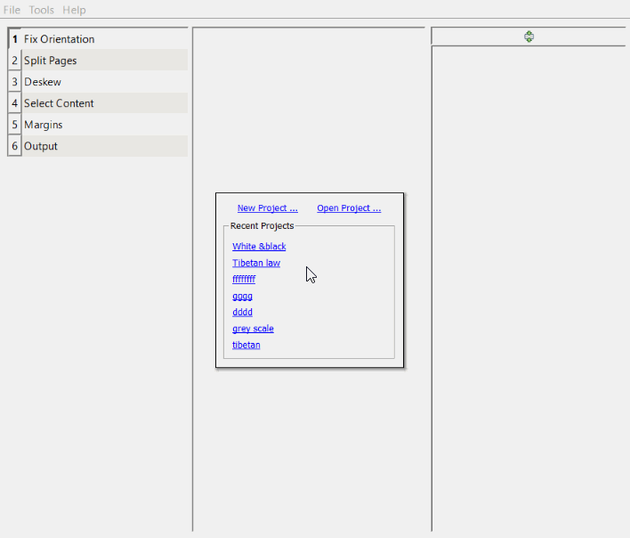
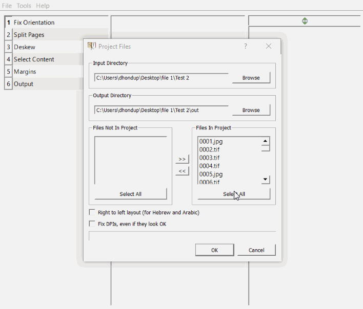
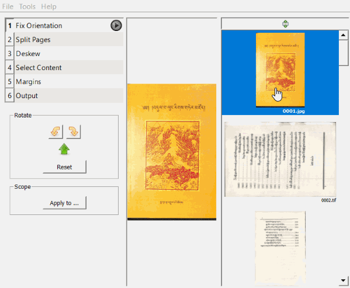
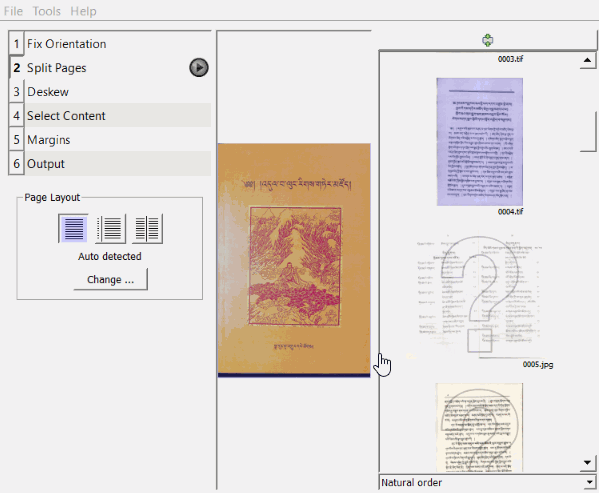
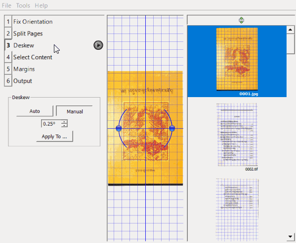
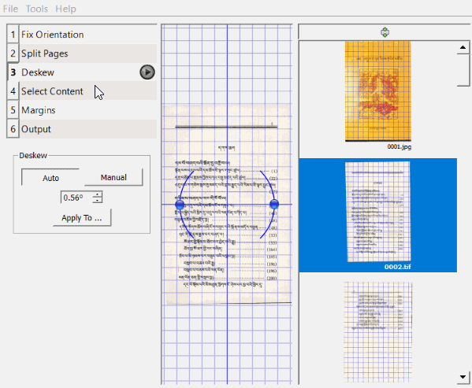
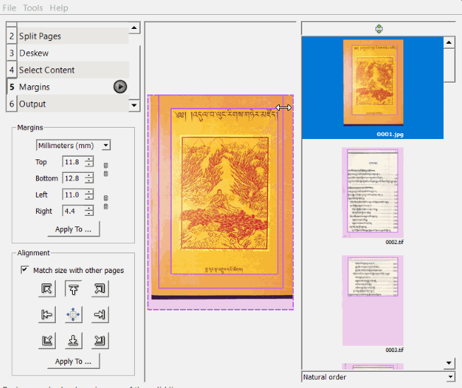
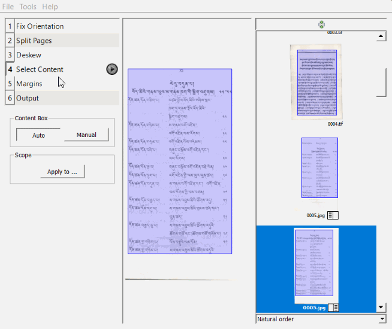
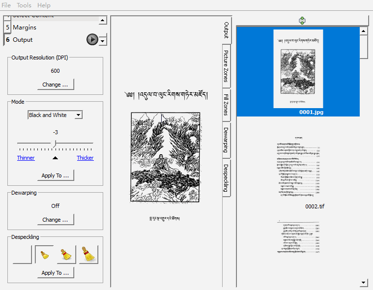

# ScanTailor བཀོལ་སྤྱོད།
|  དཀར་ཆག    |
|-----------|
|[༠༽ མཉེན་ཆས་ཕབ་ལེན་གྱི་སྡེ་ཚན།](https://github.com/buda-base/budax/blob/master/howtoguides/DIG16/index.md#%E0%BC%A0-scantailor-%E0%BD%98%E0%BD%89%E0%BD%BA%E0%BD%93%E0%BD%86%E0%BD%A6%E0%BD%95%E0%BD%96%E0%BD%A3%E0%BD%BA%E0%BD%93%E0%BD%82%E0%BE%B1%E0%BD%B2%E0%BD%A6%E0%BE%A1%E0%BD%BA%E0%BD%9A%E0%BD%93)
|[༡༽ བཤེར་པར་ནང་འདྲེན་བྱེད་ཚུལ།](https://github.com/buda-base/budax/blob/master/howtoguides/DIG16/index.md#%E0%BC%A1-%E0%BD%98%E0%BD%89%E0%BD%BA%E0%BD%93%E0%BD%86%E0%BD%A6%E0%BD%93%E0%BD%84%E0%BD%96%E0%BD%A6%E0%BE%92%E0%BE%B2%E0%BD%B2%E0%BD%82%E0%BD%96%E0%BE%B1%E0%BD%A0%E0%BD%B2%E0%BD%A1%E0%BD%B2%E0%BD%82%E0%BD%86%E0%BD%A3%E0%BD%BA%E0%BD%93%E0%BD%9A%E0%BD%B4%E0%BD%A3)
|[༢༽ ཤོག་ངོས་ཀྱི་རྣམ་པ་བསྲང་ཚུལ།](https://github.com/buda-base/budax/blob/master/howtoguides/DIG16/index.md#%E0%BC%A2--%E0%BD%A4%E0%BD%BC%E0%BD%82%E0%BD%84%E0%BD%BC%E0%BD%A6%E0%BD%80%E0%BE%B1%E0%BD%B2%E0%BD%A2%E0%BE%A3%E0%BD%98%E0%BD%94%E0%BD%96%E0%BD%A6%E0%BE%B2%E0%BD%84%E0%BD%9A%E0%BD%B4%E0%BD%A3)
|[༣༽ ཤོག་ངོས་གཉིས་འབྱར་རིགས་གཏུབ་ཚུལ།](https://github.com/buda-base/budax/blob/master/howtoguides/DIG16/index.md#%E0%BC%A3-%E0%BD%A4%E0%BD%BC%E0%BD%82%E0%BD%84%E0%BD%BC%E0%BD%A6%E0%BD%82%E0%BD%89%E0%BD%B2%E0%BD%A6%E0%BD%A0%E0%BD%96%E0%BE%B1%E0%BD%A2%E0%BD%A2%E0%BD%B2%E0%BD%82%E0%BD%A6%E0%BD%82%E0%BD%8F%E0%BD%B4%E0%BD%96%E0%BD%9A%E0%BD%B4%E0%BD%A3)
|[༤༽ ཤོག་ངོས་ཡོ་བསྲང་བྱེད་ཚུལ།](https://github.com/buda-base/budax/blob/master/howtoguides/DIG16/index.md#%E0%BC%A4-%E0%BD%A4%E0%BD%BC%E0%BD%82%E0%BD%84%E0%BD%BC%E0%BD%A6%E0%BD%A1%E0%BD%BC%E0%BD%96%E0%BD%A6%E0%BE%B2%E0%BD%84%E0%BD%96%E0%BE%B1%E0%BD%BA%E0%BD%91%E0%BD%9A%E0%BD%B4%E0%BD%A3)
|[༥༽ ཤོག་ལྡེབས་ཀྱི་གཙོ་ངོས་འདེམ་གསེས།](https://github.com/buda-base/budax/blob/master/howtoguides/DIG16/index.md#%E0%BC%A5-%E0%BD%A4%E0%BD%BC%E0%BD%82%E0%BD%A3%E0%BE%A1%E0%BD%BA%E0%BD%96%E0%BD%A6%E0%BD%80%E0%BE%B1%E0%BD%B2%E0%BD%82%E0%BD%99%E0%BD%BC%E0%BD%84%E0%BD%BC%E0%BD%A6%E0%BD%A0%E0%BD%91%E0%BD%BA%E0%BD%98%E0%BD%82%E0%BD%A6%E0%BD%BA%E0%BD%A6)
|[༦༽ ཤོག་མཐའ་གཙང་སྒྲིག་བྱེད་ཚུལ།](https://github.com/buda-base/digitization-guidelines/wiki/ScanTailor-%E0%BD%96%E0%BD%80%E0%BD%BC%E0%BD%A3%E0%BC%8B%E0%BD%A6%E0%BE%A4%E0%BE%B1%E0%BD%BC%E0%BD%91%E0%BC%8D#%E0%BC%A6-%E0%BD%A4%E0%BD%BC%E0%BD%82%E0%BD%98%E0%BD%90%E0%BD%A0%E0%BD%82%E0%BD%99%E0%BD%84%E0%BD%A6%E0%BE%92%E0%BE%B2%E0%BD%B2%E0%BD%82%E0%BD%96%E0%BE%B1%E0%BD%BA%E0%BD%91%E0%BD%9A%E0%BD%B4%E0%BD%A3)
|[༧༽ རྣམ་སྒྲིག་བརྗེ་བསྒྱུར་དང་གཏན་འབེབས།](https://github.com/buda-base/budax/blob/master/howtoguides/DIG16/index.md#%E0%BC%A7-%E0%BD%A2%E0%BE%A3%E0%BD%98%E0%BD%A6%E0%BE%92%E0%BE%B2%E0%BD%B2%E0%BD%82%E0%BD%96%E0%BD%A2%E0%BE%97%E0%BD%BA%E0%BD%96%E0%BD%A6%E0%BE%92%E0%BE%B1%E0%BD%B4%E0%BD%A2%E0%BD%91%E0%BD%84%E0%BD%82%E0%BD%8F%E0%BD%93%E0%BD%A0%E0%BD%96%E0%BD%BA%E0%BD%96%E0%BD%A6)
|[༨༽ པར་སྣོད་དང་ཉར་ཚགས་བྱེད་ཚུལ།](https://github.com/buda-base/budax/blob/master/howtoguides/DIG16/index.md#%E0%BC%A8-%E0%BD%94%E0%BD%A2%E0%BD%A6%E0%BE%A3%E0%BD%BC%E0%BD%91%E0%BD%91%E0%BD%84%E0%BD%89%E0%BD%A2%E0%BD%9A%E0%BD%82%E0%BD%A6%E0%BD%96%E0%BE%B1%E0%BD%BA%E0%BD%91%E0%BD%9A%E0%BD%B4%E0%BD%A3)

Scan Tailor མཉེན་ཆས་ནི་བཤེར་པར་ཁག་གཙང་སྒྲིག་དང་སྤུས་ཀ་ཇེ་ལེགས་སུ་གཏོང་བྱེད་ཀྱི་མཉེན་ཆས་སྟབས་བདེ་ཞིག་ཡིན།
Scan Tailor [མཉེན་ཆས](https://github.com/buda-base/digitization-guidelines/wiki/Terminology-%E0%BD%96%E0%BD%A2%E0%BE%A1%E0%BC%8B%E0%BD%86%E0%BD%91%E0%BC%8D-%E6%9C%AF%E8%AF%AD#%E8%BD%AF%E4%BB%B6%E7%A8%8B%E5%BA%8F%E5%BA%94%E7%94%A8%E7%A8%8B%E5%BA%8F-%E0%BD%98%E0%BD%89%E0%BD%BA%E0%BD%93%E0%BD%86%E0%BD%A6%E0%BD%A6%E0%BD%98%E0%BD%A6%E0%BE%99%E0%BD%B2%E0%BD%86%E0%BD%A6-software-program-apps)་ནི་བཤེར་པར་གཙང་སྒྲིག་བྱེད་སྤྱད་ཀྱི་ཡོ་བྱད་སྟབས་བདེ་ཞིག་ཡིན། འདི་ནི་གཙོ་བོ་སྡེ་ཚན་རིམ་པ་དྲུག་གིས་གྲུབ་ཡོད། འདིའི་དམིགས་བསལ་ཁྱད་ཆོས་ནི་བཤེར་འབེབས་སྐབས་ཤོག་ངོས་གཉིས་པར་ངོས་གཅིག་གི་ནང་བཤེར་འབེབས་བྱས་པ་རྣམས་སྟབས་བདེའི་ངང་གཏུབ་ཐུབ་པ་དང་། [སྐྱ་པར](https://github.com/buda-base/digitization-guidelines/wiki/Terminology-%E0%BD%96%E0%BD%A2%E0%BE%A1%E0%BC%8B%E0%BD%86%E0%BD%91%E0%BC%8D-%E6%9C%AF%E8%AF%AD#%E7%81%B0%E9%98%B6-%E0%BD%9A%E0%BD%BC%E0%BD%93%E0%BD%A3%E0%BE%A1%E0%BD%93%E0%BD%A6%E0%BE%90%E0%BE%B1%E0%BD%94%E0%BD%A2-grayscale)་རིགས་ཧ་ཅང་གསལ་བོ་བཟོ་བ། ཡོ་འཁྱོག་རིགས་བསྲང་བདེ་བ། ཤོག་མཐའི་གྲིབ་ནག་རིགས་གཏུབ་སླ་བ་སོགས་ཀྱི་ཡོན་ཏན་ཡོད།

## ༠༽ ScanTailor མཉེན་ཆས་ཕབ་ལེན་གྱི་སྡེ་ཚན།

སྒེའུ་ཁུང་རྟགས་ཅན་གྱི་གློག་ཀླད་ལ་ bit32 དང་ bit64 ཅན་གཉིས་ཡོད། གཤམ་གྱི་ཕབ་ལེན་དྲ་ཐག་ནས་སོ་སོའི་གློག་ཀླད་ཀྱི་པེས་ཐི་དང་འཚམ་པའི་མཉེན་ཆས་ཕབ་ལེན་བྱོས།
|  Window bit32  | Window bit64   |
| -- | -- |
|||
|དྲ་ཐག་འདིའི་སྟེང་སྣུན། <a href="https://github.com/scantailor/scantailor/releases/download/RELEASE_0_9_11_1/scantailor-0.9.11.1-32bit-install.exe"><button type="button" class="btn btn-success"><i class="fa fa-cloud-download"></i>32bits </button></a> |དྲ་ཐག་འདིའི་སྟེང་སྣུན། <a href="https://github.com/scantailor/scantailor/releases/download/RELEASE_0_9_11_1/scantailor-0.9.11.1-64bit-install.exe"><button type="button" class="btn btn-success"><i class="fa fa-cloud-download"></i> 64bit </button></a>

## ༡༽ མཉེན་ཆས་ནང་བསྒྲིག་བྱའི་ཡིག་ཆ་ལེན་ཚུལ།

Scan Tailor སྒོ་ཕྱེ། 🡲 New project 🡲 browse ལ་བསྣུན་ཏེ་ཡིག་ཆ་ལོང། 🡲 Ok ལ་སྣུན། 🡲 select all ལ་སྣུན། 🡲 Fix DPIs, even if they look ok འགྲིག་རྟགས་རྒྱོབ། 🡲 Ok 🡲 All pages ལ་སྣུན། 🡲 Custom ལ་བསྣུན་ཏེ་ 600*600 འདེམ། 🡲 apply 🡲 Ok ལ་སྣུན་དགོས། 

མཉེན་ཆས་ Scan Tailor མཉེན་ཆས་སྒོ་ཕྱེས་ཏེ་འདིའི་ནང་སྒྲིག་བཟོ་བྱ་རྒྱུའི་ཡིག་ཆ་ལོང།

 

## ༢༽  ཤོག་ངོས་ཀྱི་རྣམ་པ་བསྲང་ཚུལ།

ཡོ་བསྲང་རྒྱུའི་ཤོག་ངོས་དེ་འདེམ། 🡲 rotate ནས་སྐོར། 🡲 Fix orientation ལ་སྣུན།

ནང་གསེས་སྡེ་ཚན་དང་པོའི་ནང་གཙོ་བོ་ཤོག་ངོས་ཀྱི་[རྣམ་པ](https://github.com/buda-base/digitization-guidelines/wiki/Terminology-%E0%BD%96%E0%BD%A2%E0%BE%A1%E0%BC%8B%E0%BD%86%E0%BD%91%E0%BC%8D-%E6%9C%AF%E8%AF%AD#%E7%89%B9%E5%BE%81-%E0%BD%A2%E0%BE%A3%E0%BD%98%E0%BD%94-feature)་ཇི་ལྟར་བསྲང་ཚུལ་ཡིན། ཤོག་ངོས་དང་པོ་འགྲེང་བ་དང་ཡང་ན་འཕྲེད་སོགས་ཇི་ལྟར་དགོས་པ་ལྟར་བསྲངས་རྗེས་འོག་གི་སྒྲིག་འགོད་ནང་ཤོག་ངོས་ཡོངས་ལ་འགྱུར་བ་གཏོང་རྒྱུ་ཡིན་
All pages ཞེས་པ་བདམས་ན་ཚང་མ་འགྱུར་བ་གཏོང་འགྲོ། This page only བདམས་ན་རྟགས་བརྒྱབ་པའི་ཤོག་ངོས་མ་གཏོགས་འགྱུར་བ་མི་གཏོང་། གང་དགོས་པ་དེ་བདམས་རྗེས་[སྒྲིག་འགོད](https://github.com/buda-base/digitization-guidelines/wiki/Terminology-%E0%BD%96%E0%BD%A2%E0%BE%A1%E0%BC%8B%E0%BD%86%E0%BD%91%E0%BC%8D-%E6%9C%AF%E8%AF%AD#%E8%AE%BE%E7%BD%AE-%E0%BD%A6%E0%BE%92%E0%BE%B2%E0%BD%B2%E0%BD%82%E0%BD%A0%E0%BD%82%E0%BD%BC%E0%BD%91-setting)་སྟེགས་བུའི་སྣེ་མོའི་སྒྲིག་འཁོར་དེའི་སྟེང་སྣུན་དགོས།

## ༣༽ ཤོག་ངོས་གཉིས་འབྱར་རིགས་གཏུབ་ཚུལ།

2 Split Page འདེམ། 🡲 ཤོག་ངོས་གཉིས་འབྱར་རིགས་འདེམ། 🡲 Page Layout ནང་དཀྱིལ་ནས་གཏུབ་བྱེད་དེ་འདེམ། 🡲 Split Line ནས་ Auto རང་འགུལ། Manul ལག་སྒྲིག གཉིས་ཀྱི་གང་རུང་འདེམ། 🡲 Split Page ནང་གི་སྒྲིག་འཁོར་དེའི་སྟེང་སྣུན།

སྡེ་ཚན་འདིའི་ནང་གཙོ་བོ་ཤོག་ངོས་གཉིས་པར་ངོས་གཅིག་གི་ནང་ཚུད་ཡོད་པའི་པར་རིགས་སྡེབ་གཅིག་ལ་ཤོག་ངོས་སོ་སོར་གཏུབ་འགྲོ་བ་ཡིན། སྡེ་ཚན་འདིའི་ནང་ཤོག་ངོས་གཉིས་འབྱར་རིགས་གཏུབ་སྐབས་གཏུབ་བྱའི་ཤོག་ངོས་རྣམས་ལ་རིམ་པར་
གཟིགས་ཏེ་གཏུབ་མཚམས་ཀྱི་ཐིག་འགྲིག་ཡོད་མེད་ཞིབ་འཇུག་བྱེད་དགོས། དེའི་རྗེས་ཤོག་ངོས་ཡོངས་ལ་འགྱུར་བ་གཏོང་རྒྱུ་ཡིན་ཞེས་པ་བདམས་ཏེ་[སྒྲིག་འགོད](https://github.com/buda-base/digitization-guidelines/wiki/Terminology-%E0%BD%96%E0%BD%A2%E0%BE%A1%E0%BC%8B%E0%BD%86%E0%BD%91%E0%BC%8D-%E6%9C%AF%E8%AF%AD#%E8%AE%BE%E7%BD%AE-%E0%BD%A6%E0%BE%92%E0%BE%B2%E0%BD%B2%E0%BD%82%E0%BD%A0%E0%BD%82%E0%BD%BC%E0%BD%91-setting)་སྟེགས་བུའི་སྣེ་མོའི་སྒྲིག་འཁོར་དེའི་སྟེང་བསྣུན་ན་ཡིག་སྣོད་དེའི་ནང་ཡོད་པའི་གཏུབ་དགོས་
ངེས་ཀྱི་ཤོག་ངོས་ཡོངས་སྡེབ་གཏུབ་བྱེད་འགྲོ།

## ༤༽ ཤོག་ངོས་ཡོ་བསྲང་བྱེད་ཚུལ།

3 Deskew བདམས་ཏེ་ཡོ་བསྲང་རྒྱུའི་ཤོག་ངོས་རེ་རེའི་སྟེང་བསྣུན་ན་ཡོ་བསྲང་ཡོ་བྱད་དེ་འཆར་ཡོང་། 🡲 ཡོ་བསྲང་རྗེས་Deskew ནང་སྡེ་ཚན་གྱི་སྣེ་མོའི་སྒྲིག་འཁོར་དེའི་སྟེང་སྣུན་དགོས།

སྡེ་ཚན་འདིའི་ནང་གཙོ་བོ་ཤོག་ངོས་རེ་རེའི་བསེག་ཡོ་རིགས་བསྲང་ཐུབ། ཤོག་ངོས་ཚང་མ་དང་ཡང་ན་རེ་རེའི་ཡོ་བསྲང་དགོས་མིན་གྱི་འདེམ་གསེས་ནི་སྡེ་ཚན་གསུམ་པའི་ནང་གི་སྒྲིག་འགོད་དང་མཚུངས། ཤོག་ངོས་དང་པོའི་ཡོ་འཁྱོག་བསྲང་རྗེས་གཞན་རྣམས་ལའང་ཆ་སྙོམས་ཀྱིས་བསྲང་དགོས་ཞེས་བདམས་ཏེ་[སྒྲིག་འགོད](https://github.com/buda-base/digitization-guidelines/wiki/Terminology-%E0%BD%96%E0%BD%A2%E0%BE%A1%E0%BC%8B%E0%BD%86%E0%BD%91%E0%BC%8D-%E6%9C%AF%E8%AF%AD#%E8%AE%BE%E7%BD%AE-%E0%BD%A6%E0%BE%92%E0%BE%B2%E0%BD%B2%E0%BD%82%E0%BD%A0%E0%BD%82%E0%BD%BC%E0%BD%91-setting)་
སྟེགས་བུའི་སྣེ་མོའི་སྒྲིག་འཁོར་དེའི་སྟེང་བསྣུན་ན་གཞན་ཚང་མ་ཆ་སྙོམས་ཀྱིས་བསྲང་འགྲོ། སྡེ་ཚན་འདིའི་ནང་ལའང་རང་འགུལ་དང་ལག་སྒྲིག་གཉིས་ཡོད་པའི་རང་འདོད་ཀྱིས་འདེམ་ཆོག གཤམ་གྱི་དཔེ་རིས་ལ་གཟིགས།

## ༥༽ ཤོག་ལྡེབས་ཀྱི་གཙོ་ངོས་འདེམ་གསེས།

4 Select Content འདེམ། 🡲 Manual ལག་སྒྲིག་བདམས་ནས་སྒྲིག 🡲 Apply to ནས་ཚང་མ་རྟགས་བརྒྱབ་གཉིས་ཀྱི་གང་རུང་འདེམ། 🡲 བསྒྲིགས་རྗེས་སྡེ་ཚན་འདིའི་སྣེ་མོའི་སྒྲིག་འཁོར་སྟེང་སྣུན།

སྡེ་ཚན་འདིའི་ནང་གཙོ་བོ་ཤོག་ལྡེབས་ཀྱི་གཙོ་ངོས་འདེམ་དགོས་པ་ཡིན། འདིར་འདེམ་རྟགས་ནང་མ་ཚུད་པའི་རིགས་སྡེ་ཚན་རྗེས་མའི་སྒྲིག་སྦྱོར་སྐབས་གཙང་བཟོ་བྱེད་འགྲོ། དེའི་ཕྱིར་འདིར་ཤོག་ངོས་རེ་རེ་བྱས་ཏེ་དགོས་ངེས་རིགས་ལ་འདེམ་རྟགས་ཀྱིས་ཟིན་
པ་བྱེད་དགོས། ཤོག་ངོས་ཡོངས་ལ་མིག་བཤེར་ཟིན་རྗེས་གཞན་རྣམས་ལའང་ཆ་སྙོམས་ཀྱིས་བསྲང་དགོས་ཞེས་བདམས་ཏེ་[སྒྲིག་འགོད](https://github.com/buda-base/digitization-guidelines/wiki/Terminology-%E0%BD%96%E0%BD%A2%E0%BE%A1%E0%BC%8B%E0%BD%86%E0%BD%91%E0%BC%8D-%E6%9C%AF%E8%AF%AD#%E8%AE%BE%E7%BD%AE-%E0%BD%A6%E0%BE%92%E0%BE%B2%E0%BD%B2%E0%BD%82%E0%BD%A0%E0%BD%82%E0%BD%BC%E0%BD%91-setting)་སྟེགས་བུའི་སྣེ་མོའི་སྒྲིག་འཁོར་དེའི་སྟེང་སྣུན་ན་གཞན་ཚང་མ་ཆ་སྙོམས་ཀྱི་བསྲང་འགྲོ། དཔེ་རིས་ལ་གཟིགས།

## ༦༽ ཤོག་མཐའ་གཙང་སྒྲིག་བྱེད་ཚུལ།

5 Margins བདམས་ཏེ་རང་འདོད་ལྟར་སྒྲིག་སྦྱོར་བྱ་ཆོག 🡲 Alignment ནང་རྟགས་རེ་རེའི་སྟེང་བསྣུན་ནས་གཡས་གཡོན་སོགས་ལ་སྣུར་ཆོག 🡲 Margins འདིའི་སྣེ་མོའི་སྒྲིག་འཁོར་དེའི་སྟེང་སྣུན།

སྡེ་ཚན་འདིའི་ནང་གཙོ་བོ་ཤོག་ངོས་རེ་རེའི་མཐའི་གཏུབ་མཚམས་རྣམས་གཙང་སྒྲིག་དང་ཆེ་ཆུང་བཅས་འདི་ནས་གཏན་འབེབས་བྱེད་དགོས། ཤོག་མཐའི་གཏུབ་མཚམས་ཉམ་པ་དང་ནག་ནོག་རིགས་འདི་ནས་གཙང་སྒྲིག་བྱེད་མ་ཐུབ་ཚེ་[ཚོན་ལྡན་པར](https://github.com/buda-base/digitization-guidelines/wiki/Terminology-%E0%BD%96%E0%BD%A2%E0%BE%A1%E0%BC%8B%E0%BD%86%E0%BD%91%E0%BC%8D-%E6%9C%AF%E8%AF%AD#%E5%BD%A9%E8%89%B2%E5%9B%BE%E5%83%8F-%E0%BD%9A%E0%BD%BC%E0%BD%93%E0%BD%A3%E0%BE%A1%E0%BD%93%E0%BD%94%E0%BD%A2-color-image)་རིགས་
ལ་དྲི་མ་དེ་དག་ཤོག་ངོས་སུ་ལྷག་འགྲོ་བ་ཡིན། འོན་ཀྱང་། [སྐྱ་པར](https://github.com/buda-base/digitization-guidelines/wiki/Terminology-%E0%BD%96%E0%BD%A2%E0%BE%A1%E0%BC%8B%E0%BD%86%E0%BD%91%E0%BC%8D-%E6%9C%AF%E8%AF%AD#%E7%81%B0%E9%98%B6-%E0%BD%9A%E0%BD%BC%E0%BD%93%E0%BD%A3%E0%BE%A1%E0%BD%93%E0%BD%A6%E0%BE%90%E0%BE%B1%E0%BD%94%E0%BD%A2-grayscale)་རིགས་ལ་དྲི་མ་་དེ་དག་རང་འགུལ་གྱིས་གཙང་ཟོ་བྱེད་འགྲོ། 

## ༧༽ རྣམ་སྒྲིག་བརྗེ་བསྒྱུར་དང་གཏན་འབེབས།

5 Output འདེམ། 🡲 Mode ནང་ནས་Color/Greyscale འདེམ། 🡲 Apply to ནས་ 🡲 All pages ལ་འགྲིག་རྟགས་རྒྱོབས། 🡲 Ok ལ་སྣུན། 🡲 6 Output སྣེ་མོའི་སྒྲིག་འཁོར་སྟེང་སྣུན།

སྡེ་ཚན་འདི་ནས་གཙོ་བོ་པར་གྱི་[dpi](https://github.com/buda-base/digitization-guidelines/wiki/Terminology-%E0%BD%96%E0%BD%A2%E0%BE%A1%E0%BC%8B%E0%BD%86%E0%BD%91%E0%BC%8D-%E6%9C%AF%E8%AF%AD#dpi-%E0%BD%82%E0%BD%A6%E0%BD%A3%E0%BD%86%E0%BD%A0%E0%BD%B2%E0%BD%9A%E0%BD%91%E0%BD%82%E0%BD%9E%E0%BD%B2-dpi) ཚད་གཞི་ག་ཚོད་དགོས་པ་དང་པར་རྣམས་རྣམ་སྒྲིག་གང་ལ་བསྒྱུར་དགོས་མིན། དཔེར་ན། ཁྱེད་ཀྱིས་སྒྲིག་བཞིན་བའི་ཡིག་ཆ་དང་ཡང་ན་དཔེ་ཆ་དེ་ཚོན་ལྡན་དང་སྐྱ་པར་ཡང་ན་བསྲེས་མ་བཅས་གང་ལ་བསྒྱུར་དགོས་མིན་གྱི་འདེམ་
གསེས་འདི་ནས་བྱེད་དགོས་པ་ཡིན། འོན་ཀྱང་། འདིར་དཔེ་ཆ་འདིའི་རྒྱབ་ཤ་རྒྱབ་མདུན་གཉིས་དང་འདྲ་པར་ཡོད་སའི་རིགས་རྣམས་ཚོན་ལྡན་ནང་ཉར་ཏེ། ཡིག་རྐྱང་རིགས་[སྐྱ་པར](https://github.com/buda-base/digitization-guidelines/wiki/Terminology-%E0%BD%96%E0%BD%A2%E0%BE%A1%E0%BC%8B%E0%BD%86%E0%BD%91%E0%BC%8D-%E6%9C%AF%E8%AF%AD#%E7%81%B0%E9%98%B6-%E0%BD%9A%E0%BD%BC%E0%BD%93%E0%BD%A3%E0%BE%A1%E0%BD%93%E0%BD%A6%E0%BE%90%E0%BE%B1%E0%BD%94%E0%BD%A2-grayscale)་ལ་བསྒྱུར་ཡོད། འདེམ་གསེས་ཀྱི་རིམ་པ་གྲུབ་རྗེས། [སྒྲིག་འགོད](https://github.com/buda-base/digitization-guidelines/wiki/Terminology-%E0%BD%96%E0%BD%A2%E0%BE%A1%E0%BC%8B%E0%BD%86%E0%BD%91%E0%BC%8D-%E6%9C%AF%E8%AF%AD#%E8%AE%BE%E7%BD%AE-%E0%BD%A6%E0%BE%92%E0%BE%B2%E0%BD%B2%E0%BD%82%E0%BD%A0%E0%BD%82%E0%BD%BC%E0%BD%91-setting)་སྟེགས་བུའི་
སྣེ་མོའི་སྒྲིག་འཁོར་སྟེང་བསྣུན་ན་གཞན་ཚང་མ་ཆ་སྙོམས་ཀྱིས་བསྒྱུར་འགྲོ་བ་ཡིན། བསྒྲིགས་ཟིན་པ་རྣམས་མ་ཕྱིའི་ཡིག་སྣོད་ནང་ out ཟེར་བའི་ཡིག་སྣོད་ཅིག་གི་ནང་ཉར་འགྲོ་བ་ཡིན།

## ༨༽ པར་སྣོད་དང་ཉར་ཚགས་བྱེད་ཚུལ།

File སྒོ་ཕྱེས་ཏེ་ 🡲 Save Project As...བདམས་རྗེས་ཡིག་སྣོད་ཀྱི་མིང་ཕྲིས། 🡲 Save ལ་བསྣུན་ཏེ་ཉོར།

འདི་ནས་[བཤེར་པར](https://github.com/buda-base/digitization-guidelines/wiki/Terminology-%E0%BD%96%E0%BD%A2%E0%BE%A1%E0%BC%8B%E0%BD%86%E0%BD%91%E0%BC%8D-%E6%9C%AF%E8%AF%AD#%E6%89%AB%E6%8F%8F%E7%9A%84%E5%9B%BE%E5%83%8F%E6%95%B0%E5%AD%97%E5%9B%BE%E5%83%8F-%E0%BD%96%E0%BD%A4%E0%BD%BA%E0%BD%A2%E0%BD%94%E0%BD%A2%E0%BD%A2%E0%BD%98%E0%BD%A1%E0%BD%84%E0%BD%93%E0%BD%91%E0%BD%94%E0%BD%BA%E0%BD%94%E0%BD%A2-scanned-imagedigital-image)་གཙང་སྒྲིག་གི་བརྒྱུད་རིམ་རྣམས་མཉེན་ཆས་འདིའི་ནང་བསྒྲུབ་ཐུབ་པ་རྣམས་བསྒྲིགས་ཟིན་པ་ཡིན། གཤམ་གྱི་དཔེ་རིས་ནང་གསལ་བཞིན། སྒྲིག་འཕྲོ་ཉར་ཚགས་བྱེད་དགོས། རྗེས་སུ་བསྐྱར་སྒྲིག་བྱ་དགོས་ན་ད་ལྟ་ཉར་ཚགས་བྱས་པའི་ཡིག་སྣོད་འདི་སྒོ་ཕྱེས་ན་སྒྲིག་འཕྲོ་འདི་མཉེན་ཆས་ནང་ཐད་ཀར་སྒོ་ཕྱེ་ཡོང་།

[དབུ་ལ་འགྲོ།](https://github.com/buda-base/budax/blob/master/howtoguides/DIG16/index.md)
