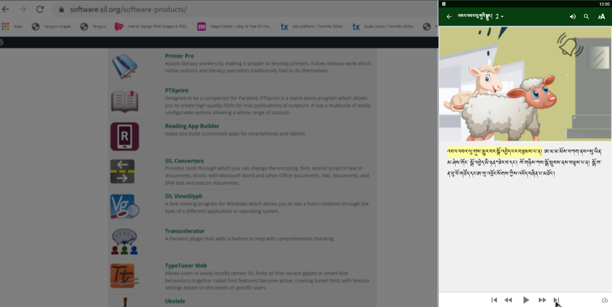
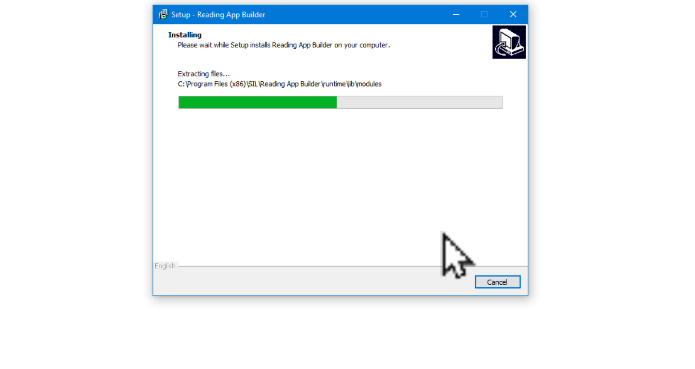
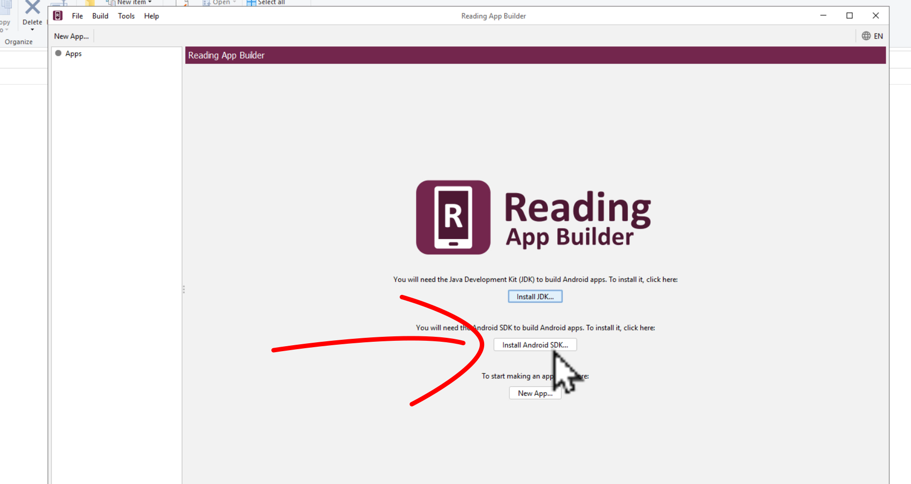

# དཔེ་ཀློག་མཉེན་ཆསསྒྲིག་སྟེགས་ཕབ་ལེན་དང་འཇུག་སྤྲོད།

འདི་ནི་དཔེ་ཀློག་མཉེན་ཆས་སྒྲིག་སྟེགས་ཏེ་ Reading App Builder (RAB)(V 10.1.1) སྒེའུ་ཁུང་རྟགས་ཅན་གྱི་གློག་ཀླད་ནང་ཕབ་ལེན་དང་འཇུག་སྤྲོད་བྱ་ཚུལ་སྤྱི་དང་། བྱེ་བྲག་མཉེན་ཆས་འདིའི་རམ་འདེགས་མཉེན་ཆས་JDKདང་SDKཕབ་ལེན་བྱ་ཚུལ་རྣམས་ངོ་སྤྲོད་བྱས་ཡོད། ཞིབ་ཕྲ་གཤམ་ལ་གཟིགས།

## 📩 ཕབ་ལེན་དྲ་ཚིགས།

ཕབ་ལེན་བྱ་ཡུལ་གྱི་དྲ་ཐག [དྲ་ཐག་འདི](https://software.sil.org/downloads/r/readingappbuilder/Reading-App-Builder-10.1.1-Setup.exe)འི་སྟེང་བསྣུན་ན་ཐད་ཀར་ཕབ་ལེན་བྱེད་ཡོང་བ་ཡིན། ཡང་ན་(software.sil.org/readingappbuilder/download)འདི་ངོ་བཤུ་བྱས་ཏེ་བཙལ་རུང་རྙེད་ཐུབ།

## ནང་དོན་གྱི་སྡེ་ཚན།

- 👉 དཔེ་ཀློག་མཉེན་ཆས་སྒྲིག་སྟེགས་RABངོ་སྤྲོད།
- 👉 དཔེ་ཀློག་མཉེན་ཆས་སྒྲིག་སྟེགས་ཕབ་ལེན་དང་འཇུག་སྤྲོད།
- 👉 རམ་འདེགས་མཉེན་ཆས་གཉིས་ཕབ་ལེན་དང་འཇུག་སྤྲོད།

## ཚོད་ལྟའི་དྲི་བ།

ཚོད་ལྟའི་དྲི་བ་རྣམས་ལ་ལན་རེ་ངེས་པར་དུ་འདེམ་རོགས། དེ་དག་ཐོག་མ་ནས་ཤེས་དགོས་པའི་ངེས་པ་མེད་པས་གང་རུང་ཞིག་འདེམ་ཆོག

1. RAB དཔེ་ཀློག་མཉེན་ཆས་སྒྲིག་སྟེགས་ནང་བརྙན་འཇོག་ཐུབ་བམ། མི་ཤེས།༽_མི་ཐུབ།༽ ཐུབ།༽ (正确回答)
2. RAB མཉེན་ཆས་ཕབ་ལེན་བྱེད་པར་གློག་ཀླད་ཀྱི་ཤོང་ཚད་ག་ཚོད་ཡོད་དགོས། 2GB༽3GB༽4GB༽ (正确回答)
3. དབབ་བྱའི་རམ་འདེགས་མཉེན་ཆས་གཉིས་གང་ན་ཡོད་དམ། New App༽Build Android App༽ སྒྲིག་སྟེགས་ཀྱི་མདུན་ངོས་སུ་ཡོད།༽ (正确回答)

## 1. དཔེ་ཀློག་མཉེན་ཆས་སྒྲིག་སྟེགས་ངོ་སྤྲོད།(RAB)
དཔེ་ཀློག་མཉེན་ཆས་སྒྲིག་སྟེགས་ཅི་ཞིག་ཡིན་པ་དང་དེའི་བྱེད་ལས་ཁག་ངོ་སྤྲོད་བྱས་ཡོད།

👇 དེ་ཅི་ལྟར་བྱ་ཚུལ་ལ་གཟིགས།

- སློབ་ཚན་གྱི་བརྙན། [དྲ་ཐག་འདིར་སྣུན།](https://drive.google.com/file/d/1LeoV26cmMhiZO3G0JQ3OFpKMF8LRXx6c/view?usp=share_link)

1. དྲི་བ། RAB དཔེ་ཀློག་མཉེན་ཆས་སྒྲིག་སྟེགས་ནང་བརྙན་འཇོག་ཐུབ་བམ། ཐུབ།༽ (正确回答) མི་ཐུབ།༽ མི་ཤེས།༽

## 2. དཔེ་ཀློག་མཉེན་ཆས་ཕབ་ལེན་དང་འཇུག་སྤྲོད།

འདིར་དཔེ་ཀློག་མཉེན་ཆས་སྒྲིག་སྟེགས་ཕབ་ལེན་དང་འཇུག་སྤྲོད་བྱ་ཚུལ་གྱི་རིམ་པ་ཁག་ངོ་སྤྲོད་བྱས་ཡོད།

👇 དེ་ཅི་ལྟར་བྱ་ཚུལ་ལ་གཟིགས།

- སློབ་ཚན་གྱི་བརྙན། [དྲ་ཐག་འདིར་སྣུན།](https://drive.google.com/file/d/1dKUlSXAmQbzdXyW98jCnZqQJeLsTeTLT/view?usp=share_link)

2. དྲི་བ། RAB མཉེན་ཆས་ཕབ་ལེན་བྱེད་པར་གློག་ཀླད་ཀྱི་ཤོང་ཚད་ག་ཚོད་ཡོད་དགོས།  
3GB༽ 4GB༽ (正确回答) 2GB༽

## 3. རམ་འདེགས་མཉེན་ཆས་གཉིས་ཕབ་ལེན།

འདིར་རམ་འདེགས་མཉེན་ཆས་JDKདང་SDKགཉིས་ཕབ་ལེན་བྱ་ཚུལ་ངོ་སྤྲོད་བྱས་ཡོད།

👇 དེ་ཅི་ལྟར་བྱ་ཚུལ་ལ་གཟིགས།

- སློབ་ཚན་གྱི་བརྙན། [དྲ་ཐག་འདིར་སྣུན།](https://drive.google.com/file/d/1CXSHeenXaM9bj5eqzVubp5OTsEOkZBoc/view?usp=share_link)

2. དྲི་བ། དབབ་བྱའི་རམ་འདེགས་མཉེན་ཆས་གཉིས་གང་ན་ཡོད་དམ།  
New App༽ Build Android App༽ སྒྲིག་སྟེགས་ཀྱི་མདུན་ངོས་སུ་ཡོད།༽ (正确回答)

## བཟོས་ཟིན་པའི་མཉེན་ཆས་ཚོད་ལྟ།

🡺 ཕབ་ལེན་ཁག་ལེགས་འགྲུབ་བྱུང་མེད་བརྟག་ཕྱིར་སློབ་ཚན་རྗེས་མ་RAB02ལ་གཟིགས།