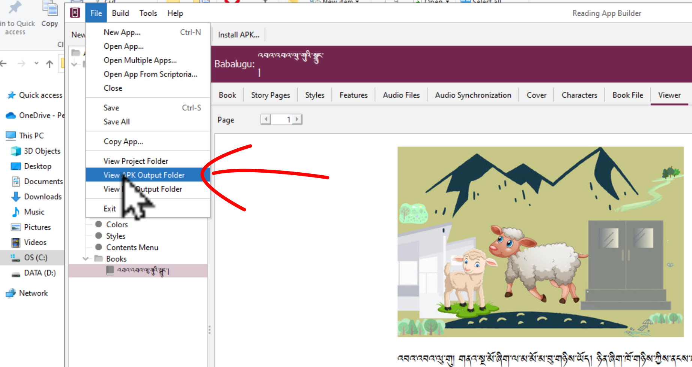
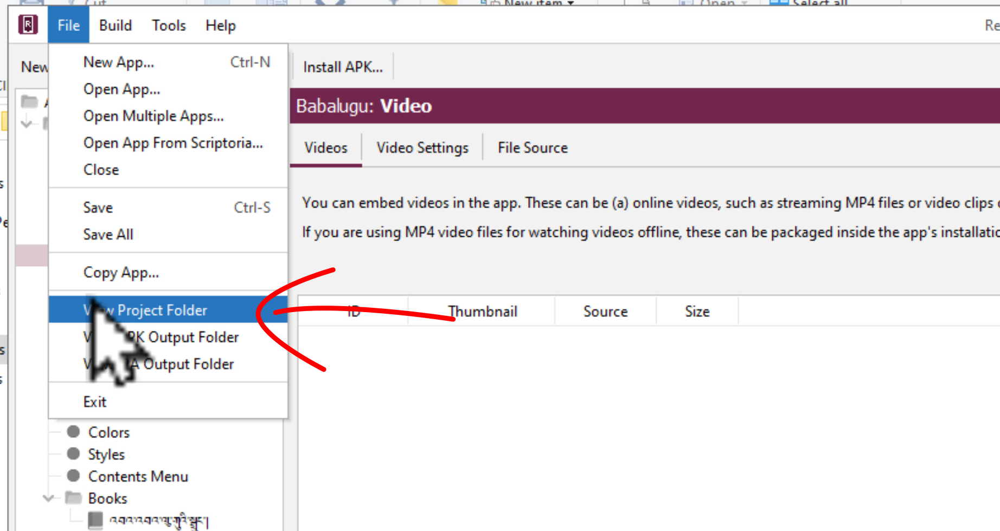

# མཉེན་ཆས་ཁག་ཕབ་ལེན་གྲུབ་ཡོད་མེད་བརྟག་པ།

འདིར་དཔེ་ཀློག་མཉེན་ཆས་སྒྲིག་སྟེགས་(RAB)དང་དེའི་རམ་འདེགས་མཉེན་ཆས་རྣམས་ཕབ་ལེན་ལམ་ལྷོང་བྱུང་ཡོད་མེད་བརྟག་ཚུལ་གྱི་རིམ་པ་ཁག་ངོ་སྤྲོད་བྱས་ཡོད། ཞིབ་ཕྲ་གཤམ་ལ་གཟིགས།

## སློབ་ཚན་འདིའི་ནང་དོན་གཙོ་བོ་ཁག

སློབ་ཚན་འདིའི་ནང་ངོ་སྤྲོད་བྱ་རྒྱུའི་ནང་དོན་ཁག་ལ་གཟིགས།

- 👉 བཟོས་ཟིན་པའི་མཉེན་ཆས་ཕབ་ལེན་དང་ཚོད་ལྟ་བྱེད་ཚུལ།
- 👉 མཉེན་ཆས་ཀྱི་APKལ་བལྟ་ཚུལ།
- 👉 མཉེན་ཆས་ཀྱི་Projectལ་བལྟ་ཚུལ།

## ཚོད་ལྟའི་དྲི་བ།

ཚོད་ལྟའི་དྲི་བ་རྣམས་ལ་ལན་རེ་ངེས་པར་དུ་འདེམ་རོགས། དེ་དག་ཐོག་མ་ནས་ཤེས་དགོས་པའི་ངེས་པ་མེད་པས་གང་རུང་ཞིག་འདེམ་ཆོག

1. ཚོད་ལྟ་བྱེད་པར་བཟོས་ཟིན་པའི་མཉེན་ཆས་ཀྱི་ཡིག་ཆ་གང་ལེན་དགོས།  data༽ ཡིག་ཆ་ཆ་ཚང་།༽ .appDef༽ (正确回答)
2. APKལ་བལྟ་བར་ཐོག་མར་གང་གནོན་དགོས་སམ། New App༽ Build༽ File༽ (正确回答)
3. Projectལ་བལྟ་བར་གང་གནོན་དགོས་སམ། Open app༽ Build༽ File༽ (正确回答)

## ༡. བཟོས་ཟིན་པའི་མཉེན་ཆས་ཕབ་ལེན་དང་ཚོད་ལྟ།

ད་སྔ་བཟོས་ཟིན་པའི་མཉེན་ཆས་[Github དྲ་ཐག་](https://github.com/tadhondup/RAB-Sample/archive/refs/heads/main.zip) དང་ [微云 དྲ་ཐག་](https://share.weiyun.com/FfxgnShO)འདི་གཉིས་ཀྱི་གང་རུང་ནས་ཕབ་ལེན་བྱས་ཏེ་ཚོད་ལྟ་བྱ་ཚུལ་ངོ་སྤྲོད་བྱས་ཡོད།

👇 དེ་ཅི་ལྟར་བྱ་ཚུལ་ལ་གཟིགས།

 

- སློབ་ཚན་གྱི་བརྙན། [དྲ་ཐག་འདིར་སྣུན།](https://drive.google.com/file/d/1b8mWfiPW08ivZ9KFOLaTQ5YpVXM6PpR3/view?usp=share_link)

1. དྲི་བ། ཚོད་ལྟ་བྱེད་པར་བཟོས་ཟིན་པའི་མཉེན་ཆས་ཀྱི་ཡིག་ཆ་གང་ལེན་དགོས། 
2. .appDef༽ (正确回答) data༽ ཡིག་ཆ་ཆ་ཚང་།༽

## 2. མཉེན་ཆས་ཀྱི་APKལ་བལྟ་ཚུལ།

👇 དེ་ཅི་ལྟར་བྱ་ཚུལ་ལ་གཟིགས།

- སློབ་ཚན་གྱི་བརྙན། [དྲ་ཐག་འདིར་སྣུན།](https://drive.google.com/file/d/11VPKAdLSDj6J7JAz1krkOOt3DB0zx1zq/view?usp=share_link)

2. དྲི་བ། APKལ་བལྟ་བར་ཐོག་མར་གང་གནོན་དགོས་སམ། 
2. New App༽ File༽ (正确回答)  Build༽

### 3.མཉེན་ཆས་ཀྱི་Projectལ་བལྟ་ཚུལ།

👇 དེ་ཅི་ལྟར་བྱ་ཚུལ་ལ་གཟིགས།

- སློབ་ཚན་གྱི་བརྙན། [དྲ་ཐག་འདིར་སྣུན།](https://drive.google.com/file/d/1zo35pwptVj7PcZ3aewUV3IjIumzn8Yhe/view?usp=share_link)

3. དྲི་བ། Projectལ་བལྟ་བར་གང་གནོན་དགོས་སམ། 
4. Open app༽ Build༽ File༽ (正确回答)

## བྱིས་སྒྲུང་མཉེན་ཆས་དངོས་སུ་སྒྲིག་ཚུལ།

🡺 དཔེ་ཀློག་མཉེན་ཆས་སྒྲིག་སྟེགས་ནང་ནས་བྱིས་སྒྲུང་མཉེན་ཆས་དངོས་སུ་སྒྲིག་ཚུལ་གྱི་སློབ་ཚན་ཁག་[RAB03]([https://github.com/buda-base/budax/edit/master/howtoguides/RAB03/index.md](https://github.com/buda-base/budax/blob/master/howtoguides/RAB03/index.md)ལ་གཟིགས།
