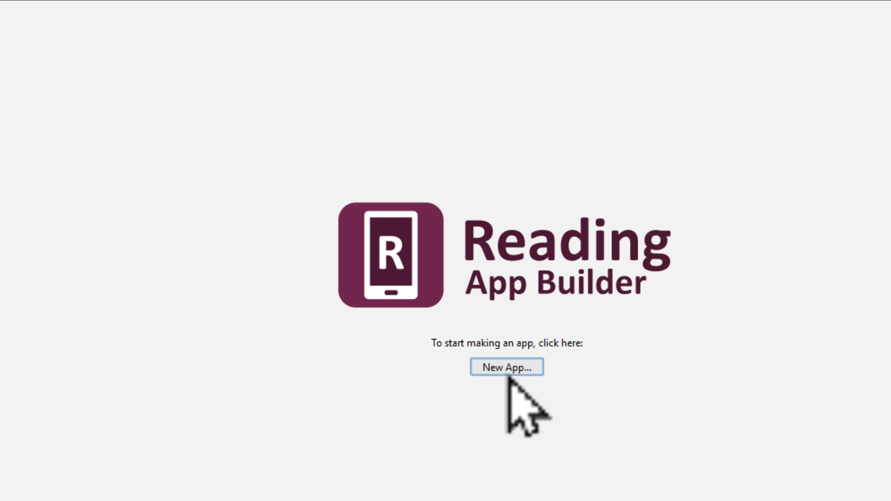
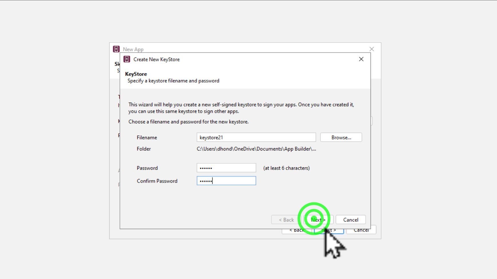
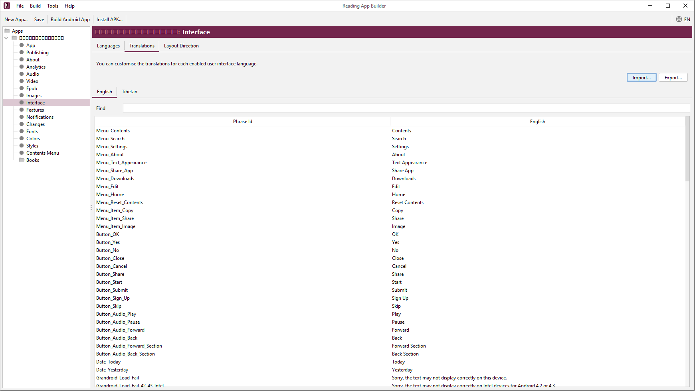

# RAB མཉེན་ཆས་ཐུན་མོང་གི་སྒྲིག་འགོད།

འདི་ནི་RABནང་མཉེན་ཆས་གང་ཞིག་བཟོས་རུང་དེ་དག་གི་ཐོག་མའི་ཐུན་མོང་གི་སྒྲིག་འགོད་སྒྲིག་སྟངས་ངོ་སྤྲོད་བྱས་ཡོད། ཞིབ་ཕྲ་གཤམ་ལ་གཟིགས།

## སློབ་ཚན་འདིའི་ནང་དོན་གཙོ་བོ་ཁག
- 👉 མཉེན་ཆས་ཀྱི་རྨང་གཞི་གསར་བཟོ།
- 👉 གསོག་མཛོད་Keystoreབཟོ་ཚུལ།
- 👉 མཉེན་ཆས་ནང་བོད་ཡིག་འཇོག་ཚུལ།

## ཚོད་ལྟའི་དྲི་བ།

ཚོད་ལྟའི་དྲི་བ་རྣམས་ལ་ལན་རེ་ངེས་པར་དུ་འདེམ་རོགས། དེ་དག་ཐོག་མ་ནས་ཤེས་དགོས་པའི་ངེས་པ་མེད་པས་གང་རུང་ཞིག་འདེམ་ཆོག

1. RABནང་བོད་ཡིག་ཡིག་གཟུགས་འདེམ་སྐབས་གང་འདེམ་དགོས་སམ། Sample Text༽ Select a common font༽ Specify a font file༽ (正确回答)
2. མཉེན་ཆས་རེ་རེ་ལ་Keystore རེ་རེ་གསར་བཟོ་བྱེད་དགོས་སམ། མི་ཤེས།༽ དགོས།༽ མི་དགོས།༽ (正确回答)
3. མཉེན་ཆས་ཀྱི་སྐད་ཡིག་བོད་འགྱུར་མ་གང་ནས་ཕབ་དགོས། Google༽ 百度༽ 微云༽ (正确回答)

## 1. མཉེན་ཆས་ཀྱི་རྨང་གཞི་གསར་བཟོ།

འདིར་མཉེན་ཆས་ཀྱི་རྨང་གཞི་གསར་བཟོ་དང་ཡིག་གཟུགས་འདེམ་ཚུལ་ངོ་སྤྲོད་བྱས་ཡོད།

👇 དེ་ཅི་ལྟར་བྱ་ཚུལ་ལ་གཟིགས།

- སློབ་ཚན་གྱི་བརྙན། [དྲ་ཐག་འདིར་སྣུན།](https://drive.google.com/file/d/1CNVokXkPqtq8xO6Ydhwrcnl8BZmrtoeV/view?usp=share_link)

1. དྲི་བ། RABནང་བོད་ཡིག་ཡིག་གཟུགས་འདེམ་སྐབས་གང་འདེམ་དགོས་སམ།  
Specify a font file༽ (正确回答) Select a common font༽ Sample Text༽

## 2. གསོག་མཛོད་Keystoreབཟོ་ཚུལ།

འདིར་གསོག་མཛོད་དམ་Keystoreགསར་བཟོ་བྱེད་ཚུལ་ངོ་སྤྲོད་བྱས་ཡོད།

👇 དེ་ཅི་ལྟར་བྱ་ཚུལ་ལ་གཟིགས།

- སློབ་ཚན་གྱི་བརྙན། [དྲ་ཐག་འདིར་སྣུན།](https://drive.google.com/file/d/1YsbEfgihc6WDF4msmtOVe4l3X4CUesI_/view?usp=share_link)

2. དྲི་བ། མཉེན་ཆས་རེ་རེ་ལ་Keystore རེ་རེ་གསར་བཟོ་བྱེད་དགོས་སམ། མི་ཤེས།༽ མི་དགོས།༽ (正确回答) དགོས།༽

## 3. མཉེན་ཆས་ནང་བོད་ཡིག་འཇོག་ཚུལ།

འདིར་མཉེན་ཆས་ནང་སྐད་ཡིག་དུ་མ་མཉམ་འཇོག་བྱེད་ཐུབ་པས། འདིར་ཨིན་ཡིག་དང་བོད་ཡིག་མཉམ་འཇོག་ཚུལ་བྱ་ཚུལ་ངོ་སྤྲོད་བྱས་ཡོད། མཉེན་ཆས་ཀྱི་སྐད་ཡིག་བོད་འགྱུར་མ་[GitHub དྲ་ཐག་](https://github.com/tadhondup/RAB-Sample/releases/download/v1.0.2/RAB.Localization.Bo.txt) དང་ [微云 དྲ་ཐག་](https://share.weiyun.com/2B9PYmOS)འདི་གཉིས་ཀྱི་གང་རུང་ནས་ཕབ་ལེན་བྱོས།

👇 དེ་ཅི་ལྟར་བྱ་ཚུལ་ལ་གཟིགས།

 

- སློབ་ཚན་གྱི་བརྙན། [དྲ་ཐག་འདིར་སྣུན།](https://drive.google.com/file/d/1ACVvPfv6cTWXgJf9EqQFyQ4p45YLr_CW/view?usp=share_link)

3. དྲི་བ། མཉེན་ཆས་ཀྱི་སྐད་ཡིག་བོད་འགྱུར་མ་གང་ནས་ཕབ་དགོས། Google༽ 百度༽ 微云༽ (正确回答)

## བྱིས་སྒྲུང་མཉེན་ཆས་སྒྲིག་ཚུལ།

🡺 དཔེ་ཀློག་མཉེན་ཆས་སྒྲིག་སྟེགས་ནང་ནས་བྱིས་སྒྲུང་མཉེན་ཆས་དངོས་སུ་སྒྲིག་ཚུལ་གྱི་སློབ་ཚན་རྗེས་མ་[RAB04](https://github.com/buda-base/budax/blob/master/howtoguides/RAB04/index.md)ལ་གཟིགས།
