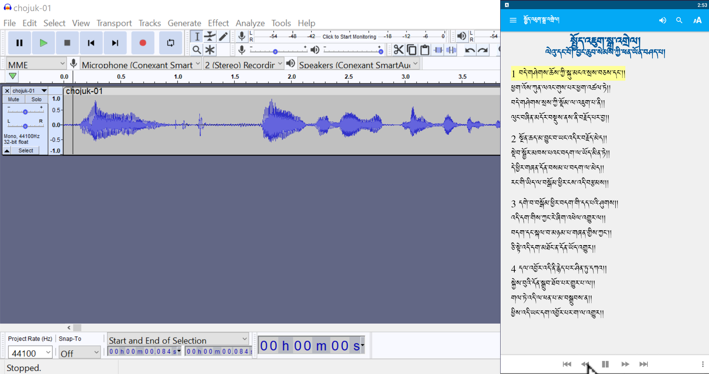
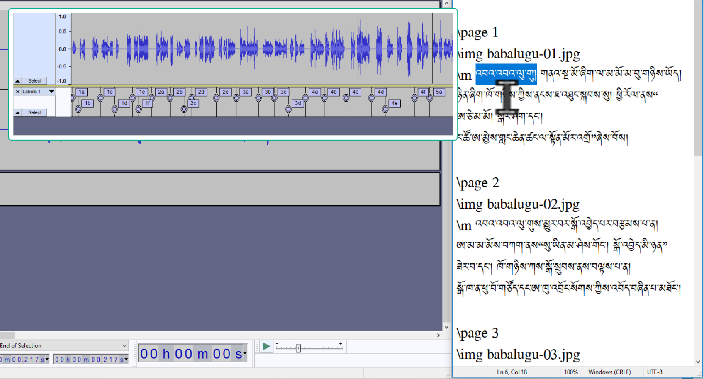
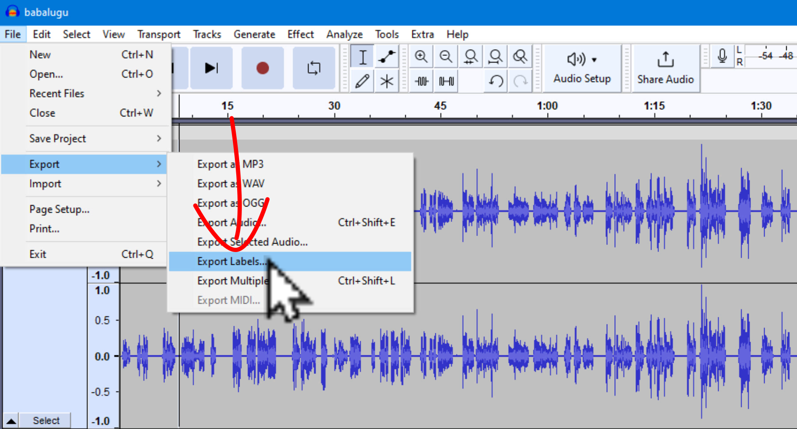

# སྒྲ་ལྡན་བྱིས་སྒྲུང་མཉེན་ཆས་སྒྲིག་ཚུལ།2\3

འདིར་Audacityསྒྲ་སྒྲིག་མཉེན་ཆས་ཕབ་ལེན་དང་དེའི་ནང་ཡིག་ཆ་སྒྲིག་ཚུལ་ངོ་སྤྲོད་བྱས་ཡོད། ཞིབ་ཕྲ་གཤམ་ལ་གཟིགས།

## སྒྲ་ལྡན་བྱིས་སྒྲུང་མཉེན་ཆས་ཀྱི་གྲུབ་ཆ་ཁག

སྒྲ་ལྡན་བྱིས་སྒྲུང་མཉེན་ཆས་ཆ་ཚང་ཞིག་བསྒྲིག་པར་ནང་གསེས་སློབ་ཚན་འདི་དག་ལ་ངེས་ཆ་དང་བྱང་ཆ་ལྡན་དགོས།

1. [འདིའི་ཐུན་མིན་མཚོན་རྟགས་ངོ་སྤྲོད།](https://github.com/buda-base/budax/blob/master/howtoguides/RAB04/index.md)
2. Audacityཕབ་ལེན་དང་སྒྲ་སྒྲིག་ཚུལ།
3. [བྱིས་སྒྲུང་མཉེན་ཆས་དངོས་སུ་སྒྲིག་ཚུལ།]()

## 2. Audacityཕབ་ལེན་དང་སྒྲ་སྒྲིག་ཚུལ།

སློབ་ཚན་འདིའི་ནང་ངོ་སྤྲོད་བྱ་རྒྱུའི་ནང་དོན་ཁག་ལ་གཟིགས།

- 👉 Audacityཕབ་ལེན་དང་འཇུག་སྤྲོད།
- 👉 ཡིག་ཆ་ནང་འདྲེན་དང་སྒྲ་མཚམས་རེའུ་མིག་བཟོ་ཚུལ།
- 👉 སྒྲ་དང་སྒྲ་མཚམས་རེའུ་མིག་ཕྱིར་འདྲེན།

## ཚོད་ལྟའི་དྲི་བ།

ཚོད་ལྟའི་དྲི་བ་རྣམས་ལ་ལན་རེ་ངེས་པར་དུ་འདེམ་རོགས། དེ་དག་ཐོག་མ་ནས་ཤེས་དགོས་པའི་ངེས་པ་མེད་པས་གང་རུང་ཞིག་འདེམ་ཆོག

1. ཕབ་ལེན་སྐབས་Runཟེར་བ་དེ་སྐད་ཡིག་འདེམ་གསེས་ཀྱི་སྔ་རྗེས་གང་ན་ཡོད། རྗེས།༽ མཉམ་དུ།༽ སྔོན།༽ (正确回答)
2. སྒྲ་མཚམས་རེའུ་མིག་བཟོ་སྐབས་ཀྱི་མགྱོགས་ཐེབས་གང་ཡིན། shift+b༽ alt+m༽ ctrl+m༽ (正确回答)
3. སྒྲ་ཕྱིར་འདྲེན་སྐབས་འདེམ་རྟགས་རྒྱག་དགོས་ས་གང་ཡིན། Labels༽ Export as WAV༽ Constant༽ (正确回答)

## 1. Audacityཕབ་ལེན་དང་འཇུག་སྤྲོད།

སྒྲ་སྒྲིག་མཉེན་ཆས་འདི་ཕབ་ལེན་བྱ་གནས་[དྲ་ཐག་](https://www.audacityteam.org/)འདིར་སྣུན། ཡང་ན་www.audacityteam.org འདི་ཐད་ཀར་ངོ་བཤུ་བྱས་ཏེ་བཙལ་ཡང་རུང་ངོ་།།

👇 དེ་ཅི་ལྟར་བྱ་ཚུལ་ལ་གཟིགས།

- སློབ་ཚན་གྱི་བརྙན། [དྲ་ཐག་འདིར་སྣུན།](https://drive.google.com/file/d/13yJTuNHQv932V1dhITeQGkVwdXgCtAzY/view?usp=share_link)

1. དྲི་བ། ཕབ་ལེན་སྐབས་Runཟེར་བ་དེ་སྐད་ཡིག་འདེམ་གསེས་ཀྱི་སྔ་རྗེས་གང་ན་ཡོད།  
སྔོན།༽ (正确回答) རྗེས།༽ མཉམ་དུ།༽ 

## 2. ཡིག་ཆ་ནང་འདྲེན་དང་སྒྲ་མཚམས་རེའུ་མིག་བཟོ་ཚུལ།

འདིའི་ནང་གསེས་གཉིས་ལ་རིམ་པར་གཟིགས།
### 2.1 སྒྲ་ནང་འདྲེན་དང་སྒྲ་མཚམས་རེའུ་མིག་ངོ་སྤྲོད། 

དཔེ་མཚོན་ལམ་ནས་སྒྲ་ནང་འདྲེན་དང་གཙང་སྒྲིག་བྱེད་ཚུལ་སྒྲ་མཚམས་རེའུ་མིག་གང་ཡིན་བཅས་ངོ་སྤྲོད་བྱས་ཡོད།

👇 དེ་ཅི་ལྟར་བྱ་ཚུལ་ལ་གཟིགས།

- སློབ་ཚན་གྱི་བརྙན། [དྲ་ཐག་འདིར་སྣུན།](https://drive.google.com/file/d/1y1s4W-0cy8mgCdqfEzZF0Z0aA12Tq1Bu/view?usp=share_link)

### 2.2 སྒྲ་མཚམས་རེའུ་མིག་བཟོ་ཚུལ།

👇 དེ་ཅི་ལྟར་བྱ་ཚུལ་ལ་གཟིགས།

- སློབ་ཚན་གྱི་བརྙན། [དྲ་ཐག་འདིར་སྣུན།](https://drive.google.com/file/d/1dj0ejgtLqPqIZ4KIZj9Qzt6PJfr5UR6O/view?usp=share_link)

2. དྲི་བ། སྒྲ་མཚམས་རེའུ་མིག་བཟོ་སྐབས་ཀྱི་མགྱོགས་ཐེབས་གང་ཡིན།  
alt+m༽ ctrl+m༽ (正确回答) shift+b༽
## 3. སྒྲ་དང་སྒྲ་མཚམས་རེའུ་མིག་ཕྱིར་འདྲེན།

👇 དེ་ཅི་ལྟར་བྱ་ཚུལ་ལ་གཟིགས།

 

- སློབ་ཚན་གྱི་བརྙན། [དྲ་ཐག་འདིར་སྣུན།](https://drive.google.com/file/d/1KAp02CTTJP9Qk8LBqYoarU_8tZ49GSzl/view?usp=share_link)

3. དྲི་བ། སྒྲ་ཕྱིར་འདྲེན་སྐབས་འདེམ་རྟགས་རྒྱག་དགོས་ས་གང་ཡིན།  
Labels༽ Export as WAV༽ Constant༽ (正确回答)
