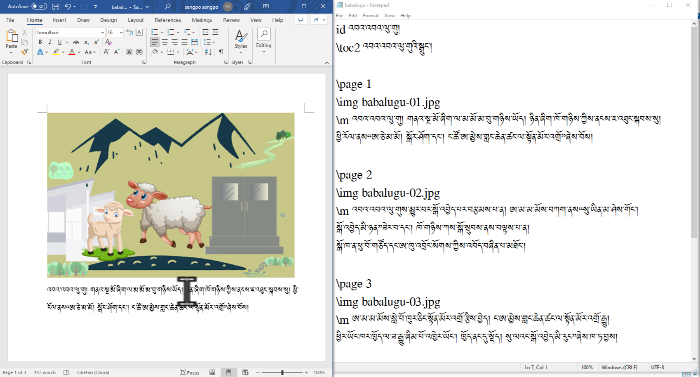
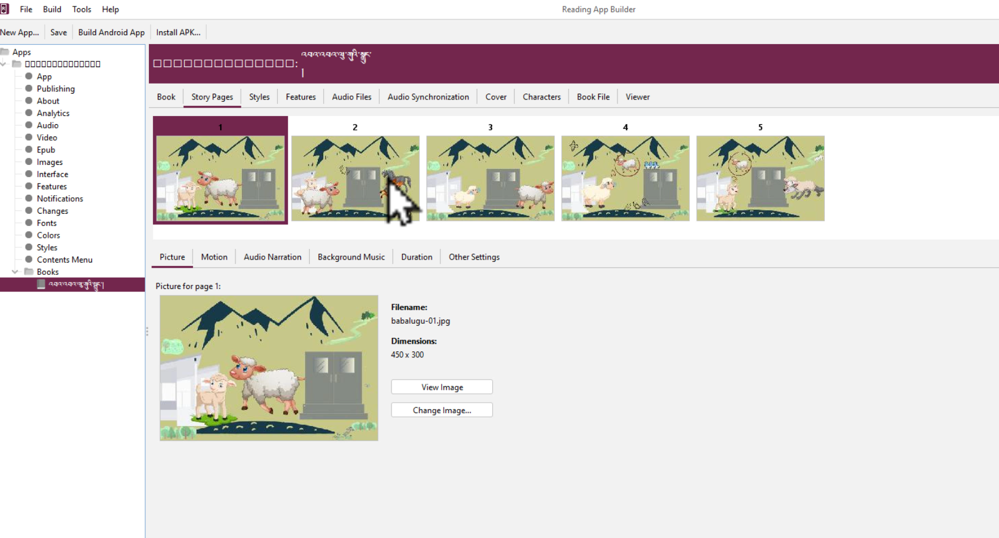
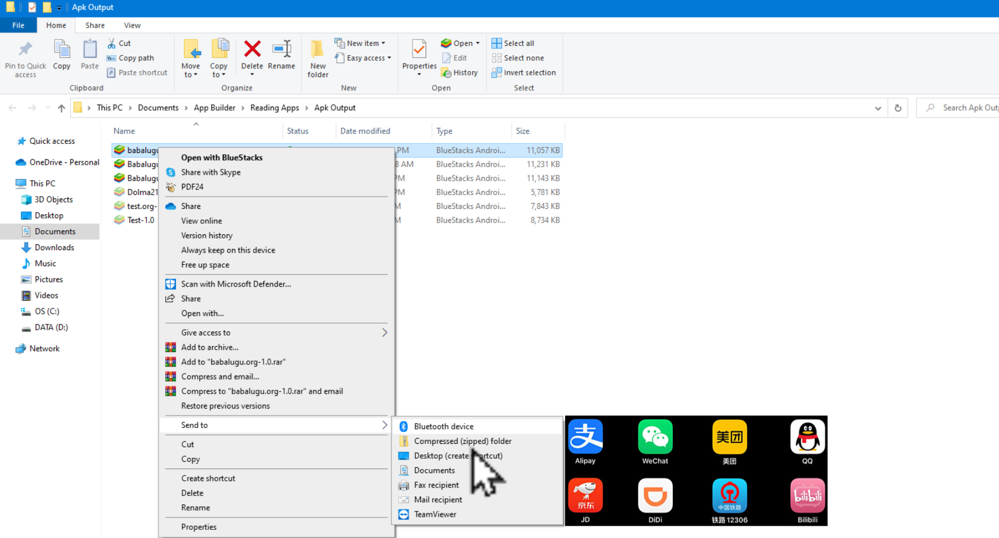

# སྒྲ་ལྡན་བྱིས་སྒྲུང་མཉེན་ཆས་སྒྲིག་ཚུལ།3\3

འདིར་RABདཔེ་ཀློག་མཉེན་ཆས་སྒྲིག་སྟེགས་ནང་དངོས་སུ་རྩོམ་སྒྲིག་བྱ་ཚུལ་དང་དེའི་མཉེན་ཆས། དེ་བཞིན་དཔེ་ཆ་སྒྲིག་ཚུལ་བཅས་ངོ་སྤྲོད་བྱས་ཡོད། ཞིབ་ཕྲ་གཤམ་ལ་གཟིགས།
## སྒྲ་ལྡན་བྱིས་སྒྲུང་མཉེན་ཆས་ཀྱི་གྲུབ་ཆ་ཁག

སྒྲ་ལྡན་བྱིས་སྒྲུང་མཉེན་ཆས་ཆ་ཚང་ཞིག་བསྒྲིག་པར་ནང་གསེས་སློབ་ཚན་འདི་དག་ལ་ངེས་ཆ་དང་བྱང་ཆ་ལྡན་དགོས།

1. [འདིའི་ཐུན་མིན་མཚོན་རྟགས་ངོ་སྤྲོད།](https://github.com/buda-base/budax/blob/master/howtoguides/RAB04/index.md)
2. [Audacityཕབ་ལེན་དང་སྒྲ་སྒྲིག་ཚུལ།](https://github.com/buda-base/budax/blob/master/howtoguides/RAB05/index.md)
3. སྒྲ་ལྡན་བྱིས་སྒྲུང་མཉེན་ཆས་དངོས་སུ་སྒྲིག་ཚུལ།

## 3. སྒྲ་ལྡན་བྱིས་སྒྲུང་མཉེན་ཆས་དངོས་སུ་སྒྲིག་ཚུལ།

སློབ་ཚན་འདིའི་ནང་ངོ་སྤྲོད་བྱ་རྒྱུའི་ནང་དོན་ཁག

- 👉 རྩོམ་སྒྲིག་དང་དེ་བྱ་སའི་མཉེན་ཆས་ངོ་སྤྲོད།
- 👉 རྒྱུ་ཆ་རྣམས་དཔེ་ཆའི་ཚན་པའི་ནངསྒྲིག་ཚུལ།
- 👉 སྔོན་ཚུད་ལྟ་ཞིབ་དང་མཉེན་ཆས་དངོས་སྒྲིག

## ཚོད་ལྟའི་དྲི་བ།

ཚོད་ལྟའི་དྲི་བ་རྣམས་ལ་ལན་རེ་ངེས་པར་དུ་འདེམ་རོགས། དེ་དག་ཐོག་མ་ནས་ཤེས་དགོས་པའི་ངེས་པ་མེད་པས་གང་རུང་ཞིག་འདེམ་ཆོག

1. RABནང་ཡིག་ཆ་བླངས་ན་འདྲ་པར་ཡང་མཉམ་དུ་འཁྱེར་ཡོང་བའི་མཉེན་ཆས་དེ་གང་ཡིན། TextEditor༽ Notepad༽ Word༽ (正确回答)
2. Motion ཟེར་བའི་ཚན་པ་དེ་སྡེ་ཚན་གང་གི་ནང་ཡོད་དམ། images༽ illustrations༽ Story Pages༽ (正确回答)
3. APKལ་བལྟ་སྐབས་ཐོག་མར་གང་གནོན་དགོས། View apk༽ Build༽ File༽ (正确回答)

## 1. རྩོམ་སྒྲིག་དང་དེ་བྱ་སའི་མཉེན་ཆས་ངོ་སྤྲོད།

👇 དེ་ཇི་ལྟར་བྱ་ཚུལ་ལ་གཟིགས།

- སློབ་ཚན་གྱི་བརྙན། [དྲ་ཐག་འདིར་སྣུན།](https://drive.google.com/file/d/1JnyCRr_4tU5tQ9RKPPVmVAod89m2YdxW/view?usp=share_link)

1. དྲི་བ། RABནང་ཡིག་ཆ་བླངས་ན་འདྲ་པར་ཡང་མཉམ་དུ་འཁྱེར་ཡོང་བའི་མཉེན་ཆས་དེ་གང་ཡིན། Word༽ (正确回答)Notepad༽ TextEditor༽

## 2. རྒྱུ་ཆ་རྣམས་དཔེ་ཆའི་ཚན་པའི་ནང་སྒྲིག་ཚུལ།

👇 དེ་ཇི་ལྟར་བྱ་ཚུལ་ལ་གཟིགས།

- སློབ་ཚན་གྱི་བརྙན། [དྲ་ཐག་འདིར་སྣུན།](https://drive.google.com/file/d/1l9b2XgDy5yFYUoOsZkWR40NHHtB_JxUb/view?usp=share_link)

2. དྲི་བ། Motion ཟེར་བའི་ཚན་པ་དེ་སྡེ་ཚན་གང་གི་ནང་ཡོད་དམ། illustrations༽ Story Pages༽ (正确回答) images༽

## 3. སྔོན་ཚུད་ལྟ་ཞིབ་དང་མཉེན་ཆས་དངོས་སྒྲིག

👇 དེ་ཇི་ལྟར་བྱ་ཚུལ་ལ་གཟིགས།

 

- སློབ་ཚན་གྱི་བརྙན། [དྲ་ཐག་འདིར་སྣུན།](https://drive.google.com/file/d/1QVhx91qW_84tlqA1Clx1I89h75RPdNQ0/view?usp=share_link)

3. དྲི་བ། APKལ་བལྟ་སྐབས་ཐོག་མར་གང་གནོན་དགོས། View apk༽ Build༽ File༽ (正确回答)