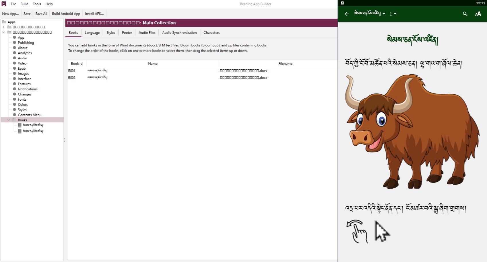
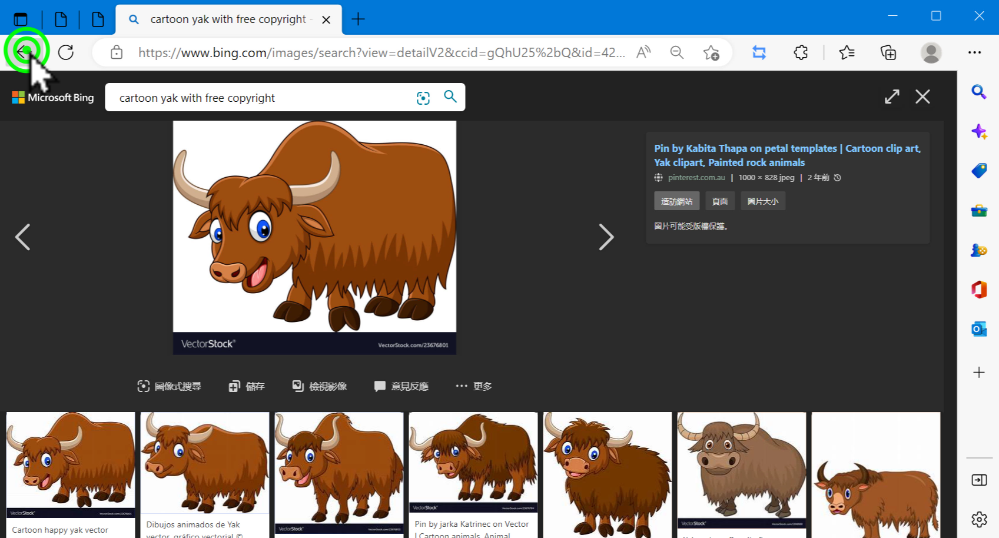
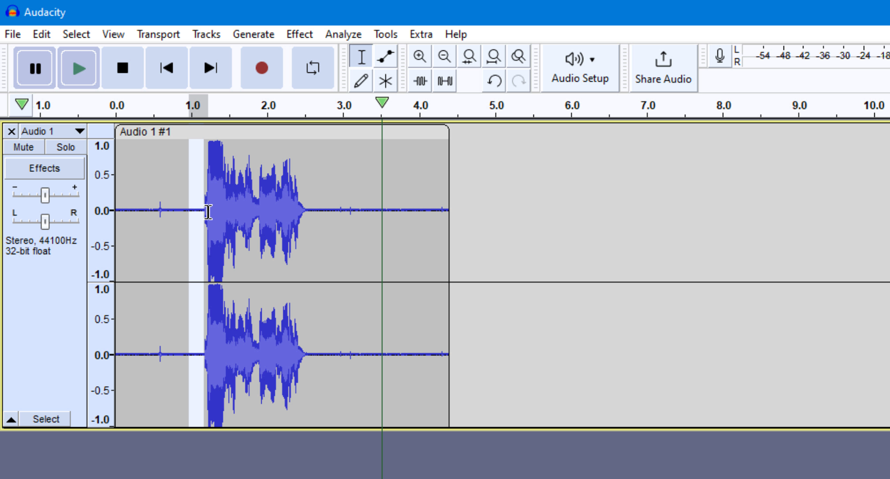

# སྐད་ལ་བརྟེན་ནས་སེམས་ཅན་ངོས་འཛིན།1/2

འདིར་RABདཔེ་ཀློག་མཉེན་ཆས་སྒྲིག་སྟེགས་ནང་སེམས་ཅན་གྱི་སྐད་དང་འདྲ་པར་མཉམ་སྒྲིག་གིས་ཕན་ཚུན་ངོས་འཛིན་ཚུལ་གྱི་བྱིས་སྒྲུང་མཉེན་ཆས་སྒྲིག་ཚུལ་ངོ་སྤྲོད་བྱས་ཡོད། ཞིབ་ཕྲ་གཤམ་ལ་གཟིགས།

## མཉེན་ཆས་འདི་སྒྲིག་ཚུལ་གྱི་སློབ་ཚན་ཁག་གཉིས།

མཉེན་ཆས་འདི་ཆ་ཚང་བ་ཞིག་སྒྲིག་བཟོ་བྱེད་པར་བྱེད་རྩ་བའི་སློབ་ཚན་སྟོད་སྨད་གཉིས་ལ་ངེས་ཆ་དང་བྱང་ཆ་གཉིས་ཀ་ལྡན་དགོས།
1. སློབ་ཚན་སྟོད་ཆ།
2. [སློབ་ཚན་སྨད་ཆ།](https://github.com/buda-base/budax/blob/master/howtoguides/RAB08/index.md)

## 1.1 སློབ་ཚན་སྟོད་ཆའི་ནང་དོན་ཁག

སློབ་ཚན་འདིའི་ནང་ངོ་སྤྲོད་བྱ་རྒྱུའི་ནང་དོན་ཁག་ནི་

- 👉 མཉེན་ཆས་དེ་དང་དེའི་རྒྱུ་ཆ་ངོ་སྤྲོད།
- 👉 འདྲ་པར་འཚོལ་ཞིབ་དང་སྒྲིག་ས་ངོ་སྤྲོད།
- 👉 སྒྲ་ལེན་ཚུལ་དང་ཉར་ཚུལ་ངོ་སྤྲོད།

## ཚོད་ལྟའི་དྲི་བ།

ཚོད་ལྟའི་དྲི་བ་རྣམས་ལ་ལན་རེ་ངེས་པར་དུ་འདེམ་རོགས། དེ་དག་ཐོག་མ་ནས་ཤེས་དགོས་པའི་ངེས་པ་མེད་པས་གང་རུང་ཞིག་འདེམ་ཆོག

1. འདིའི་ནང་རྩ་བའི་རྒྱུ་ཆ་རིགས་མ་འདྲ་བ་ག་ཚོད་ཡོད་དམ། ༡ ཡོད།༽ ༢ ཡོད།༽ ༣ ཡོད།༽ (正确回答)
2. འདིར་ངོ་སྤྲོད་བྱས་པའི་འདྲ་པར་སྒྲིག་ཆས་དེ་གང་ཡིན་ནམ། Photoshop༽ imageeditor༽ Photopee༽ (正确回答)
3. སྒྲ་ཕྱིར་འདྲེན་སྐབས་འདེམ་རྟགས་རྒྱག་དགོས་ས་དེ་གང་ཡིན་ནམ། Preset༽ Variable༽ Constant༽ (正确回答)

## 1. མཉེན་ཆས་དེ་དང་དེའི་རྒྱུ་ཆ་ངོ་སྤྲོད།

👇 དེ་ཅི་ལྟར་བྱ་ཚུལ་ལ་གཟིགས།

- སློབ་ཚན་གྱི་བརྙན། [དྲ་ཐག་འདིར་སྣུན།](https://drive.google.com/file/d/1uUHRHQ0LVK4f7IBcUGn3ZPXrzK222DV-/view?usp=share_link)

1. དྲི་བ། འདིའི་ནང་རྩ་བའི་རྒྱུ་ཆ་རིགས་མ་འདྲ་བ་ག་ཚོད་ཡོད་དམ། ༣ ཡོད།༽ (正确回答) ༢ ཡོད།༽ ༡ ཡོད།༽

## 2. འདྲ་པར་འཚོལ་ཞིབ་དང་སྒྲིག་ས་ངོ་སྤྲོད།

👇 དེ་ཅི་ལྟར་བྱ་ཚུལ་ལ་གཟིགས།

- སློབ་ཚན་གྱི་བརྙན། [དྲ་ཐག་འདིར་སྣུན།](https://drive.google.com/file/d/1M3KBEOm48Mwzrj0IDxSl-5QEAWRRNRZk/view?usp=share_link)

2. དྲི་བ། འདིར་ངོ་སྤྲོད་བྱས་པའི་འདྲ་པར་སྒྲིག་ཆས་དེ་གང་ཡིན་ནམ། Photoshop༽ Photopee༽ (正确回答) image editor༽ 

## 3. སྒྲ་ལེན་ཚུལ་དང་ཉར་ཚུལ་ངོ་སྤྲོད།

👇 དེ་ཅི་ལྟར་བྱ་ཚུལ་ལ་གཟིགས།

 

- སློབ་ཚན་གྱི་བརྙན། [དྲ་ཐག་འདིར་སྣུན།](https://drive.google.com/file/d/1yosdERO7gyB-zw3vYpD3V_IK_ZNGJKvA/view?usp=share_link)

3. དྲི་བ། སྒྲ་ཕྱིར་འདྲེན་སྐབས་འདེམ་རྟགས་རྒྱག་དགོས་ས་དེ་གང་ཡིན་ནམ། Preset༽ Variable༽ Constant༽ (正确回答)

- 👉 སློབ་ཚན་འདིའི་སྨད་ཆ་ལ་གཟིགས།
