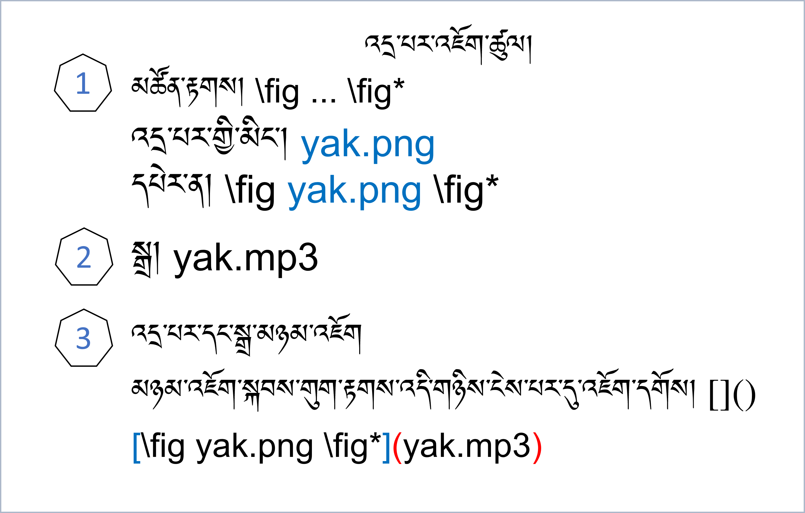
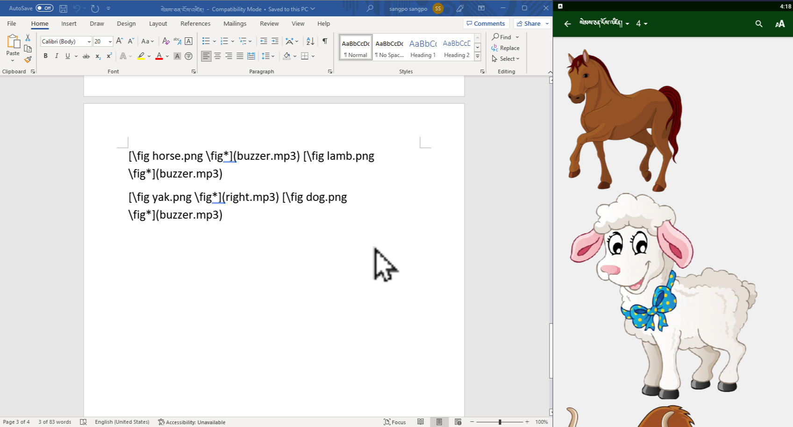
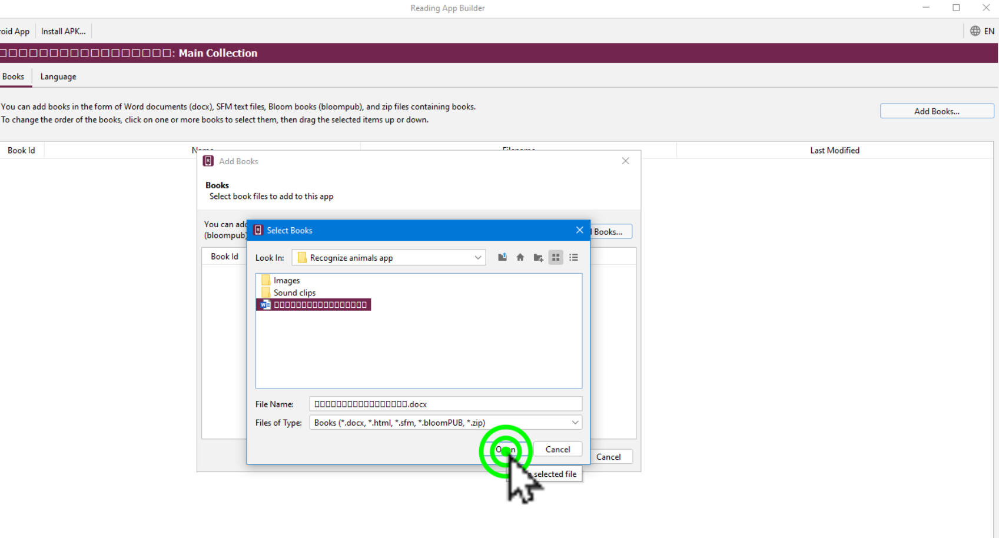
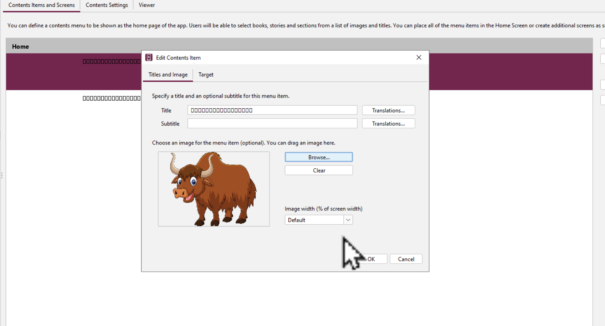

# སྐད་ལ་བརྟེན་ནས་སེམས་ཅན་ངོས་འཛིན།2/2

འདིར་RABདཔེ་ཀློག་མཉེན་ཆས་སྒྲིག་སྟེགས་ནང་སེམས་ཅན་གྱི་སྐད་དང་འདྲ་པར་མཉམ་སྒྲིག་གིས་ཕན་ཚུན་ངོས་འཛིན་ཚུལ་གྱི་བྱིས་སྒྲུང་མཉེན་ཆས་སྒྲིག་ཚུལ་ངོ་སྤྲོད་བྱས་ཡོད། ཞིབ་ཕྲ་གཤམ་ལ་གཟིགས།

## མཉེན་ཆས་འདི་འགྲུབ་བྱེད་ཀྱི་སློབ་ཚན།

མཉེན་ཆས་འདི་ཆ་ཚང་བ་ཞིག་སྒྲིག་བཟོ་བྱེད་པར་རྩ་བའི་སློབ་ཚན་འདིའི་སྟོད་སྨད་གཉིས་ལ་ངེས་ཆ་དང་བྱང་ཆ་གཉིས་ཀ་ལྡན་དགོས།
1. [སློབ་ཚན་སྟོད་ཆ།](https://github.com/buda-base/budax/blob/master/howtoguides/RAB07/index.md)
2. སློབ་ཚན་སྨད་ཆ།

## 2.1 སློབ་ཚན་སྨད་ཆའི་ནང་དོན་ཁག

སློབ་ཚན་འདིའི་ནང་ངོ་སྤྲོད་བྱ་རྒྱུའི་ནང་དོན་ཁག་ནི་

- 👉 སྒྲུང་རྩོམ་སྒྲིག་དང་མཚོན་རྟགས་འཇོག་ཚུལ་ངོ་སྤྲོད།
- 👉 སྒྲིག་སྟེགས་ནང་དངོས་སུ་སྒྲིག་ཚུལ་ངོ་སྤྲོད།
- 👉 དཔེ་ཆགཞན་དང་དཀར་ཆག་འདྲ་པར་འཇོག་ཚུལ་ངོ་སྤྲོད།

## ཚོད་ལྟའི་དྲི་བ།

ཚོད་ལྟའི་དྲི་བ་རྣམས་ལ་ལན་རེ་ངེས་པར་དུ་འདེམ་རོགས། དེ་དག་ཐོག་མ་ནས་ཤེས་དགོས་པའི་ངེས་པ་མེད་པས་གང་རུང་ཞིག་འདེམ་ཆོག

1. ༽ (正确回答)
2. ༽ (正确回答)
3. ༽ (正确回答)

## 1. སྒྲུང་རྩོམ་སྒྲིག་དང་མཚོན་རྟགས་འཇོག་ཚུལ་ངོ་སྤྲོད།

👇 དེ་ཅི་ལྟར་བྱ་ཚུལ་ལ་གཟིགས།

མཚོན་རྟགས་དང་དེ་དག་འཇོག་ཚུལ།

- སློབ་ཚན་གྱི་བརྙན། [དྲ་ཐག་འདིར་སྣུན།]()

1. དྲི་བ། 

## 2. སྒྲིག་སྟེགས་ནང་དངོས་སུ་སྒྲིག་ཚུལ་ངོ་སྤྲོད།

👇 དེ་ཅི་ལྟར་བྱ་ཚུལ་ལ་གཟིགས།

- སློབ་ཚན་གྱི་བརྙན། [དྲ་ཐག་འདིར་སྣུན།]()

2. དྲི་བ། 

## 3. དཔེ་ཆགཞན་དང་དཀར་ཆག་འདྲ་པར་འཇོག་ཚུལ་ངོ་སྤྲོད།

👇 དེ་ཅི་ལྟར་བྱ་ཚུལ་ལ་གཟིགས།

 

- སློབ་ཚན་གྱི་བརྙན། [དྲ་ཐག་འདིར་སྣུན།]()

3. དྲི་བ། 

- 👉 མདུན་གྱི་དྲ་ཐག་བརྒྱུད་ནས་སློབ་ཚན་འདིའི་སྟོད་ཆ་ལ་གཟིགས།