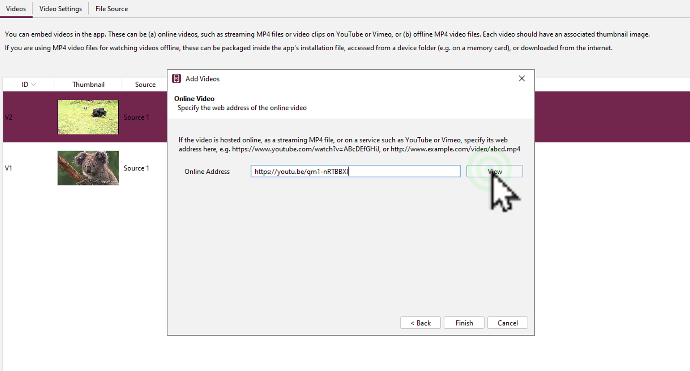

# Photopeaབཀོལ་ཚུལ།

SABདང་RABགཉིས་ཀྱི་དགོས་མཁོ་ལྟར་འདིར་Photopeaཡི་ཁྱད་ཆོས་འགའའི་བཀོལ་སྤྱོད་ལམ་སྟོན་སྟབས་བདེ་ཞིག་ངོ་སྤྲོད་བྱས་ཡོད། ཞིབ་ཕྲ་གཤམ་ལ་གཟིགས།

## 1. སློབ་ཚན་འདིའི་ནང་དོན་ཁག

སློབ་ཚན་འདིའི་ནང་ངོ་སྤྲོད་བྱ་རྒྱུའི་ནང་དོན་ཁག་ནི་

- 👉 འདྲ་པར་གྱི་རྒྱབ་ལྗོངས་བསུབ་ཚུལ།
- 👉 འདྲ་པར་གཏུབ་སྒྲིག་བྱ་ཚུལ།
- 👉 འདྲ་པར་གྱི་ཆེ་ཆུངདང་ཕྱིར་འདྲེན་བྱ་ཚུལ།

## ཚོད་ལྟའི་དྲི་བ།

ཚོད་ལྟའི་དྲི་བ་རྣམས་ལ་ལན་རེ་ངེས་པར་དུ་འདེམ་རོགས། དེ་དག་ཐོག་མ་ནས་ཤེས་དགོས་པའི་ངེས་པ་མེད་པས་གང་རུང་ཞིག་འདེམ་ཆོག

1. Photopeaབཀོལ་བར་དེ་ཕབ་ལེན་བྱེད་དགོས་སམ། མི་ཤེས།༽ དགོས།༽ མི་དགོས།༽ (正确回答)
2. འདྲ་པརགྲུ་བཞི་ཁ་གང་མ་ཡོང་བར་གནོན་ཐེབས་གང་གནོན་དགོས། CTRL༽ ALT༽ SHIFT༽ (正确回答)
3. ཕྱིར་འདྲེན་ལ་དགོས་ངེས་ཀྱི་རྣམ་སྒྲིག་གམ་格式ཚན་པ་གང་གི་ནང་ཡོད། ཁ་འབྱེད།༽ ཤོག་ལྷེ་ཕྱིར་ཕབས།༽ ཕབ་སྟངས་གཞན།༽ (正确回答)

## 1. འདྲ་པར་གྱི་རྒྱབ་ལྗོངས་བསུབ་ཚུལ།

👇 དེ་ཅི་ལྟར་བྱ་ཚུལ་ལ་གཟིགས།

- སློབ་ཚན་གྱི་བརྙན། [དྲ་ཐག་འདིར་སྣུན།](https://drive.google.com/file/d/1E5tLjKHvENKNcSQNhzWQQGjv_UB1L1si/view?usp=share_link)

1. དྲི་བ། Photopeaབཀོལ་བར་དེ་ཕབ་ལེན་བྱེད་དགོས་སམ། མི་དགོས།༽ (正确回答) དགོས།༽ མི་ཤེས།༽

## 2. འདྲ་པར་གཏུབ་སྒྲིག་བྱ་ཚུལ།

👇 དེ་ཅི་ལྟར་བྱ་ཚུལ་ལ་གཟིགས།

- སློབ་ཚན་གྱི་བརྙན། [དྲ་ཐག་འདིར་སྣུན།](https://drive.google.com/file/d/1o8Zlh4zfDdmcbr6kNm7VrToUwPxSqSTA/view?usp=share_link)

2. དྲི་བ། འདྲ་པརགྲུ་བཞི་ཁ་གང་མ་ཡོང་བར་གནོན་ཐེབས་གང་གནོན་དགོས། CTRL༽ SHIFT༽ (正确回答) ALT༽

## 3. འདྲ་པར་གྱི་ཆེ་ཆུངདང་ཕྱིར་འདྲེན་བྱ་ཚུལ།

👇 དེ་ཅི་ལྟར་བྱ་ཚུལ་ལ་གཟིགས།

 

- སློབ་ཚན་གྱི་བརྙན། [དྲ་ཐག་འདིར་སྣུན།](https://drive.google.com/file/d/10OX2B90PHMU_KdhsFAdqqHwALGKmEi9G/view?usp=share_link)

3. དྲི་བ། ཕྱིར་འདྲེན་ལ་དགོས་ངེས་ཀྱི་རྣམ་སྒྲིག་གམ་格式ཚན་པ་གང་གི་ནང་ཡོད། 
ཁ་འབྱེད།༽ ཤོག་ལྷེ་ཕྱིར་ཕབས།༽ ཕབ་སྟངས་གཞན།༽ (正确回答)

