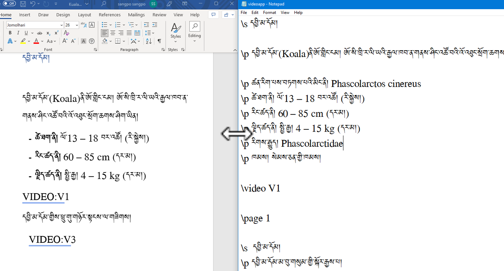

# Photopeeབཀོལ་ཚུལ།

## 1. སློབ་ཚན་འདིའི་ནང་དོན་ཁག

སློབ་ཚན་འདིའི་ནང་ངོ་སྤྲོད་བྱ་རྒྱུའི་ནང་དོན་ཁག་ནི་

- 👉 
- 👉 
- 👉 

## ཚོད་ལྟའི་དྲི་བ།

ཚོད་ལྟའི་དྲི་བ་རྣམས་ལ་ལན་རེ་ངེས་པར་དུ་འདེམ་རོགས། དེ་དག་ཐོག་མ་ནས་ཤེས་དགོས་པའི་ངེས་པ་མེད་པས་གང་རུང་ཞིག་འདེམ་ཆོག

1. ༽ (正确回答)
2. ༽ (正确回答)
3. ༽ (正确回答)

## 1. 

👇 དེ་ཅི་ལྟར་བྱ་ཚུལ་ལ་གཟིགས།

## 1.1 

- སློབ་ཚན་གྱི་བརྙན། [དྲ་ཐག་འདིར་སྣུན།]()

## 1.2 སྒྲིག་སྟེགས་ནང་བརྙན་འཇོག་ཚུལ།

- སློབ་ཚན་གྱི་བརྙན། [དྲ་ཐག་འདིར་སྣུན།]()

1. དྲི་བ། 

## 2. 

👇 དེ་ཅི་ལྟར་བྱ་ཚུལ་ལ་གཟིགས།

- སློབ་ཚན་གྱི་བརྙན། [དྲ་ཐག་འདིར་སྣུན།]()

2. དྲི་བ། 

## 3. 
👇 དེ་ཅི་ལྟར་བྱ་ཚུལ་ལ་གཟིགས།

 

- སློབ་ཚན་གྱི་བརྙན། [དྲ་ཐག་འདིར་སྣུན།]()

3. དྲི་བ། 

