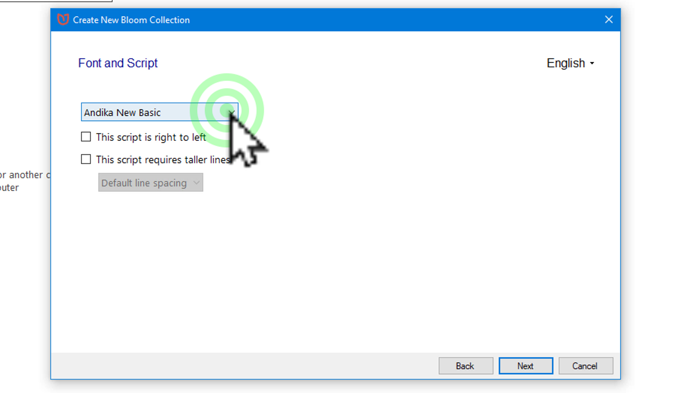
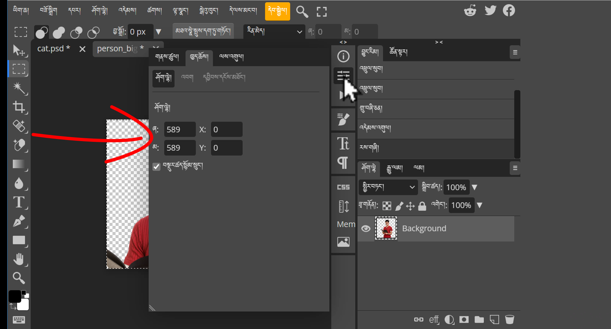

# Bloomདཔེ་མཛོད་བཀོལ་ཚུལ།2/2

འདིར་Bloomliberary དང་ Bloom མཉེན་ཆས་ གཉིས་ཀྱི་ནང་ནས་བྱིས་སྒྲུང་གསར་སྒྲིག་དང་ཡིག་བསྒྱུར་དཔེ་ཀློག་བྱ་ཚུལ་སོགས་ངོ་སྤྲོད་བྱས་ཡོད། ཞིབ་ཕྲ་གཤམ་ལ་གཟིགས།

## Bloomབཀོལ་ཚུལ་གྱི་སློབ་ཚན།

འདི་ལ་སློབ་ཚན་སྟོད་སྨད་གཉིས་ཡོད།
1. [Bloomདཔེ་མཛོད་བཀོལ་ཚུལ།](https://github.com/buda-base/budax/blob/master/howtoguides/RAB11/index.md)
2. Bloom མཉེན་ཆས་བཀོལ་ཚུལ།

## 2. Bloom མཉེན་ཆས་བཀོལ་ཚུལ།

སློབ་ཚན་འདིའི་སྨད་ཆའི་ནང་དོན་ཁག་ནི་

- 👉 Bloom མཉེན་ཆས་ཕབ་ལེན་བྱ་ཚུལ།
- 👉 བྱིས་སྒྲུང་ཕབ་ལེན་དང་ལོ་ཙཱ་བྱེད་ཚུལ།
- 👉 འགྱུར་དེབ་དེ་Bloomདཔེ་མཛོད་ནང་འཇོག་ཚུལ།

## ཚོད་ལྟའི་དྲི་བ།

ཚོད་ལྟའི་དྲི་བ་རྣམས་ལ་ལན་རེ་ངེས་པར་དུ་འདེམ་རོགས། དེ་དག་ཐོག་མ་ནས་ཤེས་དགོས་པའི་ངེས་པ་མེད་པས་གང་རུང་ཞིག་འདེམ་ཆོག

1. ཕྱོགས་བསྒྲིགས་ཀྱི་སྐད་ཡིག་གཙོ་བོ་འདེམ་གསེས་ནང་བོད་ཡིག་ཡོད་དམ། མི་ཤེས།༽ མེད།༽ ཡོད།༽ (正确回答)
2. ཕབ་ལེན་བྱས་པའི་བྱིས་སྒྲུང་གི་འདྲ་པར་རྣམས་བསྒྱུར་བཅོས་བྱེད་ཆོག་གམ། མི་ཤེས།༽ ཆོག༽ མི་ཆོག༽ (正确回答)
3. འགྱུར་དེབ་དེ་དཔེ་མཛོདནང་ནང་འཇུག་བྱེད་པར་ནང་འཛུལ་བྱ་དགོས་སམ། མི་ཤེས།༽ མི་དགོས།༽ དགོས།༽ (正确回答)

## 1. Bloom མཉེན་ཆས་ཕབ་ལེན་བྱ་ཚུལ།

👇 དེ་ཇི་ལྟར་བྱ་ཚུལ་ལ་གཟིགས།

- སློབ་ཚན་གྱི་བརྙན། [དྲ་ཐག་འདིར་སྣུན།](https://drive.google.com/file/d/1PFF3L1-AlUXp1ZpDn7Mandgkurl1pSzH/view?usp=share_link)

1. དྲི་བ། ཕྱོགས་བསྒྲིགས་ཀྱི་སྐད་ཡིག་གཙོ་བོ་འདེམ་གསེས་ནང་བོད་ཡིག་ཡོད་དམ། 
ཡོད།༽ (正确回答) མེད།༽ མི་ཤེས།༽

## 2. བྱིས་སྒྲུང་ཕབ་ལེན་དང་ལོ་ཙཱ་བྱེད་ཚུལ།

👇 དེ་ཇི་ལྟར་བྱ་ཚུལ་ལ་གཟིགས།

- སློབ་ཚན་གྱི་བརྙན། [དྲ་ཐག་འདིར་སྣུན།](https://drive.google.com/file/d/1tHyFhvaL56LPsqHSsxPARjF1qJrDs2-h/view?usp=share_link)

2. དྲི་བ། ཕབ་ལེན་བྱས་པའི་བྱིས་སྒྲུང་གི་འདྲ་པར་རྣམས་བསྒྱུར་བཅོས་བྱེད་ཆོག་གམ། 
ཆོག༽ མི་ཆོག༽ (正确回答) མི་ཤེས།༽

## 3. འགྱུར་དེབ་དེ་Bloomདཔེ་མཛོད་ནང་འཇོག་ཚུལ།

👇 དེ་ཇི་ལྟར་བྱ་ཚུལ་ལ་གཟིགས།

 

- སློབ་ཚན་གྱི་བརྙན། [དྲ་ཐག་འདིར་སྣུན།](https://drive.google.com/file/d/18EgTZeGeyn3TmJuLScYckahuu5tnId11/view?usp=share_link)

3. དྲི་བ། འགྱུར་དེབ་དེ་དཔེ་མཛོདནང་ནང་འཇུག་བྱེད་པར་ནང་འཛུལ་བྱ་དགོས་སམ། 
མི་ཤེས།༽ མི་དགོས།༽ དགོས།༽ (正确回答)

## སློབ་ཚན་འདིའི་སྟོད་ཆ།

མདུན་ལ་ཡོད་པའི་དྲ་ཐག་དེ་བརྒྱུད་ནས་སློབ་ཚན་འདིའི་སྟོད་ཆ་ལ་གཟིགས།
