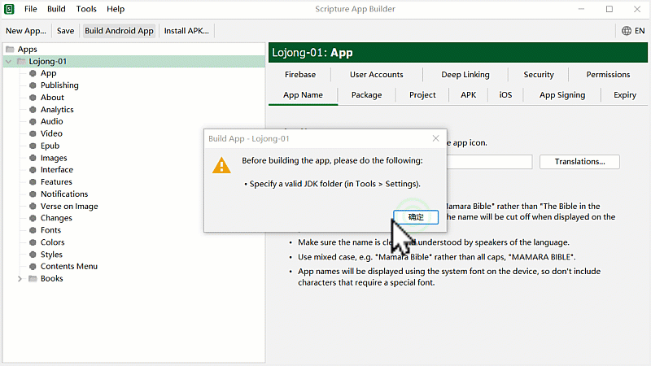
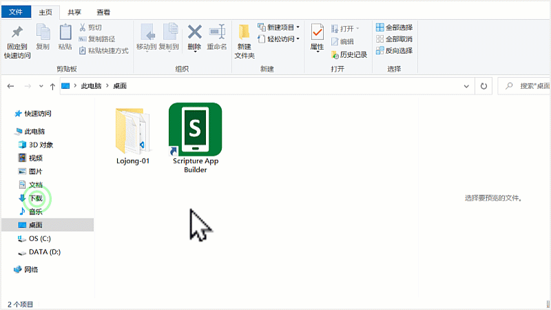
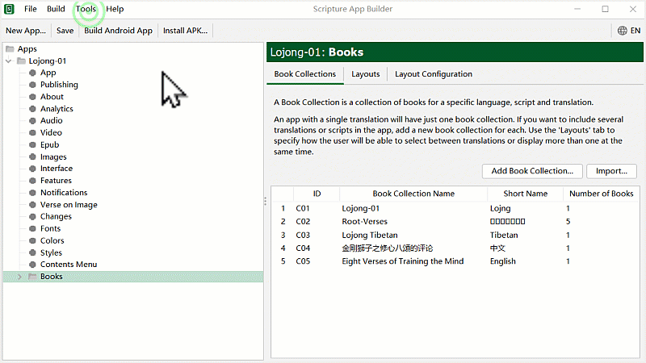
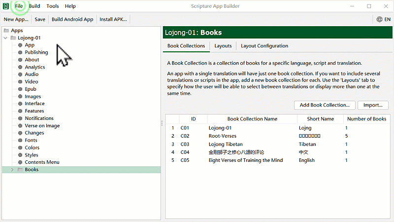

# གཙུག་ལག་མཉེན་ཆས་ཕབ་ལེན་དང་འཇུག་སྤྲོད།

འདི་ནི་གཙུག་ལག་མཉེན་ཆས་སྒྲིག་སྟེགས་ཏེ་ Scripture App Builder (SAB) སྒེའུ་ཁུང་རྟགས་ཅན་གྱི་གློག་ཀླད་ནང་ཕབ་ལེན་དང་འཇུག་སྤྲོད་བྱ་ཚུལ། གཞན་དེ་ལ་རམ་འདེགས་མཉེན་ཆས་ཁག་ཕབ་ལེན་དང་འཇུག་སྤྲོད་ཇི་ལྟར་བྱ་ཚུལ་བཅས་གོ་རིམ་ལྟར་ངོ་སྤྲོད་བྱས་ཡོད། སྤྱིར་གཙུག་ལག་མཉེན་ཆས་འདི་ནི་རང་ཉིད་ཀྱི་འདོད་པ་ལྟར་དཔེ་ཀློག་དང་འབྲེལ་བའི་མཉེན་ཆས་རིགས་སྣ་ཚོགས་བཟོ་སའི་སྒྲིག་སྟེགས་མཉེན་ཆས་ཤིག་ཡིན། དཔེ་མཚོན་རྒྱས་པ་རྣམས་ལ་རིམ་པར་གཟིགས།

ཕབ་ལེན་བྱ་ཡུལ་གྱི་དྲ་ཐག [དྲ་ཐག་འདི](https://software.sil.org/scriptureappbuilder/download/)འི་སྟེང་བསྣུན་ན་ཐད་ཀར་ཕབ་ལེན་བྱ་ཡུལ་གྱི་དྲ་ཚིགས་ནང་འཛུལ་འགྲོ་བ་ཡིན། ཡང་ན་（download scriptureappbuilder）འདི་ལྟར་བྲིས་ཏེ་བཙལ་རུང་རྙེད་ཐུབ།
## ཚོད་ལྟའི་དྲི་བ་ཁག་ལ་ལན་རེ་ངེས་པར་འདེམ་རོགས། ཐོག་མ་ནས་ཤེས་དགོས་པའི་ངེས་པ་མེད་པས་གང་རུང་ཞིག་འདེམ་ཆོག

1. JDK ཕབ་ལེན་དྲ་ཐག་གང་ན་ཡོད་དམ། ༡༽ 百度ནང་ཡོད། ༢༽ 谷歌ནང་ཡོད། ༣༽ SABནང་ཡོད། (正确回答)
2. SDK ཕབ་ལེན་བྱེད་པར་ཐོག་མར་མཉེན་ཆས་ཀྱི་སྡེ་ཚན་གང་གནོན་དགོས་སམ། ༡༽ building ༢༽ File ༣༽ Tools (正确回答)
3. APK ཟེར་བ་ཅི་ཞིག་ཡིན་ནམ། ༡༽ དྲ་ཚིགས་ཤིག ༢༽ མཉེན་ཆས་ཀྱི་རྒྱུ་ཆ་ཞིག ༣༽ བཟོས་ཟིན་པའི་མཉེན་ཆས་ཤིག (正确回答)
## དང་བོ། ཚང་དགོས་པའི་ཆ་རྐྱེན་ཁག
- གློག་ཀླད། Windows XP, 7, 8.x or 10.
- གློག་ཀླད་རང་གི་ཤོང་ཚད་ 4 GB སྟོང་བ་ཡོད་དགོས།
- གློག་ཀླད་ཀྱི་ཀླད་པའི་ཤོང་ཚད་ 4 GB of RAM སྟོང་བ་ཡོད་དགོས།
- གློག་ཀླད་ནང་མཉེན་ཆས་ཐོག་མར་ཕབ་ལེན་སྐབས་དྲ་རྒྱར་མཐུད་དགོས། ཐེངས་རྗེས་མར་མེད་ཀྱང་ཆོག

## གཉིས་པ། ཚོད་ལྟ་བྱ་སའི་ཉེར་མཁོ་གྲ་སྒྲིག
1. Android མ་ལག་ཅན་གྱི་ཁ་པར་དང་平板 གང་རུང་ཞིག་ཡོད་དགོས།
2. ཁ་པར་དེ་དང་གློག་ཀླད་གཉིས་མཐུད་བྱེད་ཀྱི་USB གློག་སྐུད་ཅིག་ཡོད་དགོས། 
3. ཨིན་ཌོ་ཁ་པར་གྱི་མ་ལག་གློག་ཀླད་ནང་ཕབ་ལེན་བྱས་ཏེ་དེའི་ནང་ཚོད་ལྟ་བྱ་ཡང་ཆོག

### A.1 མཉེན་ཆས་ཕབ་ལེན།

འདི་གོང་གི་དྲ་ཐག་དེའི་སྒང་བསྣུན་ན་ཐད་ཀར་ཕབ་གནས་ཀྱི་དྲ་ཚིགས་ནང་འཛུལ་འགྲོ། དེ་ནས་མཉེན་ཆས་ཀྱི་ཐོན་གསར་རྙིང་གང་དགོས་བདམས་ཆོག་མོད། ཐོན་གསར་ཤོས་ནི་ཐོག་མར་ལོགས་སུ་བཏོན་ཡོད་པ་དེ་ཡིན། འགུལ་རིས་ལ་གཟིགས།

### A.2 མཉེན་ཆས་འཇུག་སྤྲོད།

འདིར་ནས་མཉེན་ཆས་ཕབ་ལེན་གྲུབ་རྗེས་གློག་ཀླད་ནང་འཇུག་སྤྲོད་བྱ་དགོས། དེའི་ཁྲོད་སྐད་ཡིག་འདེམ་ས་ནས་རང་ལ་ངེས་ཆ་ཆེ་བའི་སྐད་ཡིག་(རྒྱ་ཡིག་དང་ཨིན་ཡིག་གང་རུང་)གང་ཡིན་པ་དེ་འདེམ།

# B. མཉེན་ཆས་ཚོད་ལྟ་དང་རམ་འདེགས་ཕབ་ལེན།

འདིར་ཁྱེད་ཀྱིས་ད་སྔ་བཟོས་ཟིན་པའི་མཉེན་ཆས་དེ་SAB གཙུག་ལག་མཉེན་ཆས་ནང་ཚོད་ལྟ་བྱས་ཏེ་རམ་འདེགས་མཉེན་ཆས་གཞན་རྣམས་ཕབ་ལེན་བྱ་དགོས། ད་སྔ་བཟོས་ཟིན་པའི་མཉེན་ཆས་[Github དྲ་ཐག་](https://github.com/tadhondup/Lojong-001.git) དང་ [微云 དྲ་ཐག་](https://share.weiyun.com/KujPqi7U)འདི་གཉིས་ཀྱི་གང་རུང་ནས་ཕབ་ལེན་བྱོས། བཟོས་ཟིན་པའི་མཉེན་ཆས་ག་འདྲ་ཞིག་ཡིན་ནམ། འགུལ་རིས་ལ་གཟིགས།

## རམ་འདེགས་མཉེན་ཆས་ཀྱི་ཐོ།

- Java Development Kit (JDK) 
- Android Software Development Kit (SDK)  

འདི་དག་ནི་བཟོས་ཟིན་པའི་མཉེན་ཆས་ཤིག་ཚོད་ལྟ་བྱས་ན་གཙུག་ལག་མཉེན་ཆས་ཀྱིས་སྐབས་ལྟར་ཚང་མེད་པའི་རམ་འདེགས་མཉེན་ཆས་གང་དགོས་མཚམས་སྦྱོར་བྱེད་ཡོང། སྐབས་དེར་ཕབ་ལེན་བྱས་ན་སྟབས་བདེ་བ་ཡོད།
### B.1 SAB དྲ་རྒྱར་མཐུད་སྟངས།

གཙུག་ལག་མཉེན་ཆས་སྒོ་ཕྱེས་པ་དང་ཐོག་མར་དྲ་རྒྱར་མཐུད་དགོས། Use compiler offline ལ་རྟགས་འགོད་མི་རུང་། གོ་རིམ་གཤམ་བཀོད་ཀྱི་འདྲ་པར་ལ་གཟིགས།

འདིར་ད་ལྟ་ཕབ་ལེན་བྱས་ཟིན་པའི་གཙུག་ལག་མཉེན་ཆས་སྒྲིག་སྟེགས་ནང་བཟོས་ཟིན་པའི་མཉེན་ཆས་ལེན་སྟངས་དང་དེ་ཉར་ཚགས་བྱ་ཚུལ་ངོ་སྤྲོད་བྱས་ཡོད།

### B.2 རམ་འདེགས་མཉེན་ཆས་JDK ཕབ་ལེན།

འདིར་གཙུག་ལག་མཉེན་ཆས་ནང་བཟོས་ཟིན་པའི་མཉེན་ཆས་བླངས་རྗེས་རམ་འདེགས་མཉེན་ཆས་དང་བོ་JDK དགོས་པའི་བརྡ་བསྟན་པ་དང་། ཕབ་ལེན་བྱ་སྟངས་ངོ་སྤྲོད་བྱས་ཡོད།

### B.3 JDK འཇུག་སྤྲོད།

འདིར་JDK རམ་འདེགས་མཉེན་ཆས་ཕབ་ལེན་བྱས་རྗེས་འཇུག་སྤྲོད་བྱ་དགོས། གོ་རིམ་ལ་གཟིགས།

1. དྲི་བ། JDK ཕབ་ལེན་དྲ་ཐག་གང་ན་ཡོད་དམ། ༡༽ SABནང་ཡོད། (正确回答) ༢༽ 百度ནང་ཡོད། ༣༽ 谷歌ནང་ཡོད།

### B.4 རམ་འདེགས་མཉེན་ཆས་SDK ཕབ་ལེན།

འདིར་རམ་འདེགས་མཉེན་ཆས་གཉིས་པ་SDK ཕབ་ལེན་བྱ་དགོས། ཕབ་ལེན་གྱི་རིམ་པ་ལ་གཟིགས། སྟོད་ཆ།

SDK རམ་འདེགས་མཉེན་ཆས་ཕབ་ལེན་གྱི་སྨད་ཆ།

2. དྲི་བ། SDK ཕབ་ལེན་བྱེད་པར་ཐོག་མར་མཉེན་ཆས་ཀྱི་སྡེ་ཚན་གང་གནོན་དགོས་སམ། ༡༽ building ༢༽ Tools (正确回答) ༣༽ File

### B.5 བཟོས་ཟིན་པའི་མཉེན་ཆས་APK.

འདི་བར་གཙུག་ལག་མཉེན་ཆས་སྒྲིག་སྟེགས་ཕབ་ལེན་དང་འཇུག་སྤྲོད། རམ་འདེགས་མཉེན་ཆས་ཕབ་ལེན་དང་བཅས་ཡོངས་སུ་གྲུབ་པ་ཡིན། བཟོས་ཟིན་པའི་མཉེན་ཆས་APK འཇོག་གནས་ལ་བལྟ་སྟངས།  - APK ནི་བཟོས་ཟིན་པའི་མཉེན་ཆས་ཡིན། དེ་蓝牙འམ་སོ་སྔོན་པོ་དང་ཡང་ན་བརྒྱུད་ལམ་གཞན་བརྒྱུད་ནས་ཨན་ཌོ་མ་ལག་ཅན་གྱི་ཁ་པར་དང་平板གང་རུང་ནང་བསྐུར་ཏེ་སྒོ་ཕྱེས་ནས་བཀོལ་ཆོག་པ་ཡིན།

3. དྲི་བ། APK ཟེར་བ་ཅི་ཞིག་ཡིན་ནམ། ༡༽ དྲ་ཚིགས་ཤིག ༢༽ མཉེན་ཆས་ཀྱི་རྒྱུ་ཆ་ཞིག ༣༽ བཟོས་ཟིན་པའི་མཉེན་ཆས་ཤིག (正确回答)