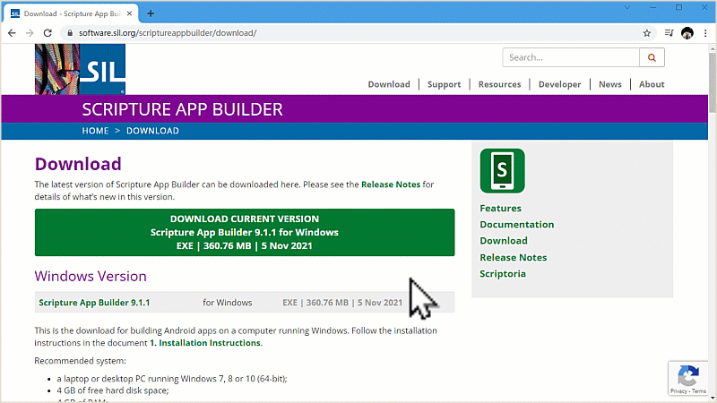
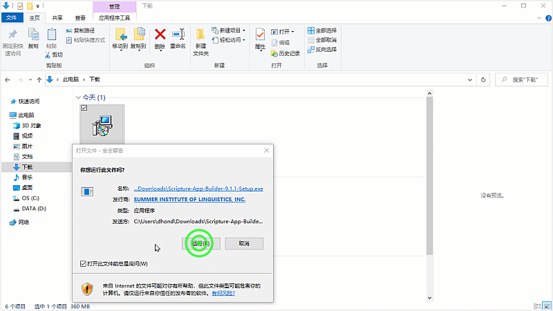
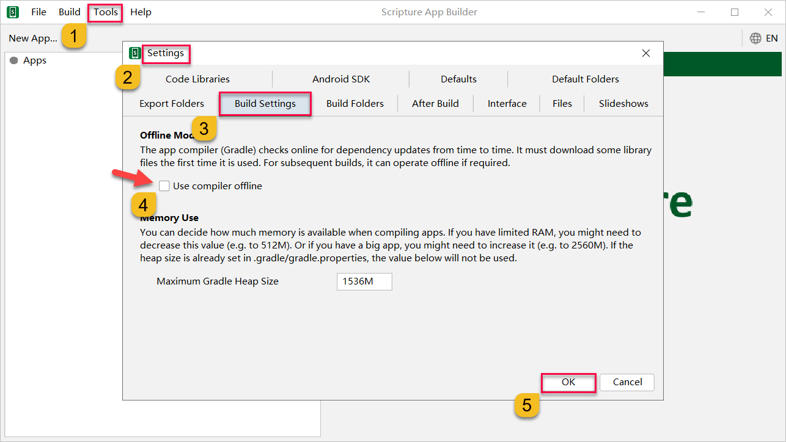

# གཙུག་ལག་མཉེན་ཆས་བཀོལ་ཚུལ།

འདི་ནི་གཙུག་ལག་མཉེན་ཆས་སྒྲིག་སྟེགས་ཏེ་ Scripture App Builder (SAB) སྒེའུ་ཁུང་རྟགས་ཅན་གྱི་གློག་ཀླད་ནང་ཕབ་ལེན་དང་འཇུག་སྤྲོད་ཇི་ལྟར་བྱ་ཚུལ་ངོ་སྤྲོད་བྱས་ཡོད། མཉེན་ཆས་འདིའི་ནང་རང་ཉིད་ཀྱི་འདོད་པ་ལྟར་དཔེ་ཀློག་དང་འབྲེལ་བའི་མཉེན་ཆས་རིགས་སྣ་ཚོགས་བཟོ་ཐུབ་པ་ཡིན། དཔེ་མཚོན་རྒྱས་པ་རྣམས་ལ་རིམ་པར་གཟིགས།

ཕབ་ལེན་བྱ་ཡུལ་གྱི་དྲ་ཐག [དྲ་ཐག་འདི](https://software.sil.org/scriptureappbuilder/download/)འི་སྟེང་བསྣུན་ན་ཐད་ཀར་ཕབ་ལེན་བྱ་ཡུལ་གྱི་དྲ་ཚིགས་ནང་འཛུལ་འགྲོ་བ་ཡིན། ཡང་ན་（https://software.sil.org/scriptureappbuilder/download/）འདི་ལྟར་བྲིས་ཏེ་བཙལ་རུང་རྙེད་ཐུབ།
## དང་བོ། གློག་ཀླད་ནང་ཚང་དགོས་པ་ཁག
- གློག་ཀླད། Windows XP, 7, 8.x or 10.
- གློག་ཀླད་རང་གི་ཤོང་ཚད་ 4 GB སྟོང་བ་ཡོད་དགོས།
- གློག་ཀླད་ཀྱི་ཀླད་པའི་ཤོང་ཚད་ 4 GB of RAM སྟོང་བ་ཡོད་དགོས།
- གློག་ཀླད་ནང་མཉེན་ཆས་ཐོག་མར་ཕབ་ལེན་སྐབས་དྲ་རྒྱར་མཐུད་དགོས། ཐེངས་རྗེས་མར་མེད་ཀྱང་ཆོག

## གཉིས་པ། ཚོད་ལྟ་བྱ་སའི་ཉེར་མཁོ་གྲ་སྒྲིག
1. Android མ་ལག་ཅན་གྱི་ཁ་པར་དང་平板 གང་རུང་ཞིག་ཡོད་དགོས།
2. ཁ་པར་དེ་དང་གློག་ཀླད་གཉིས་མཐུད་བྱེད་ཀྱི་USB གློག་སྐུད་ཅིག་ཡོད་དགོས། 
3. ཨིན་ཌོ་ཁ་པར་གྱི་མ་ལག་གློག་ཀླད་ནང་ཕབ་ལེན་བྱས་ཏེ་དེའི་ནང་ཚོད་ལྟ་བྱ་ཡང་ཆོག

## A.1 མཉེན་ཆས་ཕབ་ལེན།

འདི་གོང་གི་དྲ་ཐག་དེའི་སྒང་བསྣུན་ན་ཐད་ཀར་ཕབ་གནས་ཀྱི་དྲ་ཚིགས་ནང་འཛུལ་འགྲོ། དེ་ནས་མཉེན་ཆས་ཀྱི་ཐོན་གསར་རྙིང་གང་དགོས་བདམས་ཆོག་མོད། ཐོན་གསར་ཤོས་ནི་ཐོག་མར་ལོགས་སུ་བཏོན་ཡོད་པ་དེ་ཡིན། འགུལ་རིས་ལ་གཟིགས།

## A.2 མཉེན་ཆས་འཇུག་སྤྲོད།

འདིར་ནས་མཉེན་ཆས་ཕབ་ལེན་གྲུབ་རྗེས་གློག་ཀླད་ནང་འཇུག་སྤྲོད་བྱ་དགོས། དེའི་ཁྲོད་སྐད་ཡིག་འདེམ་ས་ནས་རང་ལ་ངེས་ཆ་ཆེ་བའི་སྐད་ཡིག་(རྒྱ་ཡིག་དང་ཨིན་ཡིག་གང་རུང་)གང་ཡིན་པ་དེ་འདེམ།

# B. མཉེན་ཆས་ཚོད་ལྟ་དང་རམ་འདེགས་ཕབ་ལེན།

འདིར་ཁྱེད་ཀྱིས་ད་སྔ་བཟོས་ཟིན་པའི་མཉེན་ཆས་དེ་SAB གཙུག་ལག་མཉེན་ཆས་ནང་ཚོད་ལྟ་བྱས་ཏེ་རམ་འདེགས་མཉེན་ཆས་གཞན་རྣམས་ཕབ་ལེན་བྱ་དགོས། ད་སྔ་བཟོས་ཟིན་པའི་མཉེན་ཆས་[དྲ་ཐག་འདི་]()ནས་ཕབ་ལེན་བྱོས། བཟོས་ཟིན་པའི་མཉེན་ཆས་ག་འདྲ་ཞིག་ཡིན་ནམ། འགུལ་རིས་ལ་གཟིགས།

## རམ་འདེགས་མཉེན་ཆས་ཀྱི་ཐོ།

- Java Development Kit (JDK) 
- Android Software Development Kit (SDK)  
འདི་དག་ནི་བཟོས་ཟིན་པའི་མཉེན་ཆས་ཤིག་ཚོད་ལྟ་བྱས་ན་གཙུག་ལག་མཉེན་ཆས་ཀྱིས་སྐབས་ལྟར་ཚང་མེད་པའི་རམ་འདེགས་མཉེན་ཆས་གང་དགོས་མཚམས་སྦྱོར་བྱེད་ཡོང། སྐབས་དེར་ཕབ་ལེན་བྱས་ན་སྟབས་བདེ་བ་ཡོད།
## B.1 SAB སྒོ་འབྱེད་དང་ཚོད་ལྟ།

གཙུག་ལག་མཉེན་ཆས་སྒོ་ཕྱེས་པ་དང་ཐོག་མར་དྲ་རྒྱར་མཐུད་དགོས། Use compiler offline ལ་རྟགས་འགོད་མི་རུང་། གོ་རིམ་གཤམ་བཀོད་ཀྱི་འདྲ་པར་ལ་གཟིགས།

འདིར་ད་ལྟ་ཕབ་ལེན་བྱས་ཟིན་པའི་གཙུག་ལག་མཉེན་ཆས་སྒྲིག་སྟེགས་སྒོ་ཕྱེས་ཏེ་བཟོས་ཟིན་པའི་མཉེན་ཆས་རྙིང་བ་ཞིག་ཚོད་ལྟ་བྱས་པ་བརྒྱུད་ནས་རམ་འདེགས་མཉེན་ཆས་གཞན་ཁག་ཕབ་ལེན་བྱ་ཚུལ་ངོ་སྤྲོད་བྱས་ཡོད།

