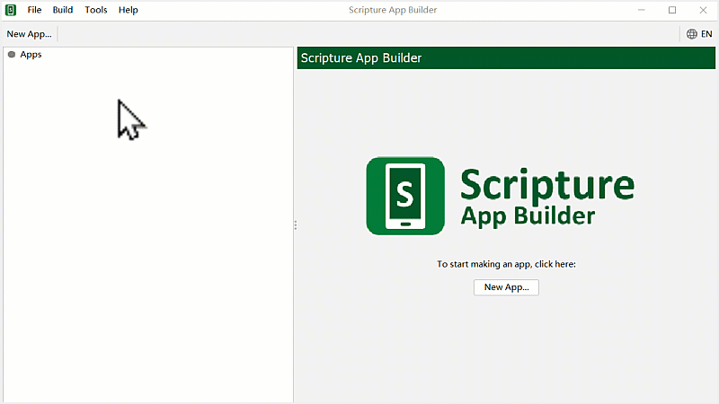
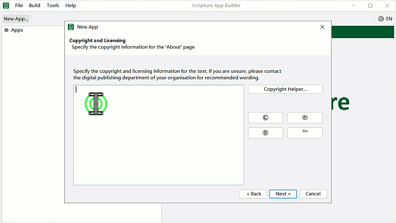

# SAB མཉེན་ཆས་ཐུན་མོང་གི་སྒྲིག་འགོད།

Scripture App Builder རམ་གཙུག་ལག་མཉེན་ཆས་སྒྲིག་སྟེགས་ནང་རང་ཉིད་ཀྱི་འདོད་པ་བཞིན་མཉེན་ཆས་བཟོ་སྐབས་མཉེན་ཆས་ཐུན་མོང་གི་སྒྲིག་འགོད་ཇི་ལྟར་སྒྲིག་ཚུལ་ངོ་སྤྲོད་བྱས་ཡོད། 

## འབྲེལ་ཡོད་ཀྱི་བཀོལ་སྤྱོད་ལམ་སྟོན་ཁག
- གཙུག་ལག་མཉེན་ཆས་ཕབ་ལེན་དང་འཇུག་སྤྲོད། [དྲ་ཐག་འདིར་](https://github.com/buda-base/budax/blob/master/howtoguides/SAB01/index.md#%E0%BD%82%E0%BD%99%E0%BD%B4%E0%BD%82%E0%BD%A3%E0%BD%82%E0%BD%98%E0%BD%89%E0%BD%BA%E0%BD%93%E0%BD%86%E0%BD%A6%E0%BD%96%E0%BD%80%E0%BD%BC%E0%BD%A3%E0%BD%9A%E0%BD%B4%E0%BD%A3)སྣུན།
- སྤྱིའི་སྒྲིག་འགོད་སྒྲིག་ཚུལ། [སླེབ་ལ་ཉེ་་]()

## A. མཉེན་ཆས་གསར་པ་བཟོ་ཚུལ།

མཉེན་ཆས་ཀྱི་མིང་བོད་ཡིག་ནང་འབྲི་ཆོག་མོད་ཕྱོགས་བསྒྲིགས་(Package name)ཀྱི་མིང་བོད་ཡིག་ནང་འབྲི་མི་རུང་། སྒྲིག་འགོད་འགའ་རེའི་ནང་བོད་ཡིག་བྲིས་དུས་སྒམ་གྲུ་བཞི་རེ་མ་གཏོགས་ཡིག་གཟུགས་འཆར་མི་ཐུབ་མོད་བཟོས་རྗེས་ཁ་པར་ནང་འཆར་ཐུབ།

## A.1 མཉེན་ཆས་ཀྱི་མིང་དང་སྐད་ཡིག

འདིར་མཉེན་ཆས་གསར་པའི་མིང་དང་ཕྱོགས་སྒྲིག་གི་མིང་། ཕྱོགས་བསྒྲིགས་ཀྱི་མིང་ལ་དཔེར་ན། lojong.org ལྟ་བུའི་ཚོགས་སྒེར་གང་རུང་གི་དྲ་བྱང་ལྟ་བུ། སྐད་ཡིག་གི་ཨང་བརྡ་(language code) འཇོག་ཚུལ་བཅས་ངོ་སྤྲོད་བྱས་ཡོད། མཉེན་ཆས་ཀྱི་མིང་ད་ལྟ་བཟོ་བཞིན་པའི་མཉེན་ཆས་ཀྱི་ནང་དོན་དང་མཐུན་པར་འདོག་དགོས།

## A.2 བདག་དབང་དང་ཡིག་གཟུགས།

འདིར་མཉེན་ཆས་ཀྱི་བདག་དབང་དང་བོད་ཡིག་གི་ཡིག་གཟུགས་འཇོག་སྟངས་བཅས་ངོ་སྤྲོད་བྱས་ཡོད། མཉེན་ཆས་དེ་བོད་ཡིག་ནང་བཟོ་ན་བོད་ཡིག་གི་ཡིག་གཟུགས་ཤིག་ངེས་པར་འདེམ་དགོས་པས་དེ་སྔ་མོ་ནས་གྲ་སྒྲིག་བྱ་དགོས།

## A.3 ཚོན་མདོག་དང་སྐད་ཡིག་འདེམ།

འདིར་མཉེན་ཆས་ཀྱི་ཚོན་མདོག་དང་སྐད་ཡིག མཉེན་ཆས་ཀྱི་འདྲ་པར་བཅས་འདེམ་གསེས་བྱ་ཚུལ་ངོ་སྤྲོད་བྱས་ཡོད། སྐད་ཡིག་འདི་མཉེན་ཆས་ཀྱི་གཞི་རྩའི་སྐད་ཡིག་ཡིན་པས་རང་ལ་ངེས་ཆ་ཡོད་པའི་རྒྱ་ཡིག་དང་ཡང་ན་ཨིན་ཡིག་སོགས་གང་རུང་འདེམ་ཆོག

## A.4 Keystore བཟོ་ཚུལ།

འདིར་Keystoreའམ་གསོག་གནས་བཟོ་ཚུལ་ངོ་སྤྲོད་བྱས་ཡོད། འདི་ནི་ཆེས་ཐོག་མར་གསར་བཟོ་དགོས་པ་ལས་བཟོས་རྗེས་མཉེན་ཆས་ཡོངས་ལ་གཅིག་གྱུར་གྱིས་བཀོལ་ཆོག་པ་ཡིན།

Keystoreའམ་གསོག་གནས་བཟོས་ཟིན་པ་དེ་ལེན་ཚུལ། འདི་ཡན་ཆོད་གཙུག་ལག་མཉེན་ཆས་སྒྲིག་སྟེགས་ནང་མཉེན་ཆས་གསར་པ་བཟོ་སྐབས་ཀྱི་ཐུན་མོང་གི་སྒྲིག་འགོད་ཙམ་ཡིན། འདི་ནས་ཞིབ་ཚགས་སྒྲིག་དགོས་པས་བཀོལ་སྤྱོད་ལམ་སྟོན་རྗེས་མ་རྣམས་ལ་གཟིགས།

## A.5 བོད་ཡིག་འཇོག་ཚུལ།

འདིར་མཉེན་ཆས་ཀྱི་སྐད་ཡིག་གཉིས་མཉམ་འཇོག་བྱེད་ཐུབ། དཔེར་ན། རྒྱ་ཡིག་དང་བོད་ཡིག་ཡང་ན་ཨིན་ཡིག་དང་བོད་ཡིག འཇོག་ཚུལ་ལ་རིམ་པར་གཟིགས། མཉེན་ཆས་ཀྱི་སྐད་ཡིག་བོད་འགྱུར་མ་[དྲ་ཐག་འདི་](https://github.com/tadhondup/Localization-for-SAB/blob/main/Interface%20language/newest%20localization%20of%20SAB.txt)ནས་ཕབ་ལེན་བྱོས།

ཆ་ཤས་གཉིས་པ།

<iframe src="https://shimowendang.com/forms/cytvT6t9G9DhKHRJ/fill?channel=1" style="height:1050px;width:800px;"></iframe>

##  [教程目录 བཀོལ་སྤྱོད་ལམ་སྟོན་གྱི་དཀར་ཆག](https://github.com/buda-base/budax)
