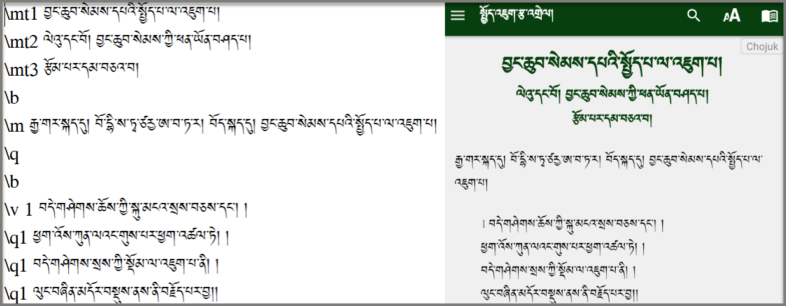
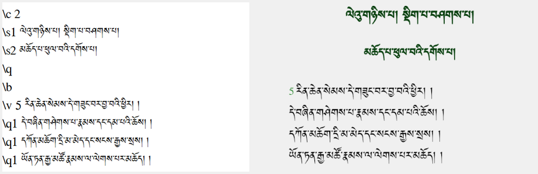
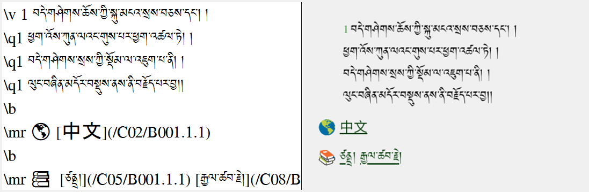
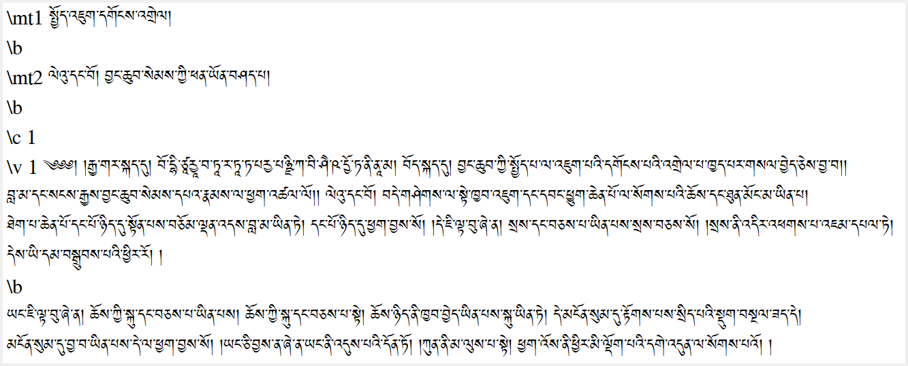
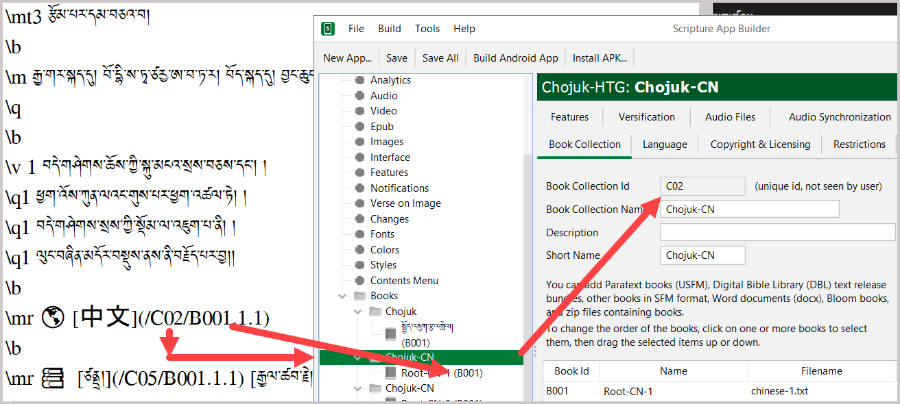

# རྩ་འགྲེལ་སྦྱར་མའི་མཉེན་ཆས།

རྩ་འགྲེལ་སྦྱར་མའི་མཉེན་ཆས་ནི་གཞུང་གཅིག་གི་རྩ་བ་དང་དེའི་འགྲེལ་མ་འདྲ་བ་དུ་མ་མཉམ་སྦྱོར་གྱི་མཉེན་ཆས་ཤིག་ཡིན། གཞུང་གཅིག་གི་རྩ་བའི་ཤོ་ལོ་ཀ་རེ་རེ་བཞིན་དེའི་འགྲེལ་བ་གང་ཡོད་རྣམས་ཤོ་ལོ་ཀ་རེ་རེ་དང་མཉམ་སྦྱོར་གྱིས་དུས་གཅིག་ལ་བལྟ་ཐུབ་པའི་ཁྱད་ཆོས་ཡོད། འདིར་དཔེ་མཚོན་གྱི་ཕྱིར་དུ་སྤྱོད་འཇུག་རྩ་འགྲེལ་མཉམ་སྦྱོར་གྱི་མཉེན་ཆས་ཤིག་ངོ་སྤྲོད་བྱས་ཡོད།

### མཉེན་ཆས་འདིའི་དགེ་མཚན།

འདིའི་ཐུན་མིན་ཁྱད་ཆོས་ནི་རང་ཉིད་དཔེ་ཁྲིད་དང་འགྲུལ་བཞུད་སོགས་ཀྱི་སྐབས་དཔེ་ཆ་མང་བོ་མཉམ་འཁྱེར་གྱི་ངལ་བ་བསྟེན་མི་དགོས་པར་རང་ཉིད་ཀྱི་ཁ་པར་ནང་མཉེན་ཆས་འདི་ཕབ་ལེན་བྱས་ན་དེའི་ནང་གང་ལ་གང་དགོས་ཀྱི་མཐུན་རྐྱེན་ཆ་ཚང་འཛོམས་ཡོད་ཅིང་། རང་ཉིད་ཀྱིས་མཉེན་ཆས་འདིའི་རིགས་བསྒྲིགས་ཏེ་ཚོང་བསྒྱུར་གྱི་ལམ་ཁ་ཡང་ཆེན་པོ་ཡོད།

## སྤྱོད་འཇུག་རྩ་འགྲེལ་མཉམ་སྦྱོར།

འདིར་སྤྱོད་འཇུག་རྩ་འགྲེལ་མཉམ་སྦྱོར་གྱིས་མཉེན་ཆས་སྒྲིག་སྟངས་ཤིག་ངོ་སྤྲོད་བྱས་ཡོད། དཔེ་འདིའི་སྒྲིག་ཐབས་ཀྱི་རིགས་ལམ་སྤྱད་ནས་སྤྱིར་གཞུང་གཞན་གྱི་རྩ་འགྲེལ་མཉམ་སྦྱོར་གྱི་མཉེན་ཆས་སྒྲིག་སྟངས་ཤེས་པར་བྱའོ།།

## A.༡ རྩ་བ་རྩོམ་སྒྲིག་བྱ་ཚུལ།

མཉེན་ཆས་འདིའི་ནང་རྩོམ་སྒྲིག་བྱེད་པར་ཐུན་མིན་གྱི་ཁྱད་ཆོས་དང་མཚོན་བྱེད་གང་མང་ཡོད། རྩོམ་སྒྲིག་བྱེད་ས་ནི་ སྒེའུ་ཁུང་རྟགས་ཅན་ནང་ Notepad ཡང་ན་ Visual Studio Code གང་རུང་མ་གཏོགས་ Word ཡང་ན་ Docs སོགས་ཀྱི་ནང་བསྒྲིགས་ན་མཉེན་ཆས་ཀྱིས་ངོས་ལེན་མི་བྱེད།  
དགོས་ངེས་ཀྱི་མཚོན་རྟགས་རིགས་མཚམས་སྦྱོར།
- \mt མཚན་བྱང་།
- \mt1 མཚན་བྱང་དང་བོ།
- \mt2 མཚན་བྱང་གཉིས་པ།
- \b ཚིག་གྲུབ་གོང་འོག་གི་བར་སྟོང་།
- \m normal text རྒྱུན་ལྡན་ཡིག་གཟུགས་ཏེ་མཚན་བྱང་དང་མཛད་བྱང་། སྡེ་ཚན་རིགས་མ་ཡིན་པ།
- \v འདིས་ཤོ་ལོ་ཀ་མཚོན།
- \v 1 ཤོ་ལོ་ཀ་དང་བོ་ལྟ་བུ།
- \q1 ཤོ་ལོ་ཀའི་ཚིག་གྲུབ་རྣམས་ཀྱི་གོང་འོག་ཚོད་འཛིན་བྱེད། 
- \c ལེའུ་བགོ་བྱེད།
- \c 1 ལེའུ་དང་བོ་ལྟ་བུ།
- \mr དྲ་ཐག Link དྲ་ཐག་ཚང་མའི་མགོར་འདི་འཇོག་དགོས།
- \s ནང་གསེས་ཀྱི་སྡེ་ཚན་གྱི་མཚན་བྱང་།
- \s1 ནང་གསེས་ཀྱི་སྡེ་ཚན་དང་བོ་ལྟ་བུ། སྡེ་ཚན་གཞན་ལ་ཡང་ཨང་རིམ་ལྟར་སྒྲིག་དགོས།

མཚན་བྱང་དང་བོ་དང་གཉིས་པ། བར་སྟོང་དང་ཤོ་ལོ་ཀ ཚིག་རྐང་སོགས་ཀྱི་མགོར་མཚོན་རྟགས་ཀྱི་རིགས་མི་འདྲ་བ་སོ་སོར་བཀོལ་སྟངས། པར་རིས་དང་བོ་རྩོམ་སྒྲིག་བྱེད་བཞིན་པ་དང་གཉིས་པ་མཉེན་ཆས་ནང་དངོས་སུ་འཆར་ཡོད་པའི་དཔེ་མཚོན་ཡིན།

## A.༢ ལེའུ་དང་སྡེ་ཚན།

རྩ་བ་གཅིག་གི་ནང་ལེའུ་དང་སྡེ་ཚན། དེའི་ནང་གསེས་སྡེ་ཚན་བཅས་ཀྱི་མགོར་མཚོན་རྟགས་ཀྱི་རིགས་མ་འདྲ་བ་སོ་སོར་བཀོལ་སྟངས། པར་རིས་དང་བོ་རྩོམ་སྒྲིག་བྱེད་བཞིན་པ་དང་གཉིས་པ་མཉེན་ཆས་ནང་དངོས་སུ་འཆར་ཡོད་པའི་དཔེ་མཚོན་ཡིན།
- རྩ་བ་གཙོ་བོ་ཤོག་ངོས་གཅིག་ཡིན་དགོས།
- རྩ་འགྲེལ་ཕན་ཚུན་མཐུད་སྦྱོར་གྱི་ཨང་གྲངས་རྣམས་མཐའ་དོན་སྒྲིག་སྟེགས་ནང་བསྒྲིགས་རྗེས་འཇོག་དགོས།

མཉེན་ཆས་ནང་དངོས་སུ་འཆར་དུས་ལེའུ་ཡིས་བྱེད་ནུས་འདོན་སྟངས་ཀྱི་དཔེ་མཚོན་ལ་གཟིགས།

## A.༣ རྩ་འགྲེལ་མཉམ་སྦྱར།

🌎 རྟགས་འདིས་རྩ་བ་མཚོན། སྐད་རིགས་གཞན་གྱི་ནང་ཡོད་པའི་རྩ་བ་ཁག་རྩ་བ་གཙོ་བོ་དང་མཐུད་སྦྱོར་བྱ་ཚུལ། རྒྱ་ཡིག་གི་སྤྱོད་འཇུག་རྩ་བ་དཔེར་བཀོད་ཡོད།  
📚 རྟགས་འདིས་འགྲེལ་བ་མཚོན། འགྲེལ་བ་ཁག་རྩ་བ་གཙོ་བོ་དང་མཐུད་སྦྱོར་བྱ་ཚུལ། མཁས་པ་ཙནྡྲ་དང་རྒྱལ་ཚབ་རྗེ་གཉིས་ཀྱི་འགྲེལ་བ་དཔེར་བཀོད་ཡོད།

## A.༤ འགྲེལ་བ་རྩོམ་སྒྲིག

མཚོན་རྟགས་རིགས་བཀོལ་ནས་འགྲེལ་བ་རྩོམ་སྒྲིག་བྱེད་ཚུལ་གཙོ་ཆེར་རྩ་བ་དང་གཅིག་མཚུངས་ཡིན་མོད། འདིར་ཚིག་རྐང་རེ་རེའི་སྔོན་ལ་མཚོན་རྟགས་མི་དགོས། ལེའུ་དང་ཤོ་ལོ་ཀའི་གྲངས་ཀ་དེ་རྩ་བའི་ལེའུ་དང་ཤོ་ལོ་ཀའི་གྲངས་ཀ་དང་ངེས་པར་དུ་གཅིག་མཚུངས་ཡིན་དགོས། དེ་མིན་ཕན་ཚུན་མཐུད་སྦྱོར་བྱ་མི་ཐུབ།
འགྲེལ་བ་རྩོམ་སྒྲིག་སྐབས་དོ་སྣང་དང་གྲ་སྒྲིག་དགོས་པ་ནི་  
- གཞུང་གཅིག་ཡིན་རུང་ལེའུ་རེ་རེ་ཤོག་ངོས་རེ་རེ་ཡིན་དགོས།
- ཤོག་ངོས་སོ་སོའི་མིང་གཅིག་གྱུར་ཡིན་དགོས།
- ཨང་གྲངས་ཀྱིས་གོ་རིམ་ཕྱེ་དགོས།
- ལེའུ་མེད་ན་ཆ་ཚང་ཤོག་ངོས་གཅིག་ཡིན་ཆོག

## A.༥ མཐུད་སྦྱོར་འགྲེལ་བཤད།

འདིར་ཡིག་ཆ་ཕན་ཚུན་མཐུད་བྱེད་ཀྱི་མཚོན་རྟགས་དང་དེ་དག་རེ་རེའི་མཚོན་ཚུལ་མཚམས་སྦྱོར་བྱས་ཡོད། འདིའི་ཨང་གྲངས་ཁག་ནི་མཉེན་ཆས་བསྒྲིག་སའི་སྟེགས་བུའི་ནང་གི་ཨང་གྲངས་ཁག་ཡིན། འདི་ལྟར་ཨང་གྲངས་དང་མཚོན་རྟགས་ཁག་མ་འཛོལ་བར་བསྒྲིགས་ན་ད་གཟོད་མཉེན་ཆས་ཀྱིས་རྩ་འགྲེལ་རྣམས་ཕན་ཚུན་མཐུད་སྦྱོར་ལེགས་པར་བྱེད་ཐུབ་པ་ཡིན།  
[中文](/C08/B003.3.12) འདིའི་འགྲེལ་བཤད།
- [中文] འདིའི་ནང་བརྗོད་གཞིའི་མིང་ཡིན། (གང་ཕྲིས་རུང་ཆོག)
- C08 ཕྱོགས་བསྒྲིགས་ཀྱི་ཨང་ཡིན།
- B003 ནི་Book འམ་དཔེ་ཆའི་ཨང་ཡིན།
- 3 ལེའུའི་ཨང་ཡིན།
- 12 ཤོ་ལོ་ཀའི་ཨང་ཡིན། 

## B. རྩ་འགྲེལ་རྒྱུ་ཆ་གྲ་སྒྲིག

གཙུག་ལག་མཉེན་ཆས་སྒྲིག་སྟེགས་ནང་མཉེན་ཆས་གང་ཞིག་བཟོས་རུང་ཐོག་མའི་འགྲོ་རིམ་ཐུན་མོང་གཅིག་གྱུར་ཡིན། 
སྐབས་སུ་བབ་པ་རྩ་འགྲེལ་སྦྱར་མའི་མཉེན་ཆས་གསར་དུ་བཟོ་བར་གྲ་སྒྲིག་དགོས་པ་ཁག་ནི་་
- གློག་ཀླད་ནང་བསྒྲིག་བྱ་ཐུན་མོང་གི་ཡིག་སྣོད་ཅིག
- དེའི་ནང་མཚོན་རྟགས་རྣམས་བཀོལ་ནས་རྩ་བ་རྩོམ་སྒྲིག་ཟིན་པ།
- མཚོན་རྟགས་རྣམས་བཀོལ་ནས་འགྲེལ་བ་རྩོམ་སྒྲིག་ཟིན་པ།
- མཉེན་ཆས་ནང་བཀོལ་རྒྱུའི་བརྗོད་གཞི་དང་འབྲེལ་བའི་འདྲ་པར་ཁག 
- མཉེན་ཆས་ཀྱི་སྐད་ཡིག་བོད་འགྱུར་མ།
- བོད་ཡིག་ཡིག་གཟུགས་གང་རུང་ཞིག་བཅས་གྲ་སྒྲིག་དགོས།  

རྒྱུ་ཆ་གྲ་སྒྲིག་བྱས་ཡོད་པའི་དཔེ་མཚོན།

## B.༡ མཉེན་ཆས་གསར་བཟོ།

བརྗོད་གཞི་དང་འབྲེལ་བའི་མཉེན་ཆས་ཀྱི་མིང་འདོགས་སྟངས་དང་རྩ་བ་ལེན་སྟངས་སྐད་ཡིག་གི་འཇུག་ཚུལ་བཅས་ཀྱི་དཔེ་མཚོན།

## B.༢ བདག་དབང་དང་ཡིག་གཟུགས།

འདིར་མཉེན་ཆས་ལ་བདག་དབང་འཇོག་སྟངས་དང་ཡིག་གཟུགས་ལེན་སྟངས། ཚོན་མདོག་འདེམ་ཚུལ་སོགས་ཀྱི་དཔེ་མཚོན།

## B.༣ Keystore ལེན་ཚུལ།

འདིར་ད་སྔ་བཟོས་ཟིན་པའི་གསོག་གནས་སམ་Keystore ལེན་སྟངས་སོགས་ཀྱི་དཔེ་མཚོན། འདི་གསར་བཟོ་བྱ་ཚུལ་སྔ་མའི་ལམ་སྟོན་གཉིས་པའི་ནང་གཟིགས། ཐོག་མར་བཟོས་རྗེས་མཉེན་ཆས་ཡོངས་ལ་ཐུན་མོང་དུ་བཀོལ་ཆོག

## B.༤ བོད་ཡིག་འཇོག་ཚུལ།

འདིར་མཉེན་ཆས་ཀྱི་སྐད་ཡིག་གཉིས་མཉམ་འཇོག་བྱེད་ཐུབ། དཔེར་ན། རྒྱ་ཡིག་དང་བོད་ཡིག་ཡང་ན་ཨིན་ཡིག་དང་བོད་ཡིག འཇོག་ཚུལ་ལ་རིམ་པར་གཟིགས། མཉེན་ཆས་ཀྱི་སྐད་ཡིག་བོད་འགྱུར་མ་[དྲ་ཐག་འདི་](https://github.com/tadhondup/Localization-for-SAB/releases/download/untagged-258949faf59fbdf4ee0a/localization.bo.txt)ནས་ཕབ་ལེན་བྱོས།

ཆ་ཤས་གཉིས་པ།

## C. Book དཔེ་ཆ་སྒྲིག་ཚུལ།

འདི་ནི་སྤྱིའི་ཕྱོགས་བསྒྲིགས་སམ་Book Collection ཡི་མིང་འདོགས་ཚུལ་དང་བྱེ་བྲག་རེ་རེའི་མིང་འདོགས་ཚུལ་གྱི་དཔེ་མཚོན་ཡིན།  
- Book Collection 