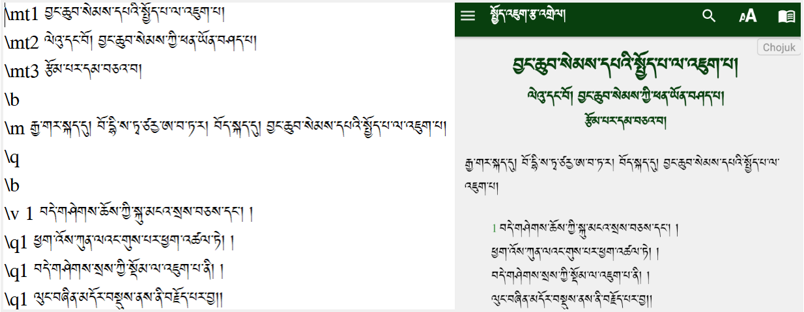

# རྩ་འགྲེལ་སྦྱར་མའི་མཉེན་ཆས།

རྩ་འགྲེལ་སྦྱར་མའི་མཉེན་ཆས་ནི་གཞུང་གཅིག་གི་རྩ་བ་དང་དེའི་འགྲེལ་མ་འདྲ་བ་དུ་མ་མཉམ་སྦྱོར་གྱི་མཉེན་ཆས་ཤིག་ཡིན། གཞུང་གཅིག་གི་རྩ་བའི་ཤོ་ལོ་ཀ་རེ་རེ་བཞིན་དེའི་འགྲེལ་བ་གང་ཡོད་རྣམས་ཤོ་ལོ་ཀ་རེ་རེ་དང་མཉམ་སྦྱོར་གྱིས་དུས་གཅིག་ལ་བལྟ་ཐུབ་པའི་ཁྱད་ཆོས་ཡོད། འདིར་དཔེ་མཚོན་གྱི་ཕྱིར་དུ་སྤྱོད་འཇུག་རྩ་འགྲེལ་མཉམ་སྦྱོར་གྱི་མཉེན་ཆས་ཤིག་ངོ་སྤྲོད་བྱས་ཡོད།

## མཉེན་ཆས་འདིའི་དགེ་མཚན།

འདིའི་ཐུན་མིན་ཁྱད་ཆོས་ནི་རང་ཉིད་དཔེ་ཁྲིད་དང་འགྲུལ་བཞུད་སོགས་ཀྱི་སྐབས་དཔེ་ཆ་མང་བོ་མཉམ་འཁྱེར་གྱི་ངལ་བ་བསྟེན་མི་དགོས་པར་རང་ཉིད་ཀྱི་ཁ་པར་ནང་མཉེན་ཆས་འདི་ཕབ་ལེན་བྱས་ན་དེའི་ནང་གང་ལ་གང་དགོས་ཀྱི་མཐུན་རྐྱེན་ཆ་ཚང་འཛོམས་ཡོད་ཅིང་། རང་ཉིད་ཀྱིས་མཉེན་ཆས་འདིའི་རིགས་བསྒྲིགས་ཏེ་ཚོང་བསྒྱུར་གྱི་ལམ་ཁ་ཡང་ཆེན་པོ་ཡོད།

## སྤྱོད་འཇུག་རྩ་འགྲེལ་མཉམ་སྦྱོར།

འདིར་སྤྱོད་འཇུག་རྩ་འགྲེལ་མཉམ་སྦྱོར་གྱིས་མཉེན་ཆས་སྒྲིག་སྟངས་ཤིག་ངོ་སྤྲོད་བྱས་ཡོད། དཔེ་འདིའི་སྒྲིག་ཐབས་ཀྱི་རིགས་ལམ་སྤྱད་ནས་སྤྱིར་གཞུང་གཞན་གྱི་རྩ་འགྲེལ་མཉམ་སྦྱོར་གྱི་མཉེན་ཆས་སྒྲིག་སྟངས་ཤེས་པར་བྱའོ།།

## A.༡ རྩ་བ་རྩོམ་སྒྲིག་བྱ་ཚུལ།

མཉེན་ཆས་འདིའི་ནང་རྩོམ་སྒྲིག་བྱེད་པར་ཐུན་མིན་གྱི་ཁྱད་ཆོས་དང་མཚོན་བྱེད་གང་མང་ཡོད། རྩོམ་སྒྲིག་བྱེད་ས་ནི་ སྒེའུ་ཁུང་རྟགས་ཅན་ནང་ Notepad ཡང་ན་ Visual Studio Code གང་རུང་མ་གཏོགས་ Word ཡང་ན་ Docs སོགས་ཀྱི་ནང་བསྒྲིགས་ན་མཉེན་ཆས་ཀྱིས་ངོས་ལེན་མི་བྱེད།  
དགོས་ངེས་ཀྱི་མཚོན་རྟགས་རིགས་མཚམས་སྦྱོར།
- \mt མཚན་བྱང་།
- \mt1 མཚན་བྱང་དང་བོ།
- \mt2 མཚན་བྱང་གཉིས་པ།
- \b ཚིག་གྲུབ་གོང་འོག་གི་བར་སྟོང་།
- \m normal text རྒྱུན་ལྡན་ཡིག་གཟུགས་ཏེ་མཚན་བྱང་དང་མཛད་བྱང་། སྡེ་ཚན་རིགས་མ་ཡིན་པ།
- \v འདིས་ཤོ་ལོ་ཀ་མཚོན།
- \v 1 ཤོ་ལོ་ཀ་དང་བོ་ལྟ་བུ།
- \q1 ཤོ་ལོ་ཀའི་ཚིག་གྲུབ་རྣམས་ཀྱི་གོང་འོག་ཚོད་འཛིན་བྱེད། 
- \c ལེའུ་བགོ་བྱེད།
- \c 1 ལེའུ་དང་བོ་ལྟ་བུ།
- \mr དྲ་ཐག Link དྲ་ཐག་ཚང་མའི་མགོར་འདི་འཇོག་དགོས།
- \s ནང་གསེས་ཀྱི་སྡེ་ཚན་གྱི་མཚན་བྱང་།
- \s1 ནང་གསེས་ཀྱི་སྡེ་ཚན་དང་བོ་ལྟ་བུ། སྡེ་ཚན་གཞན་ལ་ཡང་ཨང་རིམ་ལྟར་སྒྲིག་དགོས།

མཚན་བྱང་དང་བོ་དང་གཉིས་པ། བར་སྟོང་དང་ཤོ་ལོ་ཀ ཚིག་རྐང་སོགས་ཀྱི་མགོར་མཚོན་རྟགས་ཀྱི་རིགས་མི་འདྲ་བ་སོ་སོར་བཀོལ་སྟངས། པར་རིས་དང་བོ་རྩོམ་སྒྲིག་བྱེད་བཞིན་པ་དང་གཉིས་པ་མཉེན་ཆས་ནང་དངོས་སུ་འཆར་ཡོད་པའི་དཔེ་མཚོན་ཡིན།

## A.༢ ལེའུ་དང་སྡེ་ཚན།

རྩ་བ་གཅིག་གི་ནང་ལེའུ་དང་སྡེ་ཚན། དེའི་ནང་གསེས་སྡེ་ཚན་བཅས་ཀྱི་མགོར་མཚོན་རྟགས་ཀྱི་རིགས་མ་འདྲ་བ་སོ་སོར་བཀོལ་སྟངས། པར་རིས་དང་བོ་རྩོམ་སྒྲིག་བྱེད་བཞིན་པ་དང་གཉིས་པ་མཉེན་ཆས་ནང་དངོས་སུ་འཆར་ཡོད་པའི་དཔེ་མཚོན་ཡིན།

## A.༣ རྩ་འགྲེལ་མཉམ་སྦྱར།

🌎 རྟགས་འདིས་རྩ་བ་མཚོན། སྐད་རིགས་གཞན་གྱི་ནང་ཡོད་པའི་རྩ་བ་ཁག་རྩ་བ་གཙོ་བོ་དང་མཐུད་སྦྱོར་བྱ་ཚུལ། རྒྱ་ཡིག་གི་སྤྱོད་འཇུག་རྩ་བ་དཔེར་བཀོད་ཡོད།  
📚 རྟགས་འདིས་འགྲེལ་བ་མཚོན། འགྲེལ་བ་ཁག་རྩ་བ་གཙོ་བོ་དང་མཐུད་སྦྱོར་བྱ་ཚུལ། མཁས་པ་ཙནྡྲ་དང་རྒྱལ་ཚབ་རྗེ་གཉིས་ཀྱི་འགྲེལ་བ་དཔེར་བཀོད་ཡོད།

