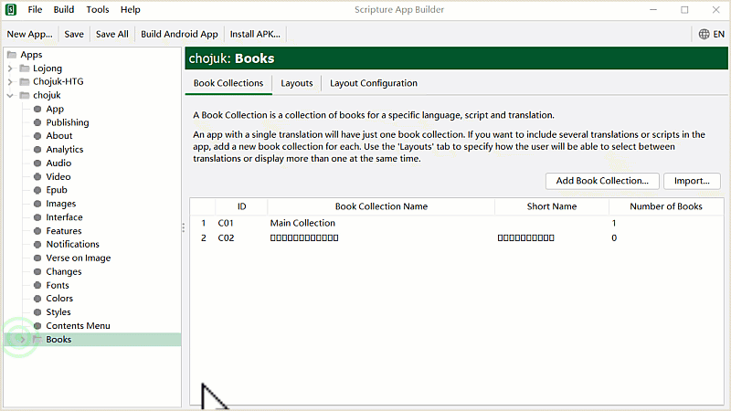
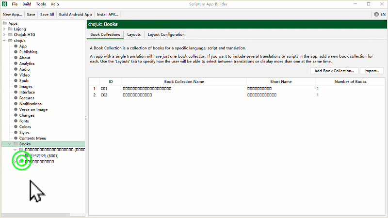
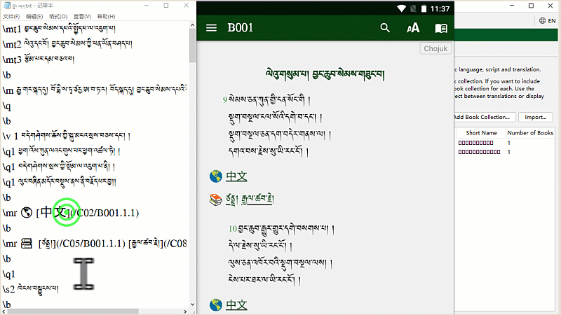
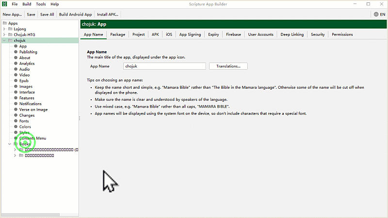
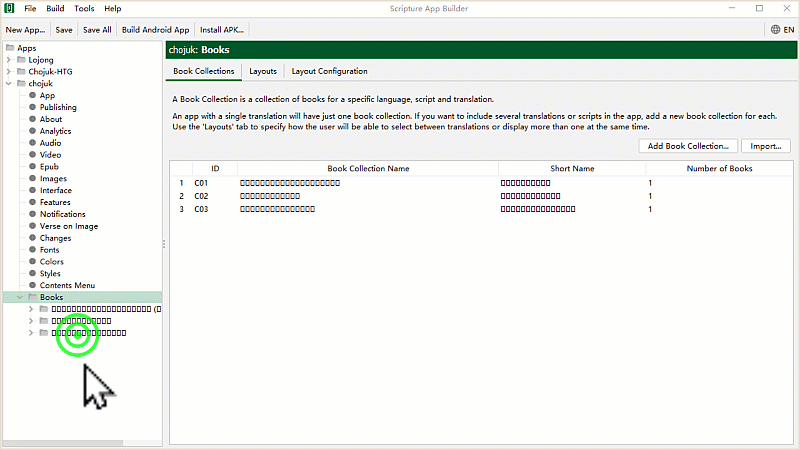
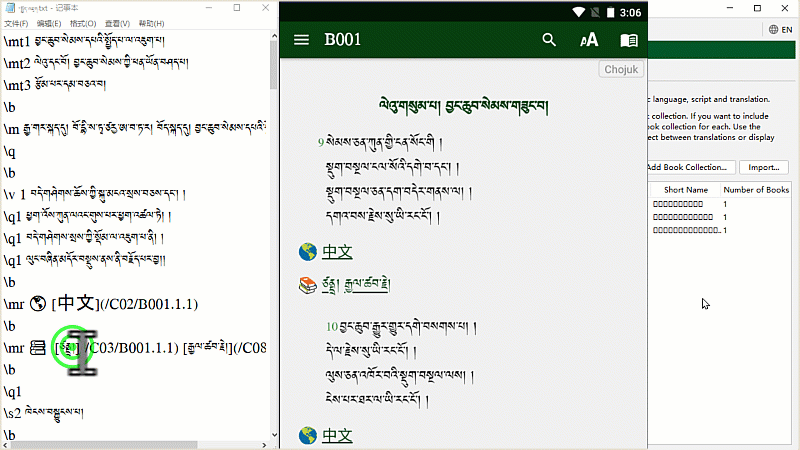

# རྩ་འགྲེལ་དཔེ་ཆ་འཇོག་ཚུལ།

## རྩ་འགྲེལ་མཉེན་ཆས་ཀྱི་སྟོད་སྨད་བར་གསུམ།

རྩ་འགྲེལ་སྦྱར་མའི་མཉེན་ཆས་སྒྲིག་ཚུལ་གྱི་ཁྱད་ཆོས་དང་ལག་བསྟར་བྱང་ཆུབ་པར་གཤམ་བཀོད་ཀྱི་བཀོལ་སྤྱོད་ལམ་སྟོན་རིམ་པ་གསུམ་ལ་བལྟས་པ་ཙམ་མ་ཟད་བྱང་ཆ་ལྡན་དགོས།
གོ་རིམ་བཞིན་དྲ་ཐག་རེ་རེའི་སྟེང་བསྣུན་ཏེ་བསླབ་པར་བྱའོ།།
- སྟོད་ཆ། [མཉེན་ཆས་འདིའི་ཐུན་མིན་མཚོན་རྟགས་རིགས་བཀོལ་སྟངས།](https://github.com/buda-base/budax/blob/master/howtoguides/SAB03/index.md#%E0%BD%A2%E0%BE%A9%E0%BD%A0%E0%BD%82%E0%BE%B2%E0%BD%BA%E0%BD%A3%E0%BD%A6%E0%BE%A6%E0%BE%B1%E0%BD%A2%E0%BD%98%E0%BD%A0%E0%BD%B2%E0%BD%98%E0%BD%89%E0%BD%BA%E0%BD%93%E0%BD%86%E0%BD%A6%E0%BD%A6%E0%BE%92%E0%BE%B2%E0%BD%B2%E0%BD%82%E0%BD%9A%E0%BD%B4%E0%BD%A3)
- བར་ཆ། རྩ་འགྲེལ་སྦྱར་མའི་མཉེན་ཆས་ནང་རྩ་འགྲེལ་དཔེ་ཆ་འཇོག་ཚུལ།
- སྨད་ཆ། ཉར་ཚགས་དང་APK བཟོ་ཚུལ།

## C. Book དཔེ་ཆ་སྒྲིག་ཚུལ།

འདི་ནི་དཔེ་ཆ་ཕྱོགས་བསྒྲིགས་སམ་Book Collection སྤྱིའི་མིང་འདོགས་ཚུལ་གྱི་རིམ་པ་དང་སྔོན་ལྟ་བྱེད་ཚུལ་གྱི་དཔེ་མཚོན་ཡིན། འདི་ནི་རྩ་བ་གཙོ་བོ་ཡིན་པས་ C01 དང་ Book Collection དང་བོ་ཡང་ཡིན།
- Book Collection དཔེ་ཆ་ཕྱོགས་བསྒྲིགས།
- Book དཔེ་ཆ།

བོད་ཡིག་གི་སྤྱོད་འཇུག་རྩ་བ་གཙོ་བོ་རང་གི་མིང་འདོགས་ཚུལ། C01 དང་བོའི་ Book དཔེ་ཆ་དང་བོ་ཡིན།

## C.༡ སྐད་རིགས་མ་འདྲ་བའི་རྩ་བ་སྣོན་ཚུལ།

འདིར་རྩ་བ་གཙོ་བོ་དང་ལྷན་དུ་སྐད་རིགས་གཞན་ནང་ཡོད་པའི་རྩ་བ་འཇོག་ཚུལ་གྱི་དཔེ་སྟོན་ཕྱིར་སྤྱོད་འཇུག་རྩ་བ་རྒྱ་ཡིག་ཞིག་བཞག་ཡོད། མཚོན་རྟགས་འཇོག་ཚུལ་གཞན་དང་མཚུངས། རྩ་བར་ལེའུ་ག་ཚོད་ཡོད་རུང་ཤོག་ངོས་གཅིག་ཡིན་ཆོག
- རྩ་བ་རེར་དཔེ་ཆ་ཕྱོགས་བསྒྲིགས་སམ་Book Collection གསར་བ་རེ་བཟོ་དགོས།
- དཔེ་ཆ་ཕྱོགས་བསྒྲིགས་རེ་བཟོས་དུས་ C01 འདིའི་ཨང་ཡང་འགྱུར་འགྲོ།

- དཔེ་ཆ་འམ་Book ལ་མིང་འདོགས་སྟངས། མིང་འདི་རྗེས་སུ་ཁ་པར་ནང་འཆར་རྒྱུ་ཡིན་པས་ཚུལ་མཐུན་ཞིག་འདོགས་དགོས།

## C.༢ མཐུད་སྦྱོར་གྱི་ཨང་ལེན་ཚུལ།

འདིར་རྩ་བ་གཙོ་བོ་དང་མཐུད་སྦྱོར་གྱི་རྩོམ་སྒྲིག་སྐབས་མཉེན་ཆས་སྒྲིགས་སྟེགས་ནས་དཔེ་ཆ་ཕྱོགས་བསྒྲིགས་དང་དཔེ་ཆའི་ཨང་གྲངས་བླངས་ཏེ་མཐུད་སྦྱོར་དྲ་ཐག་ནང་འཇོག་ཚུལ་ངོ་སྤྲོད་བྱས་ཡོད། གཞན་ལ་འང་འདི་བཞིན་རིགས་འགྲེའི་ལམ་ནས་ཤེས་པར་བྱའོ།།

## C.༣ འགྲེལ་བ་འཇོག་ཚུལ།

འདིར་གཙུག་ལག་མཉེན་ཆས་སྒྲིག་སྟགས་ནང་འགྲེལ་བ་འཇོག་ཚུལ་གྱི་དཔེ་བསྟན་ཡོད། གོང་གི་རྩ་བ་འཇོག་སྟངས་དང་གཅིག་མཚུངས་ཡིན།
- རྒྱ་གར་མཁས་པ་ཙནྡྲས་མཛད་པའི་སྤྱོད་འགྲེལ་དཔེ་རུ་བཀོད་ཡོད།
- འགྲེལ་བ་རེར་དཔེ་ཆ་ཕྱོགས་བསྒྲིགས་སམ་Book Collection གསར་བ་རེ་བཟོ་དགོས།
- དཔེ་ཆ་ཕྱོགས་བསྒྲིགས་རེ་བཟོས་དུས་ C01 འདིའི་ཨང་ཡང་འགྱུར་འགྲོ།

- དཔེ་ཆ་འམ་Book ལ་མིང་འདོགས་སྟངས། མིང་འདི་རྗེས་སུ་ཁ་པར་ནང་འཆར་རྒྱུ་ཡིན་པས་ཚུལ་མཐུན་ཞིག་འདོགས་དགོས།

## C.༤ མཐུད་སྦྱོར་གྱི་ཨང་ལེན་ཚུལ།

འདིར་འགྲེལ་བ་འདི་རྩ་བ་གཙོ་བོ་དང་མཐུད་སྦྱོར་གྱི་རྩོམ་སྒྲིག་སྐབས་མཉེན་ཆས་སྒྲིགས་སྟེགས་ནས་དཔེ་ཆ་ཕྱོགས་བསྒྲིགས་དང་དཔེ་ཆའི་ཨང་གྲངས་བླངས་ཏེ་མཐུད་སྦྱོར་དྲ་ཐག་ནང་འཇོག་ཚུལ་ངོ་སྤྲོད་བྱས་ཡོད། འགྲེལ་བ་འདི་ལས་མང་བ་འཇོག་འདོད་ཚེ་དྲ་ཐག་གི་ཚོགས་དེ་གཅིག་འཕྲོར་གཅིག་མཐུད་ནས་འཇོག་དགོས། སྒྲིག་ཚུལ་གོང་དང་མཚུངས་སོ།།

<iframe src="https://shimowendang.com/forms/cytvT6t9G9DhKHRJ/fill?channel=1" style="height:1050px;width:800px;"></iframe>

##  [教程目录 བཀོལ་སྤྱོད་ལམ་སྟོན་གྱི་དཀར་ཆག](https://github.com/buda-base/budax)