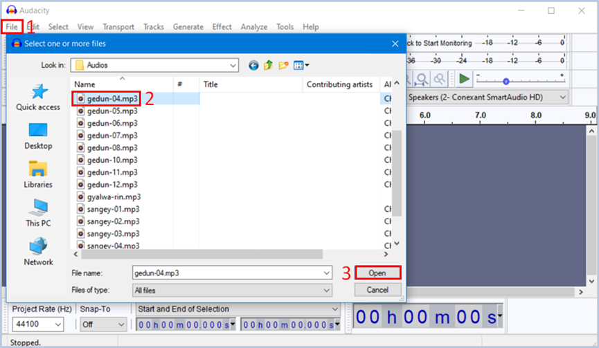

# SABནང་རྩ་བ་དང་སྒྲ་འགྲེལ་སྒྲིག་ཚུལ།

**ནང་དོན་སྙིང་བསྡུས།** འདི་ནི་Scripture App Builder (SAB)འམ་གཙུག་ལག་མཉེན་ཆས་སྒྲིག་སྟེགས་ནང་དཔེ་ཁྲིད་སྒྲ་རུ་བླངས་པ་རྣམས་གཞུང་དེའི་རྩ་བ་རང་དང་མཉམ་སྒྲིག་གིས་བལྟ་ཉན་བྱ་སའིཁ་པར་ནང་བཀོལ་རྒྱུའི་མཉེན་ཆས་སྒྲིག་སྟངས་ཀྱི་ངོ་སྤྲོད་ཅིག་ཡིན། སྤྱིར་གཞུང་གང་ཡིན་རུང་རིགས་ལམ་འདི་སྤྱད་ནས་མཉེན་ཆས་སྒྲིག་ཆོག་མོད་ཀྱང་། འདིར་སྤྱོད་འཇུག་གི་རྩ་བ་དང་དེའི་སྒྲ་འགྲེལ་གཉིས་དཔེར་བཀོད་དེ་དེ་གཉིས་མཉམ་སྒྲིག་གིས་ངོ་སྤྲོད་བྱས་ཡོད། 

🔊 提示：གསལ་འདེབས། རྩ་བ་དང་སྒྲ་འགྲེལ་མཉམ་སྒྲིག་གི་མཉེན་ཆས་དང་རྩ་བ་དང་ཡིག་རྐྱང་ཡིན་པའི་འགྲེལ་བ་མཉམ་སྒྲིག་གི་མཉེན་ཆས་གཉིས་ཀྱི་མཚོན་རྟགས་འཇོག་སྟངས་གཉིས་ལ་ཁྱད་པར་ཡོད། གཙོ་བོ་ཤོ་ལོ་ཀ་དང་ཚིག་རྐང་བར་སྟོང་བཅས་ཀྱི་མཚོན་རྟགས་འཇོག་སྟངས་ལ་ཁྱད་པར་ཡོད་པས་དོ་སྣང་མཛོད།

## མཚོན་རྟགས་ངེས་པ།

རྩ་བ་དང་སྒྲ་འགྲེལ་མཉམ་སྒྲིག་གི་མཚོན་རྟགས་རྣམས་ངོ་སྤྲོད།

- \mt མཚན་བྱང་།  
- \mt1 མཚན་བྱང་དང་བོ།  
- \mt2 མཚན་བྱང་གཉིས་པ།
- \b ཚིག་གྲུབ་གོང་འོག་གི་བར་སྟོང་འབྱེད་བྱེད།
- \m ཚིག་བཅད་གོང་འོག་གི་མཚམས་འཛིན་པ་དང་། སྒྲ་རྟགས་ཏག་ཏག་འཛིན་ཐུབ་པ་ཡིན།
- \m ཤོ་ལོ་ཀ་རེ་རེའི་མདུན་ལ་འང་འདི་འཇོག་དགོས།
- \m 1 ཤོ་ལོ་ཀ་དང་བོ་མཚོན།
- \m 2 ཤོ་ལོ་ཀ་གཉིས་པ་མཚོན།
- \s ནང་གསེས་སྡེ་ཚན་གྱི་མཚན་བྱང་།
- \s1 ནང་གསེས་སྡེ་ཚན་དང་བོ། སྡེ་ཚན་གཞན་ལ་ཡང་ཨང་རིམ་ལྟར་སྒྲིག་དགོས།
- \c ལེའུ།
- \c 1 ལེའུ་དང་བོ།
- \c 2 ལེའུ་གཉིས་པ། གཞན་ལ་དེ་བཞིན་ཨང་རིམ་སྤར་ནས་འཇོག་དགོས།

## A. སྡེ་ཚན་དང་བོ། སྒྲ་འགྲེལ་གྱི་རྩ་བ་རྩོམ་སྒྲིག

འདིར་སྒྲ་འགྲེལ་ཅན་གྱི་སྤྱོད་འཇུག་རྩ་བ་དང་ལྷན་མཚོན་རྟགས་བཀོལ་ནས་རྩོམ་སྒྲིག་བྱ་ཚུལ་དང་མཉེན་ཆས་ནང་དངོས་སུ་འཆར་ཡོད་པའི་དཔེ་མཚོན།

### A.༡ ལེའུ་དང་སྡེ་ཚན།

འདིར་རྩ་བ་དང་སྒྲ་འགྲེལ་མགྲེལ་མཉམ་སྒྲིག་མཉེན་ཆས་ནང་ལེའུ་དང་སྡེ་ཚན་ཁག་རྩོམ་སྒྲིག་བྱ་ཚུལ་དཔེ་མཚོན།

### A.༢ ཁྱད་པར་མཉམ་བསྡུར།

རྩ་བ་དང་སྒྲ་འགྲེལ་མཉམ་སྒྲིག་མཉེན་ཆས་དང་རྩ་བ་དང་ཡིག་རྐྱང་ཡིན་པའི་འགྲེལ་བ་མཉམ་སྒྲིག་གི་མཉེན་ཆས་གཉིས་ཀྱི་མཚོན་རྟགས་འཇོག་སྟངས་མ་འདྲ་བའི་ཁྱད་པར་དཔེ་མཚོན། 

