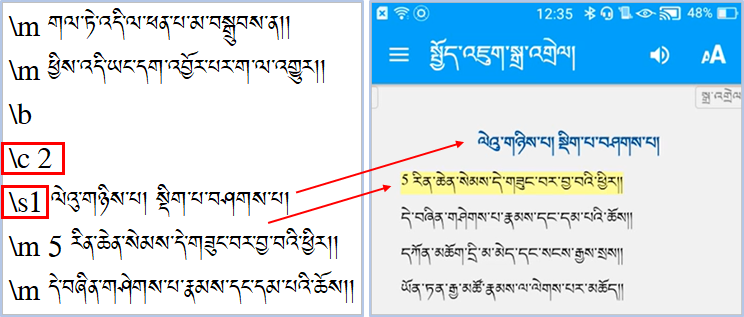
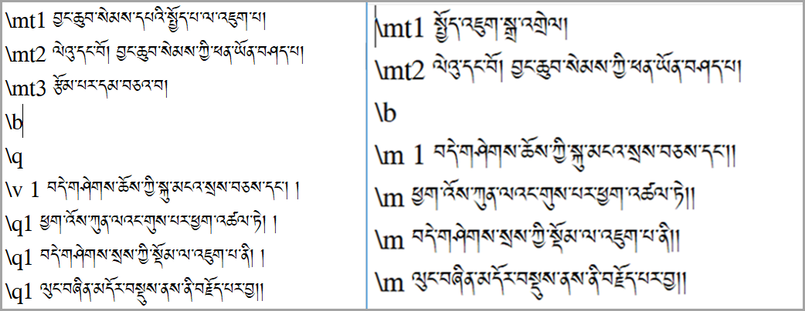

# SAB ནང་རྩ་བ་དང་སྒྲ་འགྲེལ་མཉེན་ཆས་སྒྲིག་ཚུལ།

**ནང་དོན་སྙིང་བསྡུས།** འདི་ནི་Scripture App Builder (SAB)འམ་གཙུག་ལག་མཉེན་ཆས་སྒྲིག་སྟེགས་ནང་དཔེ་ཁྲིད་སྒྲ་རུ་བླངས་པ་རྣམས་གཞུང་དེའི་རྩ་བ་རང་དང་མཉམ་སྒྲིག་གིས་བལྟ་ཉན་བྱ་སའིཁ་པར་ནང་བཀོལ་རྒྱུའི་མཉེན་ཆས་སྒྲིག་སྟངས་ཀྱི་ངོ་སྤྲོད་ཅིག་ཡིན། སྤྱིར་གཞུང་གང་ཡིན་རུང་རིགས་ལམ་འདི་སྤྱད་ནས་མཉེན་ཆས་སྒྲིག་ཆོག་མོད་ཀྱང་། འདིར་སྤྱོད་འཇུག་གི་རྩ་བ་དང་དེའི་སྒྲ་འགྲེལ་གཉིས་དཔེར་བཀོད་དེ་དེ་གཉིས་མཉམ་སྒྲིག་གིས་ངོ་སྤྲོད་བྱས་ཡོད། 

🔊 提示：གསལ་འདེབས། རྩ་བ་དང་སྒྲ་འགྲེལ་མཉམ་སྒྲིག་གི་མཉེན་ཆས་དང་རྩ་བ་དང་ཡིག་རྐྱང་ཡིན་པའི་འགྲེལ་བ་མཉམ་སྒྲིག་གི་མཉེན་ཆས་གཉིས་ཀྱི་མཚོན་རྟགས་འཇོག་སྟངས་གཉིས་ལ་ཁྱད་པར་ཡོད། གཙོ་བོ་ཤོ་ལོ་ཀ་དང་ཚིག་རྐང་བར་སྟོང་བཅས་ཀྱི་མཚོན་རྟགས་འཇོག་སྟངས་ལ་ཁྱད་པར་ཡོད་པས་དོ་སྣང་མཛོད།

## མཚོན་རྟགས་ངེས་པ།

རྩ་བ་དང་སྒྲ་འགྲེལ་མཉམ་སྒྲིག་གི་མཚོན་རྟགས་རྣམས་ངོ་སྤྲོད།

- \mt མཚན་བྱང་།  
- \mt1 མཚན་བྱང་དང་བོ།  
- \mt2 མཚན་བྱང་གཉིས་པ།
- \b ཚིག་གྲུབ་གོང་འོག་གི་བར་སྟོང་འབྱེད་བྱེད།
- \m ཚིག་བཅད་གོང་འོག་གི་མཚམས་འཛིན་པ་དང་། སྒྲ་རྟགས་ཏག་ཏག་འཛིན་ཐུབ་པ་ཡིན།
- \m ཤོ་ལོ་ཀ་རེ་རེའི་མདུན་ལ་འང་འདི་འཇོག་དགོས།
- \m 1 ཤོ་ལོ་ཀ་དང་བོ་མཚོན།
- \m 2 ཤོ་ལོ་ཀ་གཉིས་པ་མཚོན།
- \s ནང་གསེས་སྡེ་ཚན་གྱི་མཚན་བྱང་།
- \s1 ནང་གསེས་སྡེ་ཚན་དང་བོ། སྡེ་ཚན་གཞན་ལ་ཡང་ཨང་རིམ་ལྟར་སྒྲིག་དགོས།
- \c ལེའུ།
- \c 1 ལེའུ་དང་བོ།
- \c 2 ལེའུ་གཉིས་པ། གཞན་ལ་དེ་བཞིན་ཨང་རིམ་སྤར་ནས་འཇོག་དགོས།

## མཉེན་ཆས་འདིའི་བཀོལ་སྤྱོད་ལམ་སྟོན་ཁག

རྩ་བ་དང་སྒྲ་འགྲེལ་མཉམ་སྦྱར་གྱི་མཉེན་ཆས་སྒྲིག་ཚུལ་ལ་རྩ་བའི་བཀོལ་སྤྱོད་ལམ་སྟོན་རིགས་མ་འདྲ་བ་བཞི་ཙམ་ཡོད། མཉེན་ཆས་འདི་ལེགས་སྒྲིག་ཐུབ་པར་ལམ་སྟོན་དེ་དག་ལ་ཞིབ་བལྟ་བྱས་པས་མ་ཚད་ངེས་པར་དུ་བྱང་ཆུབ་དགོས།
- དང་བོ། SAB ནང་རྩ་བ་དང་སྒྲ་འགྲེལ་མཉེན་ཆས་སྒྲིག་ཚུལ། (མཚོན་རྟགས་སྒྲིག་ཚུལ།)
- གཉིས་པ། [Audacity ནང་སྒྲ་མཚམས་འཇོག་ཚུལ།](https://github.com/buda-base/budax/blob/master/howtoguides/SAB07/index.md#audacity%E0%BD%A6%E0%BE%92%E0%BE%B2%E0%BD%A6%E0%BE%92%E0%BE%B2%E0%BD%B2%E0%BD%82%E0%BD%98%E0%BD%89%E0%BD%BA%E0%BD%93%E0%BD%86%E0%BD%A6) (སྒྲ་མཚམས་རེའུ་མིག་དང་དེ་སྒྲིག་ཚུལ།)
- གསུམ་པ། [སྒྲིག་སྟེགས་ནང་དཔེ་ཚོགས་སྒྲིག་སྦྱོར་བྱ་ཚུལ།]() (དཔེ་ཚོགས་ལེན་སྟངས་དང་མིང་འདོགས་ཚུལ།)
- བཞི་བ། [མཉེན་ཆས་ཀྱི་ཁྱད་ཆོས་སྒྲིག་སྦྱོར་དང་དངོས་སྒྲིག]() (ཁྱད་ཆོས་འདོར་ལེན་དང་APKབཟོ་ཚུལ་སོགས།)
## A. སྡེ་ཚན་དང་བོ། སྒྲ་འགྲེལ་གྱི་རྩ་བ་རྩོམ་སྒྲིག

འདིར་སྒྲ་འགྲེལ་ཅན་གྱི་སྤྱོད་འཇུག་རྩ་བ་དཔེ་རུ་བཟུང་སྟེ་མཚོན་རྟགས་བཀོལ་ནས་རྩོམ་སྒྲིག་བྱ་ཚུལ་དང་མཉེན་ཆས་ནང་དངོས་སུ་འཆར་ཡོད་པའི་དཔེ་མཚོན། པར་རིས་དང་བོ་རྩོམ་སྒྲིག་བྱེད་བཞིན་པ་དང་གཉིས་པ་མཉེན་ཆས་ནང་དངོས་སུ་འཆར་ཡོད་པའི་རྣམ་པ་ཡིན།

### A.༡ ལེའུ་དང་སྡེ་ཚན།

འདིར་རྩ་བ་དང་སྒྲ་འགྲེལ་མགྲེལ་མཉམ་སྒྲིག་མཉེན་ཆས་ནང་ལེའུ་དང་སྡེ་ཚན་ཁག་རྩོམ་སྒྲིག་བྱ་ཚུལ་དཔེ་མཚོན། པར་རིས་དང་བོ་རྩོམ་སྒྲིག་བྱེད་བཞིན་པ་དང་གཉིས་པ་མཉེན་ཆས་ནང་དངོས་སུ་འཆར་ཡོད་པའི་རྣམ་པ་ཡིན། སྒྲ་མཚམས་གང་ལ་ཡོད་ན་དེའི་མཚམས་ཀྱི་རྩ་ཚིག་རང་འགུལ་གྱིས་མདོག་སེར་བོར་གྱུར་ཡོང་བའི་དཔེ་མཚོན།

### A.༢ ཁྱད་པར་མཉམ་བསྡུར།

རྩ་བ་དང་སྒྲ་འགྲེལ་མཉམ་སྒྲིག་མཉེན་ཆས་དང་རྩ་བ་དང་ཡིག་རྐྱང་ཡིན་པའི་འགྲེལ་བ་མཉམ་སྒྲིག་གི་མཉེན་ཆས་གཉིས་ཀྱི་མཚོན་རྟགས་འཇོག་སྟངས་མ་འདྲ་བའི་ཁྱད་པར་དཔེ་མཚོན། 

## B. ཐོག་མའི་གྲ་སྒྲིག

གློག་ཀླད་ནང་སྒྲ་འགྲེལ་མཉེན་ཆས་འདི་དང་འབྲེལ་བའི་རྒྱུ་ཆ་སྤྱིའི་ཡིག་སྣོད་ཅིག་བཟོས། དེའི་ནང་རྒྱུ་ཆའི་རིགས་རེ་རེར་ཡིག་སྣོད་རེ་བཟོས།
- གཞུང་དེའི་རྩ་བ། 
- གཞུང་དེའི་སྒྲ་འགྲེལ་ལམ་དེའི་དཔེ་ཁྲིད་སྒྲར་བླངས་པ་གཅིག
- ནང་དོན་དང་མཐུན་པའི་མཉེན་ཆས་ནང་འཇོག་རྒྱུའི་འདྲ་པར་ཁག
སྒྲ་འགྲེལ་མཉེན་ཆས་བསྒྲིག་པར་རྒྱུ་ཆ་འདི་དག་ངེས་པར་ཚང་དགོས།  རྩ་བ་རྩོམ་སྒྲིག་ཟིན་པ་དང་སྒྲ་གཙང་བཟོ་ཟིན་པ་སྒྲ་མཚམས་རེའུ་མིག་བཟོས་ཟིན་པ་རྣམས་ཀྱང་གོང་གི་སྡེ་ཚན་སོ་སོའི་ནང་ཉར་དགོས།
## B.༡ སྒྲ་འགྲེལ་མཉེན་ཆས་རྩོམ་སྒྲིག་སྒྲིག་གཞི།

འདིར་སྤྱོད་འཇུག་དཔེར་བཀོད་ནས་ངོ་སྤྲོད་བྱས་ཡོད།
👉 དང་བོ། རྩ་བ་རྩོམ་སྒྲིག་བྱེད་སྐབས་ཀྱི་སྒྲིག་ཞིག་ནི་
- ལེའུ་དུ་མ་ཡོད་རུང་ཤོག་ངོས་གཅིག་ཡིན་ཆོག
- ལེའུ་རེ་རེའི་མཚམས་སུ་ལེའུའི་མཚོན་རྟགས་འཇོག་དགོས།
- མཚོན་རྟགས་རྣམས་མ་ནོར་བར་སྒྲིག་དགོས། 

དཔེར་ན། སྤྱོད་འཇུག་རྩ་བའི་མིང་འདོགས་ཚུལ་གཅིག་གྱུར་གྱི་དཔེ་མཚོན་གཤམ་གསལ།
- chojuk.txt

👉 གཉིས་པ། སྒྲ་འགྲེལ་རྩོམ་སྒྲིག་བྱེད་སྐབས་ཀྱི་སྒྲིག་གཞི་ནི་
- སྒྲ་དེ་ཤོ་ལོ་ཀའི་ཚིག་རྐང་རེ་རེའི་མཚམས་སུ་སྒྲ་མཚམས་འཇོག་དགོས།
- ལེའུ་རེར་སྒྲ་གཅིག་རང་ཡིན་དགོས།
- སྒྲ་འགྲེལ་ལེའུ་རེ་རེའི་མིང་འདོགས་ཚུལ་རྩ་བ་དང་གཅིག་གྱུར་དགོས།

དཔེར་ན། ལེའུ་རེ་རེའི་སྒྲའི་མིང་འདོགས་ཚུལ་རྩ་བ་དང་གཅིག་གྱུར་ཡིན་པའི་དཔེ་མཚོན་གཤམ་གསལ།
- chojuk-01.mp3
- chojuk-02.mp3
- chojuk-03.mp3

👉 གསུམ་པ། སྒྲ་མཚམམས་རེའུ་མིག་ནི་གཞུང་དེའི་རྩ་བ་དང་སྒྲ་འགྲེལ་གཉིས་ཀྱི་མཚམས་ཐད་ཀར་མཐུད་བྱེད་དང་མཚམས་དེའི་རྩ་ཚིག་སེར་བོར་གྱུར་བ་ཡིན།  
སྒྲ་མཚམམས་རེའུ་མིག་གི་སྒྲིག་གཞི་ནི་
- སྒྲ་མཚམམས་རེའུ་མིག་གི་ཨང་གྲངས་ཁག་སོར་འཇོག་དགོས།
- སྒྲ་འགྲེལ་དེ་ག་རང་གི་སྒྲ་མཚམམས་རེའུ་མིག་ཡིན་དགོས།
- སྒྲ་མཚམམས་རེའུ་མིག་གི་མིང་འདོགས་ཚུལ་སྒྲ་འགྲེལ་དང་རྩ་བ་བཅས་གཅིག་གྱུར་དགོས།

དཔེར་ན། སྒྲ་མཚམམས་རེའུ་མིག་གི་མིང་འདོགས་ཚུལ་རྩ་བ་དང་སྒྲ་འགྲེལ་བཅས་གཅིག་གྱུར་བྱས་པའི་དཔེ་མཚོན་གཤམ་གསལ།
- chojuk-01.txt
- chojuk-02.txt
- chojuk-03.txt

## C. SAB ནང་སྒྲ་འགྲེལ་མཉེན་ཆས་གསར་བཟོ།

གཙུག་ལག་མཉེན་ཆས་སྒྲིག་སྟེགས་སམ་Scripture App Builder (SAB)ནངརྩ་བ་དང་སྒྲ་འགྲེལ་མཉམ་སྒྲིག་མཉེན་ཆས་གསར་བཟོ་བྱ་ཚུལ་གྱི་ ཐོག་མའི་སྡེ་ཚན་ནི་ཐུན་མོང་གཅིག་གྱུར་ཡིན། 
- དེའི་[དཔེ་མཚོན་དྲ་ཐག་འདི་](https://github.com/buda-base/budax/blob/master/howtoguides/SAB02/index.md#sab-%E0%BD%98%E0%BD%89%E0%BD%BA%E0%BD%93%E0%BD%86%E0%BD%A6%E0%BD%90%E0%BD%B4%E0%BD%93%E0%BD%98%E0%BD%BC%E0%BD%84%E0%BD%82%E0%BD%B2%E0%BD%A6%E0%BE%92%E0%BE%B2%E0%BD%B2%E0%BD%82%E0%BD%A0%E0%BD%82%E0%BD%BC%E0%BD%91)ནས་གཟིགས།

### ☝️ སྒང་གི་དྲ་ཐག་ལ་བསྣུན་ཏེ་བཀོལ་སྤྱོད་ལམ་སྟོན་རྗེས་མ་རྣམས་ལ་གཟིགས། 

<iframe src="https://shimowendang.com/forms/cytvT6t9G9DhKHRJ/fill?channel=1" style="height:1050px;width:800px;"></iframe>

##  [教程目录 བཀོལ་སྤྱོད་ལམ་སྟོན་གྱི་དཀར་ཆག](https://github.com/buda-base/budax)