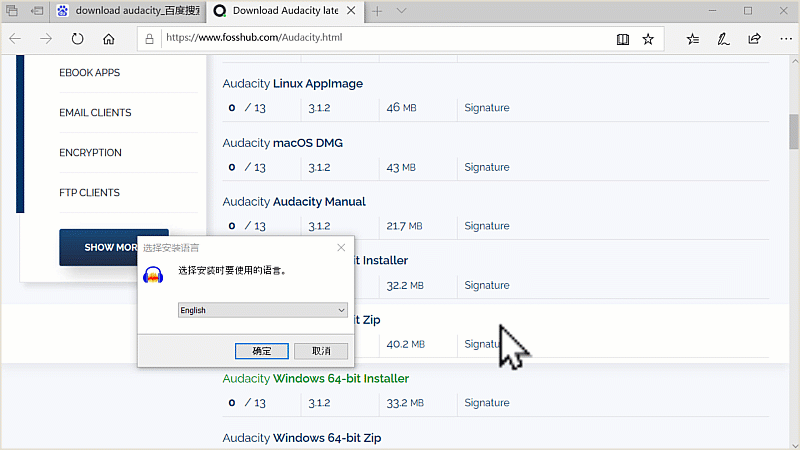
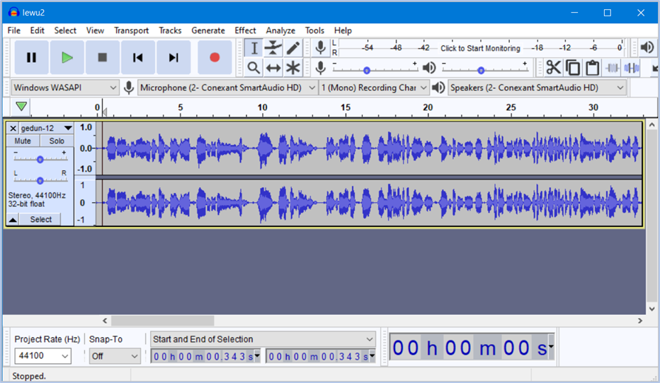
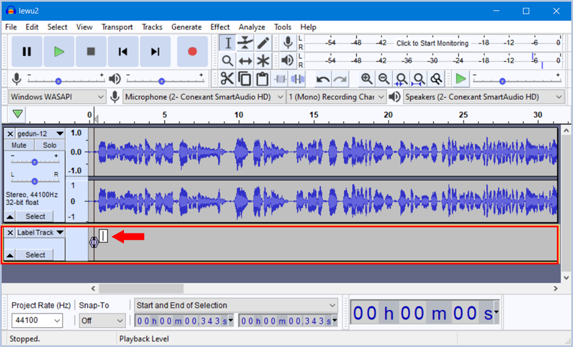
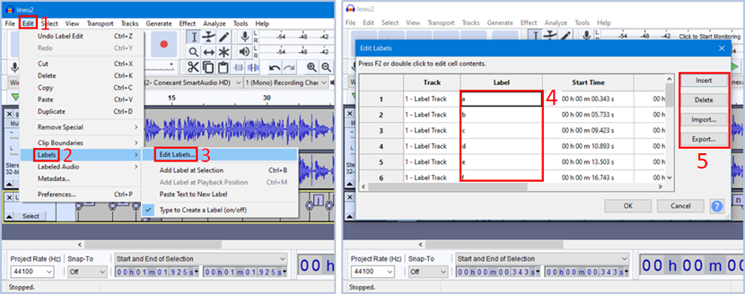
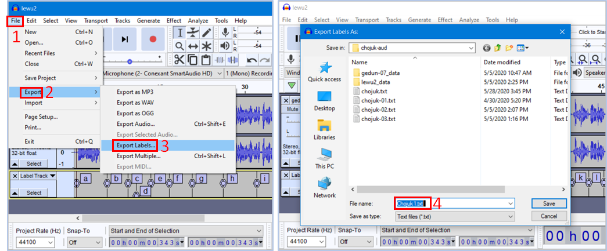
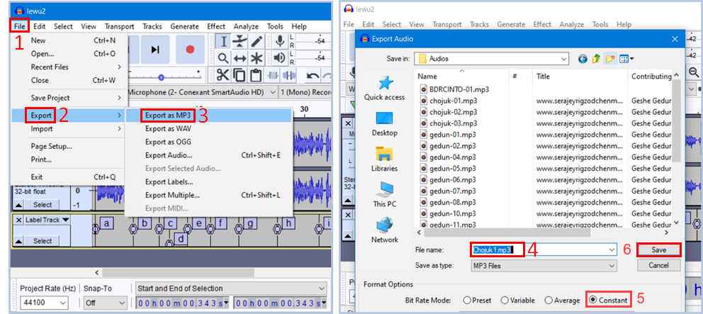

# Audacityསྒྲ་སྒྲིག་མཉེན་ཆས།

མཉེན་ཆས་འདིའི་ངོ་སྤྲོད་མདོར་བསྡུས། མཉེན་ཆས་འདི་ནི་ཕབ་ལེན་རིན་མེད་དང་སྒྲའི་རིགས་བཅད་གཏུབ་དང་མཐུད་སྦྱོར། གཙང་བཟོ་སོགས་ལ་མཁོ་བའི་ཁྱད་ཆོས་སྣ་མང་འཛོམས་ཤིང་བཀོལ་སྤྱོད་ལ་རྙོག་འཛིང་མེད་པ་ཞིག་ཡིན། སྐབས་སུ་བབས་པ་གཙུག་ལག་མཉེན་ཆས་སྒྲིག་སྟེགས་ནང་བཀོལ་རྒྱུའི་སྒྲ་གཏུབ་སྟངས་དང་གཏུབ་རྗེས་སྒྲ་མཚམས་རེའུ་མིག་གམ་timing file བཟོ་སྟངས་དེ་ངོ་སྤྲོད་བྱ་རྒྱུ་ཡིན།

## མཉེན་ཆས་འདིའི་བཀོལ་སྤྱོད་ལམ་སྟོན་ཁག

རྩ་བ་དང་སྒྲ་འགྲེལ་མཉམ་སྦྱར་གྱི་མཉེན་ཆས་སྒྲིག་ཚུལ་ལ་རྩ་བའི་བཀོལ་སྤྱོད་ལམ་སྟོན་རིགས་མ་འདྲ་བ་གསུམ་ཙམ་ཡོད། མཉེན་ཆས་འདི་ལེགས་སྒྲིག་ཐུབ་པར་ལམ་སྟོན་དེ་དག་ལ་ཞིབ་བལྟ་བྱས་པས་མ་ཚད་ངེས་པར་དུ་བྱང་ཆུབ་དགོས།
- དང་བོ། [SAB ནང་རྩ་བ་དང་སྒྲ་འགྲེལ་མཉེན་ཆས་སྒྲིག་ཚུལ།](https://github.com/buda-base/budax/blob/master/howtoguides/SAB06/index.md#sab-%E0%BD%93%E0%BD%84%E0%BD%A2%E0%BE%A9%E0%BD%96%E0%BD%91%E0%BD%84%E0%BD%A6%E0%BE%92%E0%BE%B2%E0%BD%A0%E0%BD%82%E0%BE%B2%E0%BD%BA%E0%BD%A3%E0%BD%98%E0%BD%89%E0%BD%BA%E0%BD%93%E0%BD%86%E0%BD%A6%E0%BD%A6%E0%BE%92%E0%BE%B2%E0%BD%B2%E0%BD%82%E0%BD%9A%E0%BD%B4%E0%BD%A3) (མཚོན་རྟགས་སྒྲིག་ཚུལ།)
- གཉིས་པ། Audacity ནང་སྒྲ་མཚམས་འཇོག་ཚུལ། (སྒྲ་མཚམས་རེའུ་མིག་དང་དེ་སྒྲིག་ཚུལ།)
- གསུམ་པ། [སྒྲིག་སྟེགས་ནང་སྒྲ་འགྲེལ་སྦྱར་མའི་དཔེ་ཚོགས་སྒྲིག་ཚུལ།](https://github.com/buda-base/budax/blob/master/howtoguides/SAB08/index.md#%E0%BD%A6%E0%BE%92%E0%BE%B2%E0%BD%A0%E0%BD%82%E0%BE%B2%E0%BD%BA%E0%BD%A3%E0%BD%A6%E0%BE%A6%E0%BE%B1%E0%BD%A2%E0%BD%98%E0%BD%A0%E0%BD%B2%E0%BD%91%E0%BD%94%E0%BD%BA%E0%BD%9A%E0%BD%BC%E0%BD%82%E0%BD%A6%E0%BD%A6%E0%BE%92%E0%BE%B2%E0%BD%B2%E0%BD%82%E0%BD%9A%E0%BD%B4%E0%BD%A3) (དཔེ་ཚོགས་ལེན་སྟངས་དང་མིང་འདོགས་ཚུལ།)
## ངོ་སྤྲོད་ཀྱི་རིམ་པ།

1. སྡེ་ཚན་དང་བོ། མཉེན་ཆས་ཕབ་ལེན་གྱི་གོ་རིམ།
2. སྡེ་ཚན་གཉིས་པ། སྒྲ་མཚམས་ཀྱི་དུས་ཚོད་རེའུ་མིག་དེ་བཟོ་སྟངས།
3. སྡེ་ཚན་གསུམ་པ། གཏུབ་མཚམས་ཀྱི་སྒྲ་མཚམས་རེའུ་མིག་དེ་ཉར་ཚགས་བྱ་ཚུལ་བཅས་སོ།།

## A. སྡེ་ཚན་དང་པོ་ཕབ་ལེན། 

A.༡ [དྲ་ཐག་འདིར་](https://www.fosshub.com/Audacity.html)བསྣུན་ཏེ་རང་གི་གློག་ཀླད་ཀྱི་རིགས་མཐུན་པའི་མཉེན་ཆས་ཕབ་ལེན་བྱ་ཆོག འདིའི་མཚམས་ནས་རང་ལ་ངེས་ཆ་ཆེ་བའི མཉེན་ཆས་ཀྱི་སྐད་ཡིག་ཀྱང་འདེམ་ཆོག གོ་རིམ་ལ་གཟིགས།

ཆ་ཤས་གཉིས་པ། སྒྲ་སྒྲིག་མཉེན་ཆས་ཕབ་ལེན་བྱས་གྲུབ་པ་ཡིན།

## ཐོག་མའི་གྲ་སྒྲིག

གློག་ཀླད་ནང་སྒྲ་འགྲེལ་མཉེན་ཆས་འདི་དང་འབྲེལ་བའི་རྒྱུ་ཆ་སྤྱིའི་ཡིག་སྣོད་ཅིག་བཟོས། དེའི་ནང་རྒྱུ་ཆའི་རིགས་རེ་རེར་ཡིག་སྣོད་རེ་བཟོས།
- གཞུང་དེའི་རྩ་བ་གཙོ་བོ། 
- གཞུང་དེའི་སྒྲ་འགྲེལ་ལམ་དེའི་དཔེ་ཁྲིད་སྒྲར་བླངས་པ་གཅིག
- ནང་དོན་དང་མཐུན་པའི་མཉེན་ཆས་ནང་འཇོག་རྒྱུའི་འདྲ་པར་ཁག
- སྒྲ་མཚམས་རེའུ་མིག  
སྒྲ་འགྲེལ་མཉེན་ཆས་བསྒྲིག་པར་རྒྱུ་ཆ་འདི་དག་ངེས་པར་ཚང་དགོས།  རྩ་བ་རྩོམ་སྒྲིག་ཟིན་པ་དང་སྒྲ་གཙང་བཟོ་ཟིན་པ་སྒྲ་མཚམས་རེའུ་མིག་བཟོས་ཟིན་པ་རྣམས་ཀྱང་གོང་གི་སྡེ་ཚན་སོ་སོའི་ནང་ཉར་དགོས།

## སྒྲ་འགྲེལ་མཉེན་ཆས་རྩོམ་སྒྲིག་སྒྲིག་གཞི།

འདིར་སྤྱོད་འཇུག་དཔེར་བཀོད་ནས་ངོ་སྤྲོད་བྱས་ཡོད།  
👉 དང་བོ། རྩ་བ་རྩོམ་སྒྲིག་བྱེད་སྐབས་ཀྱི་སྒྲིག་ཞིག་ནི་
- ལེའུ་དུ་མ་ཡོད་རུང་ཤོག་ངོས་གཅིག་ཡིན་ཆོག
- ལེའུ་རེ་རེའི་མཚམས་སུ་ལེའུའི་མཚོན་རྟགས་འཇོག་དགོས།
- མཚོན་རྟགས་རྣམས་མ་ནོར་བར་སྒྲིག་དགོས། 

དཔེར་ན། སྤྱོད་འཇུག་རྩ་བའི་མིང་འདོགས་ཚུལ་གཅིག་གྱུར་གྱི་དཔེ་མཚོན་གཤམ་གསལ།
- chojuk.txt

👉 གཉིས་པ། སྒྲ་འགྲེལ་རྩོམ་སྒྲིག་བྱེད་སྐབས་ཀྱི་སྒྲིག་གཞི་ནི་
- སྒྲ་དེ་ཤོ་ལོ་ཀའི་ཚིག་རྐང་རེ་རེའི་མཚམས་སུ་སྒྲ་མཚམས་འཇོག་དགོས།
- ལེའུ་རེར་སྒྲ་གཅིག་རང་ཡིན་དགོས།
- སྒྲ་འགྲེལ་ལེའུ་རེ་རེའི་མིང་འདོགས་ཚུལ་རྩ་བ་དང་གཅིག་གྱུར་དགོས།

དཔེར་ན། ལེའུ་རེ་རེའི་སྒྲའི་མིང་འདོགས་ཚུལ་རྩ་བ་དང་གཅིག་གྱུར་ཡིན་པའི་དཔེ་མཚོན་གཤམ་གསལ།
- chojuk-01.mp3
- chojuk-02.mp3
- chojuk-03.mp3

👉 གསུམ་པ། སྒྲ་མཚམམས་རེའུ་མིག་ནི་གཞུང་དེའི་རྩ་བ་དང་སྒྲ་འགྲེལ་གཉིས་ཀྱི་མཚམས་ཐད་ཀར་མཐུད་བྱེད་དང་མཚམས་དེའི་རྩ་ཚིག་སེར་བོར་གྱུར་བ་ཡིན།  
སྒྲ་མཚམམས་རེའུ་མིག་གི་སྒྲིག་གཞི་ནི་
- སྒྲ་མཚམམས་རེའུ་མིག་གི་ཨང་གྲངས་ཁག་སོར་འཇོག་དགོས།
- སྒྲ་འགྲེལ་དེ་ག་རང་གི་སྒྲ་མཚམམས་རེའུ་མིག་ཡིན་དགོས།
- སྒྲ་མཚམམས་རེའུ་མིག་གི་མིང་འདོགས་ཚུལ་སྒྲ་འགྲེལ་དང་རྩ་བ་བཅས་གཅིག་གྱུར་དགོས།

དཔེར་ན། སྒྲ་མཚམམས་རེའུ་མིག་གི་མིང་འདོགས་ཚུལ་རྩ་བ་དང་སྒྲ་འགྲེལ་བཅས་གཅིག་གྱུར་བྱས་པའི་དཔེ་མཚོན་གཤམ་གསལ།
- chojuk-01.txt
- chojuk-02.txt
- chojuk-03.txt
 ## B. སྡེ་ཚན་གཉིས་པ། སྒྲ་མཚམས་རེའུ་མིག་བཟོ་ཚུལ།

B.༡ སྒྲ་སྒྲིག་མཉེན་ཆས་Audacity སྒོ་ཕྱེས་ཏེ་སྒྲ་འགྲེལ་ལེན་ཚུལ། 
- དང་བོ། མཉེན་ཆས་ཀྱི་fileལ་སྣུན།
- དེ་ནས་open སྒོ་ཕྱེས།
- བསྒྲིག་བྱའི་སྒྲ་འགྲེལ་ལོངས།

B.༢ མཉེན་ཆས་ནང་སྒྲ་དངོས་སུ་བླངས་ཡོད་པའི་རྣམ་པ།

B.༣ སྒྲའི་ལྷག་མའམ་མཁོ་མེད་རྣམས་གཏུབ་ནས་གཙང་བཟོ་བྱོས། རྩ་བ་དེའི་ཤོ་ལོ་ཀའི་ཚིག་རྐང་རེ་རེའི་མཚམས་སུ་སྒྲ་འགྲེལ་ནང་སྒྲ་མཚམས་འཇོག་དགོས། སྒྲ་མཚམས་འཇོག་ཆས་དེ་ཡོང་བར་ཐེབས་གཞོང་སྒང་གི་ ctrl+B འདི་གཉིས་མཉམ་གནོན་བྱོས།

B.༤ སྒྲ་མཚམས་འཇོག་སྐབས་སྒྲ་ལ་ཉན་བཞིན་གཞུང་དེའི་རྩ་ཙིག་གི་ཚིག་རྐང་རེ་རེའི་མཚམས་སུ་སླེབས་སྐབས་ཐེབས་གཞོང་སྒང་གི་ ctrl+m གཉིས་མཉམ་གནོན་བྱས་ན་ཐད་ཀར་མཚམས་དེར་སྒྲ་མཚམས་འཇོག་ས་བཟོ་ཡོང་། བཟོས་རྗེས་སྒྲ་མཚམས་རེའི་མཚམས་སུ་ཨིན་ཡིག་ a ནས་ z བར་དང་དེ་ལས་མང་བ་དགོས་ཚེ་ aa ནས་ az བར་དང་ba ནས bz བར་རིམ་བཞིན་འཇོག་དགོས། 

B.༥ སྒྲ་མཚམས་རྣམས་བསྐྱར་བཅོས་རིགས་བྱ་དགོས་ཚེ་སྒྲིག་འགོད་ཀྱི་གོ་རིམ་པར་རིས་དང་བོ་ལྟར། འདིར་ཁ་སྣོན་དང་ཡང་ན་སུབ་དགོས་ཚེ་པར་རིས་གཉིས་པའི་དཔེ་རིས་ངོས་ཀྱི་ཨང་བཞི་བའི་སར་རྟགས་བརྒྱབ་སྟེ། ཨང་ལྔ་བའི་དམར་རྟགས་ནང་གི་ཁྱད་ཆོས་ཁག་ལ་བསྣུན་ནས་གང་ལ་གང་དགོས་ལྟར་སྒྲིག་དགོས།

## C. སྡེ་ཚན་གསུམ་པ། སྒྲ་མཚམས་རེའུ་མིག་ཉར་ཚགས།

C.༡ བཟོས་ཟིན་པའི་སྒྲ་མཚམས་རེའུ་མིག་ timing file དེ་ཉར་ཚགས་བྱ་ཚུལ། སྒྲིག་འགོད་ཀྱི་གོ་རིམ་ནི་པར་རིས་དང་བོ་ལྟར་དང་། པར་རིས་གཉིས་པ་ནང་བཞིན་ཡིག་ཆའི་མིང་ཕྲིས། མིང་དེ་ཡང་གོང་ཞུས་ལྟར་ཡིག་ཆ་འདི་དང་འབྲེལ་བའི་རིགས་ཚང་མར་གཅིག་གྱུར་འདོགས་དགོས།  
སྒང་ལ་གཟིགས།

C.༢ གཏུབ་ཟིན་པའི་སྒྲ་མཚམས་རེའུ་མིག་གི་རྣམ་པ། གཤམ་གྱི་དཔེ་རིས་ལ་གཟིགས། འདི་མཉེན་ཆས་ནང་ནང་འཇུག་བྱས་ན་འདིས་མཉེན་ཆས་ནང་གི་རྩ་བ་དང་འགྲེལ་བའི་སྦྲེལ་མཚམས་རྣམས་ཐད་ཀར་ཐད་ཀར་མཐུད་ཡོང་བ་ཡིན།

C.༣ ད་ལྟ་གོང་ནས་སྒྲ་མཚམས་བསྒྲིགས་ཟིན་པའི་སྒྲ་དེ་ཉར་ཚགས་བྱ་དགོས། སྒྲིག་འགོད་ཀྱི་གོ་རིམ་ནི་པར་རིས་དང་བོ་ལྟར་དང། པར་རིས་གཉིས་པ་ལྟར་སྒྲའི་ཡིག་ཆའི་མིང་སྔར་ཞུས་བཞིན་གཅིག་གྱུར་དགོས། 
སྒང་ལ་གཟིགས། འདི་ལ་རིགས་འགྲེ་བྱས་ནས་གཞན་རྣམས་ཀྱང་ཤེས་པར་བྱའོ།།

☝️ སྒང་གི་དྲ་ཐག་ལ་བསྣུན་ཏེ་བཀོལ་སྤྱོད་ལམ་སྟོན་རྗེས་མ་རྣམས་ལ་གཟིགས། 

<iframe src="https://shimowendang.com/forms/cytvT6t9G9DhKHRJ/fill?channel=1" style="height:1050px;width:800px;"></iframe>

##  [教程目录 བཀོལ་སྤྱོད་ལམ་སྟོན་གྱི་དཀར་ཆག](https://github.com/buda-base/budax)