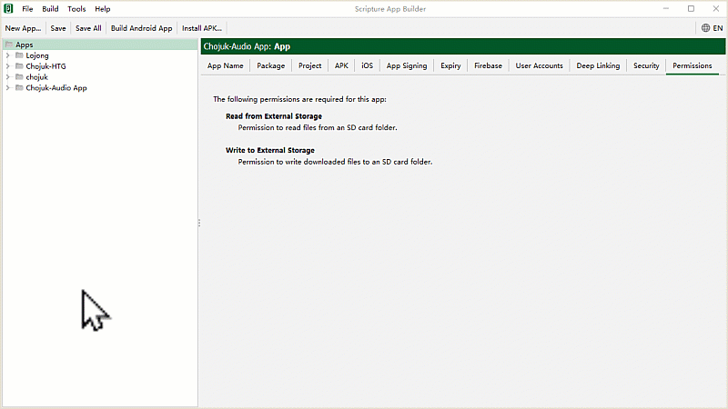

# སྒྲ་འགྲེལ་སྦྱར་མའི་དཔེ་ཚོགས་སྒྲིག་ཚུལ།

འདིར་གཙུག་ལག་མཉེན་ཆས་སྒྲིག་སྟེགས་(SAB)ནང་རྩ་བ་དང་སྒྲ་འགྲེལ་སྦྱར་མའི་མཉེན་ཆས་སྒྲིག་ཚུལ་གྱི་དཔེ་ཚོགས་སམ་ Book Collection དང་ Book དཔེ་ཆའི་རྩ་བ་དང་སྒྲ་འགྲེལ་སྒྲིག་ཚུལ་དང་། སྒྲ་མཚམས་བཅས་འཇོག་ཚུལ་ངོ་སྤྲོད་བྱས་ཡོད།
## མཉེན་ཆས་འདིའི་བཀོལ་སྤྱོད་ལམ་སྟོན་ཁག

རྩ་བ་དང་སྒྲ་འགྲེལ་མཉམ་སྦྱར་གྱི་མཉེན་ཆས་སྒྲིག་ཚུལ་ལ་རྩ་བའི་བཀོལ་སྤྱོད་ལམ་སྟོན་རིགས་མ་འདྲ་བ་བཞི་ཙམ་ཡོད། མཉེན་ཆས་འདི་ལེགས་སྒྲིག་ཐུབ་པར་ལམ་སྟོན་དེ་དག་ལ་ཞིབ་བལྟ་བྱས་པས་མ་ཚད་ངེས་པར་དུ་བྱང་ཆུབ་དགོས།
- དང་བོ། [SAB ནང་རྩ་བ་དང་སྒྲ་འགྲེལ་མཉེན་ཆས་སྒྲིག་ཚུལ།](https://github.com/buda-base/budax/blob/master/howtoguides/SAB06/index.md#sab-%E0%BD%93%E0%BD%84%E0%BD%A2%E0%BE%A9%E0%BD%96%E0%BD%91%E0%BD%84%E0%BD%A6%E0%BE%92%E0%BE%B2%E0%BD%A0%E0%BD%82%E0%BE%B2%E0%BD%BA%E0%BD%A3%E0%BD%98%E0%BD%89%E0%BD%BA%E0%BD%93%E0%BD%86%E0%BD%A6%E0%BD%A6%E0%BE%92%E0%BE%B2%E0%BD%B2%E0%BD%82%E0%BD%9A%E0%BD%B4%E0%BD%A3) (མཚོན་རྟགས་སྒྲིག་ཚུལ།)
- གཉིས་པ། [Audacity ནང་སྒྲ་མཚམས་འཇོག་ཚུལ།](https://github.com/buda-base/budax/blob/master/howtoguides/SAB07/index.md#audacity%E0%BD%A6%E0%BE%92%E0%BE%B2%E0%BD%A6%E0%BE%92%E0%BE%B2%E0%BD%B2%E0%BD%82%E0%BD%98%E0%BD%89%E0%BD%BA%E0%BD%93%E0%BD%86%E0%BD%A6) (སྒྲ་མཚམས་རེའུ་མིག་དང་དེ་སྒྲིག་ཚུལ།)
- གསུམ་པ། སྒྲིག་སྟེགས་ནང་སྒྲ་འགྲེལ་སྦྱར་མའི་དཔེ་ཚོགས་སྒྲིག་ཚུལ། (དཔེ་ཚོགས་ལེན་སྟངས་དང་མིང་འདོགས་ཚུལ།)
- བཞི་བ། [མཉེན་ཆས་ཀྱི་ཁྱད་ཆོས་སྒྲིག་སྦྱོར་དང་དངོས་སྒྲིག]() (ཁྱད་ཆོས་འདོར་ལེན་དང་APKབཟོ་ཚུལ་སོགས།)

## A. སྡེ་ཚན་དང་བོ། རྩ་ཚིག་གི་དཔེ་ཚོགས།

རྩ་བ་དང་སྒྲ་འགྲེལ་སྦྱར་མའི་མཉེན་ཆས་ལ་དཔེ་ཚོགས་སམ་Book Collection གཅིག་མ་གཏོགས་མི་དགོས། དེའི་རྩ་བ་དང་སྒྲ་འགྲེལ་གཉིས་མཉམ་འཇོག་བྱ་ཐུབ།

☝️ སྒང་གི་དྲ་ཐག་ལ་བསྣུན་ཏེ་བཀོལ་སྤྱོད་ལམ་སྟོན་རྗེས་མ་རྣམས་ལ་གཟིགས། 

<iframe src="https://shimowendang.com/forms/cytvT6t9G9DhKHRJ/fill?channel=1" style="height:1050px;width:800px;"></iframe>

##  [教程目录 བཀོལ་སྤྱོད་ལམ་སྟོན་གྱི་དཀར་ཆག](https://github.com/buda-base/budax)