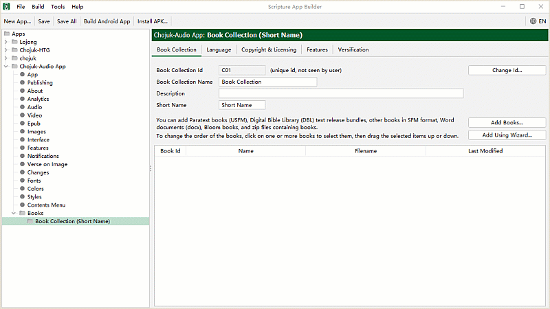
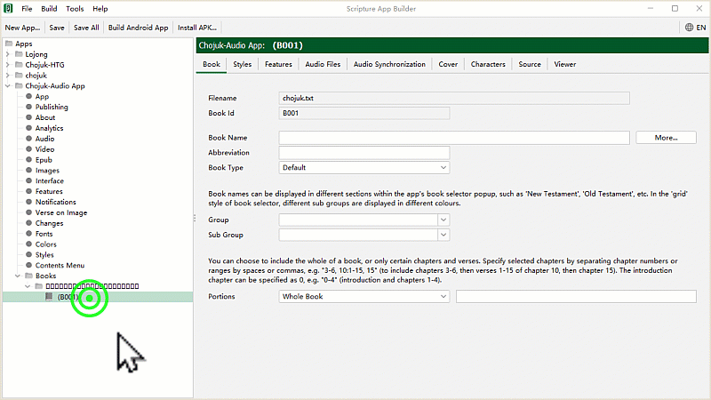
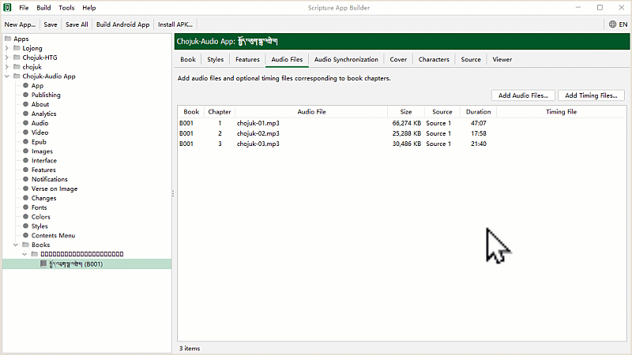
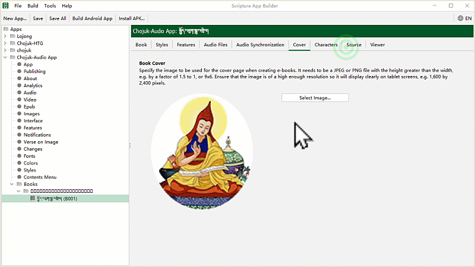
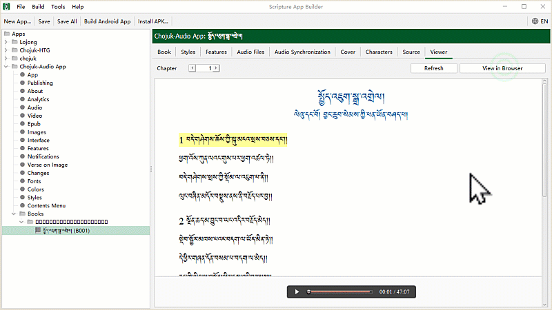
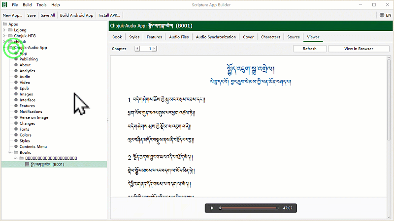
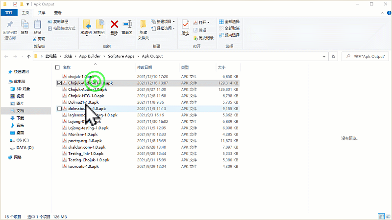

# སྒྲ་འགྲེལ་སྦྱར་མའི་དཔེ་ཚོགས་སྒྲིག་ཚུལ།

འདིར་གཙུག་ལག་མཉེན་ཆས་སྒྲིག་སྟེགས་(SAB)ནང་རྩ་བ་དང་སྒྲ་འགྲེལ་སྦྱར་མའི་མཉེན་ཆས་སྒྲིག་ཚུལ་གྱི་དཔེ་ཚོགས་སམ་ Book Collection དང་ Book དཔེ་ཆའི་རྩ་བ་དང་སྒྲ་འགྲེལ་སྒྲིག་ཚུལ་དང་། སྒྲ་མཚམས་བཅས་འཇོག་ཚུལ་ངོ་སྤྲོད་བྱས་ཡོད།
## མཉེན་ཆས་འདིའི་བཀོལ་སྤྱོད་ལམ་སྟོན་ཁག

རྩ་བ་དང་སྒྲ་འགྲེལ་མཉམ་སྦྱར་གྱི་མཉེན་ཆས་སྒྲིག་ཚུལ་ལ་རྩ་བའི་བཀོལ་སྤྱོད་ལམ་སྟོན་རིགས་མ་འདྲ་བ་གསུམ་ཙམ་ཡོད། མཉེན་ཆས་འདི་ལེགས་སྒྲིག་ཐུབ་པར་ལམ་སྟོན་དེ་དག་ལ་ཞིབ་བལྟ་བྱས་པས་མ་ཚད་ངེས་པར་དུ་བྱང་ཆུབ་དགོས།
- དང་བོ། [SAB ནང་རྩ་བ་དང་སྒྲ་འགྲེལ་མཉེན་ཆས་སྒྲིག་ཚུལ།](https://github.com/buda-base/budax/blob/master/howtoguides/SAB06/index.md#sab-%E0%BD%93%E0%BD%84%E0%BD%A2%E0%BE%A9%E0%BD%96%E0%BD%91%E0%BD%84%E0%BD%A6%E0%BE%92%E0%BE%B2%E0%BD%A0%E0%BD%82%E0%BE%B2%E0%BD%BA%E0%BD%A3%E0%BD%98%E0%BD%89%E0%BD%BA%E0%BD%93%E0%BD%86%E0%BD%A6%E0%BD%A6%E0%BE%92%E0%BE%B2%E0%BD%B2%E0%BD%82%E0%BD%9A%E0%BD%B4%E0%BD%A3) (མཚོན་རྟགས་སྒྲིག་ཚུལ།)
- གཉིས་པ། [Audacity ནང་སྒྲ་མཚམས་འཇོག་ཚུལ།](https://github.com/buda-base/budax/blob/master/howtoguides/SAB07/index.md#audacity%E0%BD%A6%E0%BE%92%E0%BE%B2%E0%BD%A6%E0%BE%92%E0%BE%B2%E0%BD%B2%E0%BD%82%E0%BD%98%E0%BD%89%E0%BD%BA%E0%BD%93%E0%BD%86%E0%BD%A6) (སྒྲ་མཚམས་རེའུ་མིག་དང་དེ་སྒྲིག་ཚུལ།)
- གསུམ་པ། སྒྲིག་སྟེགས་ནང་སྒྲ་འགྲེལ་སྦྱར་མའི་དཔེ་ཚོགས་སྒྲིག་ཚུལ། (དཔེ་ཚོགས་ལེན་སྟངས་དང་མིང་འདོགས་ཚུལ།)

## A. སྡེ་ཚན་དང་བོ། རྩ་ཚིག་གི་དཔེ་ཚོགས།

རྩ་བ་དང་སྒྲ་འགྲེལ་སྦྱར་མའི་མཉེན་ཆས་ལ་དཔེ་ཚོགས་སམ་Book Collection གཅིག་མ་གཏོགས་མི་དགོས། དེའི་རྩ་བ་དང་སྒྲ་འགྲེལ་གཉིས་མཉམ་འཇོག་བྱ་ཐུབ།

### A.༡ སྒྲིག་འགོད་བསྐྱར་ཞིབ།

རྩ་བ་དང་སྒྲ་འགྲེལ་སྦྱར་མའི་མཉེན་ཆས་གསར་བཟོའི་སྡེ་ཚན་གྱི་ཐོག་མའི་སྒྲོག་འགོད་ཁག་ལ་བསྐྱར་ལྟའི་དཔེ་མཚོན།

### A.༢ རྩ་བ་ལེན་སྟངས།

འདི་ནི་སྤྱིའི་དཔེ་ཚོགས་ཀྱི་མིང་བསྐྱར་འདོགས་དང་དེའི་ནང་མཚོན་རྟགས་མཉམ་འཇོག་གིས་རྩོམ་སྒྲིག་ཚད་ལྡན་བྱས་ཟིན་པའི་རྩ་བ་ལེན་སྟངས་ཀྱི་སྐོར་ཡིན།

### A.༣ སྒྲ་འགྲེལ་ལེན་སྟངས།

འདི་ནི་ད་ལྟ་བླངས་ཟིན་པའི་རྩ་བའི་Bookལ་མིང་འདོགས་སྟངས་དང་ད་སྔ་ནས་གྲ་སྒྲིག་བྱས་ཟིན་པའི་སྒྲ་འགྲེལ་དེ་ལེན་ཚུལ་ཡིན། གསལ་བཤད། ཁྱེད་ཀྱིས་བཟོ་བཞིན་པའི་མཉེན་ཆས་ནང་གཏུབ་ཟིན་སྒྲ་འགྲེལ་ལེའུ་ག་ཚོད་ཡོད་ཀྱང་ཚང་མ་སྡེབ་གཅིག་ལ་ལེན་ཆོག

### A.༤ སྒྲ་མཚམས་རེའུ་མིག་ལེན་ཚུལ།

འདི་ནི་ད་ལྟ་གྲ་སྒྲིག་བྱས་ཟིན་པའི་སྒྲ་མཚམས་རེའུ་མིག་ལེན་སྟངས་དང་འཕྲུལ་དེབ་ཀྱི་མདུན་ཤོག་འཇོག་སྟངས་གཉིས་ཀྱི་དཔེ་མཚོན་ཡིན།

## B. སྡེ་ཚན་གཉིས་པ། མཉེན་ཆས་སྔོན་ཚུད་བལྟ་ཞིབ།

འདི་ནི་ཁྱེད་ཀྱིས་སྒྲིག་བཞིན་པའི་མཉེན་ཆས་འབུལ་སྤྲོད་དངོས་སུ་མ་བྱས་པའི་སྔོན་དུ། གཙུག་ལག་མཉེན་ཆས་སྒྲིག་སྟེགས་SAB དང་དྲ་ཚིགས་གཉིས་ཀྱི་ནང་སྔོན་ལྟ་བྱ་བའི་སྡེ་ཚན་ཡིན།
 ### B.༡ སྒྲིག་སྟེགས་ནང་སྔོན་ཚུད་ལྟ་ཞིབ།

འདི་ནི་ཁྱེད་ཀྱིས་བཟོ་བཞིན་པའི་མཉེན་ཆས་དེ་གཙུག་ལག་མཉེན་ཆས་སྒྲིག་སྟེགས་རང་གི་ནང་རྩ་བ་དང་སྒྲ་འགྲེལ་སོགས་ཏག་ཏག་འགྲིག་ཡོད་མེད་སྔོན་ལྟ་བྱེད་ཚུལ་ཡིན། དང་བོའི་ནང་མཚོན་རྟགས་རྣམས་ཏག་ཏག་བཞག་ཡོད་མེད་བལྟ་ཐུབ། གཉིས་པའི་ནང་སྒྲ་དང་སྒྲ་རྟགས་སོགས་ཏག་ཏག་ཡོད་མེད་བལྟ་ཐུབ།

### B.༢ དྲ་ཚིགས་ནང་སྔོན་ཚུད་ལྟ་ཞིབ།

འདི་ནི་ཁྱེད་ཀྱིས་བཟོ་བཞིན་པའི་མཉེན་ཆས་དེ་དྲ་ཚིགས་ནང་རྩ་བ་དང་སྒྲ་འགྲེལ་སོགས་ཏག་ཏག་འགྲིག་ཡོད་མེད་སྔོན་ལྟ་བྱེད་ཚུལ་ཡིན།

## C. སྡེ་ཚན་གསུམ་པ། ཉར་ཚགས་དང་འབུལ་སྤྲོད།

འདི་ནི་ཁྱེད་ཀྱིས་སྒྲིག་སྟེགས་ནང་རྒྱུ་ཆ་ཡོངས་རྫོགས་ཚད་ལྡན་བསྒྲིགས་རྗེས་སྔོན་ལྟ་དང་ལེགས་བཅོས་སོགས་བྱས་རྗེས་མཉེན་ཆས་དེ་དངོས་སུ་འབུལ་སྤྲོད་བྱ་ཚུལ་གྱི་རིམ་པ་ཡིན།

### C.༡ མཉེན་ཆས་ཉར་ཚགས་དང་འབུལ་སྤྲོད།

འདི་ནི་མཉེན་ཆས་ཀྱི་རྒྱུ་ཆ་རྣམས་རང་རང་གི་སར་ཚད་ལྡན་བསྒྲིགས་རྗེས་དེ་དག་ཉར་ཚགས་དང་དངོས་སུ་འབུལ་སྤྲོད་བྱ་ཚུལ། དེ་བཞིན་བཟོས་ཟིན་པའི་མཉེན་ཆས་ཀྱི་APK ལ་བལྟ་ཚུལ་བཅས་ཡིན།

### C.༢ མཉེན་ཆས་APKབརྒྱུད་སྐུར།

APK ནི་ཁྱེད་ཀྱིས་བཟོས་ཟིན་པའི་མཉེན་ཆས་དེ་ཡིན་ཞིང་། འདི་ནི་སོ་སྔོན་པོ་དང་ཡང་ན་སྤྱི་ཚོགས་བརྒྱུད་ལམ་གང་ཡིན་ནང་བསྐུར་ཐུབ། དེ་ཨན་ཌོ་མ་ལག་ཅན་གྱི་ཁ་པར་དང་平板སོགས་གང་རུང་པབ་ལེན་བྱས་ཏེ་བཀོལ་ཆོག བརྒྱུད་སྐུར་བྱ་བའི་གོ་རིམ་ལ་གཟིགས།

☝️ སྒང་གི་དྲ་ཐག་ལ་བསྣུན་ཏེ་བཀོལ་སྤྱོད་ལམ་སྟོན་རྗེས་མ་རྣམས་ལ་གཟིགས། 

<iframe src="https://shimowendang.com/forms/cytvT6t9G9DhKHRJ/fill?channel=1" style="height:1050px;width:800px;"></iframe>

##  [教程目录 བཀོལ་སྤྱོད་ལམ་སྟོན་གྱི་དཀར་ཆག](https://github.com/buda-base/budax)