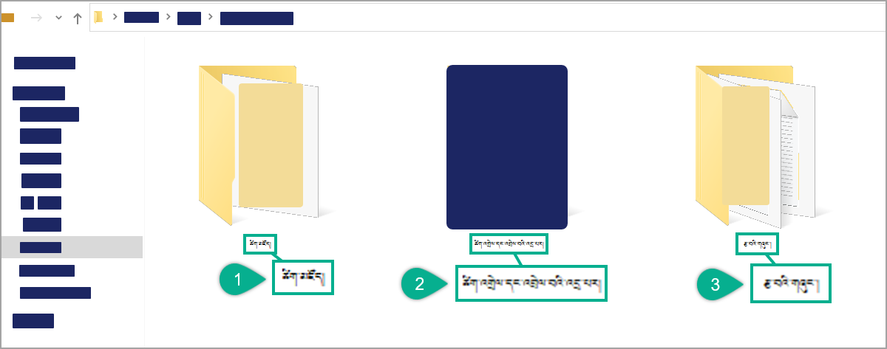
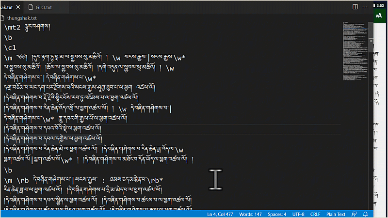
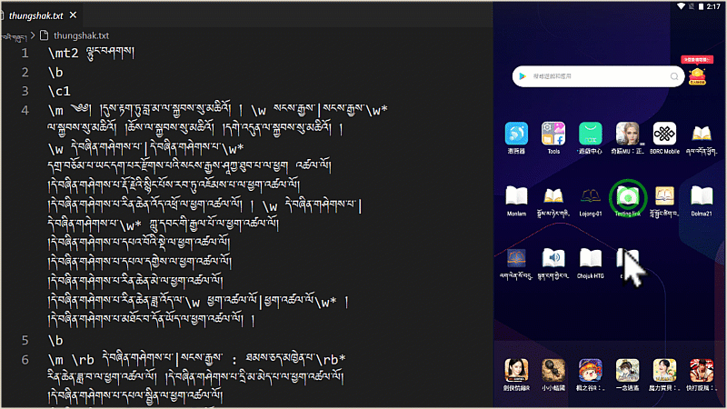

# SAB ནང་ཚིག་མཛོད་སྒྲིག་ཚུལ།

འདི་ནི་ཁྱེད་ཀྱིས་གཙུག་ལག་མཉེན་ཆས་སྒྲིག་སྟེགས་སམ་(SAB)ནང་མཉེན་ཆས་སྒྲིག་བཞིན་པའི་གཞུང་དེའི་ཐ་སྙད་གམིགས་བསལ་བ་དང་ཡང་ན་གོ་དཀའ་བའི་རིགས་ལ་ཐད་ཀར་ཚིག་འགྲེལ་འཇོག་སྟངས་དང་སྒྲིག་ཚུལ་གྱི་བཀོལ་སྤྱོད་ལམ་སྟོན་ཞིག་ཡིན། འདི་སྒྲིག་ཚུལ་ལ་ཡང་རིགས་མ་འདྲ་བ་འགའ་ཡོད་པས། རིམ་བཞིན་གཟིགས། འདིར་ལྟུང་བཤགས་དཔེ་རུ་བཟུང་ནས་ངོ་སྤྲོད་བྱས་ཡོད།

## རྒྱུ་ཆ་གྲ་སྒྲིག

གཙུག་ལག་མཉེན་ཆས་སྒྲིག་སྟེགས་སམ་(SAB)ནང་ཚིག་འགྲེལ་ལམ་ཚིག་མཛོད་སྒྲིག་པར་དགོས་ངེས་ཀྱི་གྲུབ་ཆ་ལ་ཐོག་མར་ཐུན་མོང་གི་ཡིག་སྣོད་ཅིག་བཟོས་ཏེ་དེའི་ནང་
- ཡིག་སྣོད་ཅིག་གི་ནང་སྒྲིག་བཞིན་པའི་གཞུང་། (ཡིག་རྐྱང་།)
- ཡིག་སྣོད་ཅིག་གི་ནང་ཚིག་མཛོད་བསྒྲིག་སའི་ཤོག་ངོས་ཤིག 
- ཡིག་སྣོད་ཅིག་གི་ནང་ཚིག་འགྲེལ་དང་འབྲེལ་བའི་འདྲ་པར་ཁག

ཐུན་མོང་གི་ཡིག་སྣོད་ཅིག་གི་ནང་རྒྱུ་ཆ་རྣམས་གྲ་སྒྲིག་བྱས་ཡོད་པའི་རྣམ་པ།

## ཚིག་མཛོད་ཀྱི་ངོ་སྤྲོད།

འདིར་ཚིག་མཛོད་ཟེར་བ་ནི་གཞུང་དེའི་དམིགས་བསལ་ཐ་སྙད་དང་གོ་དཀའ་བའི་རིགས་ཀྱི་ཚིག་འགྲེལ་རྣམས་མཉམ་འཇོག་བྱ་སའི་ཤོག་ངོས་དེ་ལ་ཟེར། ཚིག་འགྲེལ་ཡོངས་རྫོགས་མཚོན་རྟགས་རྣམས་མཉམ་བསྒྲིགས་བྱས་ཏེ་མཉེན་ཆས་ནང་ལོགས་སུ་ནང་འཇུག་བྱ་དགོས། ཚིག་མཛོད་དང་ཚིག་འགྲེལ་མཛོད་གཉིས་དོན་གཅིག་ཡིན།

## A. སྦྲེལ་ཐག་ངོ་སྤྲོད།

འདི་ནི་གཞུང་དེའི་ཚིག་འགྲེལ་དགོས་སའི་ཐ་སྙད་དང་དེའི་ཚིག་འགྲེལ་རྣམས་ཕན་ཚུན་མཐུད་བྱེད་ཀྱི་མཚོན་རྟགས་རྣམས་ཀྱི་ངོ་སྤྲོད་ཅིག་ཡིན། ནན་བཤད་ཞུ་རྒྱུར། མཚོན་རྟགས་རིགས་བཀོལ་སྐབས་རེ་རེའི་བར་སྟོང་དང་ཚེག་འཇོག་སྟངས་སོགས་ལ་གཟབ་ནན་བྱ་དགོས། ཅུང་ཙམ་ནོར་ན་འདིའི་རིགས་ཀྱི་བྱེད་ནུས་འདོན་མི་ཐུབ།

དང་བོ། མཉེན་ཆས་བཟོ་སའི་གཞུང་ལུགས་རང་གི་ནང་མཚོན་རྟགས་རྣམས་བཀོལ་ཏེ་རྩོམ་སྒྲིག་བྱ་ཚུལ་ངོ་སྤྲོད།
- \mt2 ལྟུང་བཤགས།: མཉེན་ཆས་བཟོ་སའི་གཞུང་གི་མཚན་བྱང་།
- \b ཚིག་གྲུབ་ཀྱི་གོང་འོག་གི་བར་སྟོང་དབྱེ་ཆས།
- \c ལེའུའི་མཚོན་རྟགས།
- \c1 ལེའུ་དང་བོ་ལྟ་བུ།
- \m མཚོན་རྟགས་འཇོག་སའི་ཚིག་གྲུབ་རེ་རེའི་མགོར་འཇོག་དགོས། སྤྱིར་བཏང་གི་ཚིག་གྲུབ་ཁག་ལ་མི་དགོས།

### 1. གཞུང་གི་ཐ་སྙད་དེའི་མགོ་གཞུག་ལ་སྒྲིག་ཚུལ།

དང་བོ། གཞུང་དེའི་ཚིག་འགྲེལ་འཇོག་སའི་ཐ་སྙད་དེའི་མགོ་གཞུག་གཉིས་ལ་མཚོན་རྟགས་འཇོག་ཚུལ་ནི་
1. མཚོན་རྟགས་ནི་ \w ….. \w*
    1. རྣམ་སྒྲིག་ word ཡིག་ཆ་ཡིན་ན་ \w ….. \w*
    2. རྣམ་སྒྲིག་གཞན་ཡིན་ན་ \w …|.. \w* དཀྱིལ་ལ་(|) འདི་འཇུག་དགོས།
2. བཞག་ཟིན་པའི་དཔེ་མཚོན་ནི་ \w སངས་རྒྱས་|སངས་རྒྱས་"\w* ལ་སྐྱབས་སུ་མཆིའོ།།

### 2. ཚིག་འགྲེལ་མཛོད་སྒྲིག་ཚུལ།

གཉིས་པ། ཚིག་འགྲེལ་མཛོད་རྩོམ་སྒྲིག་སྐབས་བཀོལ་བྱའི་མཚོན་རྟགས་ངོ་སྤྲོད། 
- \id GLO ཚིག་འགྲེལ་མཛོད་ཀྱི་དབུ་རུ་འདི་ངེས་པར་འཇོག་དགོས།
- \toc2 ཚིག་མཛོད། བརྗོད་གཞིའི་མིང་།
- \c ལེའུའི་མཚོན་རྟགས།
- \p ཚིག་འགྲེལ་རེ་རེའི་དབུ་རུ་འདི་ངེས་པར་འཇོག་དགོས།
- \k……\k* ཐ་སྙད་ཀྱི་མགོ་གཞུག་གཉིས་སུ་འཇོག་དགོས།
- དཔེར་ན། \p \k སངས་རྒྱས་\k* ནི་དེ་བཞིན་གཤེགས་པའོ།།  
གཞུང་རང་དང་ཚིག་མཛོད་ཀྱི་ཡིག་ཆ་གཉིས་ཀྱི་ནང་མཚོན་རྟགས་རྣམས་མ་ནོར་བསྒྲིགས་ན་མཉེན་ཆས་ཀྱིས་ཐད་ཀར་དེ་གཉིས་ཕན་ཚུན་མཐུད་ཡོང་བ་ཡིན།

### 3. ཚིག་འགྲེལ་ནང་འདྲ་པར་སྒྲིག་ཚུལ།

གསུམ་པ། ཚིག་འགྲེལ་དང་མཉམ་དུ་དེ་འབྲེལ་གྱི་འདྲ་པར་ཡང་འཇོག་ཐུབ། འདྲ་པར་གྱི་Formatའམ་རྣམ་སྒྲིག་ནི་ JPEG དང་ཡང་ན png གཉིས་ཀྱི་གང་རུང་ཡིན་དགོས། ཚིག་འབྲེལ་གྱི་མཇུག་དེ་མ་ཐག་ལ་འདྲ་པར་གྱི་མཚོན་རྟགས་ཞོག
1. མཚོན་རྟགས་ནི་ \fig…. \fig*: འཇོག་སྟངས་རིགས་འགའ་ཡོད་པས་གང་བདེ་འདེམ་ཆོག
    1. \fig |picture1.jpg||||འདིར་པར་འགྲེལ་ཞོག|5:3\fig*
    2. \fig |picture2.tif||||This is another picture|\fig*
    3. \fig |picture3.jpg|||||\fig*
    4. \fig |image12.png||||image13.png|\fig* པར་གཉིས་མཉམ་དུ་འཇོག་ཚུལ།
འདི་དག་གི་གང་བཞག་རུང་འགྲིག་པ་ཡིན།

རྩོམ་སྒྲིག་བྱེད་བཞིན་པ་དང་ཁ་པར་ནང་དངོས་སུ་འཆར་ཡོད་པའི་དཔེ་མཚོན།

### 4. ཚིག་འགྲེལ་འཇོག་ཚུལ་གཞན།

བཞི་བ། ཚིག་འགྲེལ་འཇོག་ཚུལ་འདི་ནི་གོང་གི་དེ་དང་ཅུང་མི་འདྲ་སྟེ། ཐ་སྙད་དེའི་ཚིག་འགྲེལ་ཐད་ཀར་ཐ་སྙད་དེའི་སྒང་ལ་འཆར་ཡོང་བའི་ཐབས་ལམ་ཞིག་ཡིན། འདི་འཇོག་ཚུལ་སྒང་དང་མི་མཚུངས་ཏེ། ཚིག་མཛོད་ཀྱི་ཤོག་ངོས་ནང་སྒྲིག་མི་དགོར་པར་ཐད་ཀར་གཞུང་རང་གི་ནང་སྒྲིག་ཆོག  
འཇོག་ཚུལ་དང་དཔེ་མཚོན་ལ་གཟིགས།
- མཚོན་རྟགས་ནི་་\rb..|..\rb*
- དཔེར་ན། \rb དེ་བཞིན་གཤེགས་པ|སངས་རྒྱས་ཀྱི་མཚན་གཞན་\rb*
- ཚིག་གྲུབ་ཆ་ཚང་གི་དཔེ་ \p \rb དེ་བཞིན་གཤེགས་པ|སངས་རྒྱས་ཀྱི་མཚན་གཞན་\rb* ་ཙན་དན་དཔལ་ལ་ཕྱག་འཚལ་ལོ། །

## B. མཉེན་ཆས་ནང་ཚིག་འགྲེལ་མཛོད་འཇོག་ཚུལ།

སྤྱིར་བཏང་ཚིག་མཛོད་ནི་མཉེན་ཆས་གང་ཡིན་ལ་འཇོག་ཆོག་པ་ཞིག་ལས་འདི་ལ་དམིགས་བསལ་གྱིས་མཉེན་ཆས་ལོགས་སུ་བཟོ་མི་དགོས། གོང་ཞུས་ལྟར་ཚིག་འགྲེལ་མཛོད་གྱི་ཡིག་ཆ་དེ་མཉེན་ཆས་ཤིག་གི་དཔེ་ཚོགས་ཀྱི་དཔེ་ཆའམ་Book གཅིག་གི་ངོ་བོར་འཇོག་དགོས། འཇོག་སྟངས་གཤམ་ལ་གཟིགས།

མཉེན་ཆས་སྒྲིག་སྟེགས་ནང་ཁྱད་ཆོས་སྒྲིག་སྟངས་མང་ཆེ་བ་གཞན་དག་དང་གཅིག་གྱུར་ཡིན་མོད། ཚིག་མཛོད་དེ་ཁ་པར་མཉེན་ཆས་ནང་དཔེ་ཆ་གཅིག་གི་ངོ་བོར་འཆར་མི་དགོས་ན་འདི་ལ་སྒྲིག་འགོད་ཀྱི་འགྲིག་རྟགས་ལེན་དགོས། གཤམ་ལ་གཟིགས།

## C. ཁ་པར་ནང་ཚིག་མཛོད་སྒྲིག་སྦྱོར།

མཉེན་ཆས་བཟོས་རྗེས་ཁ་པར་ནང་ནས་ཀྱང་ཚིག་མཛོད་དེ་འཆར་དགོས་དང་མི་དགོས་བརྗེ་ཆོག དེ་བཞིན་མཉེན་ཆས་ཀྱི་སྐད་ཡིག་བརྗེ་ཚུལ་ཡང་འདི་ནས་ངོ་སྤྲོད་བྱས་ཡོད་པས་རིམ་པར་གཟིགས།

👉 འབྲེལ་ཡོད་ཀྱི་བཀོལ་སྤྱོད་ལམ་སྟོན་གཞན་རྣམས་ལ་གཟིགས། 

<iframe src="https://shimowendang.com/forms/cytvT6t9G9DhKHRJ/fill?channel=1" style="height:1050px;width:800px;"></iframe>

##  [教程目录 བཀོལ་སྤྱོད་ལམ་སྟོན་གྱི་དཀར་ཆག](https://github.com/buda-base/budax)