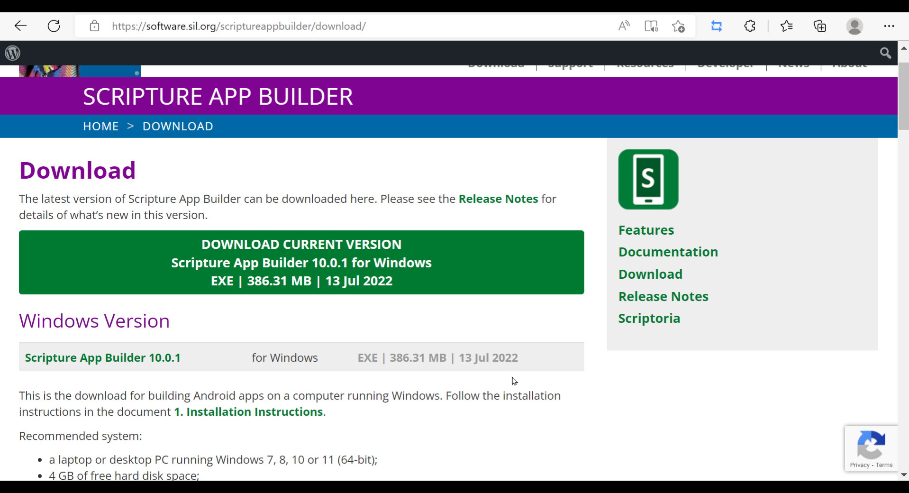
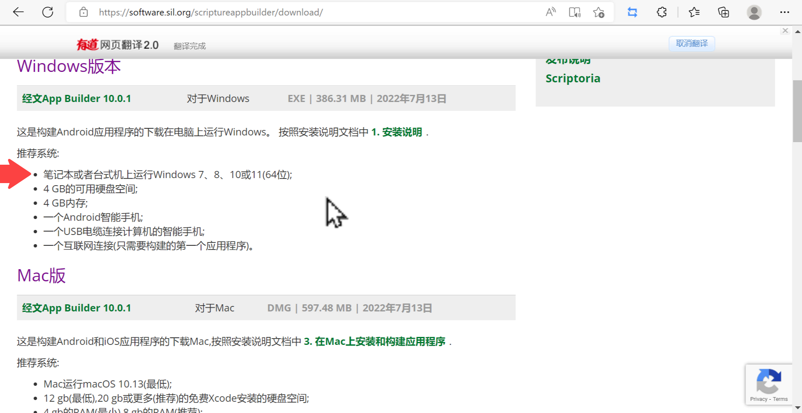
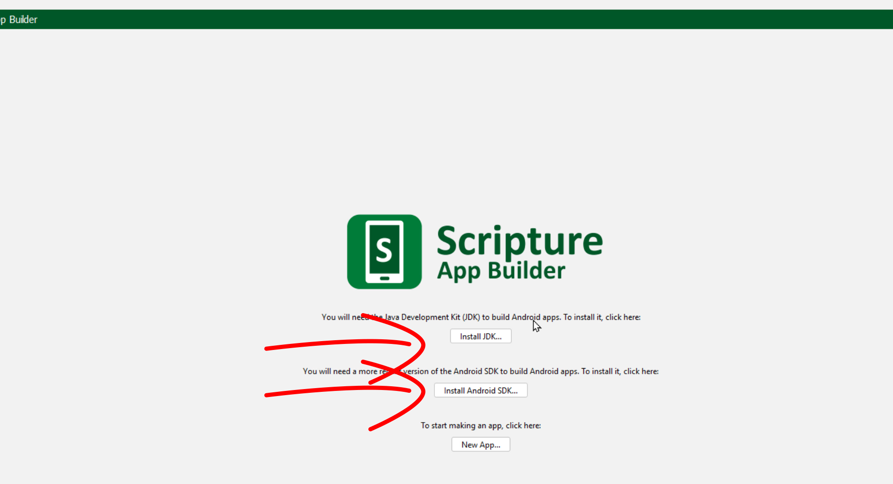
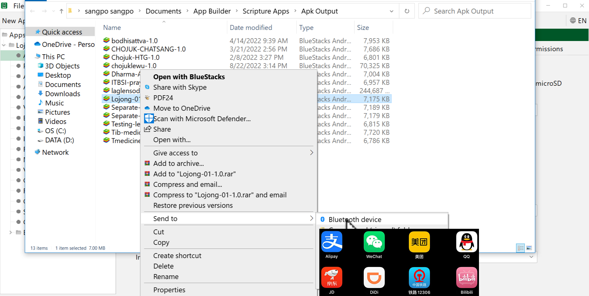

# གཙུག་ལག་མཉེན་ཆས་ཕབ་ལེན་དང་འཇུག་སྤྲོད།

འདི་ནི་གཙུག་ལག་མཉེན་ཆས་སྒྲིག་སྟེགས་ཏེ་ Scripture App Builder (SAB)(V 10.0.1) སྒེའུ་ཁུང་རྟགས་ཅན་གྱི་གློག་ཀླད་ནང་ཕབ་ལེན་དང་འཇུག་སྤྲོད་བྱ་ཚུལ་སྤྱི་དང་། བྱེ་བྲག་མཉེན་ཆས་འདིའི་རམ་འདེགས་མཉེན་ཆས་JDKདང་SDKཕབ་ལེན་བྱ་ཚུལ་རྣམས་ངོ་སྤྲོད་བྱས་ཡོད། ཞིབ་ཕྲ་གཤམ་ལ་གཟིགས།

## 📩 ཕབ་ལེན་དྲ་ཚིགས།

ཕབ་ལེན་བྱ་ཡུལ་གྱི་དྲ་ཐག [དྲ་ཐག་འདི](https://software.sil.org/scriptureappbuilder/download/)འི་སྟེང་བསྣུན་ན་ཐད་ཀར་ཕབ་ལེན་བྱ་ཡུལ་གྱི་དྲ་ཚིགས་ནང་འཛུལ་འགྲོ་བ་ཡིན། ཡང་ན་（download scriptureappbuilder）འདི་ལྟར་བྲིས་ཏེ་བཙལ་རུང་རྙེད་ཐུབ།

## ནང་དོན་གྱི་སྡེ་ཚན།

- 👉 མཉེན་ཆས་ཕབ་ལེན་དང་འཇུག་སྤྲོད།
- 👉 རམ་འདེགས་མཉེན་ཆས་གཉིས་ཕབ་ལེན།
- 👉 བཟོས་ཟིན་པའི་མཉེན་ཆས་ཕབ་ལེན་དང་ཚོད་ལྟ།

## ཚོད་ལྟའི་དྲི་བ།

ཚོད་ལྟའི་དྲི་བ་རྣམས་ལ་ལན་རེ་ངེས་པར་དུ་འདེམ་རོགས། དེ་དག་ཐོག་མ་ནས་ཤེས་དགོས་པའི་ངེས་པ་མེད་པས་གང་རུང་ཞིག་འདེམ་ཆོག

1. SAB མཉེན་ཆས་ཕབ་ལེན་བྱེད་པར་གློག་ཀླད་ཀྱི་ཤོང་ཚད་ག་ཚོད་ཡོད་དགོས། 2GB༽3GB༽4GB༽ (正确回答)
2. དབབ་བྱའི་རམ་འདེགས་མཉེན་ཆས་གཉིས་གང་ན་ཡོད་དམ། New App༽Build Android App༽ སྒྲིག་སྟེགས་ཀྱི་མདུན་ངོས་སུ་ཡོད།༽ (正确回答)
3. ཚོད་ལྟ་བྱེད་པར་བཟོས་ཟིན་པའི་མཉེན་ཆས་ཀྱི་ཡིག་ཆ་གང་ལེན་དགོས། ཆ་ཚང་།༽_data༽.appDef༽ (正确回答)

## 1. མཉེན་ཆས་ཕབ་ལེན་དང་འཇུག་སྤྲོད།

འདིར་གཙུག་ལག་མཉེན་ཆས་ཕབ་ལེན་དང་འཇུག་སྤྲོད་བྱ་ཚུལ་གྱི་རིམ་པ་ཁག་ངོ་སྤྲོད་བྱས་ཡོད།

🗣️ **དང་བོ།** ཕབ་ལེན་དྲ་ཚིགས་འཚོལ་ཞིབ་བྱ་ཚུལ།

👇 དེ་ཇི་ལྟར་བྱ་ཚུལ་ལ་གཟིགས།

- སློབ་ཚན་གྱི་བརྙན། [དྲ་ཐག་འདིར་སྣུན།](https://drive.google.com/file/d/1v9_kZvH0En2Mx2tx8v9Wxv3Yp8Wzmzpa/view?usp=sharing)

🗣️ **གཉིས་པ།** ཆ་རྐྱེན་ངོ་སྤྲོད་དང་འཇུག་སྤྲོད་བྱ་ཚུལ།

- སློབ་ཚན་གྱི་བརྙན། [དྲ་ཐག་འདིར་སྣུན།](https://drive.google.com/file/d/1Y2DREJgGwB90fUbVhpvaBG0-lbgsWqbG/view?usp=sharing)

1. དྲི་བ། SAB མཉེན་ཆས་ཕབ་ལེན་བྱེད་པར་གློག་ཀླད་ཀྱི་ཤོང་ཚད་ག་ཚོད་ཡོད་དགོས།  
4GB༽ (正确回答) 3GB༽ 2GB༽
## 2. རམ་འདེགས་མཉེན་ཆས་གཉིས་ཕབ་ལེན།

འདིར་རམ་འདེགས་མཉེན་ཆས་JDKདང་SDKགཉིས་ཕབ་ལེན་བྱ་ཚུལ་ངོ་སྤྲོད་བྱས་ཡོད།

👇 དེ་ཇི་ལྟར་བྱ་ཚུལ་ལ་གཟིགས།

- སློབ་ཚན་གྱི་བརྙན། [དྲ་ཐག་འདིར་སྣུན།](https://drive.google.com/file/d/1NzR2r1FhJ_5vMgFMZGhgdCaON1XMQRbf/view?usp=sharing)

2. དྲི་བ། དབབ་བྱའི་རམ་འདེགས་མཉེན་ཆས་གཉིས་གང་ན་ཡོད་དམ།  
New App༽ མཉེན་ཆས་ཀྱི་འཆོར་ངོས་སུ་ཡོད།༽ (正确回答) Build Android App༽

## 3. བཟོས་ཟིན་པའི་མཉེན་ཆས་ཕབ་ལེན་དང་ཚོད་ལྟ།

SAB གཙུག་ལག་མཉེན་ཆས་ཕབ་ལེན་དང་རམ་འདེགས་སོགས་ཆ་ཚང་ཡོད་མེད་བལྟ་ཕྱིར། ད་སྔ་བཟོས་ཟིན་པའི་མཉེན་ཆས་[Github དྲ་ཐག་](https://github.com/tadhondup/Lojong-001.git) དང་ [微云 དྲ་ཐག་](https://share.weiyun.com/KujPqi7U)འདི་གཉིས་ཀྱི་གང་རུང་ནས་ཕབ་ལེན་བྱས་ཏེ་ཚོད་ལྟ་བྱ་ཚུལ་ངོ་སྤྲོད་བྱས་ཡོད།

🗣️ **དང་བོ།** བཟོས་ཟིན་པའི་མཉེན་ཆས་ཕབ་ལེན་དང་SABམཉེན་ཆས་ནང་དེ་ཚོད་ལྟ་བྱ་ཚུལ།

👇 དེ་ཇི་ལྟར་བྱ་ཚུལ་ལ་གཟིགས།

 

- སློབ་ཚན་གྱི་བརྙན། [དྲ་ཐག་འདིར་སྣུན།](https://drive.google.com/file/d/17-mEXb6dvG-KJbasmD2O0ueUOvydCE-1/view?usp=sharing)

3. དྲི་བ། ཚོད་ལྟ་བྱེད་པར་བཟོས་ཟིན་པའི་མཉེན་ཆས་ཀྱི་ཡིག་ཆ་གང་ལེན་དགོས། ཡིག་ཆ་ཆ་ཚང་།༽_data༽.appDef༽ (正确回答)

🗣️ **གཉིས་པ།** ད་ལྟ་རང་གསར་བཟོ་བྱས་པའི་མཉེན་ཆས་APK འཚོལ་སྟངས།

👇 དེ་ཇི་ལྟར་བྱ་ཚུལ་ལ་གཟིགས།

 

- སློབ་ཚན་གྱི་བརྙན། [དྲ་ཐག་འདིར་སྣུན།](https://drive.google.com/file/d/1oPtWHsVhzdLDbFVer2MJQI_OwgGJwZeh/view?usp=sharing)
