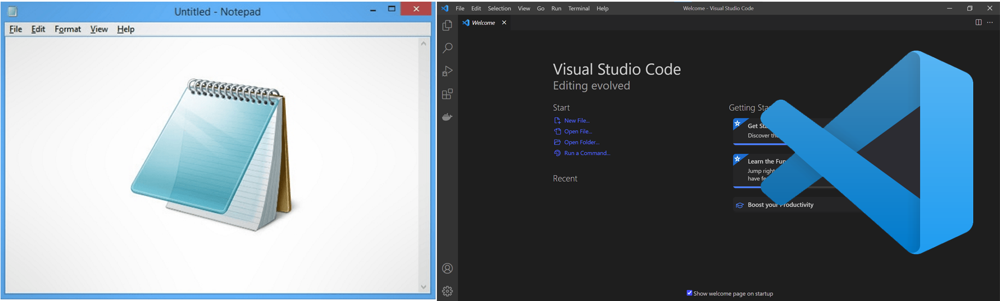
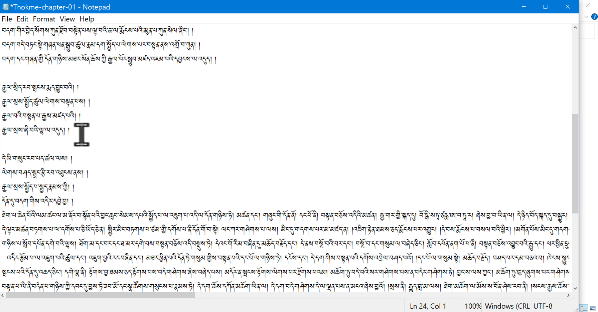
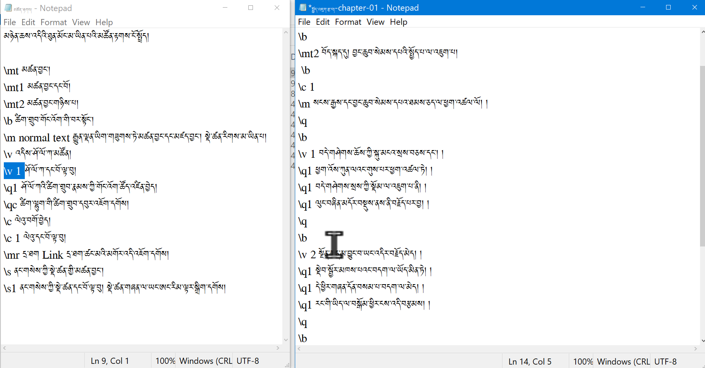
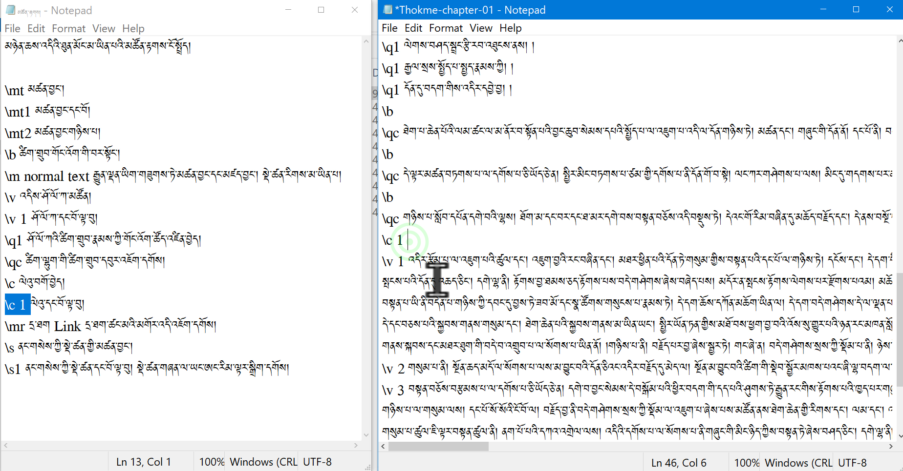

# རྩ་འགྲེལ་གཉིས་ཀྱི་ནང་མཚོན་རྟགས་སྒྲིག་ཚུལ།2\4

SABཡི་དམིགས་བསལ་མཚོན་རྟགས་རྣམས་རྩ་འགྲེལ་གཉིས་ཀྱི་ནང་སྒྲིག་ཚུལ་ངོ་སྤྲོད་བྱས་ཡོད།
## རྩ་འགྲེལ་མཉམ་སྦྱོར་མཉེན་ཆས་ཀྱི་གྲུབ་ཆ་ཁག

རྩ་འགྲེལ་སྦྱར་མའི་མཉེན་ཆས་བསྒྲིག་པ་ལ་གཤམ་བཀོད་ཀྱི་སློབ་ཚན་ཁག་ལ་ངེས་ཆ་དང་བྱང་ཆ་ལྡན་དགོས་སོ།།

1. [རྩ་འགྲེལ་མཉམ་སྦྱར་མཉེན་ཆས་ངོ་སྤྲོད།](https://github.com/buda-base/budax/blob/master/howtoguides/SAB14/index.md)
2. རྩ་འགྲེལ་གཉིས་ཀྱི་ནང་མཚོན་རྟགས་སྒྲིག་ཚུལ།
3. [མཉེན་ཆས་ནང་རྩ་འགྲེལ་དཔེ་ཆ་འཇོག་ཚུལ།]()
4. [APKདང་འདྲ་པར་འཇོག་ཚུལ།]()

## སློབ་ཚན་འདིའི་ནང་དོན་གྱི་སྡེ་ཚན།

- 👉 རྩ་འགྲེལ་ནང་དོན་གྱི་མཚམས་ཐོ་གཏུག་ཚུལ།
- 👉 རྩ་བའི་ནང་མཚོན་རྟགས་སྒྲིག་ཚུལ།
- 👉 འགྲེལ་བའི་ནང་མཚོན་རྟགས་སྒྲིག་ཚུལ།

## ཚོད་ལྟའི་དྲི་བ།

ཚོད་ལྟའི་དྲི་བ་རྣམས་ལ་ལན་རེ་ངེས་པར་དུ་འདེམ་རོགས། དེ་དག་ཐོག་མ་ནས་ཤེས་དགོས་པའི་ངེས་པ་མེད་པས་གང་རུང་ཞིག་འདེམ་ཆོག

1. རྩ་བ་ལྟར་འགྲེལ་བའི་མཚམས་དབྱེ་སྐབས་མཚོན་རྟཊ་གང་འཇོག་དགོས། \qc༽ \m༽ \v༽ (正确回答)
2. ལེའུ་ཐ་མའི་ཤོ་ལོ་ཀའི་ཨང་གི་གོ་རིམ་དེ་ལེའུ་སྔ་མའི་ཤོ་ལོ་ཀའི་འཕྲོ་ཡིན་དགོས་སམ། མི་ཤེས།༽ མི་དགོས།༽ དགོས།༽ (正确回答)
3. འགྲེལ་བའི་ནང་ཚིག་གྲུབ་ཀྱི་གོང་འོག་དབྱེ་བྱེད་ལ་གང་སྣོན་དགོས་སམ། \q༽ \b༽ \qc༽ (正确回答)

## གསལ་འདེབས་ཤིག

SABཡིས་ངོས་ལེན་བྱེད་པའི་ཡིག་ཆ་རྩོམ་སྒྲིག་བྱེད་སའི་མཉེན་ཆས་ནི།

1. Notepad
2. Visual Studio Code (VS Code)

## 1. རྩ་འགྲེལ་ནང་དོན་གྱི་མཚམས་ཐོ་གཏུག་ཚུལ།

རྩ་བ་དང་འགྲེལ་བ་གཉིས་ཀྱི་ནང་དོན་གྱི་མཚམས་ཕན་ཚུན་ཐོ་གཏུགས་ཏེ་རྩོམ་སྒྲིག་བྱ་ཚུལ་ངོ་སྤྲོད་བྱས་ཡོད།

👇 དེ་ཅི་ལྟར་བྱ་ཚུལ་ལ་གཟིགས།

- སློབ་ཚན་གྱི་བརྙན། [དྲ་ཐག་འདིར་སྣུན།](https://drive.google.com/file/d/1IAq3LzmUhNJL4O1xX_Vuo9QAY1bmwr99/view?usp=sharing)

1. དྲི་བ། རྩ་བ་ལྟར་འགྲེལ་བའི་མཚམས་དབྱེ་སྐབས་མཚོན་རྟཊ་གང་འཇོག་དགོས།  
\v༽ (正确回答) \m༽ \qc༽

## 2. རྩ་བའི་ནང་མཚོན་རྟགས་སྒྲིག་ཚུལ།

རྩ་བའི་ནང་དགོས་ངེས་ཀྱི་མཚོན་རྟགས་རྣམས་འཇོག་ཚུལ་ངོ་སྤྲོད་བྱས་ཡོད།

👇 དེ་ཅི་ལྟར་བྱ་ཚུལ་ལ་གཟིགས།

- སློབ་ཚན་གྱི་བརྙན། [དྲ་ཐག་འདིར་སྣུན།](https://drive.google.com/file/d/1aj8uZBlJyiIZSFOy4MU6VY9e-Bst7iL-/view?usp=sharing)

2. དྲི་བ། ལེའུ་ཐ་མའི་ཤོ་ལོ་ཀའི་ཨང་གི་གོ་རིམ་དེ་ལེའུ་སྔ་མའི་ཤོ་ལོ་ཀའི་འཕྲོ་ཡིན་དགོས་སམ།   མི་དགོས།༽ དགོས།༽ (正确回答) མི་ཤེས།༽

## 3. འགྲེལ་བའི་ནང་མཚོན་རྟགས་སྒྲིག་ཚུལ།

འགྲེལ་བའི་ནང་དགོས་ངེས་ཀྱི་མཚོན་རྟགས་རྣམས་རྩ་བ་དང་མཐུན་པར་འཇོག་ཚུལ་ངོ་སྤྲོད་བྱས་ཡོད།

👇 དེ་ཅི་ལྟར་བྱ་ཚུལ་ལ་གཟིགས།

 

- སློབ་ཚན་གྱི་བརྙན། [དྲ་ཐག་འདིར་སྣུན།](https://drive.google.com/file/d/1_lBLzQ2MlyetreY1cT0_qs-jet7QIpGn/view?usp=sharing)

3. དྲི་བ། འགྲེལ་བའི་ནང་ཚིག་གྲུབ་ཀྱི་གོང་འོག་དབྱེ་བྱེད་ལ་གང་སྣོན་དགོས་སམ།  
\q༽ \b༽ \qc༽ (正确回答)

