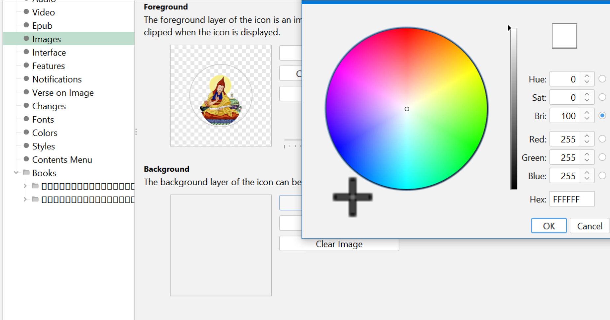
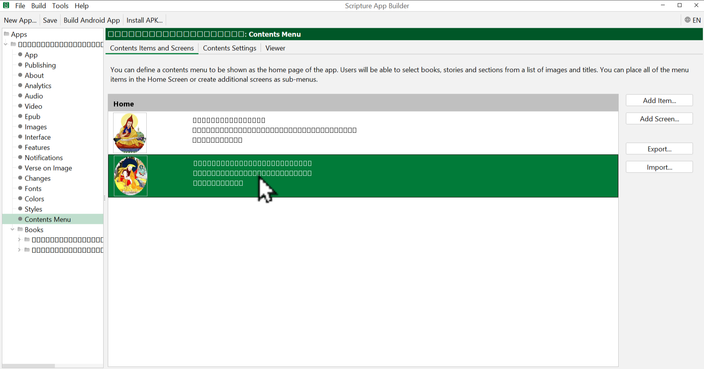
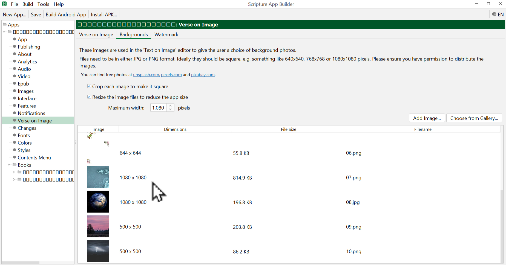
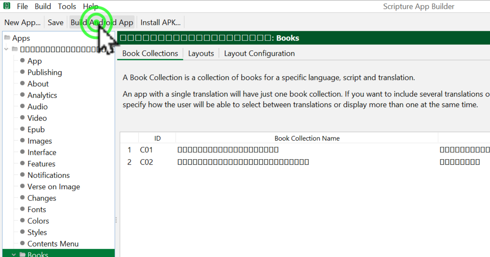

# APKདང་འདྲ་པར་འཇོག་ཚུལ།

འདིར་མཉེན་ཆས་ནང་འབྲེལ་ཡོད་འདྲ་པར་འཇོག་ཚུལ་དང་ཉར་ཚགས། APKདངོས་སུ་བཟོ་ཚུལ་སོགས་ངོ་སྤྲོད་བྱས་ཡོད།
## རྩ་འགྲེལ་མཉམ་སྦྱོར་མཉེན་ཆས་ཀྱི་གྲུབ་ཆ་ཁག

རྩ་འགྲེལ་སྦྱར་མའི་མཉེན་ཆས་བསྒྲིག་པ་ལ་གཤམ་བཀོད་ཀྱི་སློབ་ཚན་ཁག་ལ་ངེས་ཆ་དང་བྱང་ཆ་ལྡན་དགོས་སོ།།

1. [རྩ་འགྲེལ་མཉམ་སྦྱར་མཉེན་ཆས་ངོ་སྤྲོད།](https://github.com/buda-base/budax/blob/master/howtoguides/SAB14/index.md)
2. [རྩ་འགྲེལ་གཉིས་ཀྱི་ནང་མཚོན་རྟགས་སྒྲིག་ཚུལ།](https://github.com/buda-base/budax/blob/master/howtoguides/SAB15/index.md)
3. [མཉེན་ཆས་ནང་རྩ་འགྲེལ་དཔེ་ཆ་འཇོག་ཚུལ།](https://github.com/buda-base/budax/blob/master/howtoguides/SAB16/index.md)
4. APKདང་འདྲ་པར་འཇོག་ཚུལ།

## ནང་དོན་གྱི་སྡེ་ཚན།

- 👉 སྡེ་ཚན་ཁག་ལ་འདྲ་པར་འཇོག་ཚུལ།
- 👉 དཀར་ཆག་གི་འདྲ་པར་འཇོག་ཚུལ།
- 👉 APKདང་མཉེན་ཆས་ལྟ་ལེན་བྱ་ཚུལ།

## ཚོད་ལྟའི་དྲི་བ།

ཚོད་ལྟའི་དྲི་བ་རྣམས་ལ་ལན་རེ་ངེས་པར་དུ་འདེམ་རོགས། དེ་དག་ཐོག་མ་ནས་ཤེས་དགོས་པའི་ངེས་པ་མེད་པས་གང་རུང་ཞིག་འདེམ་ཆོག

1. འདིའི་སྐོར་ཟེར་བའི་ནང་གི་འདྲ་པར་གང་ལ་འཇོག་དགོས། Android Icon༽ Navigation Drawer༽ Illustrations༽ (正确回答)
2. དཀར་ཆག་གི་འདྲ་པར་འཇོག་པ་ལ་ཚན་པ་གང་གི་ནང་འགྲོ་དགོས། Import༽ Add Screen༽ Add Items༽ (正确回答)
3. APKདངོས་སུ་བཟོ་བར་གང་གནོན་དགོས་སམ། New App༽ Install APK༽ Build Android App༽ (正确回答)

## 1. སྡེ་ཚན་ཁག་ལ་འདྲ་པར་འཇོག་ཚུལ།

👇 དེ་ཅི་ལྟར་བྱ་ཚུལ་ལ་གཟིགས།

- སློབ་ཚན་གྱི་བརྙན། [དྲ་ཐག་འདིར་སྣུན།](https://drive.google.com/file/d/1q4tCoTtuVvAh3NuksRfW66h-2IRVs8t1/view?usp=sharing)

1. དྲི་བ། འདིའི་སྐོར་ཟེར་བའི་ནང་གི་འདྲ་པར་གང་ལ་འཇོག་དགོས།  
Illustrations༽ (正确回答) Navigation Drawer༽ Android Icon༽

## 2. དཀར་ཆག་གི་འདྲ་པར་འཇོག་ཚུལ།

### 2.1 ཤོ་ལོ་ཀའི་འདྲ་པར་འཇོག་ཚུལ།

👇 དེ་ཅི་ལྟར་བྱ་ཚུལ་ལ་གཟིགས།

- སློབ་ཚན་གྱི་བརྙན། [དྲ་ཐག་འདིར་སྣུན།](https://drive.google.com/file/d/1mrp0-1Ys8zlLx4Q7xof5DYpmnQJB7ATo/view?usp=sharing)

### 2.2 དཀར་ཆག་གི་འདྲ་པར་འཇོག་ཚུལ།

👇 དེ་ཅི་ལྟར་བྱ་ཚུལ་ལ་གཟིགས།

- སློབ་ཚན་གྱི་བརྙན། [དྲ་ཐག་འདིར་སྣུན།](https://drive.google.com/file/d/1f47CFW5k6kXKlRqtn-eIWEVPXX9XXnUk/view?usp=sharing)

2. དྲི་བ། དཀར་ཆག་གི་འདྲ་པར་འཇོག་པ་ལ་ཚན་པ་གང་གི་ནང་འགྲོ་དགོས།  
Add Screen༽ Add Items༽ (正确回答) Import༽

## 3. APKདང་མཉེན་ཆས་ལྟ་ལེན་བྱ་ཚུལ།

👇 དེ་ཅི་ལྟར་བྱ་ཚུལ་ལ་གཟིགས།

 

- སློབ་ཚན་གྱི་བརྙན། [དྲ་ཐག་འདིར་སྣུན།](https://drive.google.com/file/d/1MWsUgFb9lDto21t43BLMggoJIf9nPvDW/view?usp=sharing)

3. དྲི་བ། APKདངོས་སུ་བཟོ་བར་གང་གནོན་དགོས་སམ།  
New App༽ Install APK༽ Build Android App༽ (正确回答)