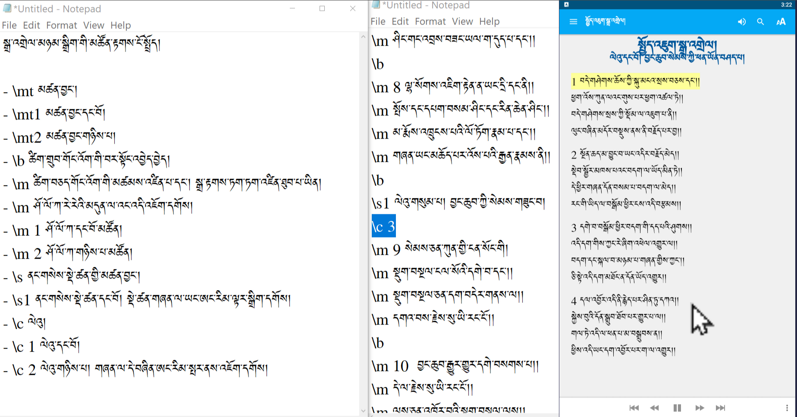
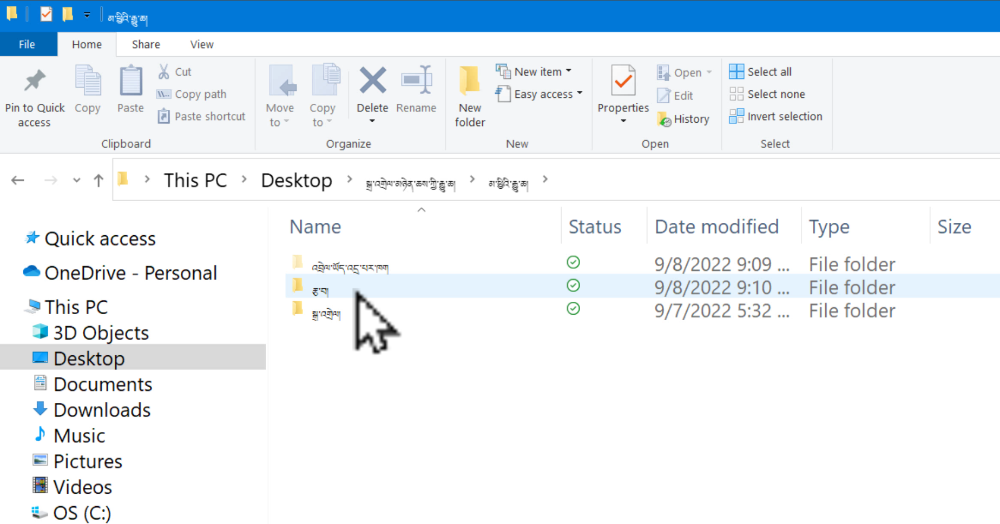
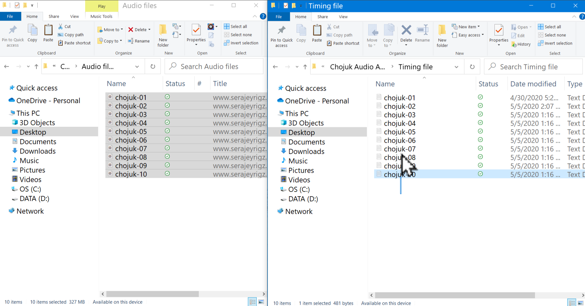

# སྒྲ་འགྲེལ་མཉེན་ཆས་སྒྲིག་ཚུལ།1\3

སྒྲ་འགྲེལ་མཉེན་ཆས་ནི་SABམཉེན་ཆས་ནང་དཔེ་ཁྲིད་སྒྲ་རུ་བླངས་པ་རྣམས་གཞུང་གི་རྩ་བ་ཡིག་རྐྱང་དང་མཉམ་སྦྱོར་གྱི་མཉེན་ཆས་སྒྲིག་ཚུལ་ཞིག་ཡིན། སྐབས་སུ་བབ་པ་འདིར་སྒྲ་འགྲེལ་མཉེན་ཆས་ཀྱི་དགོས་མཁོ་ཁག་ངོ་སྤྲོད་བྱས་ཡོད། ཞིབ་ཕྲ་གཤམ་ལ་གཟིགས།

## སྒྲ་འགྲེལ་མཉེན་ཆས་ཀྱི་གྲུབ་ཆ་ཁག

སྒྲ་འགྲེལ་མཉེན་ཆས་ཆ་ཚང་ཞིག་བསྒྲིག་པར་ནང་གསེས་སློབ་ཚན་འདི་དག་ལ་ངེས་ཆ་དང་བྱང་ཆ་ལྡན་དགོས།

1. འདིའི་ཐུན་མིན་མཚོན་རྟགས་ངོ་སྤྲོད།
2. [Audacityཕབ་ལེན་དང་སྒྲ་སྒྲིག་ཚུལ།](https://github.com/buda-base/budax/blob/master/howtoguides/SAB19/index.md)
3. [སྒྲ་འགྲེལ་མཉེན་ཆས་དངོས་སུ་སྒྲིག་ཚུལ།](https://github.com/buda-base/budax/blob/master/howtoguides/SAB20/index.md)

## 1. འདིའི་ཐུན་མིན་མཚོན་རྟགས་ངོ་སྤྲོད།

སློབ་ཚན་འདིའི་ནང་ངོ་སྤྲོད་བྱ་རྒྱུའི་ནང་དོན་ཁག་ལ་གཟིགས།

## སློབ་ཚན་འདིའི་ནང་དོན་གྱི་སྡེ་ཚན།

- 👉 འདིའི་ནང་སྤྱད་རྒྱུའི་ཐུན་མིན་མཚོན་རྟགས་ངོ་སྤྲོད།
- 👉 འདིའི་ནང་དགོས་ངེས་ཀྱི་རྒྱུ་ཆ་གྲ་སྒྲིག
- 👉 འདིའི་ནང་དགོས་ངེས་ཀྱི་སྒྲིག་གཞི་ངོ་སྤྲོད།

## ཚོད་ལྟའི་དྲི་བ།

ཚོད་ལྟའི་དྲི་བ་རྣམས་ལ་ལན་རེ་ངེས་པར་དུ་འདེམ་རོགས། དེ་དག་ཐོག་མ་ནས་ཤེས་དགོས་པའི་ངེས་པ་མེད་པས་གང་རུང་ཞིག་འདེམ་ཆོག

1. འདིའི་ནང་ཤོ་ལོ་ཀའི་མཚོན་རྟགས་གང་ཡིན་ནམ། \qc༽ \v༽ \m༽ (正确回答)
2. མཉེན་ཆས་འདི་བསྒྲིག་པར་ཐོག་མར་རྒྱུ་ཆ་གཙོ་བོ་ག་ཚོདགྲ་སྒྲིག་དགོས། ༡༽ ༢༽ ༣༽ (正确回答)
3. ཡིག་ཆ་ཡོངས་ཀྱི་མིང་གཅིག་གྱུར་ཡིན་རུང་ཁྱད་པར་བཟོ་བྱེད་གང་ཡིན། ལེའུ།༽ ཤོ་ལོ་ཀ༽ ཨང་ཀི།༽ (正确回答)

## 1. འདིའི་ནང་སྤྱད་རྒྱུའི་ཐུན་མིན་མཚོན་རྟགས་ངོ་སྤྲོད།

👇 དེ་ཅི་ལྟར་བྱ་ཚུལ་ལ་གཟིགས།

- སློབ་ཚན་གྱི་བརྙན། [དྲ་ཐག་འདིར་སྣུན།](https://drive.google.com/file/d/1YKMSjw-Sy90yx4S2MSTWKGhosgDfwxdn/view?usp=sharing)

1. དྲི་བ། འདིའི་ནང་ཤོ་ལོ་ཀའི་མཚོན་རྟགས་གང་ཡིན་ནམ། \m༽ (正确回答) \v༽ \qc༽

## 2. འདིའི་ནང་དགོས་ངེས་ཀྱི་རྒྱུ་ཆ་གྲ་སྒྲིག

👇 དེ་ཅི་ལྟར་བྱ་ཚུལ་ལ་གཟིགས།

- སློབ་ཚན་གྱི་བརྙན། [དྲ་ཐག་འདིར་སྣུན།](https://drive.google.com/file/d/1VQ0myKOObm-7QUc04HrIXJ2hoOxJpft1/view?usp=sharing)

2. དྲི་བ། མཉེན་ཆས་འདི་བསྒྲིག་པར་ཐོག་མར་རྒྱུ་ཆ་གཙོ་བོ་ག་ཚོདགྲ་སྒྲིག་དགོས།  
༢༽ ༣༽ (正确回答) ༡༽

## 3. འདིའི་ནང་དགོས་ངེས་ཀྱི་སྒྲིག་གཞི་ངོ་སྤྲོད།

👇 དེ་ཅི་ལྟར་བྱ་ཚུལ་ལ་གཟིགས།

 

- སློབ་ཚན་གྱི་བརྙན། [དྲ་ཐག་འདིར་སྣུན།](https://drive.google.com/file/d/1Bvxd1b4bBm15uDZ0vwwECbUOYp9UAO7S/view?usp=sharing)

3. དྲི་བ། ཡིག་ཆ་ཡོངས་ཀྱི་མིང་གཅིག་གྱུར་ཡིན་རུང་ཁྱད་པར་བཟོ་བྱེད་གང་ཡིན།  
ལེའུ།༽ ཤོ་ལོ་ཀ༽ ཨང་ཀི།༽ (正确回答)