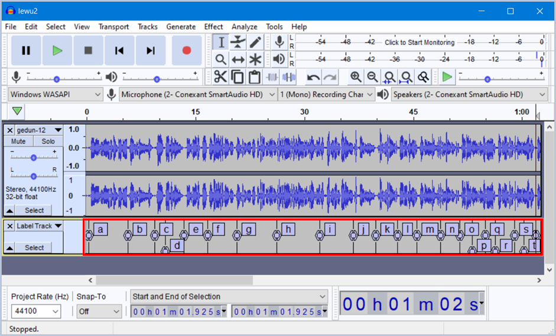
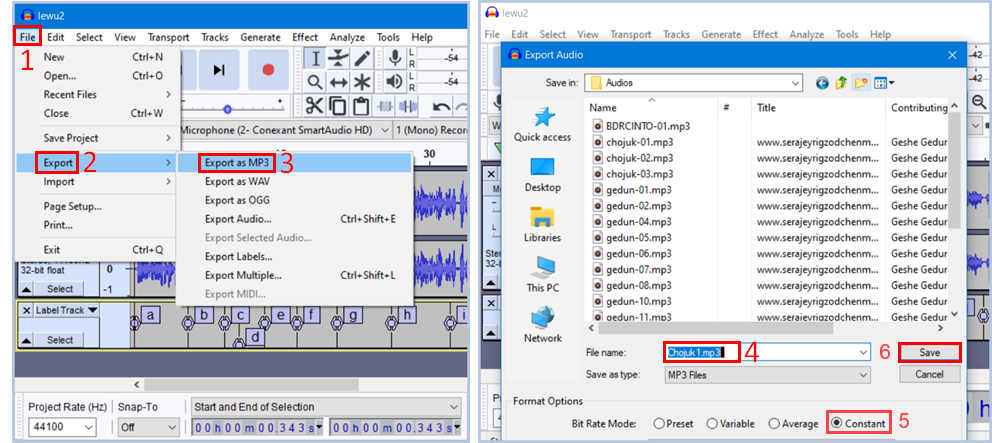

# སྒྲ་འགྲེལ་མཉེན་ཆས་སྒྲིག་ཚུལ།2\3

འདིར་Audacityསྒྲ་སྒྲིག་མཉེན་ཆས་ཕབ་ལེན་དང་དེའི་ནང་ཡིག་ཆ་སྒྲིག་ཚུལ་ངོ་སྤྲོད་བྱས་ཡོད། ཞིབ་ཕྲ་གཤམ་ལ་གཟིགས།

## སྒྲ་འགྲེལ་མཉེན་ཆས་ཀྱི་གྲུབ་ཆ་ཁག

སྒྲ་འགྲེལ་མཉེན་ཆས་ཆ་ཚང་ཞིག་བསྒྲིག་པར་ནང་གསེས་སློབ་ཚན་འདི་དག་ལ་ངེས་ཆ་དང་བྱང་ཆ་ལྡན་དགོས།

1. [འདིའི་ཐུན་མིན་མཚོན་རྟགས་ངོ་སྤྲོད།](https://github.com/buda-base/budax/blob/master/howtoguides/SAB18/index.md)
2. Audacityཕབ་ལེན་དང་སྒྲ་སྒྲིག་ཚུལ།
3. [སྒྲ་འགྲེལ་མཉེན་ཆས་དངོས་སུ་སྒྲིག་ཚུལ།](https://github.com/buda-base/budax/blob/master/howtoguides/SAB20/index.md)

## 1. Audacityཕབ་ལེན་དང་སྒྲ་སྒྲིག་ཚུལ།

སློབ་ཚན་འདིའི་ནང་ངོ་སྤྲོད་བྱ་རྒྱུའི་ནང་དོན་ཁག་ལ་གཟིགས།

## སློབ་ཚན་འདིའི་ནང་དོན་གྱི་སྡེ་ཚན།

- 👉 Audacityཕབ་ལེན་དང་འཇུག་སྤྲོད།
- 👉 ཡིག་ཆ་ནང་འདྲེན་དང་སྒྲ་མཚམས་རེའུ་མིག་བཟོ་བ།
- 👉 སྒྲ་དང་སྒྲ་མཚམས་རེའུ་མིག་ཕྱིར་འདྲེན།

## ཚོད་ལྟའི་དྲི་བ།

ཚོད་ལྟའི་དྲི་བ་རྣམས་ལ་ལན་རེ་ངེས་པར་དུ་འདེམ་རོགས། དེ་དག་ཐོག་མ་ནས་ཤེས་དགོས་པའི་ངེས་པ་མེད་པས་གང་རུང་ཞིག་འདེམ་ཆོག

1. ༽ (正确回答)
2. ༽ (正确回答)
3. ༽ (正确回答)

## 1. Audacityཕབ་ལེན་དང་འཇུག་སྤྲོད།

སྒྲ་སྒྲིག་མཉེན་ཆས་འདི་ཕབ་ལེན་བྱ་གནས་[དྲ་ཐག་](https://www.audacityteam.org/)འདིར་སྣུན། ཡང་ན་www.audacityteam.orgའདི་ཐད་ཀར་ངོ་བཤུ་བྱས་ཏེ་བཙལ་ཡང་རུང་ངོ་།།

👇 དེ་ཅི་ལྟར་བྱ་ཚུལ་ལ་གཟིགས།

- སློབ་ཚན་གྱི་བརྙན། [དྲ་ཐག་འདིར་སྣུན།]()

1. དྲི་བ། 

## 2. ཡིག་ཆ་ནང་འདྲེན་དང་སྒྲ་མཚམས་རེའུ་མིག་བཟོ་བ།

👇 དེ་ཅི་ལྟར་བྱ་ཚུལ་ལ་གཟིགས།

- སློབ་ཚན་གྱི་བརྙན། [དྲ་ཐག་འདིར་སྣུན།]()

2. དྲི་བ། 

## 3. སྒྲ་དང་སྒྲ་མཚམས་རེའུ་མིག་ཕྱིར་འདྲེན།

👇 དེ་ཅི་ལྟར་བྱ་ཚུལ་ལ་གཟིགས།

 

- སློབ་ཚན་གྱི་བརྙན། [དྲ་ཐག་འདིར་སྣུན།]()

3. དྲི་བ། 