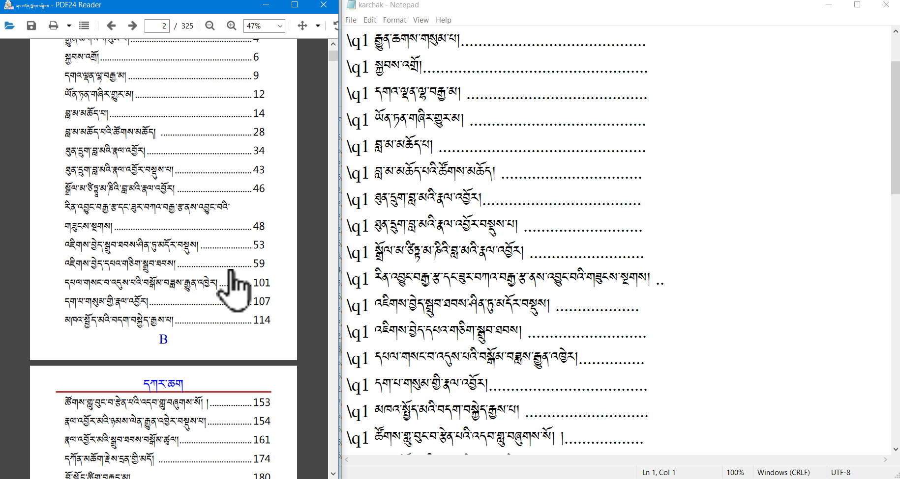
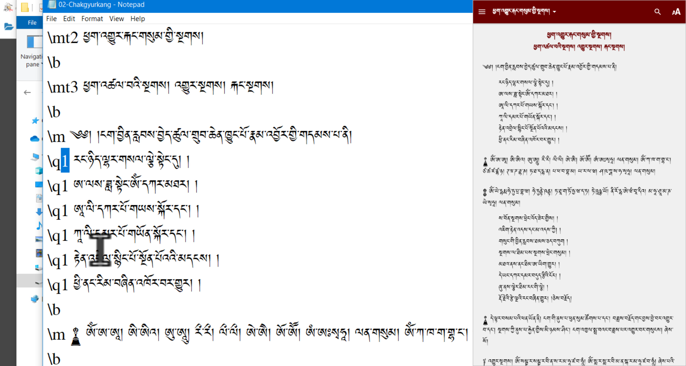
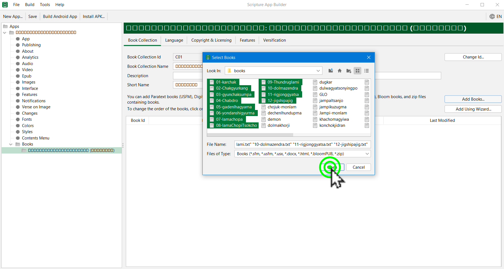
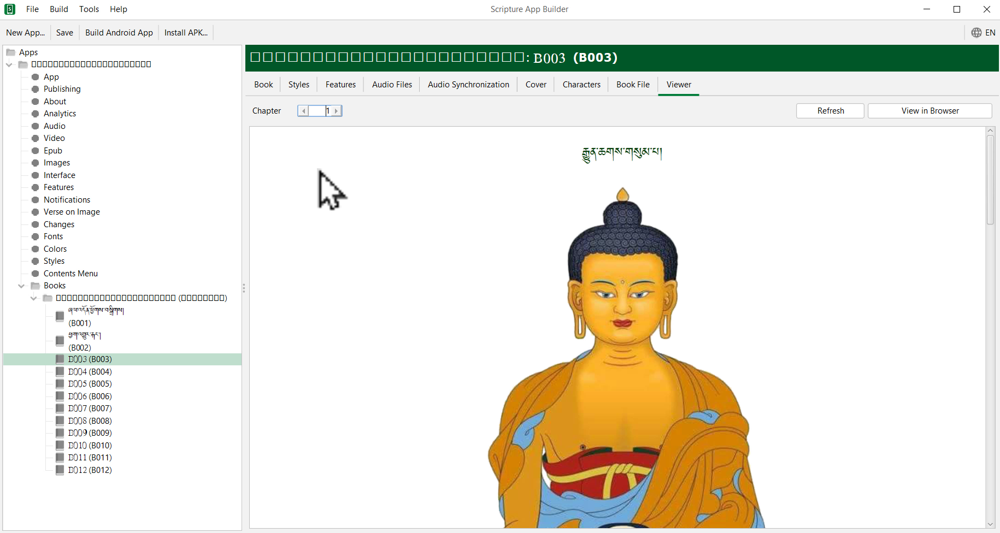

# ཞལ་འདོན་མཉེན་ཆས་སྒྲིག་ཚུལ།

SABནང་ཞལ་འདོན་ཕྱོགས་བསྒྲིགས་ཀྱི་མཉེན་ཆས་སྒྲིག་ཚུལ་ངོ་སྤྲོད་བྱས་ཡོད།
## ནང་དོན་གྱི་སྡེ་ཚན།

- 👉 སྔོན་འགྲོའི་རྒྱུ་ཆ་གྲ་སྒྲིག་བྱ་ཚུལ།
- 👉 ཆོས་སྤྱོད་རེ་རེའི་ནང་མཚོན་རྟགས་སྒྲིག་ཚུལ།
- 👉 SABནང་དཔེ་ཆ་སྒྲིག་འཇོག་བྱ་ཚུལ།

## ཚོད་ལྟའི་དྲི་བ།

ཚོད་ལྟའི་དྲི་བ་རྣམས་ལ་ལན་རེ་ངེས་པར་དུ་འདེམ་རོགས། དེ་དག་ཐོག་མ་ནས་ཤེས་དགོས་པའི་ངེས་པ་མེད་པས་གང་རུང་ཞིག་འདེམ་ཆོག

1. རྒྱུ་ཆ་གྲ་སྒྲིག་བྱེད་དགོས་པའི་རིགས་ག་ཚོད་ཡོད་དམ། གཅིག༽ གསུམ།༽ གཉིས།༽ (正确回答)
2. འདིའི་ནང་ཤོ་ལོ་ཀའི་མཚོན་རྟགས་འཇོག་དགོས་སམ། མི་ཤེས།༽ དགོས།༽ མི་དགོས།༽ (正确回答)
3. སྒྲིག་སྟེགས་ནང་དཔེ་ཆ་རེ་རེའི་མིང་བསྐྱར་འབྲི་བྱེད་དགོས་སམ། མི་ཤེས།༽ མི་དགོས།༽ དགོས།༽ (正确回答)

## 1. སྔོན་འགྲོའི་རྒྱུ་ཆ་གྲ་སྒྲིག་བྱ་ཚུལ།

👇 དེ་ཅི་ལྟར་བྱ་ཚུལ་ལ་གཟིགས།

- སློབ་ཚན་གྱི་བརྙན། [དྲ་ཐག་འདིར་སྣུན།](https://drive.google.com/file/d/1ODEABlsI-ubTKVmLP2FzAEol7lDUA_m-/view?usp=sharing)

1. དྲི་བ། རྒྱུ་ཆ་གྲ་སྒྲིག་བྱེད་དགོས་པའི་རིགས་ག་ཚོད་ཡོད་དམ།  
གཉིས།༽ (正确回答) གཅིག༽ གསུམ།༽ 

## 2. ཆོས་སྤྱོད་རེ་རེའི་ནང་མཚོན་རྟགས་སྒྲིག་ཚུལ།

👇 དེ་ཅི་ལྟར་བྱ་ཚུལ་ལ་གཟིགས།

- སློབ་ཚན་གྱི་བརྙན། [དྲ་ཐག་འདིར་སྣུན།](https://drive.google.com/file/d/1N5b4O78V-ThJVIimUCcQeblwbVLuFeQa/view?usp=sharing)

2. དྲི་བ། འདིའི་ནང་ཤོ་ལོ་ཀའི་མཚོན་རྟགས་འཇོག་དགོས་སམ།  
དགོས།༽ མི་དགོས།༽ (正确回答) མི་ཤེས།༽

## 3. མཉེན་ཆས་ནང་དཔེ་ཆ་འཇོག་ཚུལ།

འདིའི་ནང་གསེས་གཉིས་ལ་རིམ་པར་གཟིགས།

### 3.1 དཔེ་ཆ་སྒྲིག་ཚུལ།

👇 དེ་ཅི་ལྟར་བྱ་ཚུལ་ལ་གཟིགས།

 

- སློབ་ཚན་གྱི་བརྙན། [དྲ་ཐག་འདིར་སྣུན།](https://drive.google.com/file/d/1Fgt8QcIt84KooJpK9KntewtjXO7K_zq_/view?usp=sharing)

### 3.2 འདྲ་པར་འཇོག་ཚུལ།

👇 དེ་ཅི་ལྟར་བྱ་ཚུལ་ལ་གཟིགས།

 

- སློབ་ཚན་གྱི་བརྙན། [དྲ་ཐག་འདིར་སྣུན།](https://drive.google.com/file/d/1g-1GBoVNKVIYfQNZcDYf2Wdm65txhlF6/view?usp=sharing)

3. དྲི་བ། སྒྲིག་སྟེགས་ནང་དཔེ་ཆ་རེ་རེའི་མིང་བསྐྱར་འབྲི་བྱེད་དགོས་སམ།  
མི་ཤེས།༽ མི་དགོས།༽ དགོས།༽ (正确回答)