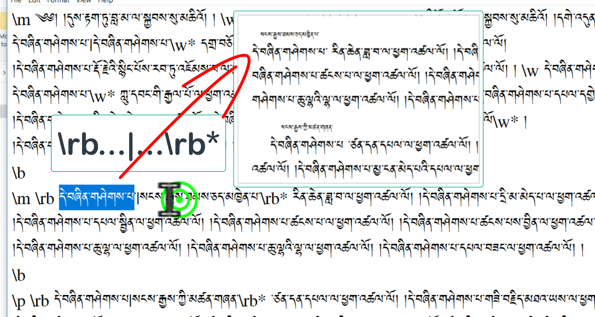
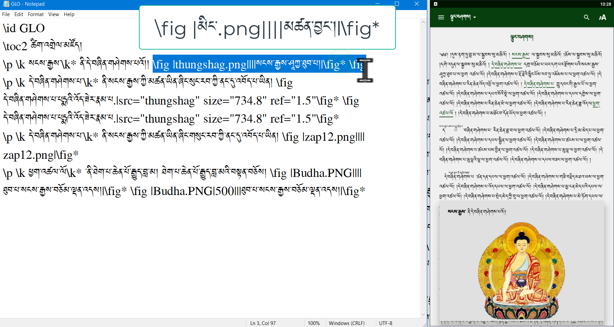
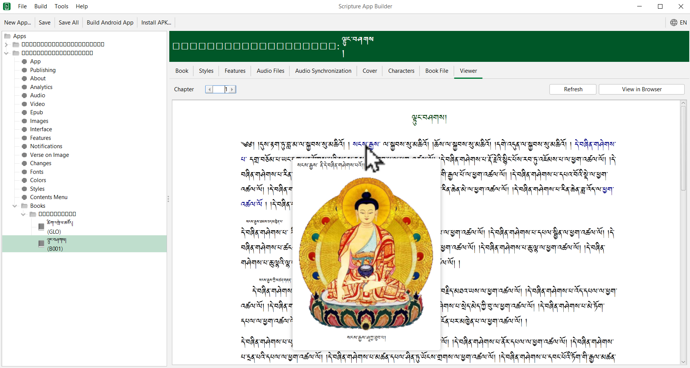

# SABནང་ཚིག་མཛོད་སྒྲིག་ཚུལ།

འདིར་SABནང་དམིགས་བསལ་ཐ་སྙད་དང་ཡང་ན་ཚན་པ་རེའི་མཚམས་སུ་ཐད་ཀར་ཚིག་འགྲེལ་དང་ཡང་ན་དྲ་ཐག་འཇོག་ཚུལ་ངོ་སྤྲོད་བྱས་ཡོད།

## ནང་དོན་གྱི་སྡེ་ཚན།

- 👉 
- 👉 
- 👉 

## ཚོད་ལྟའི་དྲི་བ།

ཚོད་ལྟའི་དྲི་བ་རྣམས་ལ་ལན་རེ་ངེས་པར་དུ་འདེམ་རོགས། དེ་དག་ཐོག་མ་ནས་ཤེས་དགོས་པའི་ངེས་པ་མེད་པས་གང་རུང་ཞིག་འདེམ་ཆོག

1. ༽ (正确回答)
2. ༽ (正确回答)
3. ༽ (正确回答)

## 1. 

👇 དེ་ཅི་ལྟར་བྱ་ཚུལ་ལ་གཟིགས།

- སློབ་ཚན་གྱི་བརྙན། [དྲ་ཐག་འདིར་སྣུན།]()

1. དྲི་བ། 

## 2. 

👇 དེ་ཅི་ལྟར་བྱ་ཚུལ་ལ་གཟིགས།

- སློབ་ཚན་གྱི་བརྙན། [དྲ་ཐག་འདིར་སྣུན།]()

2. དྲི་བ། 

## 3. 

👇 དེ་ཅི་ལྟར་བྱ་ཚུལ་ལ་གཟིགས།

 

- སློབ་ཚན་གྱི་བརྙན། [དྲ་ཐག་འདིར་སྣུན།]()

3. དྲི་བ། 