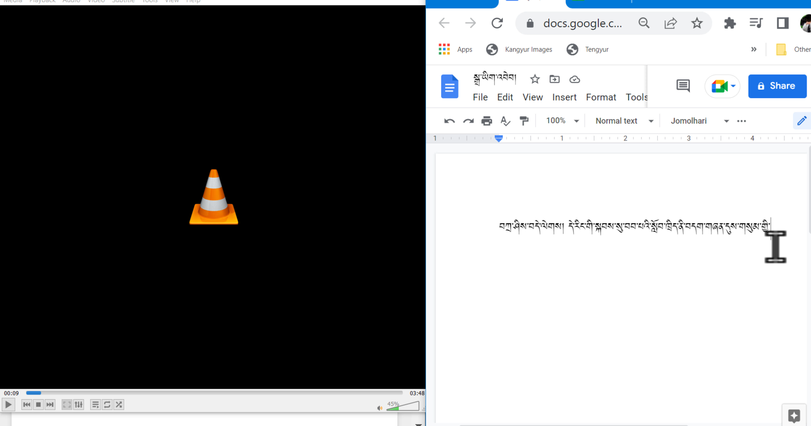
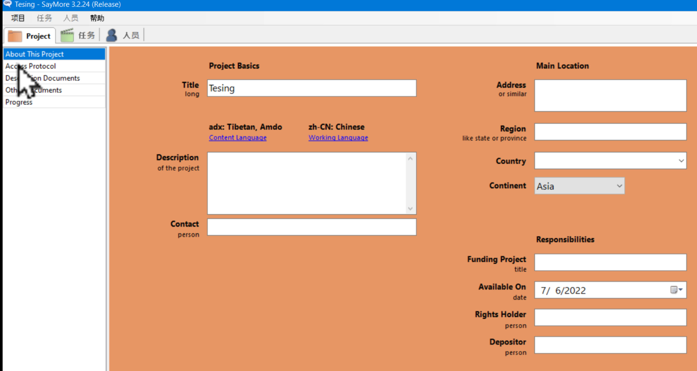
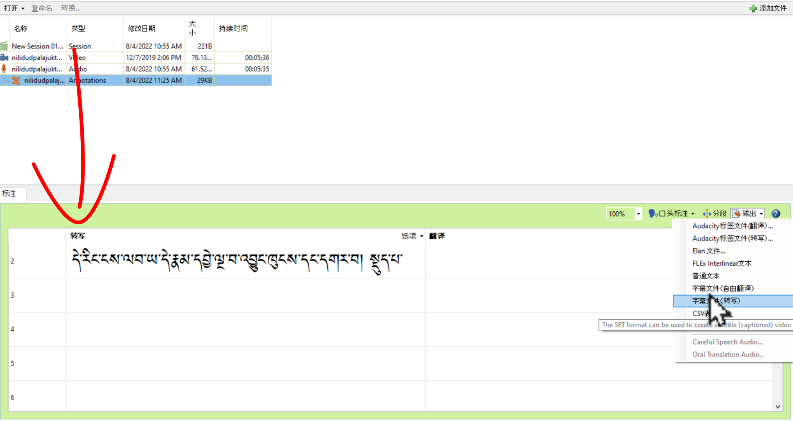

# མཉེན་ཆས་འདའི་ཕན་ནུས་ངོ་སྤྲོད།

Saymore ཡིག་འབེབ་མཉེན་ཆས་ནི་སྒེའུ་ཁུང་རྟགས་ཅན་གྱི་གློག་ཀླད་ནང་བཀོལ་རྒྱུའི་བརྙན་རིགས་སྒྲར་བསྒྱུར་བ་དང་སྒྲ་ཡིག་འབེབ་བྱེད་པའི་ཆེད་ལས་མཉེན་ཆས་ཤིག་ཡིན་ཞིང་། ཕབ་ལེན་རིན་མེད་དང་བཀོལ་བདེ་ཞིང་ཉོག་འཛིངས་མེད་པ། ཡིག་འབེབ་ལ་འཁོ་བའི་ཁྱད་ཆོས་སྣེ་འཛོམས་ཡོད་པ་བཅས་སོ།།

## ནང་དོན་གྱི་སྡེ་ཚན།

- 👉 ཡིག་འབེབ་ཀྱི་དཀའ་ངལ་ངོས་འཛིན། 
- 👉 ལས་གཞི་ཁ་གསལ་བའི་དགེ་མཚན། 
- 👉 ཡིག་འབེབ་དང་ཕྱིར་འདྲེན་བྱེད་སླ་བ། 

## 1. ཡིག་འབེབ་ཀྱི་དཀའ་ངལ་ངོས་འཛིན།

སྒྲ་དང་བརྙན་རིགས་ཡིག་ཐོག་དབབ་སྐབས་ཀྱི་སྤྱིར་བཏང་གི་དཀའ་ངལ་ཁག་གསལ་བརྗོད།

<iframe width="560" height="315" src="https://www.youtube.com/embed/5oALbp-UPwg" title="YouTube video player" frameborder="0" allow="accelerometer; autoplay; clipboard-write; encrypted-media; gyroscope; picture-in-picture" allowfullscreen></iframe>

## 2. ལས་གཞི་ཁ་གསལ་བའི་དགེ་མཚན།

Saymore མཉེན་ཆས་འདིའི་ནང་ལས་གཞི་དང་ལས་ཀའི་གནས་བབ་ཁ་གསལ་ཞིང་བལྟ་བདེ་བའི་ཁྱད་ཆོས་ངོ་སྤྲོད་བྱས་ཡོད།

👇 དེ་དག་ལ་གཟིགས།

<iframe width="560" height="315" src="https://www.youtube.com/embed/yhHD6LB_6Hg" title="YouTube video player" frameborder="0" allow="accelerometer; autoplay; clipboard-write; encrypted-media; gyroscope; picture-in-picture" allowfullscreen></iframe>

## 3. ཡིག་འབེབ་དང་ཕྱིར་འདྲེན་བྱེད་སླ་བ།

སྒྲ་དེ་ཡིག་ཐོག་དབབ་སྐབས་སྐད་རིགས་གཉིས་ཀྱི་ནང་རིམ་བར་དབབ་ཐུབ་པ་དང་ཕབ་ཟིན་ཡིག་ཆ་དེ་རྣམ་སྒྲིག་གམ་格式formatའདྲ་མིན་ནང་ཉར་ཚགས་བྱེད་ཆོག་པའི་ཁྱད་ཆོས་ངོ་སྤྲོད་བྱས་ཡོད།

👇 དེ་ཅི་ལྟར་བྱ་ཚུལ་ལ་གཟིགས།

 

<iframe width="560" height="315" src="https://www.youtube.com/embed/wjsR0-GlU08" title="YouTube video player" frameborder="0" allow="accelerometer; autoplay; clipboard-write; encrypted-media; gyroscope; picture-in-picture" allowfullscreen></iframe>

