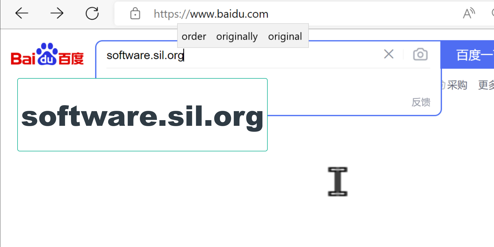
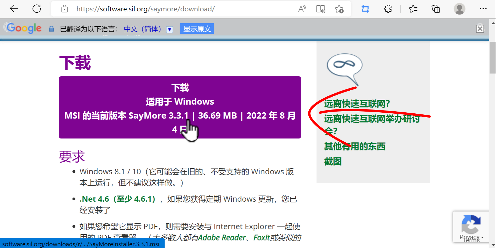
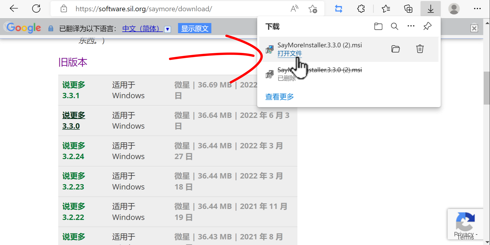

# ཡིག་འབེབ་མཉེན་ཆས་འཚོལ་ཞིབ་བྱ་ཚུལ།

Saymore ཡིག་འབེབ་མཉེན་ཆས་ཕབ་ལེན་བྱེད་གནས་འཚོལ་ཞིབ་བྱེད་སྐབས་ [དྲ་ཐག་འདིར་སྣུན།](https://software.sil.org/saymore/download/) དྲ་ཐག་འདི་ནས་ཐད་ཀར་འགྲོ་མ་ཐུབ་ན་དྲ་བྱང་ software.sil.org འདི་ཐད་ཀར་འབྲི་བ་དང་ཡང་ན་ངོ་བཤུ་བྱས་ཏེ་百度ནང་ཕབས་ཏེ་འཚོལ་ཞིབ་བྱོས།
## ནང་དོན་གྱི་སྡེ་ཚན།

- 👉 ཡིག་འབེབ་མཉེན་ཆས་ཕབ་གནས་འཚོལ་ཞིབ།
- 👉 ཐོན་རིམ་འདེམ་སྟངས་ངོ་སྤྲོད།
- 👉 ཡིག་འབེབ་མཉེན་ཆས་ཕབ་ལེན་བྱ་ཚུལ།

## ཚོད་ལྟའི་དྲི་བ།

ཚོད་ལྟའི་དྲི་བ་རྣམས་ལ་ལན་རེ་ངེས་པར་འདེམ་རོགས། དེ་དག་ཐོག་མ་ནས་ཤེས་དགོས་པའི་ངེས་པ་མེད་པས་གང་རུང་ཞིག་འདེམ་ཆོག

1. མཉེན་ཆས་ཕབ་ལེན་བྱེད་ས་དེ་百度དྲ་ཚིགས་རེད་དམ། 
མི་ཤེས།༽ རེད།༽ མ་རེད། (正确回答)
2. ཡིག་འབེབ་མཉེན་ཆས་གློག་ཀླད་རིགས་གང་གི་ནང་བཀོལ་ཐུབ་བམ། 
ཀུ་ཤུ་རྟགས་ཅན།༽ ལུནེ་ཁེ་སི།༽ སྒེའུ་ཁུང་རྟགས་ཅན།༽ (正确回答)
3. ཡིག་འབེབ་མཉེན་ཆས་ཀྱི་ཐོན་རིམ་རྙིང་བ་རྣམས་བཀོལ་ཐུབ་བམ། 
མི་ཤེས།༽ མི་ཐུབ།༽ ཐུབ།༽ (正确回答)

## 1. ཡིག་འབེབ་མཉེན་ཆས་ཕབ་གནས་འཚོལ་ཞིབ།

ཡིག་འབེབ་མཉེན་ཆས་ཕབ་གནས་དྲ་ཚིགས་འཚོལ་ཚུལ་དང་དེའི་ནང་ནས་ཡིག་འབེབ་མཉེན་ཆས་བསལ་འདེམ་བྱ་ཚུལ་ངོ་སྤྲོད་བྱས་ཡོད།

👇 དེ་ཅི་ལྟར་བྱ་ཚུལ་ལ་གཟིགས།

- སློབ་ཚན་གྱི་བརྙན། [དྲ་ཐག་འདིར་སྣུན།](https://drive.google.com/file/d/1ehOcVfDnfhtrM3C21H_pWj9GS85C5_FF/view?usp=sharing)

1.དྲི་བ། མཉེན་ཆས་ཕབ་ལེན་བྱེད་ས་དེ་百度དྲ་ཚིགས་རེད་དམ།  
མ་རེད། (正确回答) རེད།༽ མི་ཤེས།༽

## 2. ཐོན་རིམ་འདེམ་སྟངས་ངོ་སྤྲོད།

མཉེན་ཆས་འདིའི་ཐོན་རིམ་འདེམ་གསེས་བྱ་ཚུལ་ངོ་སྤྲོད་བྱས་ཡོད།

👇 དེ་ཅི་ལྟར་བྱ་ཚུལ་ལ་གཟིགས།

- སློབ་ཚན་གྱི་བརྙན། [དྲ་ཐག་འདིར་སྣུན།](https://drive.google.com/file/d/1OZEfv68RS_vkNYQdnyBf2bMAZKaP8vF0/view?usp=sharing)

2. དྲི་བ། ཡིག་འབེབ་མཉེན་ཆས་གློག་ཀླད་རིགས་གང་གི་ནང་བཀོལ་ཐུབ་བམ།  
ཀུ་ཤུ་རྟགས་ཅན།༽ སྒེའུ་ཁུང་རྟགས་ཅན།༽ (正确回答) ལུནེ་ཁེ་སི།༽ 

## 3. ཡིག་འབེབ་མཉེན་ཆས་ཕབ་ལེན་བྱ་ཚུལ།

འདི་ནས་བདམས་ཟིན་པའི་མཉེན་ཆས་དངོས་སུ་ཕབ་ལེན་བྱ་ཚུལ་ངོ་སྤྲོད་བྱས་ཡོད།

👇 དེ་ཅི་ལྟར་བྱ་ཚུལ་ལ་གཟིགས།

 

- སློབ་ཚན་གྱི་བརྙན། [དྲ་ཐག་འདིར་སྣུན།](https://drive.google.com/file/d/1HEP70iIGeoFLGw3T4Lbg721Y0TUeJm4g/view?usp=sharing)

3. ཡིག་འབེབ་མཉེན་ཆས་ཀྱི་ཐོན་རིམ་རྙིང་བ་རྣམས་བཀོལ་ཐུབ་བམ།  
མི་ཤེས།༽ མི་ཐུབ།༽ ཐུབ།༽ (正确回答)