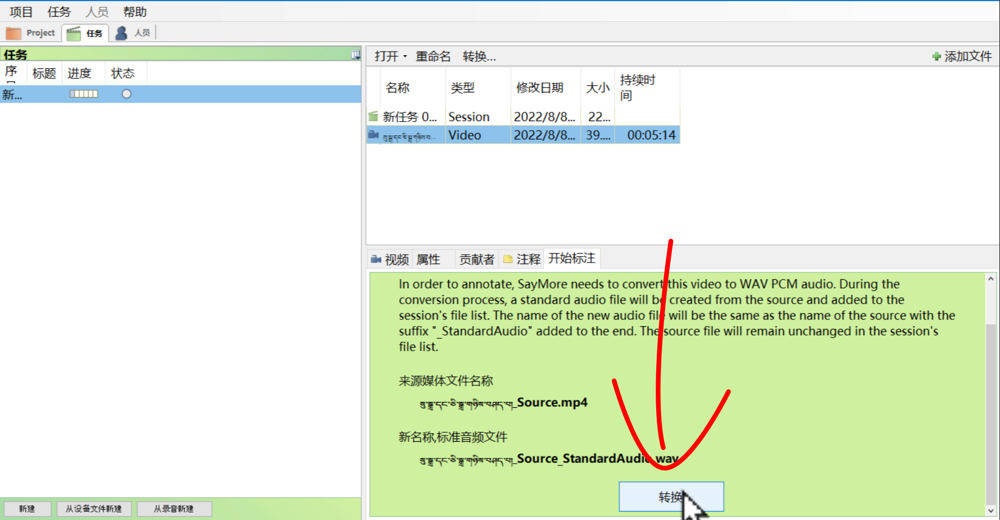
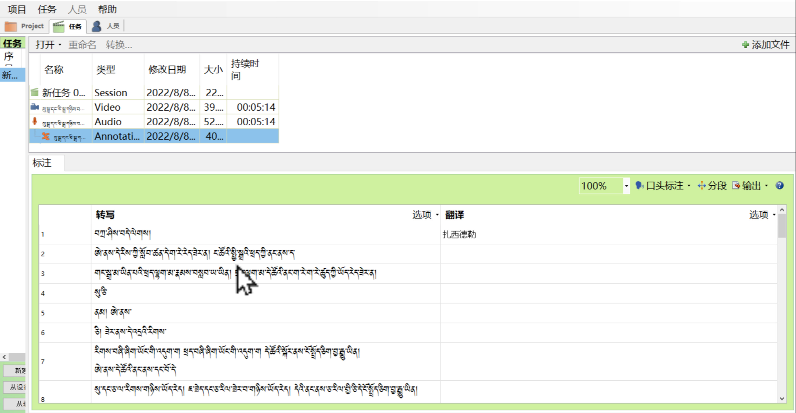
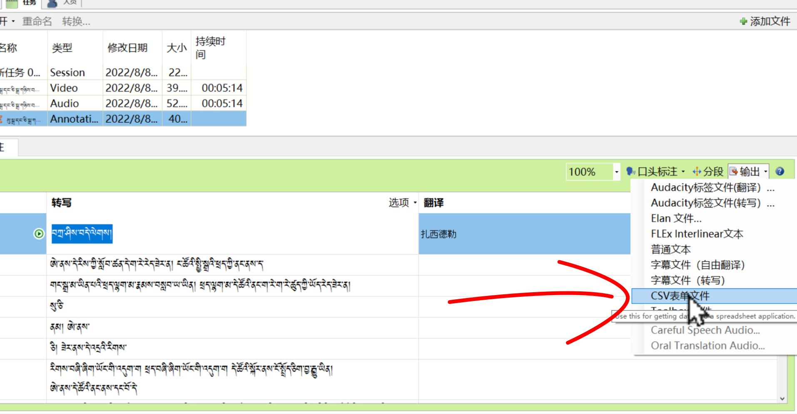

# ཡིག་འབེབ་མཉེན་ཆས་འཇུག་སྤྲོད་བྱ་ཚུལ།

Saymore ཡིག་འབེབ་མཉེན་ཆས་ནང་ཡིག་འབེབ་ཀྱི་གོ་རིམ་འགོ་ནས་མཇུག་བར་དུ་ཆ་ཚང་ཡོད་པའི་བཀོལ་སྤྱོད་ལམ་སྟོན་སྟབས་བདེ་ཞིག་ཡིན།

## ནང་དོན་གྱི་སྡེ་ཚན།

- 👉 སྨྱན་ནང་འདྲེན་དང་རྣམ་སྒྲིག་བསྒྱུར་བ།
- 👉 ཡིག་འབེབ་དངོས་བྱེད་ཚུལ།
- 👉 ཡིག་ཆ་ཕྱིར་འདྲེན་བྱ་ཚུལ།

## ཚོད་ལྟའི་དྲི་བ།

ཚོད་ལྟའི་དྲི་བ་རྣམས་ལ་ལན་རེ་ངེས་པར་དུ་འདེམ་རོགས། དེ་དག་ཐོག་མ་ནས་ཤེས་དགོས་པའི་ངེས་པ་མེད་པས་གང་རུང་ཞིག་འདེམ་ཆོག

1. ཡི་གེར་འབེབས་རྒྱུའི་ཡིག་ཆ་ལེན་ས་སྤྱིའི་སྡེ་ཚན་གང་ནང་ཡོད་དམ། 人员༽ Project༽ 项目༽ (正确回答)
2. ཡིག་འབེབས་ཀྱི་ཡིག་གཟུག་བརྗེ་བ་ལ་ཐོག་མར་གང་གནོན་དགོས་སམ། 开始标注༽ 字体༽ 迭项༽ (正确回答)
3. ཕབ་ཟིན་པ་དེ་ཡིག་རྐྱང་གི་ངོ་བོར་ཉར་ན་རྣམ་སྒྲིག་格式གང་འདེམ་དགོས། 撰写༽ 字幕文件（撰写）༽ 普通文本༽ (正确回答)

## 1. སྨྱན་ནང་འདྲེན་དང་རྣམ་སྒྲིག་བསྒྱུར་བ།

མཉེན་ཆས་ནང་སྨྱན་ནང་འདྲེན་དང་བརྙན་གྱི་རིགས་སྒྲ་ལ་བསྒྱུར་ཚུལ་ངོ་སྤྲོད་བྱས་ཡོད།

👇 དེ་ཅི་ལྟར་བྱ་ཚུལ་ལ་གཟིགས།

<iframe width="560" height="315" src="https://www.youtube.com/embed/A6oggmZDfe8" title="YouTube video player" frameborder="0" allow="accelerometer; autoplay; clipboard-write; encrypted-media; gyroscope; picture-in-picture" allowfullscreen></iframe>

1. དྲི་བ། ཡི་གེར་འབེབས་རྒྱུའི་ཡིག་ཆ་ལེན་ས་སྤྱིའི་སྡེ་ཚན་གང་ནང་ཡོད་དམ། 项目༽ (正确回答) Project༽ 人员༽

## 2. ཡིག་འབེབ་དངོས་བྱེད་ཚུལ།

ཡིག་འབེབ་མཉེན་ཆས་ནང་དངོས་སྒྲ་ཡི་གེར་དབབ་ཚུལ་དང་ཡིག་གཟུགས་ཆེ་ཆུང་སྒྲིག་ཚུལ་བཅས་ངོ་སྤྲོད་བྱས་ཡོད།

👇 དེ་ཅི་ལྟར་བྱ་ཚུལ་ལ་གཟིགས།

<iframe width="560" height="315" src="https://www.youtube.com/embed/F6ox2G6qeqw" title="YouTube video player" frameborder="0" allow="accelerometer; autoplay; clipboard-write; encrypted-media; gyroscope; picture-in-picture" allowfullscreen></iframe>

2. དྲི་བ། ཡིག་འབེབས་ཀྱི་ཡིག་གཟུག་བརྗེ་བ་ལ་ཐོག་མར་གང་གནོན་དགོས་སམ། 开始标注༽ 迭项༽ (正确回答) 字体༽

## 3. ཡིག་ཆ་ཕྱིར་འདྲེན་བྱ་ཚུལ།

ཡི་གེར་ཕབ་ཟིན་པའི་ཡིག་ཆ་ཕྱིར་འདྲེན་དང་དེའི་རྣམ་པ་format 格式 འདེམ་སྟངས་བཅས་ངོ་སྤྲོད་བྱས་ཡོད།

👇 དེ་ཅི་ལྟར་བྱ་ཚུལ་ལ་གཟིགས།

 

<iframe width="560" height="315" src="https://www.youtube.com/embed/yde59ty7QAA" title="YouTube video player" frameborder="0" allow="accelerometer; autoplay; clipboard-write; encrypted-media; gyroscope; picture-in-picture" allowfullscreen></iframe>

3. དྲི་བ། ཕབ་ཟིན་པ་དེ་ཡིག་རྐྱང་གི་ངོ་བོར་ཉར་ན་རྣམ་སྒྲིག་格式གང་འདེམ་དགོས། 撰写༽ 字幕文件（撰写）༽ 普通文本༽ (正确回答)