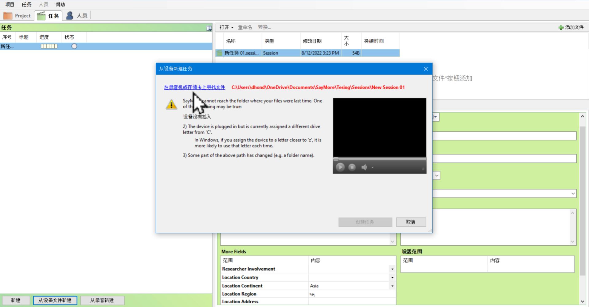
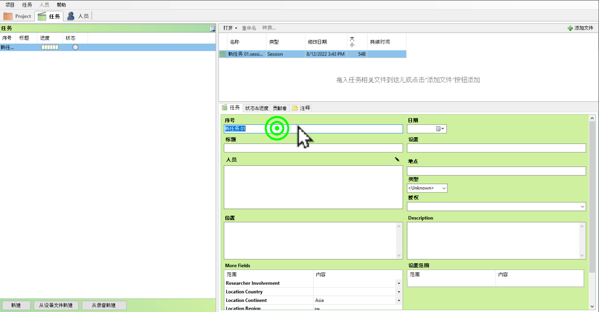
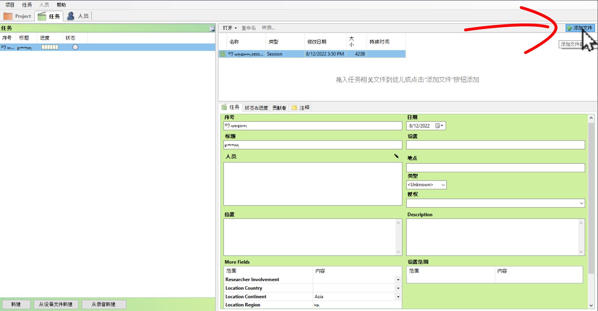

# Sessionལས་འགན་གསར་བཟོ་བྱ་ཚུལ།

འདི་ནི་Sessionལས་འགན་གྱི་ཤོག་ངོས་གསར་བཟོ་དང་དེའི་ནང་ལས་འགན་ཞིབ་འབྲི་བྱ་ཚུལ། དེ་འབྲེལ་གྱི་ཡིག་ཆ་ནང་འདྲེན་བྱ་ཚུལ་བཅས་ངོ་སྤྲོད་བྱས་ཡོད།
## ནང་དོན་གྱི་སྡེ་ཚན།

- 👉 ལས་འགན་གྱི་ཤོག་ངོས་གཟར་བཟོ་བྱ་ཚུལ།
- 👉 ལས་འགན་གྱི་གནས་ཚུལ་ཞིབ་འབྲི་བྱ་ཚུལ།
- 👉 དེ་འབྲེལ་གྱི་ཡིག་ཆ་ནང་འདྲེན་བྱ་ཚུལ།

## ཚོད་ལྟའི་དྲི་བ།

ཚོད་ལྟའི་དྲི་བ་རྣམས་ལ་ལན་རེ་ངེས་པར་དུ་འདེམ་རོགས། དེ་དག་ཐོག་མ་ནས་ཤེས་དགོས་པའི་ངེས་པ་མེད་པས་གང་རུང་ཞིག་འདེམ་ཆོག

1. ལས་འགན་སྡེ་ཚན་ནང་ལས་འགན་བཟོ་སའི་ཚན་པ་ག་ཚོད་ཡོད་དམ། ༡ ཡོད།༽ ༢ ཡོད།༽ ༣ ཡོད།༽ (正确回答)
2. ལས་འགན་ཞིབ་ཕྲ་འབྲི་ས་དེ་ཚན་པ་གང་ཡིན། 贡献煮༽ 状态&进度༽ 任务༽ (正确回答)
3. མཉེན་ཆས་ནང་ཡིག་ཆ་ནང་འདྲེན་བྱེད་སའི་ཚན་པ་གང་ཡིན་ནམ། 转换༽ 开始批注༽ 添加文件༽ (正确回答)

## 1. ལས་འགན་གྱི་ཤོག་ངོས་གསར་བཟོ་བྱ་ཚུལ།

འདིར་ལས་འགན་ནམ་Session ཡི་ཤོག་ངོས་གསར་བཟོ་བྱ་ཚུལ་གྱི་རིམ་པ་ཁག་ངོ་སྤྲོད་བྱས་ཡོད།

👇 དེ་ཇི་ལྟར་བྱ་ཚུལ་ལ་གཟིགས།

- སློབ་ཚན་གྱི་བརྙན། [དྲ་ཐག་འདིར་སྣུན།](https://drive.google.com/file/d/1nObe0s6lH3nBpYXfegZBxQ15P_-3qOFH/view?usp=sharing)

1. དྲི་བ། ལས་འགན་སྡེ་ཚན་ནང་ལས་འགན་བཟོ་སའི་ཚན་པ་ག་ཚོད་ཡོད་དམ།  
༣ ཡོད།༽ (正确回答) ༢ ཡོད།༽ ༡ ཡོད།༽

## 2. ལས་འགན་གྱི་གནས་ཚུལ་ཞིབ་འབྲི་བྱ་ཚུལ།

Session ཡི་ཤོག་ངོས་རེ་རེའི་ནང་ལས་འགན་རེ་རེའི་གནས་ཚུལ་རྣམས་ཁ་གསལ་འབྲི་ཚུལ་ངོ་སྤྲོད་བྱས་ཡོད།

👇 དེ་ཇི་ལྟར་བྱ་ཚུལ་ལ་གཟིགས།

- སློབ་ཚན་གྱི་བརྙན། [དྲ་ཐག་འདིར་སྣུན།](https://drive.google.com/file/d/1PGGl6x8L9tsFfRwNyUb8NbWh7OEEoYPX/view?usp=sharing)

2. དྲི་བ། ལས་འགན་ཞིབ་ཕྲ་འབྲི་ས་དེ་ཚན་པ་གང་ཡིན།  
贡献煮༽ 任务༽ (正确回答) 状态&进度༽ 

## 3. དེ་འབྲེལ་གྱི་ཡིག་ཆ་ནང་འདྲེན་བྱ་ཚུལ།

འདིར་མཉེན་ཆས་འདིའི་ནང་ཡི་གེར་དབབ་རྒྱུའི་སྒྲ་དང་ཡང་བརྙན་རྣམས་ནང་འདྲེན་བྱ་ཚུལ་ངོ་སྤྲོད་བྱས་ཡོད།

👇 དེ་ཇི་ལྟར་བྱ་ཚུལ་ལ་གཟིགས།

 

- སློབ་ཚན་གྱི་བརྙན། [དྲ་ཐག་འདིར་སྣུན།](https://drive.google.com/file/d/1moVf8qqm3CaJg6DItvAtbAExusUHa7gc/view?usp=sharing)

3. དྲི་བ། མཉེན་ཆས་ནང་ཡིག་ཆ་ནང་འདྲེན་བྱེད་སའི་ཚན་པ་གང་ཡིན་ནམ།  
转换༽ 开始批注༽ 添加文件༽ (正确回答)