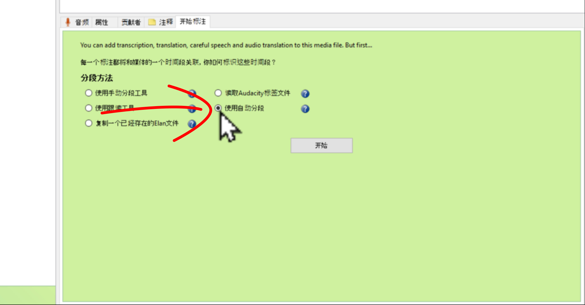
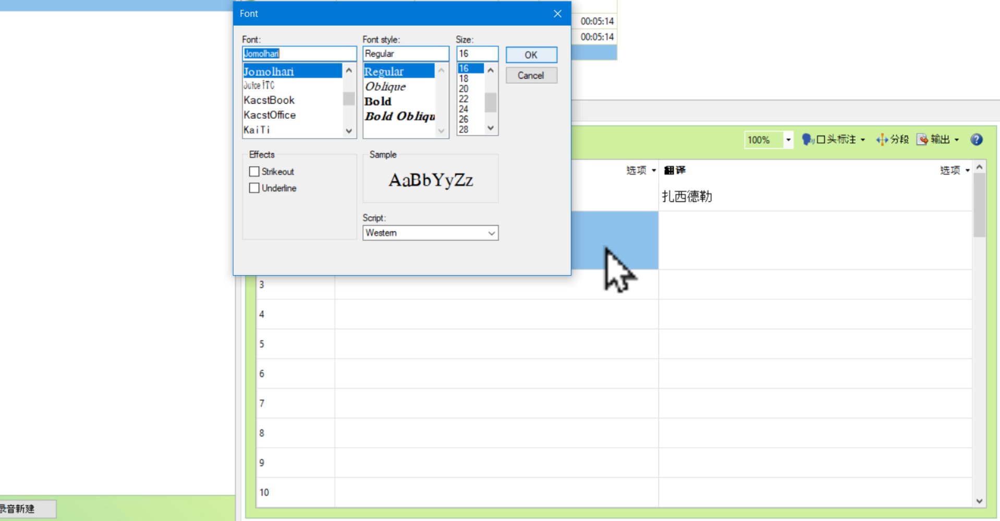
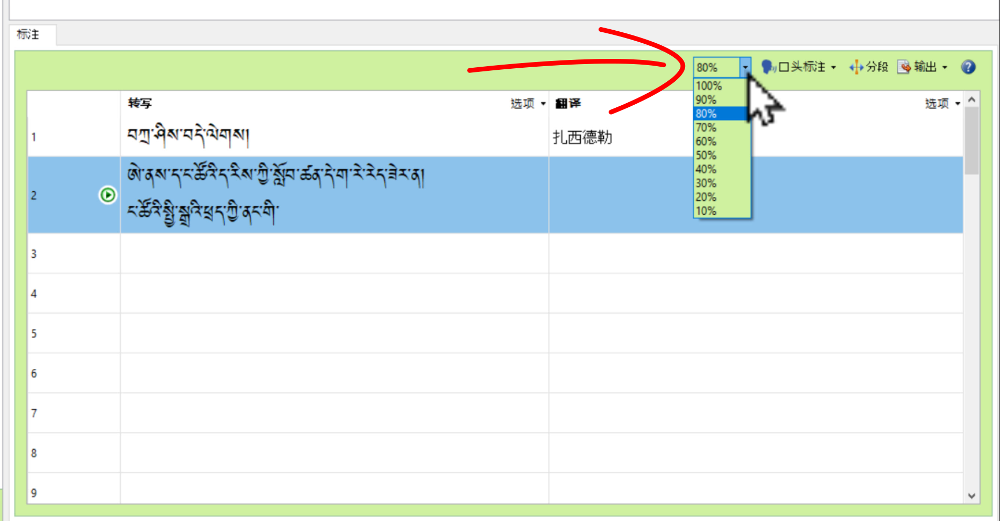

# ཡིག་འབེབ་དང་ལག་ཆ་ངོ་སྤྲོད། Annotation

འདི་ནི་ཡི་གེར་དབབ་རྒྱུའི་བརྙན་རིགས་སྒྲ་ལ་བསྒྱུར་ཚུལ་དང་། ཡིག་འབེབས་དངོས་གཞིར་མཁོ་བའི་གལ་ཆེའི་ལག་ཆ་དང་ཡིག་བསྒྱུར་དང་སྐད་བསྒྱུར་བྱ་ཚུལ་རིམ་པ་ཁག་ངོ་སྤྲོད་བྱས་ཡོད།
## ནང་དོན་གྱི་སྡེ་ཚན།

- 👉 བརྙན་རིགས་སྒྲ་ལ་བསྒྱུར་ཚུལ།
- 👉 ཡིག་འབེབས་དང་ཡིག་གཟུགས་བསྒྱུར་ཚུལ།
- 👉 སྒྲའི་མགྱོགས་ཚད་སྒྲིག་ཚུལ།

## ཚོད་ལྟའི་དྲི་བ།

ཚོད་ལྟའི་དྲི་བ་རྣམས་ལ་ལན་རེ་ངེས་པར་དུ་འདེམ་རོགས། དེ་དག་ཐོག་མ་ནས་ཤེས་དགོས་པའི་ངེས་པ་མེད་པས་གང་རུང་ཞིག་འདེམ་ཆོག

1. སྒྲ་དེ་དུམ་ཚན་ལ་གཏུབ་དུས་འདེམ་རྟགས་ངེས་པར་དུ་རྒྱག་དགོས་ས་དེ་གང་ཡིན་ནམ། མི་ཤེས།༽ 使用跟读工具༽ 使用自动分段༽ (正确回答)
2. ཡིག་འབེབས་ཀྱི་ཡིག་གཟུག་བརྗེ་བ་ལ་ཐོག་མར་གང་གནོན་དགོས་སམ། 开始标注༽ 字体༽ 迭项༽ (正确回答)
3. སྒྲའི་མགྱོགས་ཚད་བརྒྱ་ཆ་༥༠ལ་བསྒྲིགས་ན་སྒྲ་བསྐྱར་གྲགས་དེ་ཡོད་དམ། མི་ཤེས།༽ མེད།༽ ཡོད།༽ (正确回答)

## 1. བརྙན་རིགས་སྒྲ་ལ་བསྒྱུར་ཚུལ།

འདིར་མཉེན་ཆས་འདིའི་ནང་ཡི་གེར་དབབ་རྒྱུའི་བརྙན་གྱི་རིགས་སྒྲ་ལ་བསྒྱུར་ཚུལ་ངོ་སྤྲོད་བྱས་ཡོད།

👇 དེ་ཅི་ལྟར་བྱ་ཚུལ་ལ་གཟིགས།

- སློབ་ཚན་གྱི་བརྙན། [དྲ་ཐག་འདིར་སྣུན།](https://drive.google.com/file/d/1w36St2S4grqLVlouVdVox_zZSOQBMorO/view?usp=sharing)

1. དྲི་བ། སྒྲ་དེ་དུམ་ཚན་ལ་གཏུབ་དུས་འདེམ་རྟགས་ངེས་པར་དུ་རྒྱག་དགོས་ས་དེ་གང་ཡིན་ནམ། 使用自动分段༽ (正确回答) 使用跟读工具༽ མི་ཤེས།༽ 

## 2. ཡིག་འབེབས་དང་ཡིག་གཟུགས་བསྒྱུར་ཚུལ།

སྒྲ་ཡི་གེར་འབེབས་ཚུལ་དང་ཡིག་གཟུགས་དང་དེའི་ཆེ་ཆུང་སྒྲིག་ཚུལ་བཅས་ངོ་སྤྲོད་བྱས་ཡོད།

👇 དེ་ཅི་ལྟར་བྱ་ཚུལ་ལ་གཟིགས།

- སློབ་ཚན་གྱི་བརྙན། [དྲ་ཐག་འདིར་སྣུན།](https://drive.google.com/file/d/10Q8a0jiJ3FkzpqWl5b6PYxlg1g1Y9Q-m/view?usp=sharing)

2. དྲི་བ། ཡིག་འབེབས་ཀྱི་ཡིག་གཟུག་བརྗེ་བ་ལ་ཐོག་མར་གང་གནོན་དགོས་སམ། 开始标注༽ 迭项༽ (正确回答) 字体༽ 

## 3. སྒྲའི་མགྱོགས་ཚད་སྒྲིག་ཚུལ།

སྒྲ་ཡི་གེར་འབེབས་བདེ་ཕྱིར་སྒྲའི་མགྱོགས་ཚད་སྒྲིག་ཆོག་པས་དེའི་རིམ་པ་ཁག་ངོ་སྤྲོད་བྱས་ཡོད།

👇 དེ་ཅི་ལྟར་བྱ་ཚུལ་ལ་གཟིགས།

 

- སློབ་ཚན་གྱི་བརྙན། [དྲ་ཐག་འདིར་སྣུན།](https://drive.google.com/file/d/1aNqyN4AG9OWCyIcZLC-AP2-cn317soR_/view?usp=sharing)

3. དྲི་བ། སྒྲའི་མགྱོགས་ཚད་བརྒྱ་ཆ་༥༠ལ་བསྒྲིགས་ན་སྒྲ་བསྐྱར་གྲགས་དེ་ཡོད་དམ། མི་ཤེས།༽ མེད།༽ ཡོད།༽ (正确回答)