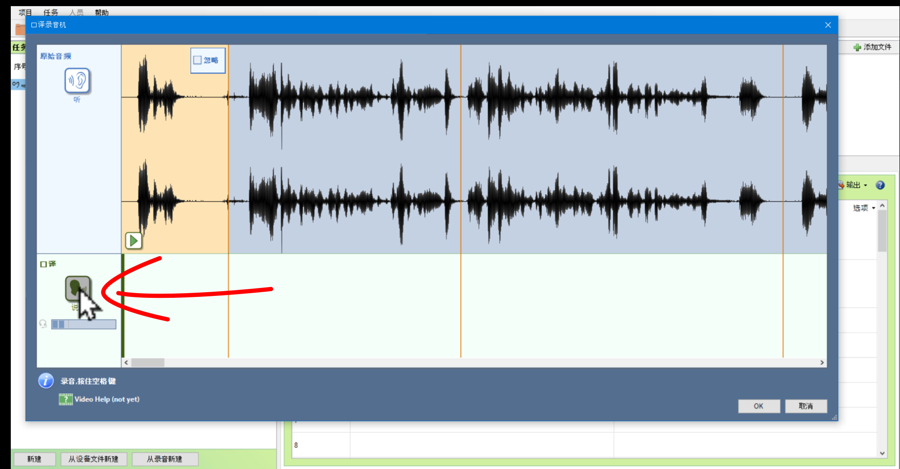
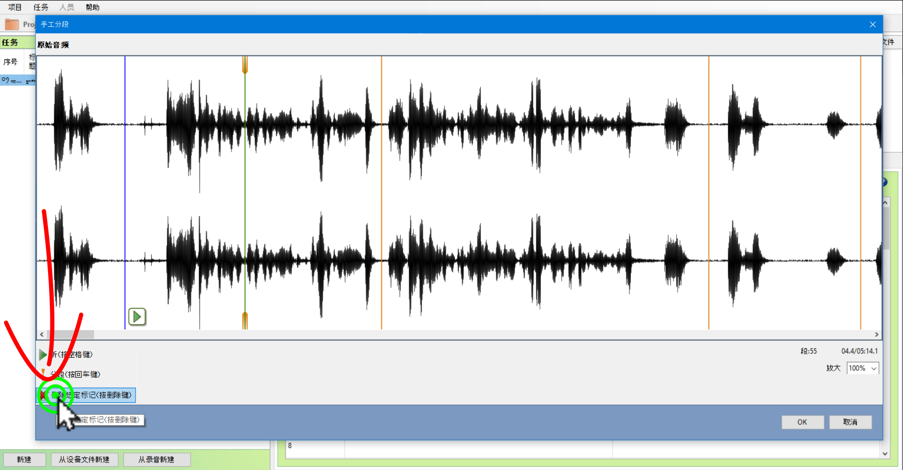
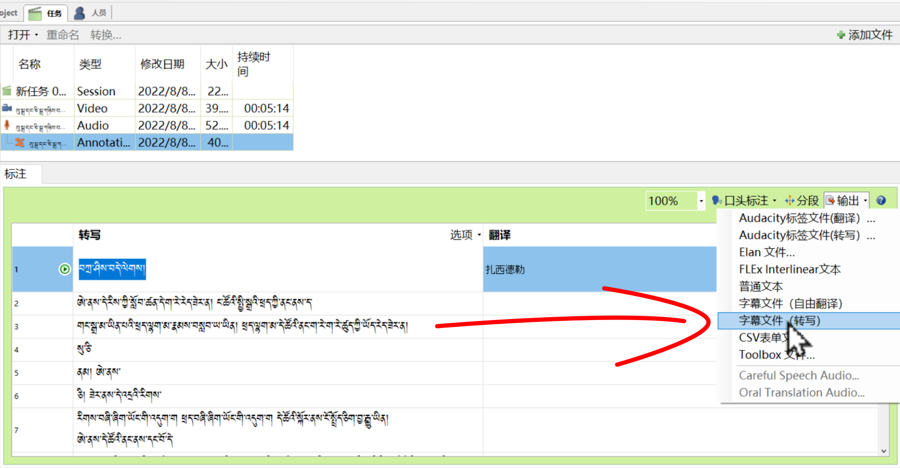

# སྐད་བསྒྱུར་དང་ཕྱིར་འདྲེན་བྱ་ཚུལ།

འདིར་ཡི་གེར་དབབ་རྒྱུའི་སྒྲ་ལ་སྐད་བསྒྱུར་འཇོག་ཚུལ་དང་དུམ་ཚན་བསྐྱར་སྒྲིག་བྱ་ཚུལ། བསྒྲིགས་ཟིན་པའི་ཡིག་ཆ་ཕྱིར་འདྲེན་བྱ་ཚུལ་རྣམས་ངོ་སྤྲོད་བྱས་ཡོད།
## ནང་དོན་གྱི་སྡེ་ཚན།

- 👉 སྒྲ་ལ་སྐད་བསྒྱུར་འཇོག་ཚུལ།
- 👉 སྒྲའི་དུམ་ཚན་བསྐྱར་སྒྲིག་བྱ་ཚུལ།
- 👉 བསྒྲིགས་ཟིན་ཡིག་ཆ་ཕྱིར་འདྲེན་བྱ་ཚུལ།

## ཚོད་ལྟའི་དྲི་བ།

ཚོད་ལྟའི་དྲི་བ་རྣམས་ལ་ལན་རེ་ངེས་པར་དུ་འདེམ་རོགས། དེ་དག་ཐོག་མ་ནས་ཤེས་དགོས་པའི་ངེས་པ་མེད་པས་གང་རུང་ཞིག་འདེམ་ཆོག

1. སྒྲའི་དུམ་ཚན་ཞིག་འགོག་དགོས་ན་གང་ལ་རྟགས་རྒྱག་དགོས་སམ། 口译༽ 跟读༽ 忽略༽ (正确回答)
2. སྒྲ་མཚམས་གསར་པ་ཞིག་སྣོན་དགོས་ན་གང་གནོན་དགོས་སམ། 忽略༽ 手工分段༽ 分段༽ (正确回答)
3. ཕབ་ཟིན་པ་དེ་ཡིག་རྐྱང་གི་ངོ་བོར་ཉར་ན་རྣམ་སྒྲིག་格式གང་འདེམ་དགོས། 撰写༽ 字幕文件（撰写）༽ 普通文本༽ (正确回答)

## 1. སྒྲ་ལ་སྐད་བསྒྱུར་འཇོག་ཚུལ།

འདིར་ཡིག་འབེབས་མཉེན་ཆས་ནང་སྒྲ་ཡི་གེར་འབེབས་སྐབས་ཡིག་བསྒྱུར་དང་སྐད་བསྒྱུར་གཉིས་ཆ་འཇོག་ཐུབ་པས་དེ་དག་གི་གོ་རིམ་ངོ་སྤྲོད་བྱས་ཡོད།

👇 དེ་ཅི་ལྟར་བྱ་ཚུལ་ལ་གཟིགས།

- སློབ་ཚན་གྱི་བརྙན། [དྲ་ཐག་འདིར་སྣུན།](https://drive.google.com/file/d/15MM6FmKtJSL7rBO73t36oWIHHQon3U-U/view?usp=sharing)

1. དྲི་བ། སྒྲའི་དུམ་ཚན་ཞིག་འགོག་དགོས་ན་གང་ལ་རྟགས་རྒྱག་དགོས་སམ།  
忽略༽ (正确回答)  跟读༽ 口译༽

## 2. སྒྲའི་དུམ་ཚན་བསྐྱར་སྒྲིག་བྱ་ཚུལ།

འདིར་མཉེན་ཆས་འདིས་རང་འགུལ་གྱིས་ཡིག་འབེབས་བྱ་རྒྱུའི་སྒྲ་དུམ་ཚན་ཐུང་ངུར་གཏུབ་འགྲོ་མོད་ཀྱང་། རེ་ཟུང་གི་དུམ་མཚམས་བསྐྱར་སྒྲིག་བྱ་ཚུལ་ངོ་སྤྲོད་བྱས་ཡོད།

👇 དེ་ཅི་ལྟར་བྱ་ཚུལ་ལ་གཟིགས།

- སློབ་ཚན་གྱི་བརྙན། [དྲ་ཐག་འདིར་སྣུན།](https://drive.google.com/file/d/12RNbUNATJhVWsPdv1LZiFloGeSpInV88/view?usp=sharing)

2. དྲི་བ། སྒྲ་མཚམས་གསར་པ་ཞིག་སྣོན་དགོས་ན་གང་གནོན་དགོས་སམ།  
忽略༽ 分段༽ (正确回答) 手工分段༽ 

## 3. བསྒྲིགས་ཟིན་ཡིག་ཆ་ཕྱིར་འདྲེན་བྱ་ཚུལ།

མཉེན་ཆས་འདི་ལ་སྤྱོད་མཁན་གྱི་དགོས་མཁོ་ལྟར་ཡིག་ཆའི་རྣམ་སྒྲིག་གམ་format 格式 འདྲ་མིན་སྣ་འཛོམས་ཤིག་ཡོད་པས་དེ་དག་བཀོལ་ཚུལ་ངོ་སྤྲོད་བྱས་ཡོད།

👇 དེ་ཅི་ལྟར་བྱ་ཚུལ་ལ་གཟིགས།

 

- སློབ་ཚན་གྱི་བརྙན། [དྲ་ཐག་འདིར་སྣུན།](https://drive.google.com/file/d/1hSxU1Z5zHWy-xSjvQoPPf6X-Ug6CO_OV/view?usp=sharing)

3. དྲི་བ། ཕབ་ཟིན་པ་དེ་ཡིག་རྐྱང་གི་ངོ་བོར་ཉར་ན་རྣམ་སྒྲིག་格式གང་འདེམ་དགོས།  
撰写༽ 字幕文件（撰写）༽ 普通文本༽ (正确回答)