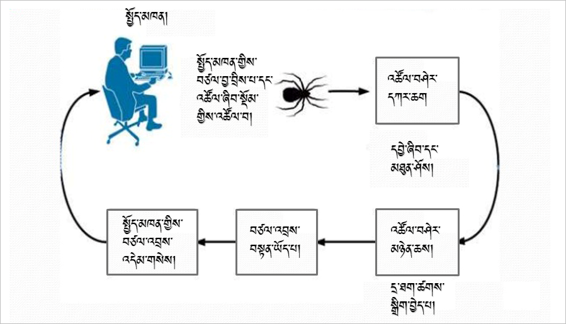
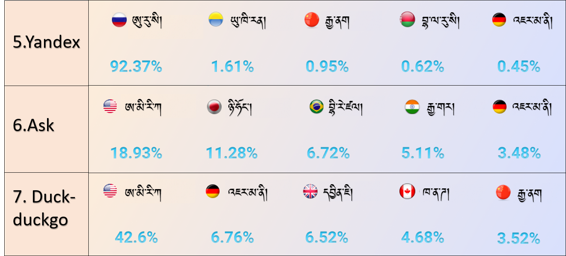
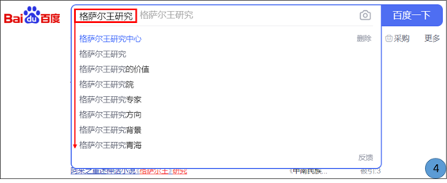
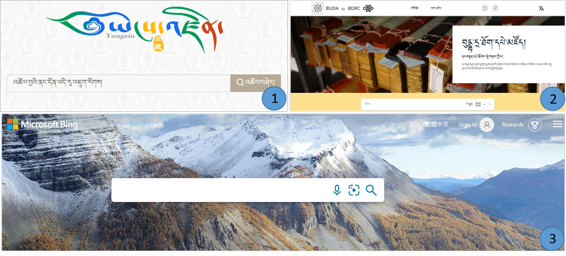

# 搜索引擎 འཚོལ་བཤེར་དྲ་ཚིགས། 

无论在生活中还是在工作中遇到任何困难或者问题，养成利用搜索引擎来解决的习惯极为重要，搜索引擎是为了便利查询和搜索而一群有识之士共同创建的知识和方法的宝库！与其仅靠个人的能力，还不如依靠千万个有识之士的智慧和知识来解决个人的困惑或者问题。ཁྱེད་ཀྱི་འཚོ་བ་དང་བྱ་བའི་ཁྲོད་གནད་དོན་ཅི་ཞིག་བྱུང་རུང་དེའི་སེལ་ཐབས་འཚོལ་བཤེར་དྲ་ཚིགས་ནང་འཚོལ་རྒྱུ་མ་བརྗེད། འཚོལ་བཤེར་དྲ་ཚིགས་ནི་འཚོལ་བཤེར་གྱི་ཆེད་དུ་སྐྱེས་བུ་རྣམ་དཔྱོད་ཅན་དུ་མས་ཐུན་མོང་དུ་བསྐྲུན་པའི་ཤེས་བྱ་དང་ཐབས་ལམ་གྱི་བང་མཛོད་ཅིག་ཡིན། དེས་ན་མི་གཅིག་གི་ཀླད་པ་བཀོལ་བ་ལས་ཤེས་རབ་ཅན་གྱི་མི་ཁྲི་ཕྲག་གི་ཀླད་པ་བཀོལ་ན་མི་བཟང་ངམ། 

## 1. 介绍搜索引擎的基本检索功能 འཚོལ་བཤེར་དྲ་ཚིགས་ཀྱི་རྨང་གཞིའི་བྱེད་ལས་ངོ་སྤྲོད།

其有三个基本功能：འདི་ལ་རྩ་བའི་བྱེད་ལས་གསུམ་ཡོད་དེ།  
🢣 1 Crawl 收集网站；དྲ་གནས་བསྡུ་རུབ།  
🢣 2 Index 编辑目录；དཀར་ཆག་སྒྲིག་པ།  
🢣 3 Rank 排列顺序：གོ་རིམ་སྒྲིག་པ།  

👉 第一，Crawl(或称 
昆虫)，它在网上发布的信息如：文本、图片、视频、音频和PDF等任何格式，该能搜索的 
信息收集在一起的网站链接到搜索引擎网站；དང་བོ། Crawl (སྡོམ་འབུ་) ཡང་ཟེར། འདིས་དྲ་ལམ་ན་སྤེལ་བའི་གནས་ཚུལ་དཔེར་ན། ཡིག་རྐྱང་དང་འདྲ་པར། 
བརྙན་དང་སྒྲ། PDFསོགས་མདོར་ན་རྣམ་སྒྲིག་གང་ཡིན་ལ་མ་ལྟོས་པར་དྲ་ལམ་ན་སྤེལ་བའི་གནས་ཚུལ་བསྡུ་རུབ་བྱེད་གང་ཆོག་པ་ 
རྣམས་འཚོལ་བསྡུ་བྱས་ཏེ་དྲ་ཐག་རྣམས་འཚོལ་བཤེར་དྲ་ཚིགས་ཀྱི་མ་ལག་ནང་མཐུད་སྦྱོར་བྱེད་པ་ཡིན།   

👉 第二，Index 它在以上网站收集者（Rank）收集和链接到的内容进行编目分类后，保存到搜索引擎网站上；གཉིས་པ། Index འདིས་གོང་གི་དྲ་གནས་བསྡུ་རུབ་བྱེད་མཁན་(སྡོམ་)གྱིས་བསྡུ་རུབ་དང་མཐུད་སྦྱོར་གང་བྱས་པ་རྣམས་ལ་ 
དཀར་ཆག་བསྒྲིགས་ཏེ་འཚོལ་བཤེར་དྲ་ཚིགས་མ་ལག་ནང་ཉར་ཚགས་བྱེད་པ་ཡིན།   

👉 第三，Rank 它在以上编目员（Index)所编辑到目录中的内容按照与使用搜索引擎者所要搜索内容的配对度来进行排列，并且仅几秒内完成。གསུམ་པ། Rank འདིས་གོང་གི་དཀར་ཆག་མཁན་གྱིས་བསྒྲིགས་པའི་དཀར་ཆག་ནང་གང་ཡོད་པ་རྣམས་འཚོལ་བཤེར་དྲ་ཚིགས་ 
སྤྱོད་མཁན་གྱི་བཙལ་བྱ་དང་ཐད་ཀར་མཐུན་ཆེུང་གི་གོ་རིམ་བསྒྲིགས་ཏེ་སྐར་ཆ་འགའི་ནང་སྤྱོད་མཁན་ལ་མཁོ་སྤྲོད་བྱེད་པ་ཡིན།  

## 2. 全球范围内使用率最高的搜索引擎 འཛམ་གླིང་ན་སྤྱོད་སྒོ་ཆེས་ཆེ་བའི་འཚོལ་བཤེར་དྲ་ཚིགས།

🢣 全球范围内使用率最高的搜索引擎名称。འཛམ་གླིང་ན་སྤྱོད་སྒོ་ཆེ་ཤོས་ཀྱི་འཚོལ་བཤེར་དྲ་ཚིགས་ཀྱི་ཐོ་གཞུང་།  
🢣 各国度使用搜索引擎使用率。རྒྱལ་ཁབ་རེ་རེའི་ནང་འཚོལ་བཤེར་དྲ་ཚིགས་རྣམས་བཀོལ་སྤྱོད་ཀྱི་ཚད།  

 

## 3. 在中国使用率最高的搜索引擎 ཀྲུང་གོ་ན་སྤྱོད་སྒོ་ཆེ་ཤོས་ཀྱི་འཚོལ་བཤེར་དྲ་ཚིགས་རྣམས། 

因各种原因，每年的使用率有波动。2019年CNNIC集团统计结果如下：རྒྱུ་རྐྱེན་སྣ་ཚོགས་ཀྱི་དབང་གིས་ལོ་རེའི་སྤྱོད་ཚད་ཀྱི་གོ་རིམ་གཅིག་མཚུངས་མིན་མོད། ༢༠༡༩ ལོར་CNNIC་ཚོགས་པའི་ཞིབ་འཇུག་འབྲས་བུ་ལྟར་ན།  
🢣 1 第一名；百度 ཨང་དང་བོ།  
🢣 2 第二名；Sogou ཨང་གཉིས་པ།  
🢣 3 第三名；360 搜索 ཨང་གསུམ་པ།  
🢣 4 第四名；神马搜索 ཨང་བཞི་བ།  
🢣 5 第五名；Microsoft Bing ཨང་ལྔ་བ།  
🢣 6 第六名；中国搜索 ཨང་དྲུག་པ།  

## 4. 搜索引擎 འཚོལ་བཤེར་དྲ་ཚིགས། 

### A. 百度 འཚོལ་བཤེར་དྲ་ཚིགས་ནང་དཔེར་བརྗོད་ཀྱི་ཚུལ་དུ་“གེ་སར་སྒྲུང་”གི་སྐོར་བཙལ་ཡོད། 一、以下是举百度搜寻引擎中搜索“格萨尔史诗”的例子，请看搜索结果浏览方式。དེའི་བཙལ་འབྲས་སོགས་ལ་བལྟ་སྟངས་གཤམ་ལ་གཟིགས། 

🔊 提示：前后输入不同的写法，或许搜到的结果更加丰富。འདིར་གསལ་འདེབས། བཙལ་བྱ་འབྲི་སྐབས་འབྲི་སྟངས་འདྲ་མིན་སྤྱད་ནས་བཙལ་ན་འབྲེལ་ཡོད་ཀྱི་བཙལ་འབྲས་དེ་ལས་མང་བ་རྙེད་སྲིད།  

👉 如：岭·格萨尔的史诗 དཔེར་ན། གླིང་གེ་སར་གྱི་སྒྲུང།  
👉 格萨尔史诗或者岭·史诗 གེ་སར་གྱི་སྒྲུང་། གླིང་སྒྲུང་།  
👉 格萨尔英雄传 སེང་ཆེན་ནོར་བུ་དགྲ་འདུལ་གྱི་རྣམ་ཐར།  
👉 或者岭·格萨尔的史诗 གླིང་སེང་ཆེན་གྱི་སྒྲུང་། ལྟ་བུ།  

依靠以下图片上显示的红框内容来选择你需要的搜索结果；གཤམ་གྱི་འདྲ་པར་ངོས་ཀྱི་དམར་རྟགས་ཅན་གྱི་འགྲེལ་བཤད། འདི་དག་ལ་བརྟེན་ནས་ཁྱེད་ཀྱི་བཙལ་འབྲས་འདེམ་གསེས་བྱ་དགོས།  
🢣 1 输入搜索内容 བཙལ་བྱའི་མིང་ཕྲིས།  
🢣 2 搜索结果 བཙལ་འབྲས་ཀྱི་གྲངས།  
🢣 3 搜索结果的题目 བཙལ་འབྲས་ཀྱི་མགོ་བརྗོད།  
🢣 4 其相关内容 དེ་འབྲེལ་གྱི་བརྗོད་བྱ་ཁག  
🢣 5 各搜索结果的来源 བཙལ་འབྲས་སོ་སོའི་ཁུངས།  
🢣 6 搜索内容相关的其他材料 བཙལ་བྱ་དང་འབྲེལ་བའི་རྒྱུ་ཆ་གཞན།  

 

### B. 改换搜索内容的名目来搜索的结果 བཙལ་བྱའི་མིང་འགྱུར་བ་བཏང་ནས་བཙལ་བའི་བཙལ་འབྲས།  

在百度上改换搜索内容的名目来搜索的不同结果
百度 བཙལ་བྱའི་མིང་འགྱུར་བ་བཏང་ནས་བཙལ་ན་བཙལ་འབྲས་ཀྱི་གྲངས་ཀ་མ་འདྲ་བ། 

🢣 1 格桑尔王  
🢣 2 格桑尔王的故事  
🢣 3 格桑尔王研究  
🢣 4 输入搜索内容时显示相似的内容。འཚོལ་གནས་ནང་བཙལ་བྱ་འབྲི་སྐབས་ཀྱི་དེ་དང་འདྲ་མཚུངས་རིགས་བསྟན་པ།  

 

 

### C. 关于各学科的其他网站目录 རིག་ཚན་སོ་སོ་དང་འབྲེལ་བའི་དྲ་ཚིགས་གཞན་གྱི་ཐོ་གཞུང་། 

在搜寻引擎上搜索内容后，相关论文的题目复制到以下网站上进行搜索。བཙལ་བྱ་དེ་འཚོལ་བཤེར་དྲ་ཚིགས་ནང་བཙལ་རྗེས་དཔྱད་རྩོམ་རིགས་ཀྱི་ཁ་བྱང་ངོ་བཤུ་བྱས་ཏེ་གཤམ་བཀོད་ཀྱི་དྲ་ཚིགས་སོ་སོའི་ནང་ཚོལ། 这些网站是各学科相应的网站。  
དེ་དག་ནི་རིག་ཚན་རེར་ཆེད་དམིགས་ཀྱི་དྲ་ཚིགས་ཡིན། 

## 5. 藏文搜索引擎 བོད་ཡིག་འཚོལ་བཤེར་དྲ་ཚིགས། 

总体上，达到标准的藏文搜索引擎少之极少。建设中的藏文搜索引擎和能搜索藏文的网站如下： སྤྱིར་བོད་ཡིག་གི་འཚོལ་བཤེར་དྲ་ཚིགས་ཚད་ལྡན་ཧ་ཅང་ཉུང་མོད། བོད་ཡིག་འཚོལ་བཤེར་དྲ་ཚིགས་དང་བོད་ཡིག་འཚོལ་ཐུབ་ས་འགའ། 

🢣 云藏搜索引擎 ཡོངས་འཛིན་འཚོལ་བཤེར་དྲ་ཚིགས།  
🢣 buda.zju.edu.cn Buda电子图书馆 བུདྡྷ་དྲ་ཐོག་དཔེ་མཛོད།  
🢣 Microsoft Bing 搜索引擎。 Microsoft Bing འཚོལ་བཤེར་དྲ་ཚིགས། 

<iframe src="https://shimowendang.com/forms/0BEmUyxxCPY4lIii/fill?channel=1" style="height:1050px;width:800px;"></iframe>

## [BUDA 操作指南 བུདྡྷ་དྲ་བའི་བཀོལ་སྤྱོད་ལམ་སྟོན།](../../menu/menu)