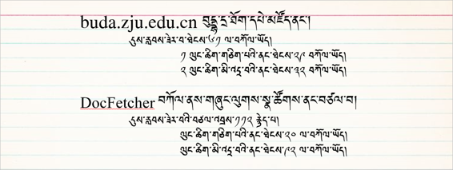
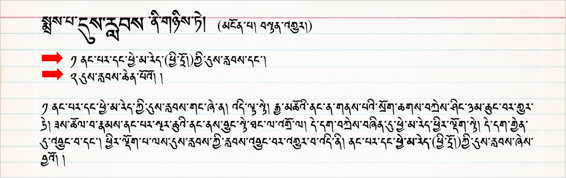
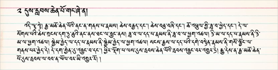

# 研究词汇的含义 ཐ་སྙད་ཀྱི་ནང་དོན་འཚོལ་ཞིབ་བྱ་ཐབས་རིམ་པ་གསུམ། 

搜索在每一著作中对浪潮这一词概念的解释以及每位学者对词的解释进行调查和探索的课程与成果。以浪潮为例着重指出了符合现代的最简单的研究方法和所需的材料。 གཞུང་སོ་སོའི་ནང་གི་དུས་རླབས་ཟེར་བའི་ཐ་སྙད་ཀྱི་འགྲེལ་བཤད་དང་མཁས་པ་སོ་སོས་དེའི་གོ་དོན་འགྲེལ་ཚུལ་ལ་བརྟག་དཔྱད་བྱས་པའི་གྲུབ་འབྲས་དང་འཚོལ་ཐབས་བཅས་ཀྱི་དཔེ་མཚོན་ངོ་སྤྲོད་ཅིག་ཡིན། འདིའི་ནང་དུས་རླབས་ཟེར་བའི་ཐ་སྙད་དཔེར་བཀོད་ནས་དུས་རབས་དང་མཐུན་པའི་འཚོལ་ཞིབ་བྱེད་ཐབས་སླ་ཤོས་ཁག་དང་རྒྱུ་ཆ་གང་དག་དགོས་པ་གཙོ་བོར་བསྟན་ཡོད། 

“དུས་རླབས་”使用此词的典型的例子 “དུས་རླབས་”ཟེར་བའི་ཐ་སྙད་དེ་བཀོལ་སྤྱོད་བྱས་པའི་དཔེ་མཚོན་གྱི་ཤོ་ལོ་ཀ  

此词在各著作中使用的次数 གཞུང་སོ་སོའི་ནང་ཐ་སྙད་འདི་བཀོལ་ཐེངས། 

在各个要的著作中使用“浪潮”这一词的搜索结果 གལ་ཆེའི་གཞུང་ལུགས་སོ་སོའི་ནང་“དུས་རླབས་”ཟེར་བའི་ཐ་སྙད་འདི་བཀོལ་ཚད་ཀྱི་བརྟག་འབྲས།

## 1. 关于查找词法 ཐ་སྙད་འདི་འཚོལ་ཐབས་གསུམ་གྱི་སྐོར།  

🢣 1 VS Code 软件 Visual Studio Code ཁོ་ཌི་མཉེན་ཆས།  
🢣 2 Docfetcher 搜索软件 DocFetcher ནགས་ཕྱི་འཚོལ་ཆས།  
🢣 3 buda.zju.edu.cn 网站 བུདྡྷ་དྲ་ཐོག་དཔེ་མཚོ། 

### A. 使用VS Code软件的搜索法 མཉེན་ཆས་ VS Code བཀོལ་ནས་འཚོལ་ཐབས།  

使用此软件在德格大藏经Text里搜索”浪潮“的方法 （40秒里搜到的结果） མཉེན་ཆས་འདིའི་ནང་སྡེ་དགེའི་བཀའ་འགྱུར་(ཡིག་རྐྱང་།)ནང་“དུས་རླབས་”ཞེས་པའི་ཐ་སྙད་བཙལ་བ། (སྐར་ཆ་༥༠ ནང་བཙལ་བ།)  

### B. 德格大藏经里搜索此词的方法 སྡེ་དགེའི་བསྟན་འགྱུར་ནང་ཐ་སྙད་འདི་བཙལ་བ། 

使用此软件在德格大藏经Text里搜索”浪潮“的方法 （40秒里搜到的结果）མཉེན་ཆས་འདི་བཀོལ་ནས་སྡེ་དགེའི་བསྟན་འགྱུར་(ཡིག་རྐྱང་)ནང་ཐ་སྙད་འདི་བཙལ་བ། (སྐར་ཆ་༥༠ ནང་བཙལ་བ།)  
 

### C. 使用doctfecher软件的搜索法 ནགས་ཕྱི་འཚོལ་ཆས་བཀོལ་ནས་འཚོལ་བ།  

🔊 གསལ་འདེབས། ནགས་ཕྱི་འཚོལ་ཆས་ནང་ཐ་སྙད་སོགས་འཚོལ་ཞིབ་བྱེད་ཐུབ་པར་ཐོག་མར་ངེས་པར་སྒྲིག་དགོས་པ་ནི། གཤམ་གྱི་འགུལ་རིས་ལ་གཟིགས།

使用Doctfecher在个著作text里搜索”浪潮“。（40秒里搜到的结果）ནགས་ཕྱི་འཚོལ་ཆས་བཀོལ་ནས་གཞུང་ལུགས་སྣ་ཚོགས་(ཡིག་རྐྱང་)ནང་“དུས་རླབས་”ཟེར་བའི་ཐ་སྙད་འདི་བཙལ་བ། (སྐར་ཆ་༤༠ ནང་བཙལ་བ།) 
 

 

### D. 使用Buda网站的搜索法 buda བུདྡྷ་དྲ་ཐོག་དཔེ་མཛོད་ནང་བཙལ་བ། 

下面是如何使用网站搜索此词的方法 （40秒里搜到的结果）བུདྡྷ་དྲ་ཐོག་དཔེ་མཛོད་འདིའི་ནང་ཐ་སྙད་འདི་བཙལ་ཐབས་དང་། བཙལ་འབྲས། (སྐར་ཆ་༥༠ ནང་བཙལ་བ།)  

 

### “浪潮”的含义在各个著作里的解释 གཞུང་ལུགས་ནང་དུས་རླབས་ཀྱི་གོ་དོན་འགྲེལ་བཤད།  

来源：《丹珠儿》 《论藏》部 ཡོང་ཁུངས། བསྟན་འགྱུར་ནང་གི་མངོན་པ།  

 

<iframe src="https://shimowendang.com/forms/QStBTLMFBrAQzQPo/fill?channel=1" style="height:1050px;width:800px;"></iframe>

##  [教程目录 བཀོལ་སྤྱོད་ལམ་སྟོན་གྱི་དཀར་ཆག](https://github.com/buda-base/budax)