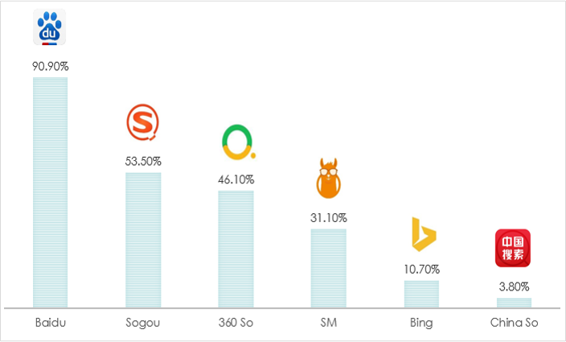

འཚོལ་བཤེར་དྲ་ཚིགས། 搜索引擎
འཚོལ་བཤེར་དྲ་ཚིགས། 搜索引擎

 

 

  
ཁྱེད་ཀྱི་འཚོ་བ་དང་བྱ་བའི་ཁྲོད་གནད་དོན་ཅི་ཞིག་བྱུང་རུང་དེའི་སེལ་ཐབས་འཚོལ་བཤེར་དྲ་ཚིགས་ནང་འཚོལ་རྒྱུ་མ་བརྗེད། འཚོལ་བཤེར་དྲ་ཚིགས་ནི་འཚོལ་བཤེར་གྱི་ཆེད་དུ་སྐྱེས་བུ་རྣམ་དཔྱོད་ཅན་དུ་མས་ཐུན་མོང་དུ་བསྐྲུན་པའི་ཤེས་བྱ་དང་ཐབས་ལམ་གྱི་བང་མཛོད་ཅིག་ཡིན། དེས་ན་མི་གཅིག་གི་ཀླད་པ་བཀོལ་བ་ལས་ཤེས་རབ་ཅན་གྱི་མི་ཁྲི་ཕྲག་གི་ཀླད་པ་བཀོལ་ན་མི་བཟང་ངམ།  
无论在生活中还是在工作中遇到任何困难或者问题，养成利用搜索引擎来解决的习惯极为重要，搜索引擎是为了便利查询和搜索而一群有识之士共同创建的知识和方法的宝库！与其仅靠个人的能力，还不如依靠千万个有识之士的智慧和知识来解决个人的困惑或者问题。

 

གཤམ་གྱི་དྲི་བ་ཁག་ལ་ངེས་པར་དུ་ལན་འདེབ་དགོས།  恳请务必选择以下选项：[矩阵量表题] *

|   | ཤེས། 了解 | མི་ཤེས་། 不了解 |
| ༡༽ འཚོལ་བཤེར་དྲ་ཚིགས་ནང་བཙལ་འབྲས་ལ་ཞིབ་ཚགས་ཀྱིས་བལྟ་ཚུལ་ཤེས་སམ། 搜索引擎网站上搜到的结果，您会详细得阅览吗？ | ○ | ○ |
| ༢༽ ཀྲུང་གོའི་འཚོལ་བཤེར་དྲ་ཚིགས་རྣམས་བཀོལ་སྤྱོད་ཀྱི་ཚད་མཐོ་དམན་ཤེས་སམ། 您了解国内引擎网站类的使用率吗？ | ○ | ○ |
| ༣༽ འཚོལ་བཤེར་དྲ་ཚིགས་ཀྱི་རྩ་བའི་བྱེད་ལས་གཙོ་བོ་ག་ཚོད་ཡོད་མེད་ཤེས་སམ། 您了解引擎网站的几个基本功能吗？ | ○ | ○ |
| ༤༽ འཛམ་གླིང་གི་འཚོལ་བཤེར་དྲ་ཚིགས་ཁྱབ་རྒྱ་ཆེ་ཤོས་གང་གང་ཡིན་ཤེས་སམ། 您了解全球范围内使用率最高的几个引擎网站吗？ | ○ | ○ |

 

༡༽ འཚོལ་བཤེར་དྲ་ཚིགས་ཀྱི་རྨང་གཞིའི་བྱེད་ལས་ངོ་སྤྲོད།介绍搜索引擎的基本检索功能  
  
འདི་ལ་རྩ་བའི་བྱེད་ལས་གསུམ་ཡོད་དེ། 其有三个基本功能：  
🢣 ༡ དྲ་གནས་བསྡུ་རུབ། Crawl 收集网站；  
🢣 ༢ དཀར་ཆག་སྒྲིག་པ། Index 编辑目录；  
🢣 ༣ གོ་རིམ་སྒྲིག་པ། Rank 排列顺序：  
  
👉 དང་བོ། Crawl (སྡོམ་འབུ་) ཡང་ཟེར། འདིས་དྲ་ལམ་ན་སྤེལ་བའི་གནས་ཚུལ་དཔེར་ན། ཡིག་རྐྱང་དང་འདྲ་པར།   
བརྙན་དང་སྒྲ། PDFསོགས་མདོར་ན་རྣམ་སྒྲིག་གང་ཡིན་ལ་མ་ལྟོས་པར་དྲ་ལམ་ན་སྤེལ་བའི་གནས་ཚུལ་བསྡུ་རུབ་བྱེད་གང་ཆོག་པ་  
རྣམས་འཚོལ་བསྡུ་བྱས་ཏེ་དྲ་ཐག་རྣམས་འཚོལ་བཤེར་དྲ་ཚིགས་ཀྱི་མ་ལག་ནང་མཐུད་སྦྱོར་བྱེད་པ་ཡིན།  第一，Crawl(或称  
昆虫)，它在网上发布的信息如：文本、图片、视频、音频和PDF等任何格式，该能搜索的  
信息收集在一起的网站链接到搜索引擎网站；  
  
👉 གཉིས་པ། Index འདིས་གོང་གི་དྲ་གནས་བསྡུ་རུབ་བྱེད་མཁན་(སྡོམ་)གྱིས་བསྡུ་རུབ་དང་མཐུད་སྦྱོར་གང་བྱས་པ་རྣམས་ལ་  
དཀར་ཆག་བསྒྲིགས་ཏེ་འཚོལ་བཤེར་དྲ་ཚིགས་མ་ལག་ནང་ཉར་ཚགས་བྱེད་པ་ཡིན།  第二，Index 它在以上网站收集者（Rank）收集和链接到的内容进行编目分类后，保存到搜索引擎网站上；  
  
👉གསུམ་པ། Rank འདིས་གོང་གི་དཀར་ཆག་མཁན་གྱིས་བསྒྲིགས་པའི་དཀར་ཆག་ནང་གང་ཡོད་པ་རྣམས་འཚོལ་བཤེར་དྲ་ཚིགས་  
སྤྱོད་མཁན་གྱི་བཙལ་བྱ་དང་ཐད་ཀར་མཐུན་ཆེུང་གི་གོ་རིམ་བསྒྲིགས་ཏེ་སྐར་ཆ་འགའི་ནང་སྤྱོད་མཁན་ལ་མཁོ་སྤྲོད་བྱེད་པ་ཡིན། 第三，Rank 它在以上编目员（Index)所编辑到目录中的内容按照与使用搜索引擎者所要搜索内容的配对度来进行排列，并且仅几秒内完成。  
 

 

 

  
༡༽ འཚོལ་བཤེར་དྲ་ཚིགས་ལ་རྩ་བའི་བྱེད་ལས་གཙོ་བོ་ག་ཚོད་ཡོད་པ་ཤེས་སོང་ངམ། 您知道搜索引擎有几个基本检索功能吗？ [单选题] *

| ཤེས་སོང་། 知道(正确答案) | ཤེས་མ་སོང་། 不知道 |   |

 

  
༢༽ འཛམ་གླིང་ན་སྤྱོད་སྒོ་ཆེས་ཆེ་བའི་འཚོལ་བཤེར་དྲ་ཚིགས།全球范围内使用率最高的搜索引擎  
  
🢣 འཛམ་གླིང་ན་སྤྱོད་སྒོ་ཆེ་ཤོས་ཀྱི་འཚོལ་བཤེར་དྲ་ཚིགས་ཀྱི་ཐོ་གཞུང་། 全球范围内使用率最高的搜索引擎名称。  
🢣 རྒྱལ་ཁབ་རེ་རེའི་ནང་འཚོལ་བཤེར་དྲ་ཚིགས་རྣམས་བཀོལ་སྤྱོད་ཀྱི་ཚད། 各国度使用搜索引擎使用率。  
 

  
  

 

 

  
༢༽ འཛམ་གླིང་ན་ཁྱབ་རྒྱ་ཆེ་ཤོས་ཀྱི་འཚོལ་བཤེར་དྲ་ཚིགས་གང་གང་ཡིན་ཤེས་སོང་ངམ། 全球范围内使用率最高的几个搜索引擎，您知道了吗？ [单选题] *

| ཤེས་སོང་། 知道(正确答案) | ཤེས་མ་སོང་། 不知道 |   |

 

  
༣༽ ཀྲུང་གོ་ན་སྤྱོད་སྒོ་ཆེ་ཤོས་ཀྱི་འཚོལ་བཤེར་དྲ་ཚིགས་རྣམས། 在中国使用率最高的搜索引擎  
  
རྒྱུ་རྐྱེན་སྣ་ཚོགས་ཀྱི་དབང་གིས་ལོ་རེའི་སྤྱོད་ཚད་ཀྱི་གོ་རིམ་གཅིག་མཚུངས་མིན་མོད། ༢༠༡༩ ལོར་CNNIC་ཚོགས་པའི་ཞིབ་འཇུག་འབྲས་བུ་ལྟར་ན། 因各种原因，每年的使用率有波动。2019年CNNIC集团统计结果如下：  
🢣 ༡ 百度 ཨང་དང་བོ། 第一名；  
🢣 ༢ Sogou ཨང་གཉིས་པ། 第二名；  
🢣 ༣ 360 搜索 ཨང་གསུམ་པ། 第三名；  
🢣 ༤ 神马搜索 ཨང་བཞི་བ། 第四名；  
🢣 ༥ Microsoft Bing ཨང་ལྔ་བ། 第五名；  
🢣 ༦ 中国搜索 ཨང་དྲུག་པ། 第六名。  
 

 

 

  
༣༽ ཀྲུང་གོའི་འཚོལ་བཤེར་དྲ་ཚིགས་རྣམས་སྤྱོད་ཚད་ཀྱི་རིམ་པ་ཤེས་སོང་ངམ། 在中国使用搜索引擎的排名，您知道了吗？ [单选题] *

| ཤེས་སོང་། 知道(正确答案) | ཤེས་མ་སོང་། 不知道 |   |

 

  
༤༽འཚོལ་བཤེར་དྲ་ཚིགས། 搜索引擎  
  
ཀ༽འདིར་百度 འཚོལ་བཤེར་དྲ་ཚིགས་ནང་དཔེར་བརྗོད་ཀྱི་ཚུལ་དུ་“གེ་སར་སྒྲུང་”གི་སྐོར་བཙལ་ཡོད། དེའི་བཙལ་འབྲས་སོགས་ལ་བལྟ་སྟངས་གཤམ་ལ་གཟིགས།一、以下是举百度搜寻引擎中搜索“格萨尔史诗”的例子，请看搜索结果浏览方式。  
  
🔊 གསལ་འདེབས། བཙལ་བྱ་འབྲི་སྐབས་འབྲི་སྟངས་འདྲ་མིན་སྤྱད་ནས་བཙལ་ན་འབྲེལ་ཡོད་ཀྱི་བཙལ་འབྲས་དེ་ལས་མང་བ་རྙེད་སྲིད། 提示：前后输入不同的写法，或许搜到的结果更加丰富。  
  
👉 དཔེར་ན། གླིང་གེ་སར་གྱི་སྒྲུང། 如：岭·格萨尔的史诗  
👉 གེ་སར་གྱི་སྒྲུང་། གླིང་སྒྲུང་། 格萨尔史诗或者岭·史诗  
👉 སེང་ཆེན་ནོར་བུ་དགྲ་འདུལ་གྱི་རྣམ་ཐར། 格萨尔英雄传  
👉 གླིང་སེང་ཆེན་གྱི་སྒྲུང་། ལྟ་བུ། 或者岭·格萨尔的史诗  
  
གཤམ་གྱི་འདྲ་པར་ངོས་ཀྱི་དམར་རྟགས་ཅན་གྱི་འགྲེལ་བཤད། འདི་དག་ལ་བརྟེན་ནས་ཁྱེད་ཀྱི་བཙལ་འབྲས་འདེམ་གསེས་བྱ་དགོས། 依靠以下图片上显示的红框内容来选择你需要的搜索结果；  
🢣 ༡ བཙལ་བྱའི་མིང་ཕྲིས། 输入搜索内容  
🢣 ༢ བཙལ་འབྲས་ཀྱི་གྲངས། 搜索结果  
🢣 ༣ བཙལ་འབྲས་ཀྱི་མགོ་བརྗོད། 搜索结果的题目  
🢣 ༤ དེ་འབྲེལ་གྱི་བརྗོད་བྱ་ཁག 其相关内容  
🢣 ༥ བཙལ་འབྲས་སོ་སོའི་ཁུངས། 各搜索结果的来源  
🢣 ༦ བཙལ་བྱ་དང་འབྲེལ་བའི་རྒྱུ་ཆ་གཞན། 搜索内容相关的其他材料  
 

 

  
ཁ༽ བཙལ་བྱའི་མིང་འགྱུར་བ་བཏང་ནས་བཙལ་བའི་བཙལ་འབྲས།  改换搜索内容的名目来搜索的结果  
  
百度 བཙལ་བྱའི་མིང་འགྱུར་བ་བཏང་ནས་བཙལ་ན་བཙལ་འབྲས་ཀྱི་གྲངས་ཀ་མ་འདྲ་བ། 在百度上改换搜索内容的名目来搜索的不同结果

🢣༡ 格桑尔王  
🢣 ༢ 格桑尔王的故事  
🢣 ༣ 格桑尔王研究  
🢣 ༤ འཚོལ་གནས་ནང་བཙལ་བྱ་འབྲི་སྐབས་ཀྱི་དེ་དང་འདྲ་མཚུངས་རིགས་བསྟན་པ། 输入搜索内容时显示相似的内容。  
 

  
  
  
 

ག༽ རིག་ཚན་སོ་སོ་དང་འབྲེལ་བའི་དྲ་ཚིགས་གཞན་གྱི་ཐོ་གཞུང་། 关于各学科的其他网站目录  
  
བཙལ་བྱ་དེ་འཚོལ་བཤེར་དྲ་ཚིགས་ནང་བཙལ་རྗེས་དཔྱད་རྩོམ་རིགས་ཀྱི་ཁ་བྱང་ངོ་བཤུ་བྱས་ཏེ་གཤམ་བཀོད་ཀྱི་དྲ་ཚིགས་སོ་སོའི་ནང་ཚོལ། 在搜寻引擎上搜索内容后，相关论文的题目复制到以下网站上进行搜索。  
དེ་དག་ནི་རིག་ཚན་རེར་ཆེད་དམིགས་ཀྱི་དྲ་ཚིགས་ཡིན། 这些网站是各学科相应的网站。  
 

 

 

  
༤༽ འཚོལ་བཤེར་དྲ་ཚིགས་ནང་བཙལ་འབྲས་ལ་ཞིབ་ཚགས་ཀྱིས་བལྟ་ཚུལ་ཤེས་སོང་ངམ། 搜寻引擎上详细阅览搜索结果的方式，您知道了吗？ [单选题] *

| ཤེས་སོང་། 知道(正确答案) | ཤེས་མ་སོང་། 不知道 |   |

 

  
༥༽ བོད་ཡིག་འཚོལ་བཤེར་དྲ་ཚིགས། 藏文搜索引擎  
  
སྤྱིར་བོད་ཡིག་གི་འཚོལ་བཤེར་དྲ་ཚིགས་ཚད་ལྡན་ཧ་ཅང་ཉུང་མོད། བོད་ཡིག་འཚོལ་བཤེར་དྲ་ཚིགས་དང་བོད་ཡིག་འཚོལ་ཐུབ་ས་འགའ། 总体上，达到标准的藏文搜索引擎少之极少。建设中的藏文搜索引擎和能搜索藏文的网站如下：  
🢣 ཡོངས་འཛིན་འཚོལ་བཤེར་དྲ་ཚིགས། 云藏搜索引擎  
🢣 བུདྡྷ་དྲ་ཐོག་དཔེ་མཛོད། buda.zju.edu.cn Buda电子图书馆  
🢣 Microsoft Bing འཚོལ་བཤེར་དྲ་ཚིགས། Microsoft Bing 搜索引擎  
 

 

 

ཕོ་མོ། 您的性别 [单选题] *

| ○ཕོ། 男 | ○མོ། 女 |

 

ཁྱེད་ཀྱི་སྐད་གདངས་མདོ་དབུས་ཁམས་གསུམ་གང་གི་སྐད་གདངས་ཡིན། 你说藏区哪种方言? [单选题] *

| ○དབུས་སྐད།卫藏方言 | ○ཁམས་སྐད། 康巴方言 | ○ཨམ་སྐད། 安多方言 | ○གཞན། 其他方言 |

 

དྲི་བ་ཡོངས་ལ་ལན་བཏབ་རྗེས་འོག་གི་་སྤེལ་་ཟེར་བ་དེའི་སྟེང་བསྣུན་ན་དངོས་སུ་སྤེལ་འགྲོ་བ་ཡིན། ཐུགས་རྗེ་ཆེ།  
  
完成所有的问题后请您点击“提交”， 谢谢！ 

སྤེལ། 提交问卷

 

 

 

