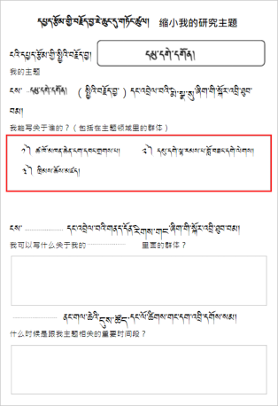

༼ནོར༽ནགས་ཕྱི་འཚོལ་ཆས་བཀོལ་ནས་དཔྱད་རྩོམ་ཀྱི་བརྗོད་བྱ་གཏན་འབེབས།用Docfetcher搜索来明确论文的主题
༼ནོར༽ནགས་ཕྱི་འཚོལ་ཆས་བཀོལ་ནས་དཔྱད་རྩོམ་ཀྱི་བརྗོད་བྱ་གཏན་འབེབས།用Docfetcher搜索来明确论文的主题

---

ཁྱེད་རང་དོ་སྣང་ཡོད་སའི་ཞིབ་འཇུག་གི་བརྗོད་གཞིའི་སྐོར་ལ་རྒྱུས་ལོན་ཟབ་མོ་ཡོང་ཆེད། ང་ཚོས་ཁྱེད་ལ་[ནགས་ཕྱི་འཚོལ་ཆས་བཀོལ་སྟངས་](=95681548)སྐོར་གྱི་དཔེ་མཚོན་སློབ་ཚན་ཞིག་བཀོད་སྒྲིག་བྱས་ཡོད། ནགས་ཕྱི་འཚོལ་ཆས་ཀྱིས་དཔེ་དེབ་དང་ཡིག་ཆ་སོགས་ལས་ཁྱེད་རང་གི་བརྗོད་གཞི་དེ་དང་འབྲེལ་བའི་ཆ་འཕྲིན་འཚོལ་སྡུད་བྱེད་ཐུབ།  

为了深度了解自己所关注的研究主题，我们为您准备了[docfetcher](=95681548)搜索，她可以帮您从书籍和文件等中搜集有关研究主题的信息。

ཀ ༽ བཙལ་ཐབས་རེའུ་མིག 搜索方法的表格  
རང་ཉིད་ཀྱི་དགོས་མཁོ་དང་བསྟུན་ནས་གཤམ་གྱི་བཙལ་ཐབས་རེའུ་མིག་ནང་གི་བཙལ་ཐབས་སྤྱད་ནས་འཚོལ་བཤེར་བྱ་ཆོག  
可以按照表格所示来搜索文献。  

ཁ ༽ འཚོལ་བྱེད་ཚིག་གནད། 输入的关键词  
འཚོལ་བྱེད་ཚིག་གནད་ནི་སྐབས་དེའི་བརྗོད་བྱ་དང་འབྲེལ་བའི་བཙལ་བྱའི་ཐ་སྙད་ལ་གོ་དགོས། སྐབས་འདིར་དམུ་དགེ་དགོན་དང་འབྲེལ་བའི་གལ་ཆེའི་མི་སྣ་འཚོལ་སྐབས་ཀྱི་ཚིག་གནད་མཉམ་སྡེབས་ཀྱི་རེའུ་མིག་དཔེ་མཚོན་རུ་བཀོད་ཡོད།  
输入的关键词是相应主题的搜索词，以下是搜索有关毛尔盖寺院的人物时所输入相关关键词范例  

ག༽ བརྗོད་བྱ་དང་འབྲེལ་བའི་མི་སྣ་འཚོལ་ཚུལ། 搜索有关主题的人物  
༡༽ དཔྱད་རྩོམ་གྱི་བརྗོད་བྱ་ཆུང་ངུ་གཏོང་སྟངས་ཀྱི་འགེངས་ཤོག ([ཕབ་ལེན།](=95681548)) 缩小研究主题的分析表([下载](=95681548)) 

འོག་གི་འདི་ནི་དཔྱད་རྩོམ་གྱི་བརྗོད་བྱ་ཆུང་རུ་གཏོང་སྟངས་ཀྱི་འགེངས་ཤོག་ཡིན། སྐབས་འདིར་དཔྱད་རྩོམ་གྱི་སྤྱིའི་བརྗོད་བྱ་ངོས་བཟུང་ནས་འབྲི་དགོས། སྐབས་འདིར་༼  དམུ་དགེ་དགོན། ༽ དཔེ་མཚོན་དུ་བཟུང་ཡོད། 以下是缩小研究主题的分析表，此时需要围绕论文的整体内容来填写，围绕毛尔盖寺院的范例如下：

༢༽ དམུ་དགེ་དགོན་དང་འབྲེལ་བའི་མི་སྣ་འཚོལ་སྟངས་ལས་མཚན་གནས་བྱེ་བྲག་པ་གཅིག་འཚོལ་ཚུལ། 搜索有关毛尔盖寺院的人物之具体人名  
གོང་གི་འགེངས་ཤོག་ནང་གི་དྲི་བ་༼ངས་དམུ་དགེ་དགོན་དང་འབྲེལ་བའི་མི་སྣ་སུ་ཞིག་གི་སྐོར་ལ་འབྲི་ཐུབ་བམ།༽ ཞེས་བའི་སྐབས་ཀྱི་དམུ་དགེ་དགོན་དང་འབྲེལ་བའི་མི་སྣ་ནགས་ཕྱི་འཚོལ་ཆས་ནང་བཙལ་སྟངས་ལ་བལྟ་བར་བྱ། དཔེ་མཚོན། ༼དམུ་དགེ་དགོན།     དང་།    མཁན་ཆེན། ༽请在docfetcher上查看以上分析表上的“我能写关于毛尔盖寺院的哪位人物？”一问的关于毛尔盖寺院的人物搜索方式。如：毛尔盖寺院 和 上师

༣༽ དམུ་དགེ་དགོན་དང་འབྲེལ་བའི་མི་སྣ་འཚོལ་སྟངས་ལས་མཚན་གནས་ཁ་ཤས་མཉམ་དུ་འཚོལ་ཚུལ། 搜索有关毛尔盖寺院的人物之若干人物  
གོང་གི་འགེངས་ཤོག་ནང་གི་དྲི་བ་༼ངས་དམུ་དགེ་དགོན་དང་འབྲེལ་བའི་མི་སྣ་སུ་ཞིག་གི་སྐོར་ལ་འབྲི་ཐུབ་བམ།༽ ཞེས་བའི་སྐབས་ཀྱི་དམུ་དགེ་དགོན་དང་འབྲེལ་བའི་མི་སྣ་ནགས་ཕྱི་འཚོལ་ཆས་ནང་བཙལ་སྟངས་ལ་བལྟ་བར་བྱ། དཔེ་མཚོན། ༼དམུ་དགེ་དགོན། དང་། ལྷ་རམས་པ། རིན་པོ་ཆེ། རྡོ་རམས་པ། ༽   
请在docfetcher上查看以上分析表上的“我能写关于毛尔盖寺院的哪位人物？”一问的关于毛尔盖寺院的人物搜索方式。如：毛尔盖寺院 和 拉然巴 和 仁波切 和 朵然巴  

༤༽ དཔྱད་རྩོམ་གྱི་བརྗོད་བྱ་ཆུང་དུ་གཏོང་སྟངས་ཀྱི་རེའུ་མིག་ནང་འབྲི་བ། 填入缩小研究主题的表格  
ནགས་ཕྱི་འཚོལ་ཆས་སྤྱད་ནས་དམུ་དགེ་དགོན་དང་འབྲེལ་བའི་མི་སྣ་བཙལ་ནས་རེ་རེ་བཞིན་དཔྱད་རྩོམ་གྱི་བརྗོད་བྱ་ཆུང་དུ་གཏོང་ཐབས་ཀྱི་རེའུ་མིག་ནང་འགོད་དགོས།请用“袋鼠搜索”搜到有关毛尔盖寺的人物后，列入到缩小研究主题的表格中。  

ཕོ་མོ། 您的性别   
[单选题] *

| ○ཕོ། 男 | ○མོ། 女 |

ཁྱེད་ཀྱིས་བོད་སྐད་བཤད་ཤེས་སམ། 你会说藏语吗? [单选题] *

| ○ཤེས། 会 | ○མི་ཤེས། 不会 |

དྲི་བ་ཡོངས་ལ་ལན་བཏབ་རྗེས་འོག་གི་་སྤེལ་་ཟེར་བ་དེའི་སྟེང་བསྣུན་ན་དངོས་སུ་སྤེལ་འགྲོ་བ་ཡིན། ཐུགས་རྗེ་ཆེ།  

完成所有的问题后请您点击“提交”， 谢谢！ 

སྤེལ། 提交问卷 

༢༽ འཚོལ་བྱེད་ཚིག་གནད་གང་འདྲ་ཞིག་ཡིན་མིན་ཤེས་སམ། 您知道搜索关键词吗？ [单选题] *

| ཤེས་སོང་། 知道(正确答案) | ཤེས་མ་སོང་། 不知道 |   |

