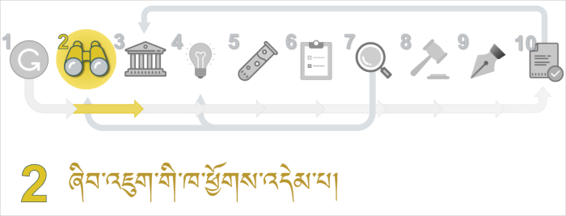
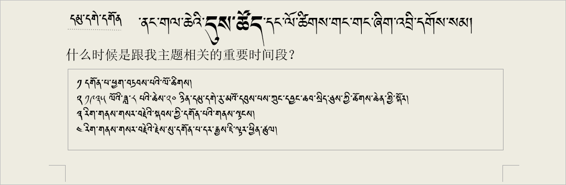
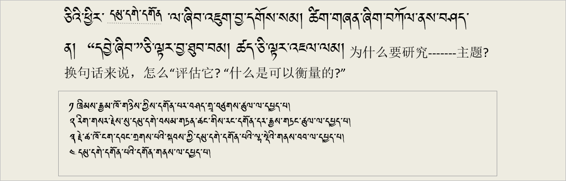

缩小我的研究主题 དཔྱད་རྩོམ་གྱི་བརྗོད་བྱ་ཇེ་ཆུང་དུ་གཏོང་ཚུལ།
缩小我的研究主题 དཔྱད་རྩོམ་གྱི་བརྗོད་བྱ་ཇེ་ཆུང་དུ་གཏོང་ཚུལ།

 

དཔྱད་རྩོམ་གྱི་བརྗོད་བྱ་འདེམ་གསེས་བྱེད་ཚུལ་གྱི་དཔེ་མཚོན་སློབ་ཚན། དམུ་དགེ་དགོན་པ་སྤྱིའི་བརྗོད་བྱ་རུ་བཟུང་ནས་དེ་དང་འབྲེལ་བའི་བརྗོད་གཞི་མང་པོ་ཞིག་བསྡུ་རུབ་བྱས་ཏེ་དཔྱད་རྩོམ་གྱི་བརྗོད་བྱ་བྱེ་བྲག་ཏུ་བདམས་པ། འདི་ལ་དཔེ་བལྟས་ཏེ་རང་གི་དཔྱད་རྩོམ་གྱི་བརྗོད་བྱ་འདེམ་གསེས་བྱེད་དགོས། 论文选题模式的案例课程。 采用了木阁寺的主题模式并收集了很多相关的话题作为论文的具体选题。要参照这个来给自己的论文选择主题。

ལན་ཞིག་ངེས་པར་འདེམ།༼སྔོན་འགྲོའི་དྲི་བ།༽必选一个答案 （前缀问题）  
[矩阵单选题] *

|   | ཤེས། | མི་ཤེས། |
| ༡ མཐར་ཕྱིན་དཔྱད་རྩོམ་གྱི་བརྗོད་བྱ་ཕྲ་རུ་གཏོང་ཚུལ་ཤེས་སམ། 了解了怎样缩小毕业论文的主题 | ○ | ○ |
| ༢ མཐར་ཕྱིན་དཔྱད་རྩོམ་གྱི་བརྗོད་བྱའི་་རིགས་ཟེར་བ་ཇི་ཞིག་ཡིན་པ་ཤེས་སམ།了解了毕业论文的主题类型是什么 | ○ | ○ |
| ༣ འཚོལ་བྱེད་ཀྱི་ཚིག་གནད་ཟེར་བའི་དོན་ཅི་ཞིག་ཡིན་པ་ཤེས་སམ། 知道搜索关键词是什么意思 | ○ | ○ |
| ༤ མཐར་ཕྱིན་དཔྱད་རྩོམ་གྱི་བརྗོད་བྱ་ཚད་ལྡན་འདེམ་ཚུལ་ཤེས་སམ། 知道如何选择毕业论文的标准主题 | ○ | ○ |

ཏ༽ དཔྱད་རྩོམ་གྱི་བརྗོད་བྱ་ཕྲ་རུ་གཏོང་ཚུལ་གྱི་འགེང་ཤོག将论文内容具体化的表格  

འདིར་བཀོད་པའི་དྲ་ཐག་སྟེང་བསྣུན་ཏེ་འགེང་ཤོག་ཕབ་ལེན་བྱོས། ([དྲ་ཐག](=96074754)) 请点击下载插在这里的表格。  

༡༽ དཔྱད་རྩོམ་གྱི་བརྗོད་བྱ་ཚད་ལྡན་ཡིན་མིན་གྱི་དཔེ་མཚོན། 论文主题是否标准的案例  

འོག་གི་བརྗོད་བྱ་ཁག་ལས་༼ཀ་ཁ་ང།༽གསུམ་བརྗོད་བྱ་རྒྱ་ཆེ་དྲགས་པས་ཚད་ལྡན་དུ་མི་བརྩི།༼ག་ཅ་༽གཉིས། བརྗོད་བྱ་ཇེ་ཆུང་དུ་བཏང་བས་ཚད་ལྡན་དུ་བརྩི། 下列主题中的”甲乙丁“，的主题太广，”丙戊“两个是缩小后的主题所以算是合格的主题。

༡༽ མཐར་ཕྱིན་དཔྱད་རྩོམ་གྱི་བརྗོད་བྱ་ཚད་ལྡན་འདེམ་ཚུལ་ཤེས་སོང་སམ། 知道毕业论文怎么选题吗？ [单选题] *

| ཤེས་སོང་། 知道(正确答案) | ཤེས་མ་སོང་། 不知道 |

༢༽ དཔྱད་རྩོམ་གྱི་བརྗོད་བྱ་ཆུང་དུ་གཏོང་ཚུལ་གྱི་དཔེ་མཚོན། 论文主题缩小的案例  

ཀ༽ སྤྱིའི་བརྗོད་བྱ་བདམས་པ། 选取总体题材  

གོང་གི་བརྗོད་བྱ་རྒྱ་ཆེ་བ་༼ཀ་ཁ་ང།༽གསུམ་གྱི་ནང་གི་“དམུ་དགེ་དགོན།”དཔེ་མཚོན་དུ་བཟུང་ནས་བརྗོད་བྱ་ཇེ་ཆུང་དུ་གཏོང་ཚུལ་གྱི་དཔེ་མཚོན་གཤམ་ལ་གཟིགས།上述题材中比较广的主题”甲乙丁“中，举“木阁寺” 的例子来缩小研究主题的具体事例如下：  

ཁ༽ སྤྱིའི་བརྗོད་བྱ་དང་འབྲེལ་བའི་མི་སྣ། 涉及论文主题的人物  

དཔྱད་རྩོམ་གྱི་སྤྱིའི་བརྗོད་བྱ་དང་འབྲེལ་བའི་གལ་ཆེའི་མི་སྣ་དག་གི་མཚན་ཐོ། 有关论文主题的重要人物的名单  

ག༽སྤྱིའི་བརྗོད་བྱ་དང་འབྲེལ་བའི་རིགས།有关总体主题的   

དཔྱད་རྩོམ་གྱི་སྤྱིའི་བརྗོད་བྱ་དང་འབྲེལ་བའི་གནས་ཚུལ་གྱི་རིགས་གང་ཡོད་རྣམས་རེ་རེ་བཞིན་ཐོ་རུ་བཀོད།将涉及论文主题的情况逐条记录下来。  

༢༽ མཐར་ཕྱིན་དཔྱད་རྩོམ་གྱི་བརྗོད་བྱའི་རིགས་ཟེར་བ་ཇི་ཞིག་ཡིན་པ་ཤེས་སོང་སམ། 知道毕业论文的主题类型是什么吗？  
[单选题] *

| ཤེས་སོང་། 知道(正确答案) | ཤེས་མ་སོང་། 不知道 |

ང༽ སྤྱིའི་བརྗོད་བྱ་དང་འབྲེལ་བའི་དུས་ཚོད། 与总主题有关的时间段  

དཔྱད་རྩོམ་གྱི་སྤྱིའི་བརྗོད་བྱ་དང་འབྲེལ་བ་ཡོད་ཅིང་། དཔྱད་རྩོམ་གྱི་བརྗོད་བྱར་འཁོད་རིན་ཡོད་པའི་གལ་ཆེའི་དུས་ཚོད་དང་ལོ་ཚིགས་ཁག་རེ་རེ་བཞིན་ཐོ་རུ་བཀོད།涉及论文的总体主题，记录跟论文内容价值有关的重要的时间段和时机  

ཅ༽སྤྱིའི་བརྗོད་བྱ་དང་འབྲེལ་བའི་ས་གནས། 于总主题有关的地区  

དཔྱད་རྩོམ་གྱི་སྤྱིའི་བརྗོད་བྱ་དང་འབྲེལ་བ་ཡོད་ཅིང་། དཔྱད་རྩོམ་གྱི་བརྗོད་བྱར་འཁོད་རིན་ཡོད་པའི་གལ་ཆེའི་ས་གནས་ཁག་རེ་རེ་བཞིན་ཐོ་རུ་བཀོད།涉及论文的总主题，将论文内容的每一个有价值的重要地方逐个记录下来。

ཆ༽ ཅིའི་ཕྱིར་སྤྱིའི་བརྗོད་བྱ་དེ་འདེམ་དགོས་པ་དང་། དེའི་སྐོར་གྱི་དབྱེ་ཞིབ། ཚད་འཇལ་ཚུལ་བཅས་ཐོ་རུ་ཁོད། 分析为什么要选择这个主题，列出测量价值的指标 。  

ཇ༽བྱེ་བྲག་ཏུ་བྱས་པའི་ངའི་དཔྱད་རྩོམ་གྱི་བརྗོད་བྱ།我的论文主题的具体化  

གོང་དུ་བཀོད་པའི་དཔྱད་རྩོམ་གྱི་སྤྱིའི་བརྗོད་བྱ་དང་འབྲེལ་བའི་བརྗོད་བྱ་བྱེ་བྲག་ཏུ་བཀོད་པ་རྣམས་ལས་རྩེ་ཕུད་གཅིག་བདམས་པའི་དཔེ་མཚོན། 在以上论文主题涉及的具体内容里选一个最好的（案例）  

༣༽ མཐར་ཕྱིན་དཔྱད་རྩོམ་གྱི་བརྗོད་བྱ་ཇེ་ཆུང་དུ་གཏོང་ཚུལ་ཤེས་སོང་སམ། 知道怎样缩小论文的主题吗？ [单选题] *

| ཤེས་སོང་།(正确答案) | ཤེས་མ་སོང་། |

ཉ༽ འཚོལ་བྱེད་ཀྱི་ཚིག་གནད།搜索关键词  

རང་ཉིད་ཀྱི་དཔྱད་རྩོམ་ནང་བཀོད་པའི་ཐ་སྙད་དམིགས་བསལ་རྣམས་ཐོ་རུ་བཀོད་པའི་དཔེ་མཚོན།记录在论文里记载的特定用语或关键词  

   

༤༽ འཚོལ་བྱེད་ཀྱི་ཚིག་གནད་ཟེར་བའི་དོན་ཅི་ཞིག་ཡིན་པ་ཤེས་སོང་སམ། 知道搜索关键词是什么意思吗？  

[单选题] *

| ཤེས་སོང་། 知道(正确答案) | ཤེས་མ་སོང་། 不知道 |

ཕོ་མོ། 你的性别:  

[单选题] *

| ○ཕོ། 男 | ○མོ། 女 |

ཁྱེད་ཀྱིས་བོད་སྐད་བཤད་ཤེས་སམ། 你会说藏语吗? [单选题] *

| ○ཤེས། 会 | ○མི་ཤེས། 不会 |

དྲི་བ་ཡོངས་ལ་ལན་བཏབ་རྗེས་འོག་གི་་སྤེལ་་ཟེར་བ་དེའི་སྟེང་བསྣུན་ན་དངོས་སུ་སྤེལ་འགྲོ་བ་ཡིན། ཐུགས་རྗེ་ཆེ།  

完成所有的问题后请您点击“提交”， 谢谢！ 

སྤེལ། 提交问卷
