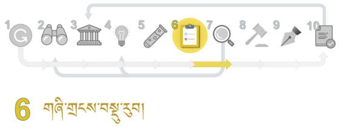
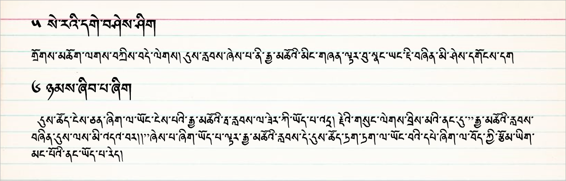

ཐ་སྙད་ཞིབ་འཇུག་གི་རྒྱུ་ཆ་འཚོལ་བསྡུ་བྱ་ཚུལ། 研究词汇的含义
ཐ་སྙད་ཞིབ་འཇུག་གི་རྒྱུ་ཆ་འཚོལ་བསྡུ་བྱ་ཚུལ། 研究词汇的含义

 

གཞུང་སོ་སོའི་ནང་གི་དུས་རླབས་ཟེར་བའི་ཐ་སྙད་ཀྱི་འགྲེལ་བཤད་དང་མཁས་པ་སོ་སོས་དེའི་གོ་དོན་འགྲེལ་ཚུལ་ལ་བརྟག་དཔྱད་བྱས་པའི་གྲུབ་འབྲས་དང་འཚོལ་ཐབས་བཅས་ཀྱི་སློབ་ཚན་ཞིག་ཡིན། འདིའི་ནང་དུས་རླབས་ཟེར་བའི་ཐ་སྙད་དཔེར་བཀོད་ནས་དུས་རབས་དང་མཐུན་པའི་ཞིབ་འཇུག་བྱེད་ཐབས་སླ་ཤོས་ཁག་དང་རྒྱུ་ཆ་གང་དག་དགོས་པ་གཙོ་བོར་བསྟན་ཡོད། 

搜索在每一著作中对浪潮这一词概念的解释以及每位学者对词的解释进行调查和探索的课程与成果。以浪潮为例着重指出了符合现代的最简单的研究方法和所需的材料。

སྔོན་འགྲོའི་དྲི་བ་བཞི་ལ་ལན་ངེས་པར་འདེབས་རོགས། 请选择您的答案[矩阵量表题] *

|   | ཤེས། | མི་ཤེས། |
| ༡ དུས་རླབས་ཟེར་བའི་ཐ་སྙད་དེའི་རྒྱབ་ལྗོངས་ཀྱི་སྒྲུང་ཁ་གསལ་ཤེས་སམ། 您知道浪潮这一词的背景吗？ | ○ | ○ |
| ༢ ཐ་སྙད་དེ་སྡེ་དགེའི་བསྟན་འགྱུར་ནང་ཐེངས་ག་ཚོད་ལ་བཀོལ་ཡོད་མེད་ཤེས་སམ། 您知道此词在德格大藏经里使用了多少次吗？ | ○ | ○ |
| ༣ ཐ་སྙད་དེའི་སྐོར་འཚོལ་ཞིབ་བྱེད་ཐབས་སླ་ཤོས་ཤེས་སམ། 您知道关于这词最简单的搜索方法吗？ | ○ | ○ |
| ༤ གཞུང་ལུགས་ནང་ཐ་སྙད་དེ་ལ་དབྱེ་བ་ག་ཚོད་ཡོད་ཤེས་སམ། 您知道各著作里此词有多少种类别吗？ | ○ | ○ |

༡༽ ཐ་སྙད་དེ་བཀོལ་སྤྱོད་བྱས་པའི་དཔེ་མཚོན་གྱི་ཤོ་ལོ་ཀ 使用此词的典型的例子  

༢༽ གཞུང་སོ་སོའི་ནང་ཐ་སྙད་འདི་བཀོལ་ཐེངས།此词在各著作中使用的次数  

གལ་ཆེའི་གཞུང་ལུགས་སོ་སོའི་ནང་“དུས་རླབས་”ཟེར་བའི་ཐ་སྙད་འདི་བཀོལ་ཚད་ཀྱི་བརྟག་འབྲས།在各个要的著作中使用“浪潮”这一词的搜索结果  

༡ ཐ་སྙད་དེ་སྡེ་དགེའི་བསྟན་འགྱུར་ནང་ཐེངས་ག་ཚོད་ལ་བཀོལ་ཡོད་མེད་ཤེས་སོང་ངམ། 您知道这个词在德格大藏经里使用了多少次吗？ [单选题] *

| ཤེས་སོང་། 知道(正确答案) | ཤེས་མ་སོང་། 不知道 |

༣༽ མཁས་པ་སོ་སོར་དུས་རླབས་ཟེར་བའི་ཐ་སྙད་ཀྱི་གོ་དོན་དྲི་བ། 学者们对浪潮含义的问题  

དགེ་བཤེས་དང་མཁན་པོ། དགེ་རྒན་དང་ཉམས་ཞིབ་པ་སྐོར་ཞིག་ལ་དུས་རླབས་ཟེར་བའི་ཐ་སྙད་དེའི་གོ་དོན་གྱི་དྲི་བ། 格西，堪布，教授和调研者对“浪潮”含义的问题  

༤༽ མཁས་པ་སོ་སོས་“དུས་རླབས” ་ཀྱི་གོ་དོན་འགྲེལ་ཚུལ། 各学者对“浪潮”含义的解释  

དྲི་ལན་ཆ་ཚང་གཤམ་ལ་རིམ་པས་བཀོད་ཡོད། དུས་ཀྱི་འགྱུར་བ་ཞིག་ལ་ངོས་བཟུང་བ།答案如下： 被认为是一个时代的变化  

༥༽དགེ་རྒན་གཉིས་ཀྱིས་དུས་རླབས་ཀྱི་གོ་དོན་འགྲེལ་བ།两位学者对浪潮含义的解释  

༡༽ དུས་ཚོད་དང་། ༢༽ དུས་ལས་ཡོལ་བ་མེད་པ་བཅས་ལ་ངོས་བཟུང་བ། 辨认为是时间和没过时的。   

༦༽ བསམ་ཚུལ་མ་འདྲ་བ་གཉིས། 两种不同的观点  

༡ རྒྱ་མཚོའི་མིང་གཞན་ཞིག་དང་། ༢ དུས་ཡོལ་མེད་པ་བཅས་ལ་ངོས་བཟུང་བ། 是大海的另一个名字或辨认为是没过时的。 

༧༽ བསམ་ཚུལ་མ་འདྲ་གཉིས།两种不同的观点  

འདི་གཉིས་ཀྱིས་དུས་གྱི་འགྱུར་བ་ལ་ངོས་བཟུང་བ། 这两位学者都认为是时代的变化  

༨༽ དགེ་བཤེས་སློབ་ཆེན་དགེ་རྒན་ཞིག一位格西认为  

དུས་ལས་མི་ཡོལ་བར་ངོས་བཟུང་བ། 是没过时的  

༩༽ གཞུང་ལུགས་ནང་དུས་རླབས་ཀྱི་གོ་དོན་འགྲེལ་བཤད། ”浪潮“的含义在各个著作里的解释  

ཡོང་ཁུངས། བསྟན་འགྱུར་ནང་གི་མངོན་པ། 来源：《丹珠儿》 《论藏》部  

  

༢ ཐ་སྙད་དེའི་རྒྱབ་ལྗོངས་ཀྱི་སྒྲུང་ཁ་གསལ་ཤོས་ཤེས་སོང་ངམ། 了解此词的背景了吗？ [单选题] *

| ཤེས་སོང་། 知道(正确答案) | ཤེས་མ་སོང་། 不知道 |

༣ གཞུང་ལུགས་ནང་ཐ་སྙད་དེ་ལ་དབྱེ་བ་ག་ཚོད་ཡོད་མེད་ཤེས་སོང་ངམ། 了解此词在各著作里有多少种类别吗？ [单选题] *

| ཤེས་སོང་། 知道(正确答案) | ཤེས་མ་སོང་། 不知道 |

༡༠༽ ཐ་སྙད་འདི་འཚོལ་ཐབས་ཀྱི་སྐོར།  关于查找词法  

🢣 ༡Visual Studio Code ཁོ་ཌི་མཉེན་ཆས།  VS Code 软件   
🢣 ༢DocFetcher ནགས་བྱི་འཚོལ་ཆས། Docfetcher 搜索软件  

🢣 ༣ buda.zju.edu.cn བུདྡྷ་དྲ་ཐོག་དཔེ་མཚོ། 网站

ཀ༽ མཉེན་ཆས་ VS Code བཀོལ་ནས་འཚོལ་ཐབས།  使用VS Code软件的搜索法  

མཉེན་ཆས་འདིའི་ནང་སྡེ་དགེའི་བཀའ་འགྱུར་(ཡིག་རྐྱང་།)ནང་“དུས་རླབས་”ཞེས་པའི་ཐ་སྙད་བཙལ་བ། (སྐར་ཆ་༥༠ ནང་བཙལ་བ།) 使用此软件在德格大藏经Text里搜索”浪潮“的方法 （40秒里搜到的结果）  

ཁ༽ སྡེ་དགེའི་བསྟན་འགྱུར་ནང་ཐ་སྙད་འདི་བཙལ་བ། 德格大藏经里搜索此词的方法  

མཉེན་ཆས་འདི་བཀོལ་ནས་སྡེ་དགེའི་བསྟན་འགྱུར་(ཡིག་རྐྱང་)ནང་ཐ་སྙད་འདི་བཙལ་བ། (སྐར་ཆ་༥༠ ནང་བཙལ་བ།)   
使用此软件在德格大藏经Text里搜索”浪潮“的方法 （40秒里搜到的结果）  

ག༽ ནགས་བྱི་འཚོལ་ཆས་བཀོལ་ནས་འཚོལ་བ།  使用doctfecher软件的搜索法  

ནགས་བྱི་འཚོལ་ཆས་བཀོལ་ནས་གཞུང་ལུགས་སྣ་ཚོགས་(ཡིག་རྐྱང་)ནང་ཐ་སྙད་“དུས་རླབས་”འདི་བཙལ་བ། (སྐར་ཆ་༤༠ ནང་བཙལ་བ།)  
使用Doctfecher在个著作text里搜索”浪潮“。（40秒里搜到的结果）  

  

ང༽buda བུདྡྷ་དྲ་ཐོག་དཔེ་མཛོད་ནང་བཙལ་བ། 使用Buda网站的搜索法  

བུདྡྷ་དྲ་ཐོག་དཔེ་མཛོད་འདིའི་ནང་ཐ་སྙད་འདི་བཙལ་ཐབས་དང་། བཙལ་འབྲས། (སྐར་ཆ་༥༠ ནང་བཙལ་བ།) 下面是如何使用网站搜索此词的方法 （40秒里搜到的结果）  

  

༤ ཐ་སྙད་དེའི་སྐོར་འཚོལ་ཞིབ་བྱེད་ཐབས་སླ་ཤོས་ཤེས་སོང་ངམ། 您掌握了关于最简单的搜索词汇的方法吗？ [单选题] *

| ཤེས་སོང་། 知道(正确答案) | ཤེས་མ་སོང་། 不知道 |

ཕོ་མོ། 您的性别 [单选题] *

| ○ཕོ། 男 | ○མོ། 女 |

ཁྱེད་ཀྱི་སྐད་གདངས་མདོ་དབུས་ཁམས་གསུམ་གང་གི་སྐད་གདངས་ཡིན། 你说藏区哪种方言? [单选题] *

| ○དབུས་སྐད།卫藏方言 | ○ཁམས་སྐད། 康巴方言 | ○ཨམ་སྐད། 安多方言 | ○གཞན། 其他方言 |

དྲི་བ་ཡོངས་ལ་ལན་བཏབ་རྗེས་འོག་གི་་སྤེལ་་ཟེར་བ་དེའི་སྟེང་བསྣུན་ན་དངོས་སུ་སྤེལ་འགྲོ་བ་ཡིན། ཐུགས་རྗེ་ཆེ།  

完成回答所有的问题后请您点击“提交”， 谢谢！   

སྤེལ། 提交问卷

